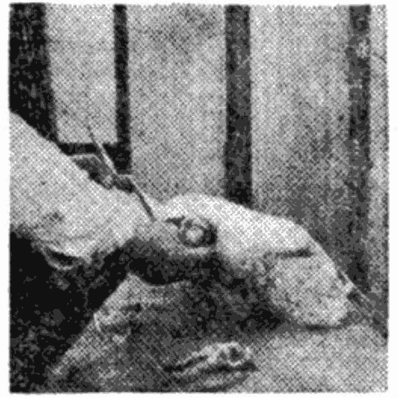
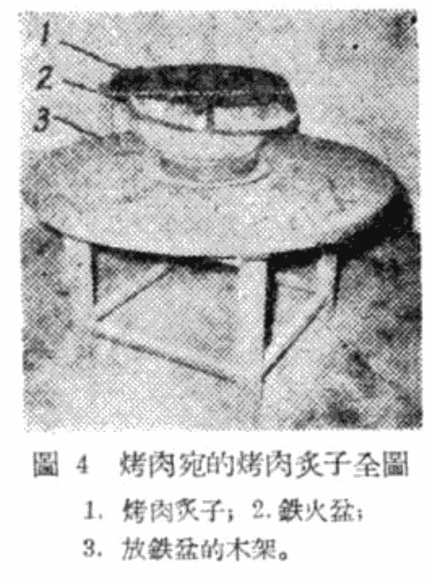

# 中國名菜譜

第一輯

北京特殊風味

中国名菜譜
第一輯
北京特殊风味

商业部飲食服务业管理局編

中国财政经济出版社

1963年·北京

前言
几千年来，我国在食品烹飪方面創造和积累了丰富的經驗，形成了具有民族特色的烹飪艺术。

相传远自春秋时代，便已注意到烹飪艺术的研究与改进。随着社会生活的发展，烹飪艺术也在不断提高；历代記載食物制作方法的文籍，就有“周礼”、“礼記”、“食經”、“玉食批”、“中饋录”、“易牙遺意”、“食珍录”、“食譜”等不下数十种。由于我国幅員廣闊，資源富饒，以及各地自然条件和生活习惯的不同，因此，又逐漸形成了許多各具風格的地方菜点。据不完全的統計，全国著名菜点約达五千余品种；具有色、香、味、形俱佳的特点，丰富多彩，膾炙人口。丰富了人民的物質生活，并在国际上享有很高的声誉。这显示着我国劳动人民的高度智慧，应该看作是祖国宝贵的历史文化遗产中的一部分。

总结传统的烹飪經驗，繼承发扬，交流推广，以进一步提高烹飪艺术水平，更好地满足人民生活的需要，是飲食业中的一项重要任务。为此，我們特組織全国各地的有关单位和著名厨师等，編写了“中国名菜譜”，分輯陆续出版。第 一輯介紹北京特殊风味，第二、三輯介紹北京名菜点，第 四、五輯介紹广东名菜点，第六輯介紹山东名菜点，第七輯 介紹四川名菜点，第八輯介紹苏、浙名菜点，第九輯介紹上 海名菜点，第十輯介紹福建、安徽、江西名菜点，等等。各 輯均系根据著名厨师亲自介紹，編写而成的，并經過集体鉴 定。書中着重介紹了各种菜点的特色和制作方法。

需要說明的是，我国烹飪經驗十分丰富，書中所輯，只是其中的一部分；并且由于我們缺乏編輯食譜的經驗，难免 会为本書带来缺点和錯誤，恳請讀者予以指正。

商业部飲食服务业管理局

目 录
挂爐烤鴨	5
一、烤鴨原料——北京填鴨	5
二、鴨的宰杀与处理	6
三、烤鴨設備与燃料	12
四、烤鴨操作过程	16
五、片鴨和吃法	20
六、鴨下水的烹制	22
1.燴鴨四宝	(22)
2.炸肫肝	(24)
3.炒鴨腸	(24)
4.燴鴿離	(25)
东来顺的涮羊肉(清真)	25
烤肉	30
沙鍋居的燒、燎、白煮	34
一、白煮	35
1.白肉片	(35)
2.沙鍋下水	(36)
3.沙鍋白肉	(38)
4.沙鍋三白	(38)
二、燒	38
1.炸卷里脊	(38)
2.炸卷肝	(39)
3.炸鹿尾	(39)
4.炸肥腸	(40)
三、燎	40
1.胡肘	(40)
2.胡肉	(41)
四、沙鍋居其他名菜	41
1.摔整脑	(41)
2.摔皮絲	(41)
3.血腸	(41)
4.鳳眼肝	(42)
5.芝麻丸子	(42)
6.如意卷	(43)
仿膳的清宫风味	44
1.芸豆卷 (45)	2.豌豆黄 (48)
3.千层糕 (49)	4.小糖窝头 (51)
5.一品烧饼 (52)	6.炒肉末 (55)
7.炒麻豆腐 (56)	
白魁的烧羊肉 (清真)	57
粮食店回民食堂的馅饼和爆胡 (清真)	62
1.馅饼 (62)	2.爆胡 (64)
灶温的一窝絲清油餅	66
金生隆的爆肚 (清真)	69
邬殿元的焦圈	71
景泉居的苏造肉	73
合义斋的灌腸	76
会仙居的炒肝	78
东恩元居的炒疙瘩 (清真)	80
豆汁张的豆汁	81

## 掛爐烤鴨

北京烤鴨，历史悠久，膾炙入口，有燜爐烤鴨、叉燒烤鴨及掛爐烤鴨等不同制作方法。目前以全聚德、便意坊的掛爐烤鴨最为有名。全聚德于清同治12年(1873年)、便意坊于清咸丰5年(1855年)开業，都以烤鴨為專業，距今都有一百来年的历史。在这百年中积累了丰富的烤鴨經驗，創造了优良的操作技术，加以原料采用專为烤鴨育成的北京填鴨，因而其制品皮脆、肉嫩、色艷、味香、油多不膩，久吃不厭，成为北京特殊風味之一，馳名中外。国内外来京人士都以一嚐掛爐烤鴨為快事。

本文主要是根据全聚德的經驗編写的。

### 一、烤鴨原料——北京填鴨

北京烤鴨所用的鴨子是北京填鴨(又称油鴨或白鴨)，这是它所以好吃好看，聞名中外的主要条件之一。北京填鴨是在北京育成的一种專供烤鴨用的鴨子，后来逐漸傳佈到国外，1875年傳到英、美；1888年傳到日本；1956年苏联也用北京鴨种育成了“莫斯科白鴨”。国内除北京地区大量飼養供应外地外，天津、承德、內蒙古等地也都在育殖。

北京填鴨的特征是：初生小雛，全身黃色，長大后羽毛变为雪白色，嘴和腳变为淺橙黃色，翅膀短，背長而寬，胸部發達，腿短，显得很强壯。填鴨的肌肉與一般鴨不同，肌肉的纖維間夾杂着白色的脂肪，紅白相間，細膩新鮮，这就是一般所稱道的“間花”。填鴨烤好后，油多，肉呈粉白色，吃起來肉細嫩

無酸味，而普通課鴨則油少，肉黑紅色，吃起來肉老，還帶有酸溜溜的味道。

北京填鴨的飼養方法是很特殊的（詳見吳知新著“北京鴨飼養法”一書，中华書局1956年8月出版）。從孵出小鴨到可以烤吃，只需三个多月。前兩个多月（70天左右）一般称为初雛及中雛期，吃食和飲水都有一定的時間和份量，由鴨子自己食飲。后一个月（30天左右）為填鴨階段，即強制育肥階段。將鴨子的飼料一玉米、黑面、黑米、稻米糠等加水做成小条，每日定时定量地由人工強制填食兩次，初填時是一半人工填，一半鴨子自己吃；到后来，鴨子完全失去了自食的能力，必須人工填餵。在填食階段，下水活動很少，因此生長很快。一只公鴨可以达到7～8斤，母鴨达5～6斤。填鴨填到30天以后，它的消化机能減退，食慾降低，这时若不宰杀就要發生回膘現象，或者肉不嫩，严重的还可能死亡。

填鴨非常嬌嫩，對環境氣候的適應力極差，象初生嬰兒一樣，怕熱怕冷，在氣候變化時，要特別當心。在人工填食時，要經常注意它的消化情況，若發現还未消化就要少餵或不餵。在圈內或運輸途中不能讓鴨子互相擠碰或踩踏，因鴨皮非常嫩最容易受伤，受伤的鴨，宰杀后鴨皮呈現紅或黑色的斑点，烤出不好看。

### 二、鴨的宰殺與處理

宰鴨分宰殺、燙毛、退毛、打氣、掏膿、洗膿掛鈎、燙皮打糖、晾皮等八道工序。

**宰殺** 用左手拿着鴨子的兩个翅膀，并以小手指勾着鴨子的右脚，大指、食指卡紧鴨喉腔。右手拿刀割断气管及食道(刀口不要太大，防止在打气时跑气。讓鴨血流入已准备好的鹽水碗中(水與血之比為5比5或6比4)，并取出鴨舌(嫩鴨輕輕一扯就拉出来了，老鴨必須將舌略微一扭再拉才行)。鴨舌取出后，將鴨扣入竹簍或較深的桶內，讓其翻扑一会，只要不動就可以燙。不能放得太久，放久就死硬了，不太好燙。

**燙毛** 將死鴨投入熱水鍋里，一手拿着鴨腳翻動鴨身，一手用漏勺或小木棒掀松鴨毛使水滲入。也可以將鴨放入鍋中用小木棒翻動鴨身，打几个滾，鴨身完全燙濕，再拉着鴨腳，用小木棒掀動鴨毛。鴨脯及鴨襟毛很厚，絨毛又多，不易進水，要多掀动。在燙時可試拔鴨頭的毛，若頭上的毛能拔下，其他處的毛也就燙好了，即可起鍋。

燙毛的水溫以攝氏60度為适宜。

一鍋熱水一次可燙3、4只鴨子。每次燙3、4分鐘。鴨燙好出鍋的時候，鍋內水溫已升到65度左右，第二批鴨子下鍋時必須加添一些冷水，使水溫降到攝氏60度。

燙鴨有兩種方法：一是死燙，即將鍋內水燒熱端在旁边來燙，鍋已離火，水溫要逐漸下降，移鍋時水溫可高一、二度。因水溫不斷下降，故在燙時動作要快，不然水冷了鴨子还未燙好。一是活燙，即把鍋一直放在火上，鴨下鍋時的水溫可以低点，应在攝氏58度左右，因水溫逐漸上升，故燙的時間不要过久，以免水溫高了把鴨皮燙坏。

不論死燙活燙，在鴨下鍋后如發現鴨皮繃紧、鴨掌抓起的現象，這說明水太熱了，要馬上加冷水，還來得及搶救。

**退毛** 先退大毛，后摘細毛。

退大毛在木案上進行。左手抓着鴨腿，右手指抓着大毛用掌按着小毛向着毛根相反的方向前推，推时手法不宜太重，先推拔胸脯的毛，因胸脯肉嫩，涼了不易退，勉强拔时就容易掉皮。胸脯毛退完了，將鴨身翻过来，再推右背、右膀、左背、左膀、脖子及头部的毛。推脖子及头部的毛的时候，用五个手指包着鴨脖子向前一推，毛即下来了。最后將鴨掉过头来再推鴨腿及鴨裆。

摘細毛在水盆里进行。夏天用冷水，冬天用温水。盆子及水要干净，切忌有油（鴨皮沾上了油，在打糖时不易上色）。左手拿着鴨头，繃紧鴨皮，右手拿鑷子摘淨鴨头、脖子、后背及翅膀等处細毛。再抽出气管吹一吹，使鴨略微鼓脹，并在气管尖打一个疙瘩。老鴨气管硬化，打不住疙瘩，可將气管内壁的薄膜用勁拧几下或扭几扭使膜粘起来不要漏气就行。再摘鴨脯及鴨腿的毛。

**打气** 將摘完毛洗干净的鴨子放在木案上，先切断鴨的双脚。再用左手拿着鴨头，右手从喉管开刀处拉出食管，左手拇指順食管推进，一直推到胸脯，使食管与周圍的膜分开，整理好后將食管再放进去不要抽断。打气时可用脚踏打气机（圖1），將打气机的膠皮管放在鴨脖子的刀口处，徐徐地將气㮼入鴨身（圖2）。气打到八分滿时，再用左手拿着脖子，右手拿着右腿，鴨脯向外，鴨背向里，兩手用力向中一挤，使气体充满鴨身各部。

鴨子打气后，在进行其他工序时，不能用手拿鴨身，只能拿翅膀、腿骨及头頸。因为手指碰着打气的地方就会有一个指印，成一个小凹坑，很不好看。此点須加注意。

**掏膛** 在掏膛的整个操作中，鴨背一直是靠着木案的。左手握紧鴨脖及右边的翅膀，右手食指从肛門掏入向下一弯，勾出屎腸与肛門拉断。再用5寸多長几分寬鋒利的尖刀，在鴨右腋下(先排出該处的气)开1寸2分的口，刀口成月牙形，开的不要过長，过長容易割坏肋骨，並且容易跑气。左手拇指及中、無名、小指握着鴨頸同右翅，用食指从鴨頸皮外面戳入堵着气。再用右手取內臟：先用右手拇指伸入刀口，將鴨脊椎骨上附着的軟骨压平后，再伸入食指貼紧鴨胸脯掏出心臟。再貼着背伸向头的方向，掏出气管、食道。食道取出交左手握紧，右手食指或中指再进去將肫(即胃)、肝周圍的膜拉断，用食指勾着鴨肫向外拉，同时拿食道的左手也略微向外一帶，鴨肫拉出，其他肝、腸亦随之而出。最后掏出右肺、左肺。这样內臟就全部掏光了(圖3)。

然后用2寸長的高粱桿一节，一头削成三角形，一头削成交叉形(圖4)，右手拿着三角形

的一头从鴨腋下开口处放入鴨腹内，向上撑着鴨脯的三叉骨上，叉形的一头騎在鴨子的后脊骨上，讓高粱桿直立起來，撐緊鴨皮，使鴨在烤时不致縮扁。

最后切断鴨的兩翅尖后，掏膛工作即告完畢。

**洗膛掛鈎** 左手拿着鴨右膀，右手拿着鴨右腿放入清水盆中，由刀口灌入清水。再用左手托着鴨的后背（不能用手指撑着，以免打气的地方有指印），右手食指伸入鴨肛門掏出回头腸（未取尽的剩腸），使清水从此处流出，如此灌洗兩次，將鴨肚子內部清洗干淨，然後开始掛鈎（圖5）。

掛鈎是左手拿着鴨頭，右手拇指和食指將鴨頸皮向下理到鴨肩處，再用右手食指从腋下刀口处伸入挑起鴨身，左手丢开鴨頭拿住鴨頸的中段，右手取铁鈎，在离鴨肩約一寸多長的鴨頸皮中綫上（鴨胸脯面）插入，从頸骨的左下面皮肉处穿入，右下面皮肉处穿出，使鈎托着鴨頸椎骨，勿使穿过頸骨，防止鈎斷鴨骨在烤时鴨子掉下来。另用1寸長小竹籤支于腋下撐起雙翅，不讓翅下垂，晾干后入爐前取下。

**燙皮打糖** 將掛好铁鈎的鴨子用开水淋一淋。作法是：

左手拿着铁鈎，右手拿着盛開水的勺，在鴨子的兩个翅膀處各淋一勺，然后从鴨頸掛鈎的地方向下再澆一勺，澆到全身。鴨子經過開水一烫，毛孔縮紧，立刻显得又白又嫩，油亮光滑，非常好看。要特別注意不要淋得太多，最好是三勺。过多时，在鴨皮晾干后从每个毛孔向外流油，油流过的地方不易上色，烤出來的鴨子色澤不勻，很不好看。同时，不要將鴨屁股离开水太近，更不要泡在開水鍋中，以免把飽滿的鴨屁股燙得緊縮難看。

接着，仍如上法澆糖水二、三勺。有的只澆一次；有的在鴨皮干透后，入爐前再澆一次。第一次打糖一定要晾干，鴨皮才脆；第二次就不一定等晾干。因为这次只是湿了鴨子的表皮，虽然未干，并不影响鴨子的脆性，同时还可以弥补第一次上糖不勻的地方，增加皮色的美观。

糖水的种类及用量各有不同。有的用塊糖（即麦芽糖熬得很老，已成固体并略帶黃色），1斤塊糖加1斤水，再加鹽少許（使糖易于溶解），存放缸內一月時間化為糖稀。全聚德所用糖水的比例是：在第一次打糖时，冬季10兩糖稀加32兩水，夏季晴天糖稀可多用几分，陰天多用1兩；第二次打糖时，夏季4兩半糖稀加43兩水，冬季6兩半糖稀也加43兩水；春秋二季打糖时，兩次用的分量相同，但比夏季要少些，比冬季要多些；夏季到秋季逐月減少，冬季到春季逐月增加。在沒有糖稀的时候，有的用白糖代替，1兩白糖加6兩水調和；有的用蜜糖代替，但無一定分量，一般經驗是凭口嚐，蜜水略帶甜味即可。

不管甚么季节，如果是陰天或雨天，由于空气里的水分多，不易吸收，容易掉色，因此所用糖分比晴天要濃一些。但要注意糖分不要过濃，过濃，在烤时容易使鴨色黑味焦；过少，鴨皮不脆又不好看，因此糖分一定要用得恰到好处。

**晾皮** 晾皮打糖后，一定要晾皮，即把鴨身水分吹干，再进爐烤，鴨皮才脆。

晾皮在夏季，要將鴨子掛在特制的一个木頂木底四圍裝有鉄紗窗的掛籠里，吊在屋簷或天井中。晾2到3小时后，皮虽未完全干透，就得放入冰箱。鴨与冰要保持一定的距离，不能直接放在冰上。同时冰上还要蒙上一塊潔淨的布，以免鴨吸潮和沾染冰上不潔淨的东西。

春秋季节也是將鴨子掛在上述掛籠里，吊在屋外天井中（頂上要有遮蓋），或者吊在兩头通風的过道里，上午晾皮下午烤，下午晾皮第二天烤。若遇陰雨連綿潮气太大的天气，鴨子又急于要烤用，就得將鴨子掛入燒有微火的屋內去烘。

冬季天气寒冷，不能在屋外晾皮，以免鴨未干而結冰（北京气候），故必須掛在溫度在零度以上的室內，吹皮兩到三天最好。

### 三、烤鴨設備與燃料

**掛爐** 全聚德的烤爐(圖6)是磚砌的，外方內圓，爐內左右后壁及頂部全都封閉，只有前壁中腰留有長方形小門一个。爐門頂略呈拱形(有的在門頂鑲一平鐵板，在爐里一边並有一月牙形的半圓孔)，爐門高低必須适宜。爐子內，頂部是中間高，周圍低，如鍋底形；爐子四周如圓筒形。爐子里的上中部有鉄橫樑兩道，一道在前，一道靠后壁。后樑比前樑高。鴨子入爐后就掛在前樑上烤。若鴨烤得多，又須陸續進爐时，可將已快烤好的移在后樑，剛進爐的放在前樑。爐底又分前后兩部分：前部分接近爐門处是磚砌的，作成小平台，燒柴用，平台高低可根據烤鴨技师的身量而定；后部分接近后牆为鐵板裝置，一般称为油槽。鐵板一头高，一头低。低的一头有一小圓洞，裝有一鐵管通于爐外。鴨在烤時流的油，滴到鐵板上，通过鐵管流到爐外所置的小木桶內。爐后底比前底略低。在兩底的分界處砌有6寸高、2寸厚的短牆一道，以擋着柴灰掉入爐后底。爐門口橫有火擋一塊，有5寸寬，比爐門略長，是青灰缸沙(做水缸用的原料)及鐵条制成的，兩端並留有手拿的鐵柄，以便擋着燒柴使其不易倒下。在火擋兩头用磚垫起，下边留一縫隙通風。

在安放烤鴨爐的房頂开一天窗，可代替烟囱，柴烟就从此处出去。

另外还有一种燒煤的爐子，構造形式与柴爐大同小異。其不同之处，是掛鴨鉄樑直放在爐的左右兩边，油槽位置亦如此。油槽是活的，用的时候放进去，不用时可以取出来。燒煤是在爐中央放一煤堆，盖上稀黃泥，中間只留一縫隙露出火苗，爐門緊閉起来。

兩種爐比較各有优劣：柴爐火力好調劑，烤的鴨子油流的少，好吃；煤爐火力大小不好調劑，而且鴨子流出的油太多，不好吃；煤爐的油槽因構造是活的比柴爐好打扫，因此流出的鴨油比柴爐的鴨油干淨清亮。

**烤鴨桿、火釡、鐵锨** 烤鴨桿(圖7)長6尺5寸，直徑約為1寸。在它尖端6寸長的地方，削成略彎的手掌形狀，在尖端4寸左右快接近圓桿的地方，刻有一个小圓槽。用烤鴨桿挑鴨時尖端伸入鐵釣中部的小環中，小圓槽恰恰緊扣在鐵釣上部，下伸到鐵環中的小鐵柄上。

烤鴨桿过去都是用檀木做的，其質硬不易燃燒，但檀木太貴，每根頂多能用一个月，一个爐需要准备二、三根，花費較大不經濟。現在已將中間經常接近火苗的地方改用3尺長的鐵筒。尖端仍用6寸長的檀木，手拿的地方用杂木。这个办法既經濟又耐用还不烫手。

>說明：
>
>烤鴨爐灶最主要的地方是爐門和双拱形平頂，其尺寸不可隨意改變。爐門邊用鐵皮包住。双拱平頂是由方磚砌成的，中央放置一塊鐵板，並在頂底由井字形角鐵組成的骨架托住頂部。兩根爐梁是一高一低，其高差為6公分，水平距離為5公分。本圖是根據北京全聚德的烤爐而繪制的，仅作參考。

火燄、鐵鎗是生火时用的。

**燃料** 烤鴨所用燃料是棗木柴，其特点是火力勻、火力硬、耐燒、烟少。沒有棗木時，也可以用李、杏等木代替，但火力軟些。

棗木柴一般要與小門一樣長或略微短一點。生火時，柴有一定的架法：先用兩根較短的棗木柴直放在爐門里的左右兩邊（柴的一頭紧紧靠近火擋）作為枕木，並用爐灰埋起來，不使燒掉，再在这兩根柴上橫架棗木柴。長柴其兩頭都放在枕木上；短柴就一头放在枕木上，一头放在爐灰上，左边一根，右边一根，交叉着放起來。一層一層地添到爐門中腰。每根柴不是筆直的，在架放時一定要留些空隙，同時底部要空，這樣才容易燃燒，烟也少。

### 四、烤鴨操作過程

#### 1. 烤爐內溫度的變化和掌握方法

掛爐烤鴨的所以外焦里嫩，是依靠熱力的反射作用，即火苗發出的熱力由爐門上壁月牙處射到爐頂，將頂壁烤熱后再反射到鴨身的結果，不完全依賴木柴火苗的直接烤射。烤鴨技師必須了解爐內溫度的變化情況。爐內熱度的高低，不能以門口火力大小及木柴的多寡來決定。除第一爐火必須大而外，以後在烤的過程中，門口的火力不必經常要大。因為爐的內部是圓的，容易納熱；只要熱力达到爐內每一个地方，把牆壁爐頂都烤熱到相當程度，爐門口又燒有木柴，外面冷空气不易进去，爐內就能一直保持着高熱。这时門口的火力就是小些，爐內仍然可以烤成又香又脆的鴨子。但在冷鴨子放进得多的時候，爐內热度大部被鴨子吸收而下降，这时就要加大火力，使爐內热度提高。

目前，操作人員的掌握爐內热度，烤好鴨子，主要是依靠經驗來掌握以下兩個關鍵問題：

##### (1) 火力的調劑

第一爐火要大，要早些燒。最好是每天的爐火都不要灭掉，用鐵鋤把未燒尽的火底子撥在一起，盖上灰用鍋扣起来，第二天再撥开，使火又燃起。这样可使爐溫不太冷，同时在烤鴨前半个鐘头加柴，使火旺起来，到正式烤鴨時爐溫已經很高，可以縮短烤鴨時間。如十点开烤，八点撥开柴灰堆，九点半加柴，小一点的鴨子半小时就可以烤好。若不这样預先撥火加柴，要一个鐘头才能烤好一爐鴨子。

升火后，必須等爐內的柴烟已經散了，里面很亮堂，从爐口即可看清楚爐后壁，才能挑鴨子進爐。

在烤的过程中，一定要使木柴火苗伸直，不扑向爐內。若火苗向爐內一扑扫在鴨身上，鴨身就会烤焦一塊，影响鴨子的質量与美观。發生火苗不直的情况是在柴燃得快透了的时候，柴会垮下去，火堆散开，这时就得赶快用鐵鋤伸入爐內，將靠近爐內一边的火底兜一下，將火堆兜直起来。

在烤的过程中，若發現鴨胸脯已上色了，当时又沒有冷鴨子进爐，就要馬上將燃燒的木柴抽掉一、兩根，在水桶內熄灭。若發現其他处都已上色，只有胸脯未上色，或鴨进爐不久鴨皮即抽縮形成皺紋，这是溫度太低的現象，就須要加大火力。

##### (2) 时间的掌握

烤鴨時間过短，鴨子沒有熟；時間过長，鴨油流得多，皮薄如油紙，肉老油少，吃起来不香。如時間掌握得恰到好处，出油就少，一只4、5斤重的填鴨頂多出2、3兩油（課鴨可能多点），吃时油多肉香嫩，皮厚而脆。

根據經驗：烤鴨所用時間，冬天与夏天不同；大鴨子与小鴨子不同，肥的与瘦的不同；公鴨与母鴨也不同。如北京氣候，冬天烤一只4斤多重的鴨子要40分鐘，夏天30几分鐘；3斤多重的冬天要35分鐘，夏天30分鐘。秋鴨与冬鴨又不同，如秋、冬鴨同为3斤重，冬鴨要35分鐘，秋鴨只要30分鐘就好了，因秋鴨肉嫩不宜久烤。公鴨和母鴨也是如此，虽是同样的重量，公鴨因体長肉薄就熟得快些，只要30分鐘；母鴨因体短肉厚就要35分鐘。填鴨和課鴨比較，課鴨皮厚比填鴨就要熟得慢些。另外，不管什么鴨，只要腹內灌的是开水，就要比灌的热水熟的快些。

总之，在火力的使用上和烤鴨時間的掌握上要灵活运用， 不能死搬硬套，而且火力与季节和地区的气候有很大关系，各 地应在实际操作中探求更好的經驗。

#### 2. 燻烤操作方法

**(1) 灌水** 在烤鴨入爐前，先在肛門內塞入2寸5分長有節的高粱桿一節，有節處一定要塞入肛門里，使水灌入鴨腹后不致漏出。再从鴨子右腋刀口處灌入七、八分滿的開水，使鴨子內煮外烤，熟得快，而且外脆里嫩好吃。若在天气太冷的時候，鴨腹內已結了冰，可先灌入熱水燙一、二次，洗掉冰，讓鴨子的溫度略略升高，再灌入開水。最后並在鴨皮上澆上兩三勺糖水，但这道手續也有的不作。

**(2) 入爐与出爐** 挑鴨出爐入爐有一定的方法和步驟。 桿尖挑鴨鈎時一定要挑鴨的右邊(圖8)，即刀口這面，这样， 鴨出爐和入爐都可以使胸脯不致接触火苗，同時挑時也順手。

入爐時先將挑起的鴨子在火擋上靠一下，使鴨背向爐里， 將這個位置略予固定後，馬上雙手將桿往上抬，略微用力將鴨一蕩，順勢往前一送，鴨尾抬起與鴨身成平行，隨着鴨桿飄过火苗送入爐內。

出爐时不用再固定位置，因为鴨在爐內时，鴨脯一直是避着火的，接近火苗的是背部或半边背。此時只將挑起的鴨子向下略低，再用勁一甩，鴨身略微抬起来，順勢就出来了。

挑鴨出入爐看起來好象是一件容易的事，做起来却不簡單，因为爐門燒上火后出口很短，假若在这个操作上作得不好，可能發生几个后果：第一，鴨皮碰到柴上刮破了或者被燒焦；第二，柴被拉垮；第三，鴨桿尖端只略微有点彎，前面又沒有擋，在出爐时一甩也可能連鉄鈎帶鴨子拋得老遠。这种操作是必須好好練習的。

鴨入爐后要注意使鴨脯向着里面的爐壁，不要讓火苗直接照射，因为鴨脯肉最嫩，經火苗照射極易上色烤焦，甚至会发生裂縫、起泡。

**(3) 烤的部位** 鴨進爐时首先烤右半側面的刀口处10 分鐘，使热气先从刀口进入鴨腹内，腹內的开水容易开。再順次轉向左半側面（即背的左半边同鴨翅的右半边）5至7分鐘，右翅正面即右正側面5至6分鐘，左边正面5至6分鐘，背后5至6分鐘。然后用桿挑起在火苗上燎半分鐘或1分鐘，又轉烤右边、左边、背后，如此循环的烤，一直到上色成熟为止。

在烤鴨时，要注意胸脯处不能直接对着火烤，因肉嫩最易上色；兩腿肉厚最不易熟，要多烤一些时候。

前面講过，鴨子上色及烤熟，不完全是火苗的照射，而是受爐壁熱力的反射，鴨屁股在最下面，爐頂反射下來的熱力比較薄弱，爐門口的火苗又比鴨屁股部位要高些，因此不易上色，須要用人工來燎。燎的時候要注意：如剛生爐時，底部还没有火底子或者火底很少，鴨屁股完全沒有上色，可以多燎几次。如底部已有火底子，鴨屁股受了火底子的熱力燻烤已略有黃色，可以少燎几次。

燎的時候要看那里缺色就燎那里，不使其他部位受到影響，特別是胸脯。怎樣才能做到这点呢？燎時手法要快，鴨身要一來一送地前后摆動，這個動作靠身體微微伏仰的力量，有時亦靠拿桿的手腕前后掀動的力量。人站的地方也不同，如燎鴨右边時，人是斜站在爐左边；燎左边時，又斜站在正右面；燎正面時，人是面向爐正中。

燎鴨屁股，一方面是为了上色均勻，另一方面是为了烤熟得快。如果操作人員沒有耐性，急于想烤好鴨子而經常去燎，那末，鴨子顏色就要燎得又紅又黑，不太好看。燎得少的，色紅、油亮很美观。技術好有經驗的技師一般不大燎。

#### 3. 怎样知道鴨子已經烤熟了

有經驗的技師對鴨子是否已經烤熟，是看時間、看顏色、看火力；也有的从測量鴨子的輕重（成熟了的鴨子比剛入爐的鴨子要輕5、6兩）來鑑定的。初學烤鴨的可以結合这几方面來看，同時再看看腹內的開水，如腹內開水成為白色，並有已凝結的小血渣就是熟了；如腹內水是紅色（血水）就是还未熟。

### 五、片鴨和吃法

鴨烤好出爐后，首先由服務員拔出塞肛門的高梁桿，將鴨腹內的開水倒出來，將整鴨送給顧客過目，然後當場用熟練的手法片成一片一片的鴨肉，裝在盤內送到餐桌上。

片鴨用的工具，一是帶边的金屬大盤一个，盤內垫有比盤略小的木板(有的是用中間高、兩边低，如屋脊形的木板，板下面橫釘有兩根木条)，片鴨時讓鴨腹內未流尽的水和油流到金屬盤內，因垫有木板，可避免水或油泡着鴨皮；二是片鴨用的刀，長6、7寸，寬1寸5分，前头齐，后跟略圓。刀薄極為鋒利。

片时，有的皮肉一起片，刀刀帶皮；有的先片皮后片肉，这可按照顧客的喜爱来片。

片鴨的順序是：先割下鴨頭，垫在鴨屁股下面，使鴨前身低，后身高，不滑动，好片(有的不先割断鴨頭，而是左手拿着鴨頸，右手拿刀片鴨肉)。然后用刀从鴨胸脯朝鴨頸的方向斜划一大片，再挨着胸骨划一刀，使胸部的肉与胸骨分开后，再从鴨肩片起。

片时是右手拿刀平片(四指握着刀把，肉片下后，由拇指按着肉片及刀面輕輕往上一帶，一片即成)，左手扶着腿骨尖或者拿着鴨頸；片到翅膀处时，將翅膀上的肉片完了，再將翅膀骨拉起来与鴨頸扭在一起，再往下片；片到鴨腿亦是如此，將片尽肉的腿骨拉起来卡入翅下腋窩中，往下再片，到鴨屁股为止；左边片完了(包括胸及背)，再片右边。一只3、4斤重的烤鴨片出的肉約可裝四盤，每裝滿一盤趁热先送給客人吃。最后將鴨嘴壳砸掉，从头中間堅着切一刀，把鴨头分成兩半，再將鴨尾切下，並將附在鴨胸骨上的左右兩条里脊肉撕下，一起放入盤中，送給客人，表示鴨已片完。

吃烤鴨最适合卷在荷叶餅里吃，一般是先將兩張荷叶餅舖在盤內，放上鴨肉並加上适当的佐料：蔥、爛蒜、面醬等，然后卷起来吃。如有喜好吃甜的，也可以蘸白糖吃。片淨的鴨骨架还可以加白菜、冬瓜熬湯，另有風味。

烤好后涼了的鴨子，还可以用来做凉菜(北京飯店常用此招待外宾)，也可做蔥烹鴨、蒸烤鴨、炒鴨肉絲等，都非常好吃。

### 六、鴨下水的烹制

鴨的下水如鴨肫肝、鴨腸、鴨掌、鴨舌等可做近百种冷荤和炒菜，味道極为鮮美。出名的有以下几种。

#### 1. 烩鴨四宝

烩鴨四宝是將鴨舌、鴨胰、鴨腰和鴨掌清洗加工，用鷄鴨湯烩制而成的。

鴨舌3个，用清水洗淨，投入八成開的熱水中烫一下，馬上取出，撕去舌上的皮膜，再用清水洗一遍，下鍋煮一刻鐘。起鍋后用冷水泡涼，再拿着舌根后的叉骨向后一拉，拉出舌內的脆骨。

鴨胰3条，胰有2寸長紧附在鴨腸上，用刀將附着部分的腸一同切下，另用小竹刀从腸刀口处伸入，將附着的腸剖开，洗去鴨糞。用醋加鹽(不加水)搓洗，除去臭味，再用清水洗兩次。鍋內水開后將洗淨的胰放进去煮，等水開后立即撈出，煮久了鴨油就將流掉，又老又瘦，既不好吃，又不好看。

鴨腰4个，先放入冷水鍋內去煮。鴨腰在大火上煮久了容易爆开不好看，因此水開后馬上連鍋搬开，另放在小火上去燉，使鍋內的水呈似開不开的現象，10分鐘后撈出，放入冷水中浸涼，再用刀剖成兩半，並撕去外皮。

鴨掌3个，鴨掌的加工比較复杂。先將鴨掌撕去外皮后洗淨，撕去皮的鴨掌上还有一种黃的色素很不好看，必須洗干淨。洗法是先將鴨掌放入八成開的熱水鍋內燙一燙，再用濕面袋布包好，双手按在布上搓，搓一陣后又放在熱水內去清一清，一直搓到黃色脫淨为止。搓完后再清洗兩次。在鴨掌后根處有黑色點，俗称鷄眼，必須刨去。

其次是煮鴨掌。即將鴨掌放入大開的開水鍋內去煮，放 入后水溫降低，等再開后，馬上移到小火，使鍋內水呈似開不開的現象。鴨掌初入鍋時腳指會拳起，等它略微伸直，就算好了，時間大約20分鐘。

最后是剔骨：左手拿鴨掌，掌背朝上，掌底朝下；用右手拇指盖在每一根脚趾背上直着划开一口，脚趾有多長划开多長；划完后將鴨掌翻过来，使掌背朝下，从划口处將右手拇指和食指伸入，捏着鴨掌指骨向前一剔，使骨与皮离开，並將每一个脚趾骨从根处折断抽出不要；再將鴨掌掉过来取掌根骨，仍如前法先將根皮用指盖划开，拇指伸入皮內，順骨轉一圈，使骨末梢的皮与骨完全脫开后，將皮往上一抹，皮骨完全脱离，即可抽出掌根骨。这样，剔骨手續就算完畢。技术好的取掉鴨掌骨后，皮是完整的；技术不好的，皮容易撕碎。

高湯(即炖好的鷄鴨湯)：用十分之八的高湯加十分之二 的冷水，燒开后放少許白矾(白矾与湯的比例是：高湯8斤、水 2斤加白矾2錢)攪一攪，等湯澄清后將上面浮起的一層泡沫 用勺去掉。

把經過加工后的鴨胰、鴨掌改二刀成为寸段，再把鴨腰、鴨舌放在一起，用開水煮几分钟，熟透即可，这样，在烩的时候就不必久煮。

鍋內放鴨油半兩，加蔥姜末炒一炒，不要炒的過久，炒出蔥姜味即可。馬上加入高湯6兩、醬油3錢、料酒2錢、味之素2錢、鹽1錢。開鍋后去掉浮沫，加稀團粉汁半兩（團粉不要加得过多，太多有些膩口，太少湯太清不濃，如清米湯样就适度了）。再將鴨四宝放入烩一烩，起鍋时放蔥油（鴨油煎热，將蔥白放入泡起，即成蔥油）少許即成。

#### 2. 炸肫肝

先將鴨肫用刀切开，洗去鴨食，去掉肫皮，切成6塊；再將鴨肝去掉肝筋，亦切成6塊，每塊成三角形。然后將切好的肫肝用开水煮，先煮肝，煮到七成透（用手按一按是軟的，並有血水流出）捞出；再將肫放入也煮七成透撈出，並濾干水。

用旺火下鴨油(1斤)，見油冒青烟合度，即放肫先炸3分鐘，撈起。等油再冒青烟时，將肝与肫同时放入油內，再炸3分鐘，即可撈起，放入盤內。另用一小盤盛裝拌勻的椒鹽(用三分之一的花椒粉，三分之二的鹽拌成)。食时用肫肝蘸椒鹽吃。

肫炸兩次的原因，主要是要用滾油炸、要快炸。第一次虽在滾油中下鍋，但放下去后，油温下降了一些，若等油再次沸滾时，時間就長了，虽然肫也会熱但不脆，因此必須撈起来，等油第二次沸滾时再放入。这样，一方面用滾油一炸，將血水激入肫肝的里面，吃起来味鮮；另一方面炸的時間很短，可使外焦里嫩，好吃。

#### 3. 炒鴨腸

鴨腸加工与鴨胰一样，用小竹刀將腸剖开，洗去鴨糞；用醋及鹽搓洗去臭味，再用清水冲洗兩次；將洗淨的腸投入开水鍋內煮一下，水开后，馬上撈出並切成寸段；切好后再放入開水鍋內燴一下。腸初下鍋时是軟綿綿的，在鍋內一燴就会鼓脹起来，这时就可起鍋了。

猪油(1兩)先下鍋，再將配料——香菜1兩或蒜黃5錢、醬油2兩、料酒1兩、味之素1錢、鹽5錢、蔥5分(放蒜黃就不放蔥)放入碗內兌好，等油熱后，先倒入配料，接着將腸倒入，在猛火滾油中炒几下即成。

炒鴨腸可按季节加配料：如三月以后，青椒上市，就用青椒或蒜黃，冬天就放小韮菜或香菜。

#### 4. 烩鴿雏

做烩鴿雏(即烩鴨血)所用原料是純鴨血6兩，加溫水12兩(水血的比例是血一、水二，这比一般的鴨血要嫩些，一般是水血各半)，放5錢細鹽，用筷子攪勻，將血面的泡沫吹去。凝結后，用刀划成方塊，下入開水鍋煮。等燒開后就移到微火上，使其不要再開，燉15~20分鐘，連湯倒出，捞出方塊血用手掰成小塊。再在開水鍋內燙一下，馬上起鍋，空干水分。再加配料(熟鴨血8兩，加高湯11兩、料酒1錢、鹽1錢、醬油1錢5分、鴨油2錢、稀团粉汁3錢等)下鍋烩。烩法与烩鴨四宝大致相同。其不同之处：(1)烩鴿雏是先下主料再起汁；烩鴨四宝是先起汁后下主料。(2)烩鴿雏起鍋时另放醋1錢5分、香油1錢、香菜少許、胡椒粉少許；烩鴨四宝則不放这些。

鴨血用手掰成小塊的作用是：鴨血凝結后，內部有一些小眼，若用刀切成小塊，四面很平滑，這些小眼被堵塞住，味不易进去；用手掰成小塊，邊沿不齊，小眼存在，味容易被吸收进去，因此比刀切的好吃。

## 东来顺的涮羊肉 (清真)

涮羊肉是把选好的羊肉切成薄薄的片，在火鍋內涮熟，蘸着调料吃的。

这种吃法在北京的清真馆里虽早就有了，可是质量不高，並不出名。清朝咸丰四年，北京前門外正陽楼开業，是汉教館出售涮羊肉的首創者。由于改进了切肉技术，提高了質量，味美适口，涮羊肉开始馳名。

东安市場里的东来顺在1903年开業，是回民丁子清开办的。最初是一个飯攤，后来逐渐扩展为一百多人的飯庄。1912年丁子清請到正陽樓的优秀切肉技师，还帶了一批徒弟，也开始出售涮羊肉。由于东来顺进一步提高了切肉技术，改制了火鍋烟囱，特別是采取了精选原料和改进調料的作法，所以涮出来的羊肉与众不同，味香，肉嫩，沒有一点膻味，滋味特別鮮美。1942年正陽樓歇業，东来顺的涮羊肉在北京就独佔鳌头了。不但許多“老北京”經常去吃，国内各地来北京的人，以及国际友人也都以一嚐东来顺涮羊肉的風味为快事。

东来顺的涮羊肉为什么那么好吃而受顾客的欢迎呢? 主要有下列一些特点。

### 一、主料选择非常严格

首先从活羊选起，該号不用山羊，因山羊肉老、筋多、膻味大。选用的是蒙古产的小尾巴绵羊，而且是要被阉割过的公羊，因为这种羊沒有膻味。秋季用吃草長大的草羊，一般体重在35斤到40斤为最好；冬季用草羊再加餵酒糟、豆皮、麻酱渣、白薯秧子等飼料三、四个月，其体重以50斤到60斤为最好。这种規格的羊，肉嫩油少。体重在20或不到30斤的羊，不够膘；太大的羊，肉老，过肥，涮吃膩口；回膘的羊，肉不嫩，味道不好，都不合乎涮吃的标准。在缺乏公羊的时候，可用同种的母羊代替。东来顺用的羊肉过去除自己到外地选購外，自己还餵養一部羊，自宰自用。合營后由食品公司根據該號需要優先供应。

其次是选肉。一只羊不是所有的肉都可以涮着吃。一只40斤重的綿羊能够涮着吃的肉只有15斤左右。具体的說：只有羊的“上腦”（瘦中帶一点肥肉，一般称为通脊，在脖子上部）、“小三叉”（五花肉，即在第六根肋骨以后部分）、“大三叉”（一头肥一头瘦）、“磨檻”（羊屁股，全瘦）、“黃瓜条”（真正后腿部分，瘦肉上有一肥肉边）等五部分可用，統称为后腿。肚胯下和其余的肉都不要。

肉料选好后还要进行加工：

第一步：去掉肉的边缘和肉头（不整齐的肉），剔除脆骨、板筋、骨头底和肉棗，再除去肉里外的筋膜，仅仅剩下最精致的肉核，並要把肉核放在冰櫃內冰冻和压实，使肉好切。冰压的方法是一層冰一層肉。冰与肉之間要隔上油布，肉可以平放；肉太多，冰櫃容量不够时，也可以斜放。

第二步：肉核經過12小時至24小時冰壓后即可取出来，先將肉按大三叉、小三叉、黃瓜条、磨檻、上腦等不同的部位分割开来，再將不同的花色開片裝盤，以适应不同顧客的需要。片时是边片邊將一些不能成片的肉頭小膜再予剔除。15斤重的后腿經過剔除分割只剩下9至10斤的淨肉。

### 二、切肉技术很高

東來順的切肉技師都有20到30年的經驗。切出的肉片又大又薄，已不能成為平片，形如木刨花而略卷，並且規格一律。

切法是，先將經過加工冰壓的7寸寬、1至2寸厚的鮮肉塊（小三叉或上腦）放在肉墩上，蓋上白布，只留出几分寬的肉在外面。准备好后，左肘略弯，五指並攜平放，四指在布上，大指在肉上，手掌略斜，指尖朝前，用手压紧肉塊及盖布，防止肉塊前后滑动。

其次，右手拿刀，紧挨着左手拇指下刀，刀尖先下，順着肉絲橫切(这样切，肉易涮熟，吃着嫩)。刀要拿得稳，用力要匀。从开刀到切完一片，刀势一直要保持平稳，不能歪前倒后，右手及整个膀子前后略微摆动，一种拉鋸似的动作連續5、6次到7、8次后肉才被切下。再把刀向前略一推，將切下的肉片推开4、5分远，同时再用刀根斩断連着的部分(参看圖1)。东来順有二十来名切肉技师，其中以王增福、李茂切得最薄最勻，一般的一分鐘能切11、12片，技术熟鍊的可切13、14片。半斤肉可切25到40片，但这也要看肉片的長短和技术的高低。切出来的肉片不宜久放，最好是切好就涮，一涮就熟，这样又嫩又好吃，放置兩三个鐘头后，一下不能涮熟，也就不好吃了。东来順的羊肉片是客人随到隨切，肉味特別新鮮。

### 三、調料講究，多种多样

东来順涮羊肉的調料又多又講究；醬豆腐滷是自己用醬豆腐磨成的漿；辣椒油是用香油炸小紅辣椒制成的；芝麻醬是自己磨的；糖蒜、醃韮菜都是自己精制的；醬油也是自己醬園用上等白面及最好黃豆來做的。由于制法与众不同，所以吃起來比市場上賣的就好得多。此外，調料还有料酒、香菜、滷蝦油、醋等，可根据自己口味調配。也可在涮肉的火鍋內放些白菜、菠菜、粉条煮着吃，特別清淡可口，最后还可以下些杂面条，吃起来更覺别有風味。

### 四、改进了使用工具

工具計有切肉用的刀和肉墩及涮肉时用的火鍋。改进后的切肉刀与普通菜刀不一样，長1尺2寸5分，中寬，兩端尖，刀背平，刀刃略似月牙形，鋼多体輕，重1斤5兩便于使用。一把刀每切4、5斤或7、8斤肉必須磨一次，刀用久了，寬度变窄，重量減輕就不好用，必須替換。

改进后的切肉墩子約有7、8寸厚，中間略高，周圍低些，这种形狀切肉好使，因要經常保持这种形狀，所以必須每月刨一回。使用的日子多了，就要再換新的。肉墩子是放在木案或棹子上，高度約在操作人員的臍下1寸左右，以操作时不弯腰为适宜。木案(或棹子)也要寬大，以便放肉头和切好的肉片。

切肉时还需要准备几块干净白布垫手用。

涮肉用的火鍋(圖2)与一般用的也有所不同。东来順經過改制后的火鍋，烟囱高出鍋盖3寸，比一般的高出1寸五左右，烟囱肚大口 小、口徑2寸，爐篦子較稀。 因此火力比一般的旺得多， 鍋底子經常都是滾開的。不象一般的火鍋在涮肉后还得等一会兒才能再涮。上炭時不要將炭平放，要立放架起，這樣火燃的更快更旺些。若不要旺火，可用鉄片蓋一蓋烟口就行了。

## 烤 肉

北京烤肉，開始于明末清初。清順治年間（公元 1644～1661 年），有些蒙古族官員喜吃烤牛羊肉。當時烤法還很簡單，只是用熟肉蘸涼水在烤肉炙子（是一種烤肉工具，詳在后面說明）上烤，烤后蘸些醬油並就着蒜瓣等佐料吃。後來（約 60 年前），才改用生牛羊肉烤的方法。

烤肉在北京有好几家，以“烤肉宛”和“烤肉季”兩家最有名。“烤肉宛”是清真飯館，設于北京市城南宣內大街，祖傳已六世，到現在已有二百多年；“烤肉季”設于北京市城北地安門外又溜河沿，世傳三代，到現在也有一百多年。兩家都用姓氏做店號，在京中早有“南宛北季”之称。

烤肉有季节性，一般在夏季不經營。“烤肉季”因位于首都八景之一“銀杏观山西雷桥”旁边，地区特殊，夏天凉爽，所以常年經營。

烤肉的特点是选肉精，切肉技术高，切出的肉片薄。最特殊的一点是：烤肉不是用锅，而是用一种特制的工具叫烤肉炙子来把肉烤熟的。

### 一、使用工具

**烤肉炙子** 是用熟鐵制成的烤肉專用工具(圖1)。它的形狀是一个直徑約2尺的圓形有边鐵盤，盤底由4、5分寬、1分厚的鐵条排列而成，鐵条之間有1分多寬的空隙。盤边左右有兩个鉄环，用以移动烤肉炙子。另备圓桌形木架一具，正中鑲一鉄制火盆(或鉄鍋)，盆內填滿黃土(圖2)，土上放6寸高与盆一般大小的鉄圈一个。鉄圈的一边留有一个4寸高、5寸長的方孔作为爐門(圖3)。烤肉宛不用鉄圈，將鉄盆偏放，一边高，一边低，在低的一边左右用兩塊磚头把烤肉炙子架平，磚中間的空隙作为灶門(圖4)。使用的方法是：先把鉄圈置于桌面的鉄盆上，再把烤肉炙子口朝下、盤底朝上紧扣于鉄圈上(圖5)。

**切肉刀和菜墩** 刀尖端窄，中間寬，刀口兩边上翹如月牙形；刀長約1尺2寸，寬約3寸5分，重1斤4.5兩，鋼多鋒利。菜墩(板)是用河柳木制成的(在河边生長的柳木)，放于木案或桌上，高矮可根据切肉技师的身材而定。

### 二、肉 料

**肉料選擇** 烤肉的主料是牛羊肉，在選擇上極為严格。

牛肉选用4、5岁体重在300斤以上的西口羯牛或乳牛。秋季用草牛(秋季草結籽，牛吃后肉肥嫩)；春、冬、夏季用糟牛(即从未做过劳役的草牛，再用酒糟等喂肥的牛)，又名站牛。掉膘后又加料喂肥的回糟牛和做过劳役加料喂肥的牛，肉老筋多；山东牛虽然肥大，但味發酸，都不适于烤食。

羊肉选用西口黑头或黄头团尾绵羊或經過阉割过的公羊及乳羊。体重在40斤为宜，30斤就嫌瘦些，50到60斤又过肥，都不够烤食标准。

这种规格的牛羊并不是全部肉都能用。如300斤重的一头牛，能烤食的只有40斤左右，即上脑、排骨、里脊三部分。排骨、里脊全是瘦肉而且很嫩，上脑肉是花肥，即一層肥，一層瘦。上脑肉只有肥牛的好，瘦牛的筋多，烤食不太适宜。一只40斤重的羊，只有17、18斤的后腿肉可用。这部分肉分为上脑、三叉、三叉骨、元宝肉、黄瓜条、磨槽等。

**肉料的剔整和冰压** 肉料要先掛在通風處吹風。新宰的牛羊，膘很足的只吹4小時，質量差一點的水分多些，要吹6小時。這樣，一面吹干肉所含水分，一面降低肉內的藏热度，以免在冰壓時，肉表面受凍激，將热度激到肉里，容易腐坏。然後，剔除肉筋、肉枣(即肥肉組織中長有橢圓形的小疙瘩，內有結核菌不能吃)及骨底肉膜，再送入冰箱冰壓。

冰箱內放的肉，必須與冰隔開，即一層冰，隔一層油、布和乾淨布，再放一層肉。冰箱底部要設排水道，冰化后使水从此處流出，以免水分浸入肉内，肉色變白。牛肉在冰箱內冰壓2、3天，羊肉冰壓1、2天。肉經過冰壓后，肌肉組織變硬好切。

### 三、肉的切法

切肉的方法與東來順涮羊肉的切法一樣，不過切出的片比涮羊肉的片小些。因為烤吃不宜大片，片大虽薄，烤出來仍然很老。

在切肉時，先要剔去肉上未剔淨的骨底、筋和膜，切去肉邊肉頭；再鑑別肉紋的橫順（不能順着肉紋切，順着切的肉片烤熟不嫩）；然後將肉放在菜墩上切，左手平放壓肉，右手拿刀，刀微向外斜，先用刀尖下刀切入肉內，再將刀往后一帶，即切完一片。

技術好的技師可將肉條重疊3、4寸高一齊切：左手拇指与其余四个手指分开向下压肉，右手拿刀，先下刀尖，次用刀跟，刀切入肉后再拉鋸似地前后摆动8、9次，將肉片下。肉片仍然是又薄又匀，而且切断面是平滑的無鋸齒形。

### 四、烤法

烤肉燒的木柴有黃柏木、楊柳木、松枝和松塔，以松枝、松塔最好。

烤肉前15分鐘生火，烤肉炙子發熱后，用蔥叶紮成把，先把烤肉炙子擦乾淨。再用生羊尾油擦一擦，油隨擦隨化。这时可傾点冷水在烤肉炙子上一試，如冷水傾入即干，說明烤肉炙子已熱，肉就可以烤了。

另將姜汁水、醬油、料酒、蝦油(有的還放西紅柿、鷄子)等佐料，按个人喜好取用适当分量，在碗中調好，將已切好的肉片放入碗內攪拌，泡一泡。隨即將切好的蔥絲(半斤肉約用2兩5錢蔥)放在烤肉炙子上，把肉片撈出放在蔥絲上，边烤边翻動(也可不翻動)。至蔥絲烤軟，肉有八成熟时，再將肉和蔥攤開，放上香菜末(半斤肉約用1兩香菜末)加以翻動，肉呈紫色(牛肉)或粉白色(羊肉)時就熟了。

烤熟的肉，盛入盤中，就着芝麻醬燒餅或夾在燒餅里吃，也可就些糖蒜吃，秋天还可就着黃瓜吃。

烤肉時要掌握適當的火候，最先烤時火要大，隨后火可以小一点；烤得多時(5～6斤)火要大，烤得少時(1斤以下)火要小。火旺肉少，1分鐘就可以烤熟，火小肉多，時間就要長些。

## 沙鍋居的燒、燎、白煑

沙鍋居原名和順居，清乾隆6年(公元1741年)開業，距今已有217年的历史。二百多年来，一直是用直径4尺的大沙锅煮猪肉，制作出来的菜品繁多，鲜美适口，所以北京人都称它为“沙锅居”。

沙鍋居現址原是清朝皇族定王府的更房(那时称为“堆子”)。据说清朝宫庭和王府有朝祭、夕祭、日祭、月祭的制度，在祭神时要选用上等的全猪。定王府祭神用过的全猪，就賞給更房，打更人就和曾作过御膳房的厨师合作，用“燒”、“燎”、“白煮”的方法，作出多样的菜品出售。先是小官員来吃，后来高级官員、宮內人員和一般群众也来吃了。沙鍋居自从开業后，營業一直很兴隆。最初每天只有一口猪，过午就卖完摘掉幌子。因此，北京有这么一句歇后語“沙鍋居的幌子——过午不候”。直到1937年才改为整天營業。

沙鍋居所做菜品的特点是：猪肉和五臟大部都是先經白煮再用“燒”、“燎”的方法制成的，作法比較特殊；对內臟、头蹄的清洗非常细致，收拾得極为干净，吃时毫無惡味。

“燒”、“燎”、“白煮”的制作方法不同，風味也各異。

### 一、白煮

白煮是把猪肉、內臟等放在盛清水的大沙鍋里，用微火燉煮。燉的時間久，原湯味極濃厚，而且肉、腸等也極香爛，屬於白煮的菜，过去只有白片肉，1951年才增添了沙鍋下水和沙鍋白肉。

#### 1. 白肉片

取半扇帶骨猪肉割去前后臀尖（这部分肉瘦且厚，适于炒菜），下剩部分按通脊、軟、硬五花等部位，横割成3、4条（每条寬3、4寸），切成5、6寸長的塊，再刮洗干净，放入大沙鍋内，肉皮朝上，以免粘鍋胡底。隨即放入清水（淹沒肉塊3寸），蓋上鍋蓋，在旺火上燒開，轉入微火，鍋內水要保持微開狀態，中途不能加水，還須把大量的浮油撇去。約煮兩小時左右后，用筷子在肉皮上扎一下，以一穿即入為合度。肉老皮厚的肉則需煮3小時左右。煮好后撈出，剔去骨，切去肉皮。晾涼后，切成1分厚，3、4寸長的薄片，摆在盤內即成。

白肉片涼吃熱吃均可。把醬油、蒜泥、韮菜花、香油、南醬豆腐（又称豆腐漿）磨成的漿和辣椒油等佐料拌在一起蘸着吃，或選擇其中几样，任凭个人喜好。白肉片蘸着佐料就着荷叶餅或燒餅吃，尤为可口。

白肉片的特点是：肥而不腻，瘦而不柴，肉香爛，味醇厚。

#### 2. 沙鍋下水

沙鍋下水是將豬的內臟包括心、肝、肺、肚、腸、連貼等6种原料，清洗干淨，用大沙鍋白煮以后制成的。

##### (1) 內臟的清洗

猪心：用刀从当中剖开（不要剖到底），放在清水里，將內部的积血用手搓掉，再換清水洗一遍即可。

猪肝和連貼：用清水洗一遍即可。

猪肺：須用清水灌入肺叶內部进行冲洗，即在猪肺的气管上插进一根膠皮管，另一头套在自来水管龙头上，靠自来水的压力，把水灌入肺叶內；沒有自来水龙头的，用壺灌亦可，灌滿后，將膠皮管拔掉，倒出肺叶內的水。这样反复灌洗3、4遍，將积血冲淨，待猪肺的顏色呈乳白色为止。

猪腸（包括肥腸及腸皮）：一般要清洗和打磨6次。第1次是翻过的腸（腸面向里，腸里向外）用清水洗一遍；第2次是把腸面翻向外面，用手去掉腸子外部的腸油，再用清水洗一遍；第3次是再把腸翻过来(腸里向外)，放在盆內，加醋、鹽、白矾(每10斤腸加鹽和醋各4兩、白矾少許)，把手指伸平，在盆內朝着一个方面旋轉动作，涮洗附在腸上的黏性物，再用清水冲洗；第4次是把腸放入开水鍋里，略紧一下(即燙煮一下)，待水又开时捞出。腸的腥味已被燙掉，用鹽、醋各1兩、白矾少許，搓洗一遍，再用清水冲洗干净；第5次是取花椒十几粒放在盆內，用开水泡后晾凉，捞出花椒，把腸放入搓洗一遍，徹底去掉腥味；第6次接着用清水冲洗，一直到潔白为止。

洗腸时必須注意：不要放在銅制的家具內，因腸用醋搓洗过，已有酸性，如遇銅器会变成黑綠色，不美观；洗好后应放在木桶里用水浸泡，以防变干。

猪肚：用清水洗一遍后，立即翻过，用刀刮去黏性物，再用清水洗一遍。接着把猪肚放在开水鍋里紧一下(約8、9分鐘)取出。用刀刮去附在猪肚上的一層白膜(俗称白臍)，然后放在盆內，加入鹽、醋(每10个猪肚用鹽1兩、醋五錢)搓洗兩分鐘左右取出。再用清水冲洗，一直洗到猪肚外皮不滑而略有些澀手为止。

##### (2) 內臟的白煮过程

煮內臟是按它的易爛程度及出鍋時間，順序放在大沙鍋里的。先放肺，次放肚，再放腸，再次放心，最后放肝和連貼。然后加入清水(淹沒內臟3寸即可)，用大火煮，開鍋后撇去浮沫，即改用微火蓋着鍋蓋煮。鍋內水要經常小開。

猪肝和連貼不要煮得过老，煮半小时左右即应捞出。猪心約煮1小时；猪腸煮1小时半；猪肚不易爛，需煮兩小时左右；猪肺約煮兩個半小时，愈爛愈好，最后捞出。煮时应灵活掌握时间，以煮熟煮爛为度。

猪肚、心、肺切成碎塊，腸切成段，肝及連貼切成片，拌在一起。

##### (3) 制作方法

取白菜(也可用菠菜或冬瓜)5、6兩洗淨后切成小塊，放入直徑6寸、深3寸半的小沙鍋里。把切拌好的猪肚、心、肺、腸、肝及連貼共半斤，覆在白菜上面。再把玉蘭片1兩5錢切成8厘許的薄片，水發海米5錢，發好的貢蘑1兩5錢(去根)，葱1段，姜1小塊，鹽3、4分，料酒3錢，味之素半分，依次放入。然后注滿煮內臟或白肉的原湯，盖好鍋盖，在旺火上燒开，再移到微火上燒20至30分鐘即成。

#### 3. 沙鍋白肉

取煮熟切好的白肉片半斤，放在小沙鍋內，加入与沙鍋下水相同的配料，注滿煮白肉原湯，盖好鍋盖，在旺火上燒开。

再移到微火上燒20至30分鐘即成。

此菜的特点：除湯味極為醇厚外，白肉片既薄且爛，入口即化，多年來為顧客最喜愛的菜品之一。

#### 4. 沙鍋三白

沙鍋三白是用白肉片、肥腸、肚塊配制而成。制法基本上与沙鍋白肉相同。

### 二、燒

“燒”是把經過白煮的猪肉、內臟等用油炸成各样品种，盛入小碟，又叫“燒碟”。主要的品种有炸卷里脊、炸鹿尾、炸肥腸等。

#### 1. 炸卷里脊

取猪里脊1斤半，切成長3寸、寬1寸2分、厚2分的薄片，猪网油1斤洗淨，葱、姜各1兩切成碎末，鹽1兩5錢。先將豬网油平舖在案上，摆成長方形，把里脊片平舖在上面。舖滿一半，空着一半，要舖均勻。随后把葱、姜末和鹽灑在里脊片上。从有里脊片的一边卷起，卷成一个直徑1寸2分許的卷。用馬蓮草或醃过的韮菜每隔7、8分捆一道（馬蓮草或醃过的韮菜比繩子干淨），放在大沙鍋里用微火煮20分鐘左右撈出。趁熱切成3寸長的段，立即用旺火熱油炸一、兩分鐘，呈焦黃色時撈起。去掉馬蓮草，趁熱切成1分多厚的圓片即成。

煮好的卷里脊，如当时不炸，放涼再炸时，須在开水鍋內煮一開，熱透后撈出再用油炸。因为涼的卷里脊用熱油炸時較長，不易炸透，且炸的久了，网油容易溶化。

此菜蘸着花椒鹽[^①]吃。肉質鮮嫩肥美，味咸香。表皮為橙黃色，刀切的斷面紅白相間，色調美观。

[^①]:  花椒鹽的做法，是把花椒放在热鍋中在旺火上炒成焦黄色，然后張成細末，再加入鹽碎的大鹽拌勻即成。分量比例是大鹽1斤，花椒1兩。

#### 2. 炸卷肝

炸卷肝做法与炸卷里脊相同，只是把里脊片改为猪肝片即可。

#### 3. 炸鹿尾

取五花猪肉1斤、猪肝4兩，分別剁成細泥，松仁1兩切碎，葱、姜各少許切成細末。然后一起放入盆內，加入香油1兩、精鹽4錢，攪拌成餡。再取洗淨的腸皮2兩5錢，灌入拌好的餡，用細麻繩捆緊兩端。每隔3寸許再捆一道，餡与餡隔开，但不要把腸皮勒破勒断。

捆好后用煮白肉的原湯煮(用白开水煮亦可)，开鍋后改用微火煮20分鐘捞出。用竹签在腸皮的每一段上刺一个小眼，使腸內的油水流到鍋中，仍然放到鍋內再煮10分鐘左右即熟。取出后，去掉麻繩，用旺火熱油炸約1、2分鐘，呈焦黃色時撈起，再趁熱切成1分5厘厚的圓片，整齐地摆在盤內，并保持未切以前原有的3寸長的鹿尾形狀即成。

此菜蘸着姜、醋水(姜去皮切成末与醋合成的)吃。味清香，鮮嫩，皮略酥，肉質松軟，因形狀和顏色与鹿尾相似，故名炸鹿尾。

#### 4. 炸肥腸

把煮熟的肥腸切成3、4寸長的段，用旺火熱油炸約1、2分鐘，呈焦黃色時撈出，趁熱切成6、7段，放在盤內即成。

此菜蘸着花椒鹽吃，味清香，肥腸外焦里嫩，咸中略帶麻味，極為可口。

### 三、燎

“燎”是把生猪肉、头蹄等先用火把皮燎胡，再下锅煮熟而制成的。主要品种是胡肘和胡肉。

#### 1. 胡肘

取去骨的猪后肘或前肘肉一塊，約2、3斤重。用鐵叉子扚着拿到火上燎2、3分鐘(只燎肉皮)，把肉皮燎成焦胡色，并起小泡。要燎得均匀，不要把肉皮的顏色燎成深淺不一。然后放到水里泡半小时取出。用刷子刷去黑色的一層胡皮，使肉皮呈金黃色，放到大沙鍋里煮熟(煮法与煮白肉相同)。因胡肘有胡香味，最好不与白肉一起煮。

煮熟后帶皮切成厚1分許的薄片，蘸着調料吃(与白肉片的調料同)，味道胡香，肉質鮮嫩，別有風味。

#### 2. 胡.肉

胡肉与胡肘作法相同。

### 四、沙鍋居其他名菜

#### 1. 拌整腦

取豬腦髓1付洗淨，用一根很細小的竹籤，將腦髓上的血筋剔淨，葱5錢切成小段，姜2錢去皮拍碎，一起放在盤子里；再加入料酒3錢，放入籠裡，在旺火上蒸1小時后取出晾涼。然后加入香油3錢、醬油3錢、蒜泥5錢，拌在一起即成。

此菜顏色乳白，味道鮮美；綿軟滑潤，入口即化。

#### 2. 拌皮絲

选用猪通脊(通脊肉皮平整，好切也好吃)部分的熟肉皮(切白肉片时剩下来的)及新鮮的嫩黃瓜各4兩。先將肉皮切成1寸2、3分寬的条，再用鋒利的刀片成約3、4厘厚極薄的片，成半透明狀，再切成絲，越細越好，放在盤內。黃瓜去皮和籽，切成細絲，放在肉皮絲的上面，淋上3錢香油、3錢醬油、3錢醋，拌勻即成。

此菜為下酒良菜。脆嫩而稍有韌性，味略酸而極鮮香。

#### 3. 血腸

血腸分紅、白兩種。紅血腸是紅血做的，白血腸是血清做的。兩種血腸的主配料分量与做法完全相同。將生猪血放入盆內，不加水不放鹽，使其沉淀。把浮在紅血上面的一層血色較淡的血清撇出(做白血腸用)。然后取煮肉湯3斤，加入精鹽4兩、花椒1兩、味之素3分、胡椒面少許攪勻。放几分鐘，使湯涼后，再將原湯輕輕倒出，与紅血10斤(或白血10斤)及切碎的香菜末2兩攪勻，灌入洗淨的腸皮里，用麻繩捆好，放在大沙鍋里煮。開鍋后再改用微火約煮15分鐘取出，去掉麻繩，用快刀切成厚2分許的薄片，放入白水鍋中煮热。然后在炒勺內加入适量的煮肉原湯，在旺火上燒开，再將血腸片放入煮一开，帶湯盛入碗內即成。

此菜蘸着与白肉片相同的調料吃。紅血腸顏色紫紅，白血腸顏色粉白。味極鮮嫩，湯味也很醇厚。

#### 4. 鳳眼肝

取生猪肝1叶(要全付猪肝中最大的1叶)，在猪肝的上部(猪肝上部厚下部薄，即較厚的一边)，順着肝的寬度四分之一和四分之三处，各用尖刀向下扎一深孔，应扎到猪肝長度的四分之三处，不要扎穿。同时刀尖在每个孔內轉一下。然后把肥猪肉切成寬厚各3分、長4寸許的長条兩个，用筷子塞入兩个圓孔內，放入煮白肉或煮內臟的大沙鍋里煮40~50分鐘即熟。捞出，先順長切成兩半，再切成厚1分許的薄片，澆上鹽水[^1]即成。

此菜，外硬內軟，味道咸香，極為可口。在紫紅色的猪肝中部鑲有白色肥肉，形如鳳眼，故名。

#### 5. 芝麻丸子

取去皮的肥瘦猪肉3兩，剁成細泥放入碗中，加入湿团粉1兩5錢，攪拌均勻，作成直徑3、4分的小丸子。然后用旺火熱油炸焦(約炸3、4分鐘)，用漏勺撈起，放在一旁。倒出炒勺中的余油，仍在原炒勺內放入白糖3兩，在微火上炒。炒时要多攪，不使变成黄色，以能拔絲为度(糖见热溶化，先冒小泡， 到冒大泡时，即可拔絲，一般大約需要2分鐘左右。若炒的时間太久，則色黃味苦)。此时把炸好的小丸子倒入炒勺内攪拌几下，趁热放在盛芝麻仁(炒熟的)的碗中，把碗幌几下，使丸子裹上一層芝麻仁，取出放在盤內，待糖汁凝固后即可食用。

[^1]: 用开水6錢、花椒4粒(碾碎)和少許食鹽在一起調和，略加沉淀，去掉沉淀的渣滓，剩下潔淨的水，即為鹽水。

此菜外焦里嫩，外皮酥脆而甜，里面肉質鮮香，并有芝麻香味。

#### 6. 如意卷

取去皮的肥瘦猪肉半斤剁成細泥，葱8分去叶与花椒2分放在一起剁爛(俗称椒麻)，姜3分去皮切成碎末，味之素1分，醬油、香油各1兩，湿团粉2兩7錢和精鹽1分。以上原配料放在碗中拌匀成餡。再取雞蛋兩个打入碗中，加入湿团粉5錢和精鹽1分，攪拌成雞蛋糊。

把炒勺放在微火上燒熱，并塗上一層香油，將三分之二的雞蛋糊倒入炒勺中，攤成一个直徑9寸許極薄的黃色圓餅取 出。再把剩下的雞蛋糊加入少許食色(又称洋梅紅)攪勻，倒入炒勺中攤成一个紅色的小薄餅，取出剁碎待用。

然后把黃色圓餅平放在案板上，薄薄地抹上一層生面糊，再舖滿肉餡，使成一个長7寸、寬5寸的長方形，中間厚四週薄，并用刀蘸少許水抹平压实。把切碎的紅色蛋皮加入少許生面糊，揉成長7寸許的紅色細圓条，另取少許油菜叶切成細末，也加入少許生面糊，同样揉成長7寸許的綠色細圓条，分別放在肉餡的上下兩端，再从兩端卷起，于中部相遇。兩卷粗細要均勻，為防止蒸時裂縫，在兩卷相遇的地方要薄薄地抹一層生面糊。

卷好后摆在盤內，上屉在旺火上蒸半小时左右即熟。隨即取出，用白布裹起，用双手捏紧捏勻，然后將布打开，在如意卷上刷上一層香油，晾涼，切成1分半厚的片即成。

此菜为凉菜，味極鮮嫩，适于下酒。顏色粉紅，中部嵌有綠、紅色小圓球各1个，四週鑲有黃色如意形的邊，很美观，故名如意卷。

## 仿膳的清宮風味

清朝末年，宮庭奢侈腐化，达于極点。太后、皇帝、妃子的膳房計有寿膳房、寿茶房、御膳房、主子膳房和隨着行宮走的野筵房等。房內还設若干局，如荤局、素局、点心局、飯局、包哈局(專作烤豬烤鴨及咸菜)等。共有大小廚師300多人。

1925年赵仁齋在北海公园开設了一个飯館，聘来几位原清宮的廚師，仿照清宮“御膳”的作法，制做各种菜点，因而取名仿膳。后几經轉讓，最後由顧守信經營。1955年社会主义改造高潮时期改為国营，归北京市园林局公园服务公司领导，直接由北海公园服务社管理。

仿膳的清宮廚師在解放前有的死了，有的散了，改为国营后，1956年才又找回五位各有專長的原清宮老廚師。这五位老廚師是：牛文質(69岁)長于冷点；楊青山(74岁)、温宝田(70岁)長于热点；王玉山(73岁)、潘文賞(74岁)擅長灶上的烹調。特別是牛文質的豌豆黃、芸豆卷、楊、温二人的馬蹄燒餅、千層糕、小糖窩头最有名。据说，小糖窩头是清慈禧太后齋戒时吃的。1956年国庆节在一次招待外宾的宴会上，由仿膳供应了4，000个小窝头、一时声傳国外。仿膳作菜点用的原料並不特殊，主要是由于精工細作，技术优良，故能独具一格，别有風味。

茲選擇以下7种优良茶点：芸豆卷、豌豆黃、千層糕、小糖窩头、馬蹄燒餅、炒肉末、炒麻豆腐，供研究參考。

### 一、芸豆卷

芸豆卷，是用芸豆泥作皮，卷上各种不同的餡，然后切成段的一种冷点。

做芸豆卷所用的芸豆有大白芸豆、小白芸豆、紅芸豆或略帶灰色的麻芸豆。餡也是多种多样的：有淺黃色的芝麻餡；有深醬色的豆沙餡；也有用豌豆黃、粉色糖(白糖內加些食紅)配成的鴛鴦餡。其中以芝麻餡最好吃。

这种冷点吃起来香甜凉爽，非常适口；看起来雪白的皮卷上各色的餡，色調美观。

#### 1. 原料加工

芸豆加工 芸豆加工过程共分四个步骤：

**泡豆及去皮** 將芸豆磨成碎瓣(俗称豆蔻)，簸去皮。放在盆里用开水泡一夜，最少也得泡半天。冬夏天都是如此。碎瓣經开水泡后，把未磨掉的豆皮泡起来了。这时再用温水把豆皮淘掉(因碎瓣是用开水泡过的，如用冷水淘，碎瓣受冷的刺激，豆心發硬，煮不透，擦豆泥时費勁)。

淘法是：先在原来泡碎瓣的盆里加一些温水与盆里的冷开水調和，兩手把碎瓣搓一搓，攪几下，豆皮就会被搓离豆身，浮在水面。另用一干淨的空盆，放上鉄絲篩子，把泡碎瓣的盆端起来，慢慢地把浮起的豆皮連水倒在篩子上，水流入空盆里，豆皮隔在筛子上。如此反复淘、搓、攪和过滤达5、6遍，豆皮就淘淨了。然后將淨碎瓣放在空鍋中待煮。

**煮豆及蒸豆** 把淨碎瓣放入开水鍋里煮。6斤白芸豆須加2錢碱(使碎瓣易爛)、1錢矾(使芸豆泥不易變質)；麻芸豆因本身不好看，若再加碱更会影响色澤，故可不加，但須加1錢矾。煮时加多少水，沒有一定分量，但水要多一些較好，以免碎瓣煮得太稠，水濾不干，做出的豆泥就太稀，还会發生生熟不勻的情況。

煮1个鐘头以后，用兩個指头把碎瓣搓一下，如感覺有脆性，略一用勁即搓成了粉，这就算煮好了。用漏勺撈出，用布包好，在蒸籠里蒸1小时后，取出仍用布包着，不使變涼，放在一旁，等着过箩。

**过箩** 先放一个瓷盆或瓦盆，將馬尾箩倒扣在它的上面。用小瓷盤舀碎瓣倒在馬尾箩上，然后取形如笏板的木板一塊，拿着窄的一端，用寬的一端在箩上擦。碎瓣擦成泥，泥通过箩形成小細絲，落到瓷盆中，箩底上只剩下少許豆皮和渣滓时，再用盤舀碎瓣再擦。6斤碎瓣擦完后只剩半斤渣滓。

**和芸豆泥** 落在瓷盆中的小細絲，不要攪和，晾涼后原封不动地放入冰箱保存，這樣才不易吸潮。用时再取出来倒在洗淨的湿布上，隔着布揉和成泥。如細絲太湿，需用干布。若放的時間久，細絲干了一些，还可和点冷开水。

#### 2. 芝麻馅加工

將芝麻過篩，除去雜物，在微火上炒到略帶黃色即起鍋，攤開晾涼，用擀面杖擀碎，加入白糖（2斤芝麻加5斤白糖）拌勻放在一起。在卷芸豆卷時再加入少許經糖水泡过的桂花。

制作过程主要是把芸豆泥压成片、加上馅、裹成卷的过程。

**压片及放馅** 取1尺5寸見方的潔淨白濕布一塊(因芸豆泥容易黏手又易散開，故一定要用濕布)，一半平鋪在石板上(石板光滑平坦較用木板好)，一半垂在石板下面。再將和好的芸豆泥(2兩)搓成直徑6、7分粗細的條，放在濕布中間，也就是接近石板邊沿的地方。把刀面(5寸長1寸多寬較光滑的小刀)平放在搓好的豆泥條上，略微用力壓成片並用刀面反复地抹(若發現粘刀就用濕布把刀擦一擦)，一直將芸豆條抹成1分厚，5、6寸長，2寸寬的長方形薄片为止。然後將薄片四週不齊的地方切去，舖滿芝麻馅，將垂在石板下面的白布蓋在芝麻馅上，並用手在布面上壓一壓，將芝麻馅压实，以免在卷的時候，到处粘些芝麻，显得不漂亮。

**裹卷及切塊** 芸豆泥片上的芝麻馅压实后，左手將布揭開，向前方拉緊，使豆泥片的后边沿(指怀里的一边)隨布略略抬起。此時，右手四指順着抬起的芸豆泥片的邊沿，隔着布向下壓一壓，使芸豆泥片的邊沿成一个小卷邊。整個邊壓完後，左手放開拉着的布，仍蓋在芸豆泥片上。雙手隔着布，將壓好的小卷邊捏實。再用雙手將卷好的小卷邊隔着布往前推卷，卷成一个大卷邊，並用雙手捏實，輕輕拉出卷進去的白布，這邊的卷邊就算完成。接着，將布帶着芸豆泥片拉換一个方向，即沒有卷的一邊換到怀里來，再照上面的卷法裹卷。

兩邊都卷好後，兩個大卷並列在一起，再將怀里里的卷拉起來壓在外邊的卷面上，用雙手隔着布輕輕地捏一捏，壓一壓，使它略微粘起來不再分开，成一个圓柱形的長条。最後將布拉起使卷慢慢地滾在石板上，先切去兩端不齊的邊，再切成6、7分長的段，芸豆卷即做成。

二、豌豆黄
豌豆黄是一种黄色無馅的方塊冷点心，味道香甜，清涼爽口。做豌豆黄的主要原料是豌豆，最好是白色豌豆，做出来的成品顏色特別鮮明。沒有白豌豆時，可用口豌豆(花豆)代替，但制品色澤較暗須加黃梔子(是一種植物，在中藥舖購買)染色。

1. 煮豆及擦豆泥
豌豆(1斤)用小磨粗磨(干磨)，使成碎瓣(俗称豆錯)，簸去皮用水洗淨。然後用鋁制鍋或銅鍋(不要用鐵鍋)加入清水(3斤)燒開，再將洗淨的豆瓣加碱(5分)下水蒸。先用大火，等開鍋后，轉入微火煮2小時，煮成稀粥狀時，加入白糖(12兩)，攪勻后即可起鍋。

在煮的过程中應該注意的是：碎瓣在剛煮開時，鍋面會起沫，必須將沫撇去，色才漂亮，最好不用勺攪動，以免豆沙沉底易胡。此外，煮豆炒豆切忌用鐵器，因豆遇鐵器易變黑色。

碎瓣煮好后要擦成豆泥，所用工具及擦法大致与芸豆卷同，所不同的是因所煮的豌豆有湯，須帶湯一起擦。每次擦时只舀一碗，不要舀豆太多，擦完再舀再擦，这样才能擦得細。

2. 炒豆泥
炒豆泥在豌豆黃的制作过程中是一个关键問題。要注意火候，若炒得太嫩(水分过多)，凝固后就切不成塊；炒得过老(水分太少)，凝固后又会裂紋，所以炒的火候要恰到好处。把豆泥倒在銅鍋里，放在旺火上燒，用木板(形如笏板)不断地攪炒(因豆泥含糖分很多，在旺火上不攪就会胡鍋)。

在豆泥剛開鍋的時候会起浮沫，浮沫下去后，豆泥就逐漸變稠，这时会起泡並濺起很高，操作人必須帶手套，以免豆泥濺出来烫手。

在炒的过程中，須随时用木板捞起試驗，如豆泥往下淌的很慢，淌下去的豆泥不是随即与鍋中的豆泥相溶合，而是形成一个堆，逐漸地与鍋中的豆泥溶合（俗称“堆絲”），在这种情况下就可以起鍋了。

若是用花口豆，在炒的中間，还須加一些黃梔子水（黃梔子水的比例一般是用5分黃梔子压碎，泡1小茶碗水，它的顏色一定要金黃色。白豆有时也可放一点黃梔子水，但水的顏色就不必太深了），黃梔子水要在起鍋前10分鐘左右加入，如加得过早，黃色就会消失。

3. 冰凍
將炒好的豆泥倒入1尺1寸長、5寸寬、7分高的白鐵模內，用一張光滑的較薄白紙蓋在上面，以免凝結后表面結皮裂口，並且可以保持清潔。然後放在通風處晾5、6小時，等涼透后，再放入冰箱，冰凍半天即成豌豆黃。

吃的时候，拿出白鐵模，揭去白紙，將模倒扣在石板上或案板上把豌豆黃倒出来，再用小刀切成小方塊盛入盤中，用牙签或叉子挑着吃。

三、千層糕
千層糕是用制作一般馒头的發面加上糖，在它表面上嵌上一些青梅、蜜棗等果制品所蒸出來的一种甜糕，原是清朝宮庭中經常吃的一种热点心。特点是：佐料多，層數多（一塊糕共有81層），而且起層起得很好，吃起來甘美松軟。

1. 制作熟面
取干面粉1兩用干布包起来放在蒸籠里蒸15分鐘取出，篩去硬塊，摻入切碎的豬油丁3兩（豬油必須加入用2分料酒，3錢桂花泡成的桂花汁，以去腥味）、白糖半斤拌勻，即成熟面，放在一旁待用。千層糕中放入熟面，可使面皮不粘在一块，並起層起得很好。

2. 和面及折層
將發面（3斤，即2斤干面加1斤水，在揉面时还需另外加6兩干面）、碱（8錢，約和水10兩5錢）、白糖（半斤）合在一起揉和均勻。用擀面杖擀成寬1尺左右、長2尺7寸的面皮。

取二分之一的熟面，撒在三分之二的面皮上，加以折疊。先將未撒熟面的面皮折到已撒熟面的面皮的一半，下余一半折在上面，折成約有8、9寸寬，1尺左右長的長方形。然后把折疊好的面皮掉換一个方向，再擀第二次，第二次擀的时候，先用擀面杖在面皮的上下兩頭有縫處各壓一下，使縫合攏，避免擀时把熟面挤出来。这时，双手握拳在面皮上壓一遍，再把折疊好的面皮擀薄，仍擀成1尺左右寬、2尺7寸長的長方形。同样在三分之二的面皮上撒滿熟面（即用剩下的一半熟面），按照以前折擀方法，再予折擀，共折擀4次。第1次为3層，2次为9層，3次为27層，4次就为81層。这时糕有1尺多長，9寸多寬，5、6分厚。在折疊1、2次时，面皮上撒的是熟面，而在3、4次时要稀稀地刷点香油。刷香油时不要滿刷，香油太多，容易脫層不好看。

3. 蒸糕
在未蒸以前，先在糕面上用青梅（1兩）、京糕（1兩5

錢)、蜜棗(3兩)、葡萄干(1兩)、瓜子仁(5分)裝飾成五色繽紛非常好看的圖案花紋，隨即放入籠aci (要舖上 屈布)。等鍋水燒開后，再把籠aci放在鍋上蒸，約蒸1小時左右就熟了。

將蒸好的糕切成45个小塊(長約2寸、寬約1寸的長方形塊)即成，热吃冷吃均可。

四、小糖窩头

小糖窩头原是清朝慈禧太后吃齋时吃的一种甜点心，形 狀与一般窩头相同。特点是：面細个小(每个只有3錢5分 重)，顏色鮮黃，味道香甜，非常好吃，看着也很别緻。因風味 特殊，不仅为遊园羣众所欢迎，且招待过国外宾朋，30年来在 北京享有很高的声誉。

做小糖窩头用的原料，有玉米面、黄豆粉和白糖。

和面及捏窝头
細玉米面(13兩)、黃豆粉(3兩)、白糖(8兩)和碱(1錢5分用4錢水化開)放在盆內混在一起。再逐次加溫水(5兩)，慢慢揉和，即边加溫水边揉和。揉和均勻后，搓成直徑約5、6分的長条，再分成80个小剂(即小塊)。

在捏窝头前，右手在清水碗里蘸一点凉水，擦在左手心，以免捏时粘手。取小剂一个放在左手心用右手指揉几下，把 風干的硬皮，揉軟过来，用兩手搓成圆形。右手食指蘸点凉 水，在圆形中間鑽一小洞，边鑽边用手指轉动窝头，左手拇指 根及中指同时帮助捏搃。这样，洞口由小漸大，由淺到深，並 把窝头上端捏成一个尖。直到窝头厚度只有1分多且內外壁 光滑，儼如宝塔形时为止。

2. 蒸窩头
把窩头很整齐地排列在龍屈上，等鍋內水开后，再把龍屈放在鍋上，約蒸15分鐘就熟了。

五、一品燒餅
一品燒餅是用發面做成的，圓形，餅底的周圍有一道边，边的中間略凹，形如馬蹄，所以在清朝时又称为馬蹄燒餅。其特殊的地方主要是烤的方法及使用的工具与一般不同。在烤的时候要有一定的技术經驗和灵活地掌握火候。做出的成品黃白鮮明，色澤勻潔，外酥內軟，香甜可口，可以說色味俱佳。

一般喜用一品燒餅夾着炒肉末吃，其味更美。

1. 做燒餅
和面 用蒸馒头一样硬度的發面(1斤半，即干面1斤約加8兩水)，加白糖(2兩)和好，搓成直徑8、9分粗細的長条，然后揪成1兩6分重的小剂(即塊)。

團餅 將小劑用手掌在案上壓成圓片拿在右手，另揪2分重的一个小面球蘸上一点香油放在圓片的中心。用圓片把小面球包起來捏攪，並團成圓球形，揪去捏攪后收口处的面头，再用手指把圓球按成直徑1寸5分扁圓形的餅。

研边 右手平放在案上，將拇指伸开与食指成直角，拇指紧挨餅边，食指根輕輕壓着餅的边沿；然后左手中、無名二指放在餅的中心，微用力使餅向压着餅边的右手食指方向旋轉，經過食指在餅边摩擦与左手中、無名指的移动，在餅的边沿內挤出了一个輪边。輪边里面(即餅的中心)因手指按餅的旋轉作用，略呈凹形；輪边外面形成一个略向下斜的边。边研好

后，其整个形狀好像倒放着的淺边小匙碟，这是燒餅的背面。

粘芝麻 1錢5分紅糖用半小飯碗清水(約2兩)化开，倒在淺边的盤內(1、2分深，要隨用隨倒)，將簸淨的芝麻用大碗或其他器皿裝好，然後將餅的正面放入盤中，蘸一蘸糖水，再放入芝麻碗內輕輕地按一按，粘上芝麻，有芝麻的一面朝下放在案上。

2. 烤燒餅工具和燃料
烤燒餅的主要工具有烤餅的鐵鏵(圖1)和烤爐(圖2)。

鐵鏵 是直徑1尺2寸、厚1分、帶有長把的圓形鐵板(鏵把全長2尺7寸，即1尺5寸長的鐵把，安上1尺2寸長的木把)。一次能烤21个燒餅。

烤爐 与一般烤爐不同，沒有爐篦子，爐底是平的。爐口圓形，直徑有1尺5寸，深4寸5分。爐子的正面开有5寸寬的缺口，在剛生爐时，可通風助燃。这个缺口經常用石塊擋起來。缺口上面还放有1寸多高、1尺左右長的一根鉄条。

燃料 烤餅用的燃料是木炭。在生爐时先估計須要烤多少鏵燒餅，最好將木炭一次加足(如烤15鏵餅，須用10斤炭)，炭燃着后將其舖平，等全部燃紅了，就可烤餅。若在不忙的時候，或者烤的虽不多，並不急需也可中途加炭，但一定要等炭全部燃紅后才能烤餅。

圖1 一品燒餅烤鏵

3. 烤燒餅
掌握鐵鏵的热度是烤好燒餅的一个重要环节。如鐵鏵的

热度太高，餅上煎的水，就会馬上被吸干，烤时容易掉下来；如 欽链的热度不够，烤好后取饼时容易揭破。这就需要用經驗 來鑑定欽链的热度，一般是在餅末上链以前先洒少許水在热

链上，听水声“味啦”一响，水馬上被吸干，同时用手掌（离链面1寸左右）試一下，如感觉链面各处的热度都很匀，热气有些烫手，但又不太厉害就行了。

圖 2 一品燒餅烤爐立体圖

將鐵链前端平放在木案的边缘上，在餅的背面中心刷上水貼在链上，用手按牢，將貼餅的一面直接伸向火口

去烤。

烤时可將链把放在爐边的鉄条上，链的根部(接近链把的部分)略微向下，前端稍微翹起，离火面有7、8寸远(圖3)，

如果火不太旺了，就要近一些。这样烤約1分鐘后，再側烤右边和左边各1分鐘，接着提高链把，链的前端略向下，再平烤1分鐘，前后共烤4分鐘左右，即把燒餅全部烤成金黃色。然后將链翻过来，大約再烤3、4分鐘，用手指在餅上按一按，手指痕迹馬上恢復原狀，或者取

圖 3 烤一品燒餅示意圖

下一个来，背面也成金黄色时，就是已經烤熟。烤好一链餅，

約共需10分鐘左右。

六、炒肉末
仿膳的炒肉末与一般炒法不同。仿膳炒的肉末是淨肉，只加一些調料，不加任何配料（如菜蔬之类），同时在炒时不用一滴油，而且还要把炒出的油水撇尽，即完全用干炒的方法。炒熟的肉末酥脆鮮嫩，酥中代脆，鮮而不腥，非常可口。

1. 肉的选择及加工
选料 猪肉1斤，肉要嫩，最好用后腿肉，肥瘦都有。

剔筋 肉末炒好后是否酥嫩，关键在于肉的筋膜剔得淨与不淨。一大塊猪肉（后腿）不仅先把外面的筋膜剔淨，还得把肉切开，將肉組織里面的很多的小筋膜剔淨。即是先將肉塊外面的筋膜剔淨，再把肉切成几小塊，露出肉層里的筋膜，再順着筋膜把肉塊切成片（或切成条），使筋膜露在肉的最上面，用刀剔淨。

切肉末 將筋膜去尽后，取3成肥7成瘦的肉，混在一起，用刀剁成米粒大小的小粒。

2. 炒熟过程
炒肉末的特点之一，就是下炒鍋时不用一滴油，所以掌握火候、防止胡鍋、去掉腥味，是炒好肉末的关键。作法是：

炒肉 肉末剛下炒鍋时要用大火①干炒1、2分鐘。若發現鍋底的肉末已經粘鍋，要馬上移在小火上，並把粘鍋底的肉末鏤下来，攪炒1分鐘左右，讓热气散一散，再放大火上炒，

①肉末本身含有腥味及血水，剛下鍋时，使用大火，为的是使热力很快透入肉心，把肉内腥味及血水很快地排出来。

等到又粘鍋，又轉向小火。如此反复地炒3、4次，一直炒到肉色由紅變粉白色，並且炒出油水来。

擾油
当肉末炒出油水时，可把锅放在小火上撇油。即先将漏勺放在肉末上，再把小铁勺放在漏勺里用力压一压，使油水滲进漏勺，用小铁勺将漏勺中的油水舀净，再移到大火上炒。

放調料
在移到大火上炒时即可放調料了。首先，將黃醬(3錢)、白糖(2錢)、鹽(5分)、醬油(2兩)一齊加入攪勻，使肉色由粉白色变成黄色。其次，再加入糖色(主要是增加色澤，加多加少可以灵活掌握)，一般使肉由黃色变成淺紅色就行了。最后，加入葱姜米(少許)，炒出味来，放进香油(5分)攪勻，再加入料酒(1兩)攪勻后，炒肉末即成。

七、炒麻豆腐
炒麻豆腐是清朝宮廷的家常菜，也是北京人爱吃的一种特殊菜品。炒好的麻豆腐顏色深灰，成稠糊狀，味略酸，清淡不膩，並有油渣和韮菜的脆香味道。

1. 原料
麻豆腐①1斤，猪肉4兩，猪油8兩，猪油渣1兩多，韮菜2兩，大青豆芽2兩，葱、姜末各少許，黃醬2錢，醬油2錢，鹽2錢，碱水(豌豆粒大小的碱兩小塊，用少許开水化开)少許。

炒前的准备工作 先把麻豆腐用布包好，用石塊压去酸湯。其次，把猪肉剁成碎末。再把猪油渣剁碎放入鍋內炒脆后

①麻豆腐是北京的特产，是粉房做淀粉时曖的綠豆漿，濾去豆渣，經過1小 時的沉淀，沉到最下面去的用做淀粉，上面的清漿則擷去不要，取中間較細的漿， 盛入鍋內燒开后，漿更稠了，攪散漿面浮起的沫，等再開鍋，把漿分入較稀的布袋 里，濾去水分后，袋內剩下如豆渣形狀的一种稠糊，即為麻豆腐。

盛起待用。韭菜(只要下半截的茎部)切成半寸长的段。大青豆芽挤去皮，摘去芽尾的须，倒入开水锅内烫1分钟捞起待用。

2. 炒 法
在炒麻豆腐时，首先将猪油少许(约5錢)倒入油锅内在旺火上烧热，把猪肉末放入炒1分钟左右，随即放入黄酱、葱姜末再炒1分钟，然后加入酱油、盐继续再炒1分钟。这时把麻豆腐倒入，但火要小些，同时加入碱水(碱水可减去麻豆腐的酸味)，与麻豆腐炒匀后，再用大火炒到麻豆腐发稠成糊状。但要注意不要胡锅，只要觉得在炒的时候有发涩的情况就得加些猪油，炒到发涩，又须加油炒。如此3、4次，等麻豆腐呈蜂窝状，并溅起很高时，加入大青豆芽炒一炒，再加韭菜段。这时仍是边炒边加油，再炒5分钟，就可以起锅盛在盘中。另用热锅加入半两猪油，将炒脆的小粒猪油渣放入锅中炒热链起，撒在麻豆腐的面上即成。

白魁的烧羊肉(清真)
东四隆福寺白魁清真館是清朝乾隆45年开业的，已有180多年的历史，原名东长顺，白魁是当时业主的名字。据说，白魁經常在王府說書，后因得罪王府被充軍到新疆，館子就讓給厨师景福，景家經營已有四代，最后又讓給黑家經營。解放后，政府为了恢复白魁烧羊肉的原有特殊风味，才把眞正的技术繼承者景福的孙子景寿山找回来，传授烹制技术。

白魁清真馆主要卖羊肉最好的菜就是烧全羊，北京只此一家。烧全羊的特点是：宰杀后的羊肉及内脏，要经过紧、烫、煨、炸几道工序，用的佐料有24种之多，其中13种都是中药，

为景家家傳秘方，解放后景寿山老师傅才公开了。白魁对羊的选择也是很严格的，它选用的是3岁到6岁体重50斤的蒙古黑头白身的肥嫩阔羊，因此作出的成品肥嫩、香爛、外焦里酥、上口不腻。

燒羊肉可以就燒餅和下酒吃。若用燒羊肉的湯放上几塊燒羊肉和几粒鮮花椒来拌面条吃，更是鮮美可口。

燒全羊有季节性，每年只有八个月应市(每年旧历二月初一上市，八、九月停業)。相傳“二月二龙抬头”这一天，沿襲旧習，一般都要吃面条，白魁卖燒羊肉，也卖面条，因此每年这一天吃的人特別多，清宮内在这一天要用八个紅捧盒来白魁取燒羊肉，已成慣例。

一、原 料
主料是全羊。活羊运到后，必須休息几天才能宰杀。宰杀后剥皮开膛取出内臟，去掉头尾及羊蹄，再把羊身分割成6塊(前后腿4塊，腰窩2塊)，进行清洗。羊肉及内臟共分15个品种：羊头、羊脖子、羊腰窩方子、羊排叉、羊腱子、羊熄子、羊尾巴

尖、羊拐子、羊蹄(以上各品种的部位参看附圖)、羊肚、羊肥腸、羊肺、羊心头、羊沙肝和羊肝。其清洗方法如下：

羊肉(包括羊脖子、羊腰窩方子、羊排叉、羊腱子、羊熄子、羊拐子)：用清水洗淨，泡30~40分鐘，然後取出掛在鈎上將水滴尽。

羊头：用涼水洗兩次，再用半開的水將羊头的毛烫

羊肉的部位和名称圖
羊腰窩方子； 2. 羊排叉； 3. 羊熄子； 4. 羊脖子； 5. 羊尾巴尖； 6. 羊腱子； 7. 羊拐子； 8. 羊蹄子。
下，未烫尽的毛就將头在爐火上燒一燒，用刷子刷洗干净。 为了易熟，必須从喉头舌根处切开，再清洗一次。

羊蹄：清洗过程如羊头，只在蹄掌处有一小塊黑色的毛， 俗称“毛虫”的，人吃了要生病，必須去掉。

羊尾：用开水烫去毛，未烫淨的毛用鉄通条烙去后，用水 洗一、兩次。

羊肚：先將肚內的食物取出，用涼水灌洗三次。翻过来， 在半開的水里燴一会兒，取出，用小刀刮去草芽。再用清水清 洗干净，放入开水鍋內紧10分鐘(即燴煮一下)，肚縮小了，但 水未变色，即可起鍋。

羊腸：將水灌进去，一点一点地將糞洗出来。糞洗淨后， 翻过来再洗。最后用开水紧10分鐘，撈起再用涼水洗一次。

羊肺：將气管去掉，分割成兩叶，把肺眼朝上，煮20分鐘， 讓肺中的余血全部煮出来后，翻过来再煮一煮即成。

羊心：心上部有兩塊圓圓的硬性肉塊叫“心耳”先去掉，再切成兩瓣，用清水洗一、兩次。

羊沙肝，即脾臟(連貼)：用清水洗干净后，放入开水鍋內煮約30分鐘到血完全凝結为止，否則容易流血。

配料有三类，共24种：

第一类是細料，計为桂皮8兩、肉果4兩、丁香8兩、砂仁8兩、肉桂子3兩、陈皮5兩、白芷3兩、三奈2兩、寇仁2兩，共43兩，这些葯夏天使用最适宜。

第二类是粗料，計为广大料2斤、南花椒1斤、茴香4兩、甘草4兩，共56兩，用以提味去腥。

以上兩类均磨成細末，分开盛放备用，每百斤肉(包括內臟)用6兩細料，8兩粗料。

第三类是調料，每百斤羊肉(內臟在內)需用口麝4兩(用

冷水1斤泡24小时，用时只要水不要口蘑）、冰糖4兩、蔥2兩（沒有蔥时，用鮮蒜2兩代替）、黃稀醬14斤、黑稀醬1斤、鹽2斤、糖色少許、碎姜4兩、香油5斤、鮮花椒适量（每年新椒上市时买好，放于密封的罐中用香油浸泡，用时需要多少取多少）。

二、制作方法
首先吊湯 在鐵鍋中放清水150斤，加入黃稀醬、黑稀醬（鹽22兩）攪勻，煮到水將沸時，用竹篱將浮沫及渣滓撇去，再煮20分鐘，制成醬湯，用細布袋濾入木桶中待用。

其次緊肉 將醬湯50斤放入大鍋中，同時加入蔥、碎姜、冰糖及粗料煮開。然後將切成一尺見方的羊肉塊放进去煮（即緊一下），有皮的一面朝下，每放一塊都要等水開后再放，放完后煮15分鐘，用叉將肉翻过来再煮5分鐘，用手捏一捏，肉硬了就可起鍋。每一鍋可緊肉25~30斤，連續緊完百斤为止。然後將肚腸放入鍋中約煮10分鐘即可起鍋。

第三碼肉 在緊肉湯鍋中先放入碎骨垫在鍋底上，再撒入細料3兩，即可开始碼肉。碼肉的时候，老肉放在下面，嫩肉放在上面，一塊塊、一層層地碼成环形的圈。圈中央放上肚腸、沙肝、心头、肝。圈外四圍碼羊蹄、羊熄子、羊尾巴、羊拐子、羊腿子，最上面放羊头。碼好后再撒上細料3兩。用制好的竹板盖在肉上，板上再放一大盆水（水約有20斤），將肉压紧。

第四煮肉 煮肉鍋用盆压好后，先用大火煮30分鐘。此后，每隔5分鐘加醬湯4~5斤，一直添到湯与竹板平了为止，再燒開煮30分鐘。这时查看湯色及湯味，如湯色太淡，可加入糖色少許，使湯成淺黃色；湯味太淡，可酌量加鹽（新湯加10兩，旧湯可少加一些）。然後繼續用大火煮30分鐘，隨即轉入小火。

第五煨肉 在小火上约煨3小时后，倒入口麝湯1斤4兩燒开，肉同內臟即可出鍋。出鍋后按品种分別放于籠裡上晾涼，走干水分待炸。

肉煮得香爛与否，关键在火力的掌握上。从吊湯到煨肉需要10小时。吊湯到煮肉需要大火，轉到煨时就需要小火。在煮煨过程中不能閃火，即：煮肉要用大火，必須一次把煤添足，不能在正需要大火时，而火力不够（煮好一鍋肉需要30斤煤球，20斤硬煤，2、3斤木柴）。因此，生火时先用柴燃着煤球，再放硬煤（10斤），另外10斤硬煤放在炕台上，使吸收热量易燃，在碼肉时加入。等肉碼好后煤已燃熾，火力就上来了。需要小火煨时，必須用煤泥压住火心，周圍略略露出火苗即行。

第六是炸 在鐵鍋中放香油2~3斤燒熱(剛要冒烟即可)，再將肉及內臟(切成骨牌塊，不切也可)下鍋炸，並用鍋蓋蓋起。这面炸好了，又翻炸那面。初炸时肉塊(內臟)四周起白泡，当全面冒白泡时即算炸透，大約需10分鐘，隨炸隨吃。羊蹄、羊头、羊熄子吃时可不炸。

三、工具

鐵鍋 是乾隆时代的遺物，原是封建王朝每年在天增祭祀煮肉用的，后来卖給了白魁。鍋的形狀与一般飯鍋相同，不过特別大，直徑有3尺多長，1尺5寸深，能盛150斤水。

銅叉(鐵叉亦可) 有3尺長，叉肉起鍋时用。

爐灶 3尺5寸高，長寬各4尺。正中有長圓形的火眼（長1尺、寬6寸），火眼周圍有一炕台。爐膛有2尺5寸深。爐条是以活動的火叉子代替的。

粮食店回民食堂的餠餅和爆胡(清真)
一、餠 餅
北京卖馅饼的很多，过去最有名的一家是“馅饼周”。馅饼周的業主叫周晓亭，他祖上原是汉族，从他父亲起才信奉了回教，祖孙三代都經營馅饼，已有一百多年历史。馅饼周最初是推一个小車只卖馅饼，后来發展成为舖面，並增加了小米粥、爆肚及爆胡等，而以馅饼最出名。

馅饼周于1952年歇業。1956年社会主义改造高潮中，前門外粮食店几家清真館联合組成回民食堂，市飲食業公司为保持馅饼周的原有特殊風味，特把周曉亭的徒弟譚德福找来，依照馅饼周的傳統制作方法，繼續制作馅饼供应，才重新恢复了这个有名的食品。

这种餠餅的特点是皮薄薄多。一个餠餅只有4錢面，却有8錢餠。皮的薄厚很均勻，就是收口的地方也沒有面疙瘩。

1. 鉄餅皮及鉄的加工
餠餅皮 將面粉放入大瓦盆內，加水。加水時，一面注水，一面用擀面杖攪，一直到攪勻为止。攪好后就放在盆內，用多少，取多少。面和水的比例是1斤面加13兩水。夏天需要加鹽少許，面才有拉力；冬天不必加。这样和出的水面比一般卖餠餅戶的水面軟得多。

做餠 用牛肉做餠。首先將肉改成小塊，剔尽筋和膜。然后裝入布袋，放进冰箱，用冰压56小時后，取出切成片。再裝袋放入冰箱压34小時取出，才改成絲，切成末。

兩次冰压为的使肉組織紧密好切。由于第一次冰压过的 肉，在切片的过程中，肉的温度增加了，肉組織又松弛了，不易 切絲，因此必須再冰压第二次。經過冰压的肉嫩，切的快，切 出的肉末大小一样，吃时酥散、利落、沒有渣。

肉末切好后和配料拌好。每斤肉末加清水少許、黃醬2 兩、精鹽5錢醃一会兒。再加入切碎的白菜(將水榨干)和菲菜 末1斤半、香油3兩、蔥2兩、姜末少許，攪勻即成餡。

切肉用的刀是特制的，形狀略方，長1尺3寸，寬1尺 多；重7至8斤。另备圓形厚底的木盆一个，肉就在这里面切。

烙餅工具和燃料
烙餅用的工具主要是鐵鐺(專作烙餅、煎餅之用)。鐵鐺 是直徑為1尺8寸的圓形薄底帶边的熟鐵平底鍋(參看圖1)。

烙餅用的爐子与一般炒菜爐的形狀基本相同，只不过爐口是平的，並且大一些，比鐵鐺只小几分（如圖1）。

爐內的煤每天早上一次加足(約70斤)，等煤燃着后，用

煤末和黄泥拌湿的煤糊把火 口全部封起来，在封好的煤 糊面上穿通十多个小孔，露 出火苗(圖1)。爐不添煤，也 不通火，可燃24小時。

制作方法
包餡 面和好及餡作好 后，就开始包。包时先將和 好的水面搓成直徑約一寸的 長条，再揪成小塊(俗称面剂

圖1 烙餠餅爐子及鉄鐺

小孔； 2. 爐口； 3. 鐵鐺。
子)。不用擀面杖擀皮，只用手掌按成周圍薄、中間厚的小圓面皮，攤放在左手掌。右手拿一个薄竹片(1尺多長，5分多寬)，將餠挑入面皮上。此时左手掌略窩，用右手持竹片把餠餅皮周圍的餠往里按；同时左手掌一方面將餠餅略微轉動，一方面將面皮往里捏攪，捏到餠的周圍都被面皮包着的时候，右手才放下薄竹片，將面皮收口处合攪，並撕去收口处的面头。此时做好的餠餅呈圓球形，放在鐵鑪上，用手指一按即成直徑1寸多長3、4分厚的圓餅。

烙餅 先用干布把鑪擦干淨，用小刷子刷上少許香油(也可以用2成香油、8成花生油混合起來的油)，放上球形的餠餅，用指按成扁平形，烙2分鐘。翻过来，在餅面上刷上香油烙3、4分鐘；再翻过来烙2分鐘即成。

餠餅一般是配合小米粥吃(小米、紅江豆熬的)，也可以在粥里放上糖，吃起来味更可口。

二、爆胡
北京的爆胡是从东北傳來的，是北京人所爱吃的一种菜肴，已有六、七十年的历史了。当初称为“爆焦”，后来有顧客提議將爆焦多爆一会兒，使肉略帶胡色①，吃起来有一种胡香味，才更好吃，从此改称爆胡，距今已有30来年。过去卖爆胡的一般都是推一个小車在街巷串卖，后来回民飯館多添上此菜，現在以前門外粮食店回民食堂做得最好。

1. 原料
爆胡用的肉是牛肉，也可以用羊肉。选肉和切肉的方法

① 食品焦了变成黃黑色，北京叫“胡”，胡色即焦了的顏色，胡香味即焦香味，“爆胡”名称由此而来。

完全与烤肉宛、烤肉季(见前)一样，只有爆制过程及所用工具略有不同。

2. 工具
爆胡用的主要工具叫爆鐺，是一塊圓形無邊的熟鐵板，中間稍凹，直徑長1尺6寸到2尺2寸，板厚約3分。

爐子系用与鐵鐺直徑一 样大小的鐵鍋一口放在木架 上。鍋內燒煤，鐵鐺就放在鐵 鍋口上，用三塊磚頭墊起來 (如圖2)即可。也可使用与 鐵鐺一般大小的大口爐子。

圖2 爆胡用的爐子及爆鐺圖

爆鐺；2. 鐵鍋(爐子)。
3. 制作方法
在爆鐺燒熱后(可用少

許淨水洒在鐺上，如水洒上后馬上冒汽并收干，即可開始爆 肉)，先將肉片(6兩)放在鐺上，肉片上面蓋上葱絲(3兩)，再 加醬油(1兩)、姜醋水①(3分)、香油(1兩)、蝦油(3分)等爆 1分鐘，將肉及調料拌勻，翻过来，用鑷子鑷到鐺的另一个地 方去再爆，然後又翻过来，又鑷到一个地方爆。要勤翻、勤換 地方，使調料的汁水爆干，肉变成金黃色，並稍帶胡味，即可盛 起。計共翻轉6、7次，每次1分鐘左右。

爆肉需要很高的热度，爆的时间又不宜太長，必須多翻多 換地方。肉在爆鐺的一个地方爆了一陣后，热度已被肉吸收，

① 少許姜蒜切成末調入醋內，即成姜醋水。

若等这块地方再烧热，需要一些时间，汁水就不能很快吸干，而且时间长了，肉不嫩，咬不动，所以必须经常翻动，换地方。 这里热度降低了，就得翻到热度高的地方去，这样汁水干得 快，肉就熟得快，而且肉是外脆里嫩，吃时才别有风味。

灶温的一窝絲清油餅
灶温本名隆盛号，在北京东四隆福寺大街，开业于清朝乾隆年間(公元1736~1795年間)，世传五代，已有二百多年的历史。据说，該号最初掌柜姓温，自己又兼掌灶，他不但制作面食和烹調技术很好，而且招待顧客也非常耐心周到，每当顧客吃的菜或面凉了，他就主动拿去热一热，使顧客吃得很舒服，“灶温”从此得名。

灶温曾一度在1952年敬业，1957年恢复营业，由国家經營，并恢复了很多特有的品种，如一窝絲清油餅、一窝絲面条、水晶餅、荷叶餅等。其中，以一窝絲清油餅最为出名。

一窝絲清油饼的做法很特殊，与其他饼完全不同。饼味咸淡适宜，香脆可口，可以当点心吃，也可以就着湯或菜吃个饱。

一、原料与和面
灶溫一窩絲清油餅用的是一等面粉(也可用标准粉代替，但质量稍差)。夏天1斤面粉加9两水，3、4錢精盐(天气最热 时还可增加)；冬天1斤面粉加10两水，不加盐(标准粉用 水与一等面粉同，只是在夏天多加1錢盐)。

和面是做好清油饼的关键。和面用水一定要适量，面和成团后必须洒少许水，用力按揉，到揉和均匀为止，湿面中不能夹有渣滓，这样才能保证把面掷得长，掷得细，不致掷断。

二、烙餅工具
烙清油餅所用鐵鑌和爐子，其形狀以及封火的情況與前述回民食堂烙餠餅爐子一樣（參看本書63頁）。一爐火可以使用12小時。

三、制作方法
1. 拉条
即將面塊拉成面絲。拉条需經過如下兩個步驟：

溜条 每抽一次面先要溜20到30下。其作用是使条粗細均勻。

方法是：將和好的面取出3斤放在案上，然後用双手蘸調好的碱水（3斤面用1錢碱加少許水化開）塗于面上，并略微揉一揉，揉成2尺多長、2寸粗細的長面条。隨着用双手拿着長面条的兩端离开木案，双脚略略叉开，將長面条中段用勁地往上一送，隨之下落。如此三次，面条即抽長了（此时面条中段較細，兩端較粗）。然後將兩端合攜起來再抽。

合攜的方法是：趁着長条中段剛从空中落下来时，兩拳立卽交叉①，面条兩端配搭在一起，長条就擰成麻花狀。

随后双手拿着面条的兩端，又如前法將面条中段往上一送一落，面条拉長，兩头合攜，又擰成麻花狀，如此反复地溜到面条均勻为止。

① 兩拳交叉时必須替換位置，如第一次交叉时是右拳放在左拳的前面，第二次必須右掌放在左拳的后面，这样交叉才能擰成麻花形。如只向一边交叉就擰不成麻花了。另外，每次擰好的麻花狀面条，有一头粗一头細，再抽时拿粗的一头的手膀用勁要大，才能掉得匀，但時間長了拿粗头的手膀很吃力，因此必須双手替換着拿粗的一头，这样操作人員不致吃力，面条也才掉得均勻。

放条及伸条 面条溜匀后，对折成兩根(但不拉断)放在案上撒上干面粉，使条与条之間不粘。再用左手握着兩根的头部，右手手指套在兩根面条的另一端，悬空拿起，兩手往外一伸，向上一送，將它拉長。然后放在案上对折成四根，再將几根面头并攞后的粗头揪掉。第二次仍如前法左手握面头，右手套在对折处，使每根面条离开，往上一送，如此連續七次，方法相同，每折一次面条数增加一倍，如第二次为4根，第三次为8根，而条一次比一次細，到第七次时，已是128根很細的面条了。

2. 刷油做餅
面絲坤好后平舖在案上，先用小刷子在面絲上刷上一層香油，再用刷子順着面絲的長度，从兩边將面絲兜攞，再刷上一層香油，使面絲完全浸透油，切成45寸長的段。左手將段的一头按在木案上，右手握着另一头往上一伸，坤到約89寸長，把面絲坤得更細，再握着面絲的一端在案上从外向里盤成一个圓餅，將面絲头放在餅的中間。最后，另揪一小塊面压在中間面絲头的地方按一下即成。

每一个清油餅有2兩5錢重，需用1兩2錢香油。

3. 烙餅
鐵鐺燒热后，先用干净湿布將鐵鐺擦一下試一試热度，若冒白汽就是火太大了，可在火上面盖上一些煤末；若是用湿布一擦即干，且不冒汽就行了。然后用干布將鐺擦干净，把餅放上去，並在餅面上刷上香油，烙2分鐘后翻过来，再刷上香油烙2分鐘。以后反复地翻，但不再刷油。大約共烙十分鐘，餅的兩面成金黄色，就从鐺上取下，用手指將餅向中間一搗，使餅絲散开，裝入盤中即成。

另外，灶温还有一窩絲面条，是坤成的，坤得極細，也很出名，坤面方法与前相同，很受顧客欢迎。灶温的右鄰是北京有名的白魁燒羊肉(清真)，用白魁的燒羊肉及羊肉湯下一窩絲面条吃，別有風味，一般老北京很喜欢这样吃法。

金生隆的爆肚(清真)

北京东安市场原有兩家卖爆肚的：一是西德顺，即爆肚王；一是金生隆，即爆肚馮。兩家都是清真馆，爆肚都很有名，都有50多年的历史。1956年公私合营，合併为金生隆，除卖爆肚而外，还增加了炒菜和面食。

爆肚是把牛肚或羊肚洗干净分割切片后，在开水鍋中爆几秒鐘，捞出蘸着調好的調料吃。質地脆嫩、鮮香、味美适口，是下酒的佳肴，就热燒餅吃也很好。爆肚分肚葫蘆、肚蘑菇、食管、肚散旦、肚板、肚頜、肚仁等七个品种(參看附圖)。蘸的調料有醬油、芝麻醬、醋、蔥花、香菜、辣椒油、醬豆腐等。

牛羊肚圖

食管。
肚板：很大，内壁有瘤狀構造。
肚葫蘆：比較小，內壁有蜂巢狀構造。
肚散旦：又名百叶，内壁有很多象書頁的褶。
肚蘑菇：相当于其他哺乳动物的胃，内壁能分泌胃液。
6 肚蘑菇尖。

肚頜。
腸。
羊肚爆好后有一种鲜味，北京人一般很爱吃。牛肚脆嫩，

但只有磨菇尖、散旦、肚仁(即肚頞去掉內外皮)三部分可以爆。牛肚以糟牛的肚(肚百叶呈黑色)最好；草牛的肚(肚百叶呈乳白色或白色)次之。羊肚以喂羊的肚最好。

爆肚的制作有以下几个步骤：

1. 清洗
肚在屠宰場已洗过，送来后还必須再洗二、三次。洗时不管冬夏天一律用冷水。第一次洗的要快，不要在水中久泡①，用盆(或缸)盛滿水，左手拿着肚，右手細致地逐段地洗，洗完一个馬上取出，再洗第二个第三个……。逐个洗完一次后，再換水洗第二次。这次可把肚全泡在水中洗，多泡一些时候(从开始洗到出水約40~50分鐘)，更能把臭味泡出来，但是如果馬上不吃，要放进冰箱，就不要仍然泡在水中了。洗干净后將羊肚分割成肚頞、散旦、蘑菇、肚葫蘆、肚板等三部分(牛肚在屠宰場已分割开了)。肚蘑菇的里面含有胃液(吃时味鮮)，为了不讓它流掉，故在翻洗后要恢复原狀，再放进冰箱。

2. 进冰箱压
牛、羊肚以当天爆吃最好。当天卖不完或者夏天天热，就得放进冰箱。冰箱底層放上冰塊，盖上油布，把肚平放在油布上面，再盖上油布，用冰塊压紧，使肚不易吸收水分。

3. 分割切条
从冰箱取出后用水再泡洗一次，空干水分，再細致地按品种切开。首先撕去附在肚上面的油，牛肚頞还要撕去內外皮

① 肚在屠宰場洗得不干净还有很多鳞物，故在第一次洗时不应在水中久泡，以免吸收鳞水，爆出来有臭味。

(即肚仁)，羊肚頸太薄，只撕去外面的油和里面的皮(有草芽的一面)。散旦、蘑菇、肚葫蘆、肚板等四部分，都要撕去接近腹腔一面的一層薄膜(因很光滑，必須隔着湿布撕)。食管先用刀拍扁，再用刀將管割开撕去薄膜。

然后將撕去皮、膜的蘑菇、葫蘆等(食管在外)順着肉紋開成1寸多寬的条，再橫切成2、3分寬的絲。如条又寬又厚就切成細絲，如条又窄又薄就可切寬些。另外，爆肚一般都是分品种下鍋爆，若不分品种混在一起爆，切片时就更要注意薄厚，比如肚仁爆的時間長，要切得薄，散旦熟的快要切厚些，这样才不致發生生熟不勻的情況。

4. 下鍋爆
用小鍋(直徑1尺2寸)將兩倍于肚的清水燒開，再將切好的肚条傾入，用漏勺翻攪。爆的時間隨品种而不同：肚葫蘆18秒鐘：肚頸20秒鐘(牛肚頸20秒)；散旦最薄用12秒鐘(牛散旦14秒鐘)；蘑菇19秒鐘(牛蘑菇尖20秒鐘)；食系23秒鐘：肚板17秒鐘。若水、肚适量，可按這樣時間；若水少肚多，水溫降低了，時間要長些，但必須看水中的肚絲是否有勁(因為剛下鍋的肚絲是軟綿綿的)。同時有的品种还会變色，比如肚仁由乳白色變成白色就熟了。几个品种混在一起爆的，也必須看肚絲是否有勁和它的顏色來決定生熟。

鄔殿元的焦圈
焦圈是一种油炸的早点食品，色深黃，油亮光滑，小巧玲瓏，形如手鐲，是北京豆漿鋪的早点之一，以郵殿元做得最有名。

郵殿元是滿族人，民國八年郵殿元到北京興盛館學徒，師

焦孙德山是清宫御膳房專做焦圈的厨师。他把技术完全傳授 給鄔殿元，因此鄔殿元做出的焦圈与众不同，吃起來特別酥 脆，而且能放七、八天都不会失去脆性。聞名來吃的顧客非常 之多，也有买了帶走的。

1932年鄔自己开了一个粥铺(陞源齋)，出售甜漿粥、焦圈和小螺絲火燒。1956年公私合营，只卖豆漿和焦圈。

一、原 料
主料是炸面。即用張家口一帶的口麥(紅皮圓粒)磨的 粉。这种面粉炸出的成品个大而酥。沒有口麥时也可以3成 一等粉、7成标准粉代替。

配料有食鹽、塊碱、明矾和花生油或香油。1斤面粉冬天需食鹽3錢6分、塊碱4錢、明矾3錢6分；夏天需食鹽4錢、塊碱4錢5分、明矾3錢6分。花生油或香油，冬、夏都用1斤6兩。另加清水十兩(冬天用温水，夏天用涼水)。

二、制作过程

先將食鹽、塊碱、明矾放在一起搗碎，加少許清水攪一攪，使其溶化，再加入其余的水攪勻，就用此水和面。

和面要和四次。

第一次：先把十分之九的調和水倒入和面盆內，放 入面 汤，馬上揉和成團，將留下的一部分調和水再用少許酒在面 上，按一按，將面团對折一下，蓋上湿布放一刻鐘。

第二次：用調和水浸湿双手，取去盖布，將面团按揉几分 鐘。翻一个面又按揉几分鐘，並將面對折一下，按揉光滑，蓋 上湿布，再放一刻鐘。

第三次：取去盖布，在面团的表面上塗上香油，然后按照

第二次操作方法按揉，最后不必蓋濕布，放一刻鐘。

第四次：从盆中取出和面，放在案上按平，用小刀在面上划上一些小方塊①，再对折一下，又塗上香油，面就和好了。如天气暖和放一小时就可以使用；如室內很冷又要馬上制做，可用燒熱的鐵鍋將面团扣一会。

用小刀(寬1寸多、連柄長2寸多的小銅刀，刀口不鋒利)將面切下一小条，約1寸多寬，5、6寸長，重3兩多，放在有油的案上，用手指壓平壓薄。再用左手將条的一头按在案上，右手拿着另一头往上一掀，掀成很薄的条，接着用小刀將薄条切成一寸多長的小条(有6、7分寬)，再取兩个小条將它重叠起来(油面对油面)，用刀在条的中間順着長度切一个縫。

这时炸鍋里的油已到6成開②，即可將切好的小面条放 入。小条在热油中很快就浮起来了，將它翻一个面，馬上用筷 子插入縫中，順着縫的長度輕輕地在兩头来回的碰，將縫碰寬 后，再用筷子套着縫在油中划几个圓圈，面条就成了一个圓形 的圈。这时要勤翻，一个至少翻四次，約1分鐘，圈兩面都成 深黃色就已炸熟可以起鍋了。

景泉居的苏造肉

苏造肉創始于清朝宫内，是宫庭里的一种家常菜。景泉居的厨师孙振标原是清宫外膳房的厨师。他于清光緒29年离开清宫后，即在北京市各饭馆担任專門制做苏造肉的厨师。对苏造肉的烹制已有50余年的經驗，有独到的心得，很受顧

① 用小刀划成方塊，是為的面“行”得快，即面同水融和得快。

② 油6成開即剛冒烟。炸焦圈的油要永远保持六成開，如油热度高了可加冷油或將火眼用鉄火蓋蓋起來；油热度低了就將火蓋揭一个縫。

客的欢迎。

苏造肉的特点是：把猪肉和内臟先用老湯①煮了后，再放到苏造湯②中用慢火煨，因此味道濃厚，香爛可口；其次，苏造湯与一般湯不同，加有九种葯料③，不仅可增加肉、臟的香味，食之並有开胃健脾之功。

一、原料处理
做苏造肉的原料有猪肉、猪心、猪肝、猪肺、猪肚及猪大腸。

猪肉及心、肝用清水洗淨即可。肺在洗淨后还須用白水煮3小時，去掉血沫及腥味。肚、腸的清洗比較費事，首先用剪刀剪去肚腸上的油及肉棗，再將里面翻过来，用醋、白矾、鹽搓洗一陣，最后用清水沖洗三次。肚洗淨后，还必須在微開的开水鍋里緊一緊(即煮一下，約煮几分钟)，用刀刮去肚面上黄色的膜及黏液(俗称肚胰子)，然后連同腸一起放在清水鍋中煮(加少許花椒)，煮到8成熟时(用竹筷能扎进去时)捞出待用。

二、烹調方法
① 老湯：用清水20斤，放入好黑醬油1斤、鹽4兩燒開成湯。用此湯煮肉后每天剩下的湯，須撾去油沫，晾涼后倒入磁罐中保存起来，不要搖動，次日煮肉时倒出再用(湯少了可适当添些清水、醬油和鹽)。如此逐日繼續使用，湯味濃濃，故称老湯。

② 苏造湯：用清水10斤，加入好白醬油半斤、鹽2兩，燒開后將葯料碾成粉，用布袋裝好，紮紧袋口放入湯中煮，把葯味煮出，即为苏造湯。煮肉后剩下的苏造湯，应保存起来次日再用，其保存方法与老湯相同。只是苏造湯煮一天后損耗很大，剩下不多，因此每天都要添加新湯和葯料。添加新湯时，所用水及調料的数量可按比例推算。

③ 药料：做苏造湯的葯料是清宮御醫研究配制的，共有四个配方，葯料一样，分量不同，按季节及肉料多少分別使用。在使用时可加以推算。

第一个配方

先將处理好的猪肉及内臟放入老湯鍋中煮，煮出血沫，並使肉变成紅色。煮的时候，不等老湯燒开就將肉、肚、腸、肺、心放入，肝要等开鍋后再放。开鍋后10分鐘就可起鍋，但其中肺必須煮1小時左右。內臟捞出不切，只將猪肉改成2寸多見方的塊，臘厚的肉还需要改薄(1寸左右厚)，再煨时才能入味。

其次，把在老湯中煮过的猪肉及内臟放入苏造湯鍋中煨。煨的时候，先在鍋內放一竹篋子，篋上平舖一層猪骨头，以便煨时不致胡鍋，並使湯味更加濃厚。然后將苏造湯倒入，用大火將湯燒开后，就改用微火，使湯似开不开地隔几秒鐘才起一下泡，这时將切好的猪肉平碼在骨头上，内臟碼在周圍，湯只將肉臓淹沒大半，然后盖上鍋盖用微火煨3小時左右即成。

煨好后放在鍋中不要取出，吃时才取出来(吃多少取多少)切成片或段，盛在碗中，就着“火燒”吃。

丁香3錢 官桂1兩 甘草1兩 砂仁2錢 桂皮1兩4錢 肉果2錢 蔥仁6錢 广皮7錢 肉桂2錢

共2兩5錢，以上分量可煮60到70斤肉料(包括內臟)。此方是冬季使用。

第二个配方：

丁香3錢 官桂6錢 甘草1兩2錢 砂仁1錢5分 桂皮1兩3錢 肉果1錢5分 蔥仁6錢 广皮3錢 肉桂1錢5分

共4兩6錢5分，以上分量可煮50到60斤肉料(包括內臟)。

第三个配方：

丁香2錢 官桂4錢 甘草8錢 砂仁1錢 桂皮8錢 肉果1錢 蔥仁4錢 广皮2錢 肉桂1錢

共3兩1錢，以上分量可煮30到40斤肉料(包括內臟)。

第四个配方：

丁香1錢 官桂2錢 甘草4錢5分 砂仁5分 桂皮4錢 肉果5分 蔥仁2錢 广皮1錢 肉桂5分

共1兩6錢，以上分量可煮10到20斤肉料(包括內臟)。

以上二、三、四3个配方是用于春、夏、秋三季的。

合义齋的灌腸
灌腸是真正的北京土吃。卖这种食品的小販很多，在市場里或街头上隨時可以看到。所謂灌腸原是用团粉和紅麴做成的一种形似豬腸的东西，切成薄片，在平鍋內用油煎焦，盛在碟內，淋上鹽蒜水吃的。北京灌腸最出名的是后門橋一帶，几乎婦孺皆知。在后門橋開業最早的一家是复兴居，距今已有180多年，当时沒有字号，一般呼之为“北京灌腸鋪”，1917年取名为复兴居。1927年在复兴居对面又開設了合义齋。1952年复兴居倒閉，現在只剩合义齋一家了。一般老北京人走到后門橋大多要到合义齋吃几盤灌腸，既可以下酒，又可以飽腹。合义齋的灌腸与一般所謂灌腸不同，是用真正的豬肥腸同用上好面粉、桂花、蔻仁等調制的灌腸糊制作的；同時師傅刘景泉有30多年的經驗。因此，煎出的灌腸片外焦里嫩，蘸蒜汁、鹽水吃，特別香脆。

灌腸的制作有以下几个过程：

1. 主料——豬大腸的处理
猪大腸10斤先要用鹽2兩、醋4兩揉洗，倒去腥水，再用清水沖洗四次。

2. 灌腸糊做法
一等面粉或标准粉20斤加鹽5兩(夏天放，冬天不放)、葱末4兩、姜末3兩放在瓦盆內用清水(1斤面加2斤4兩水)和好。水要慢慢地加，边加边用木棒攪拌。攪勻后加入花椒面1兩5錢、桂花6錢(用糖漬好的)、蔻仁粉3錢、味之素1兩拌勻，最后加入紅麴水① 2兩攪勻呈淺紅色，即為灌腸糊。

3. 灌腸
先將肥腸粗的一头用麻繩紮紧，用漏斗从肥腸細的一端插入，向內灌糊，灌到7成滿，再將兩头合攢紮上。

4. 煮灌腸
先將鐵鍋盛滿水，用7寸小碟7、8个倒置于鍋底②，燒到水9成開時，將灌好的腸子平放于鍋中碟底上，用小火（鍋中水小開）煮40分鐘后，用手按一按灌腸，如彈力很大按不动即可出鍋。出鍋后，用涼水泡冷，不管冬、夏天都要放进冰箱，但是如果上午煮，下午煎，也可不进冰箱。

5. 煎灌腸
煎灌腸所用工具是鐵鑌及普通大口鐵爐。火燃着后，盖上碎煤，再澆上稀黃泥（在煎的当中，如發現火燒大了，要再澆稀黃泥）。煎的時候，將鑌放在爐口上，半边用一寸高的石塊垫起來，使鍋略斜③。煎法是：將豬油、花生油各3兩倒入鑌中，油就完全流到低的一邊。再將涼灌腸（22兩）切成小塊（或小片）倒在鑌高的一邊，煎3分鐘后再加入糊（6兩）④，用鑌把糊同灌腸拌勻，按成薄片，再用鑌把鍋中的熱油鑌到灌腸上淋几次。煎几分钟就要翻一个面，淋上油。如此反复地煎11～12分鐘，兩面都煎成黃色，而且可以看出灌腸上冒出很多油泡就煎好了。

① 紅麵水：紅麵4兩用布袋裝好，放于鍋中，加水3斤煮，一直煮到紅麵沒有色后，取出布袋，即成紅麵水。如果沒有紅麵，可用食紅代替。

② 小碟放于鍋底是為的煮灌腸时不粘鍋，也可用其他东西代替。

③ 鍋斜放是為的使油流到一边去，煎時可用鑌昏起来淋灌腸，既不費油，而且灌腸片上的油很勻。

④ 煎时加灌腸糊主要是使灌腸塊粘在一起，按成片后，吃时外焦里嫩。

会仙居的炒肝
北京前門外鮮魚口內有兩家飯館：一叫會仙居，開業于清朝道光年間，世傳三代，有一百多年的历史；一叫天興居，開業于1930年，有20多年的历史，兩家都以出售炒肝著名。炒肝是一种早点食品。特点是：汁水晶明透徹，稀而不瀉，蒜泥熟而無臭味，肝厚腸肥，味濃不膩。就“叉子火燒”或肉包子吃別有風味。1956年社会主义改造高潮中，天興居与会仙居合併，改为公私合營。

在清朝时代，炒肝里不仅有猪肝和猪腸，还有心和肺，且一般都不勾芡。当时羣众中有这样一句俚語：“炒肝不勾芡，熬心熬肺”。在民国初年才改为勾芡，并兔去心、肺，只选用肝尖和肥腸。

炒肝实际上是烩腸，肝尖不过是一点配头。它的主要原料是猪肥腸（如肥腸缺乏，也可用腸皮，但質量差一些）及肝尖。配料中主要有去腸腥味的熟大蒜、大料；調味的有生大蒜、味之素；調色的有黃醬等。炒肝制作过程簡單，可分原料加工及烩制兩道工序。

1. 原料加工
猪肥腸 把生肥腸放入木桶中用冷水泡一下，用手細致地洗去腸上的黏液，因腸子里面很髒，所以要特別洗得仔細，要逐段逐段地洗，並將腸子上附着的油和黏膜撕下来。洗淨后把腸翻过来再洗。洗干净后，又翻还原，再用大量的涼水冲洗。

腸洗好后用草繩分紮成若干捆，放在冷水鍋內煮。開鍋

后，水面上浮有很多化油，不要馬上撇出，一定要等腸起鍋時再撇，因為化油在水面可使鍋內熱氣不易跑掉，能保持住熱度，腸子就熟的快。煮2小時後，用木筷頭扎一扎，只要能扎透即可起鍋，不要煮得太爛。

煮好的腸子須放入冷水中过一下，洗去腸皮上的化油。 然後將腸浸在清水中，等切時再撈出，以免腸干了不好吃。肥 腸要切成4分長的段，腸皮要切成8分長的段。若当天煮好 的腸子，当天不能卖完時，就必須存入冰箱。

肝尖 用水洗淨，切成1寸多長菱角形的片。

調料 先將大蒜半斤剁爛。再用豬油將大料5、6瓣炸胡。取二分之一的爛蒜加入少許黃醬、醬油、姜末連同炸胡的大料炒一炒，不加一滴水，使呈稀泥狀，即為蒜泥，盛在碗里备用。

烩制
切好的腸(6斤半)用熱高湯(豬骨湯或肉湯，約20斤)下鍋煮，煮到似開不开的時候撇去浮油，再加入切好的肝(2斤半)、醬油(2斤半)和炒好的蒜泥、味之素及余下的4兩生爛蒜攪勻，開鍋后用綠豆粉勾芡(稀團粉3斤半)，再開鍋后即成。

在烩的時候要注意不宜久煮，煮久了肥腸里的油就会全被煮出，腸即如面片一样，又小又瘦，既不好吃，又不好看。一般是煮開就行了。

家庭烩制炒肝，原配料使用数量，可按上列比例推算，并可根据个人喜好予以增减。

东恩元居的炒疙瘩(清真)
炒疙瘩是北京的一种特殊食品。它是用面粉做的，是面食的一种吃法。这种食品在北京只有兩家制做。

一是最先發明和出售炒疙瘩的創始人——和平門外臧家桥穆老太太和她的女兒，在民国初年她們開設廣福館，为了增加面食的花样，就發明了这种做法，很受到当时顧客的欢迎。

最初是一般劳动人民去吃，后来愈卖愈出名，很多有名人士也聞名去吃。因为她們母女姓穆，又很能干，所以顧客就叫她女兒为穆桂英，称广福館为穆柯寨。广福館于1952年歇業。

另一家是前門外大李紗帽胡同东恩元居，从1930年起仿照广福館的做法，也开始出售炒疙瘩，並逐步加以改进，很受顧客的欢迎，大有后来居上之势。

炒疙瘩的制做过程炒煮兼用，吃起来又綿軟又有勁，越嚼越香。炒好的疙瘩顏色焦黄，配上綠色的鮮菜，黃綠相間，非常好看。

炒疙瘩的做法分兩个步驟：

1. 和面及揪疙瘩
用一等面粉(1斤)加水(6兩)和勻揉成团(比餠子面略硬)，用刀切成片，改成条，再將長条搓成直徑2分長的圓柱形，揪成比黃豆粒略大的圓疙瘩；

用鍋將水燒開，把疙瘩倒入。倒的時候是边倒边用鉄刮(如圓)順着鍋底搗，以免疙瘩沉底胡鍋。疙瘩下完后，每隔1、2分鐘要搗一次。開鍋后再燒5、6分鐘，疙瘩全部浮在水面就煮好了。

將煮好的疙瘩用漏勺撈起来，在煮时可能有些疙瘩粘成一塊，必須用湯勺的背面在漏勺上輕輕地將它按開，再倒入冷水盆中过一下撈出（將疙瘩上的粘糊过出，才清爽利落）。

2. 炒疙瘩
炒疙瘩就是將煮熟的疙瘩再用肉炒一炒。炒疙瘩用的肉最好是牛肉的子盖部分。先將肉剔去筋膜切成絲或者末（1兩半），再用最好的香油（1兩）下鍋燒熱，將肉絲倒入炒半分鐘后，加入好醬油（7錢）、醋（1錢），糖色（少許）炒一炒，再放入煮熟的疙瘩（11兩），炒半分鐘，最后加入各种鮮菜（共2兩）。如果是冬天就用菠菜、青蒜（均切成5分長的小段）和蚕豆瓣（或青豆咀）；如果是夏天就用2分見方的黃瓜丁和3分長的豇豆段。將这些菜一齐加入后炒1分鐘，把醬油水分全浸到疙瘩里就可起鍋。

鉄 刮

豆汁張的豆汁
豆汁的營養很丰富，含有蛋白質、脂肪、無机鹽、粗纖維、醣等，味略酸，能幫助消化。豆汁色灰綠，汁較濃，味甜酸。趁熱就辣咸菜吃，又酸又辣又烫口，是北京人極愛吃的食品。它可以当早点就馒头、燒餅吃，也可以当飲料隨時喝一碗。一碗豆汁加上一小碟辣咸菜才3、4分錢，堪称价廉物美。

豆汁是粉房制做淀粉的副产品。粉房將綠豆和白玉米用水泡后，磨成漿过滤去渣，把濾出的漿放在缸內沉淀一夜，白

色的淀粉就沉到缸底，中層就是灰綠色較濃的生豆汁，最上層是清水。粉房撇去清水取出中層的生豆汁售與豆汁舖，豆汁舖再將生豆汁煮熟出售，即為熟豆汁。

北京出售熟豆汁的，以和平門外厂旬的豆汁張(張进忠)最出名，已祖傳三代，有50多年的历史。由于他选用的原料——生豆汁的質量好(历年是用四眼井四泉粉房的生豆汁，因为所用的綠豆較多，制成的豆汁比一般濃些)和經過本人的再度沉淀加工，并配制了适口的辣咸菜①，所以他的豆汁吃起来与众不同。

豆汁張是把由粉房买來的生豆汁再沉淀一次(經過沉淀煮熟后，盛在碗內即不会再沉淀)，夏季約沉淀6小時，冬季沉淀一夜。沉淀好后撇去清水，方下鍋煮。但在下鍋之先，鍋內放少許清水燒開，才倒入豆汁。在豆汁快要開鍋時，倒入攪好的百合粉汁②，邊倒邊攪，攪勻后等豆汁再煮開③就可吃了。然後把鍋放在小火上，不使胡鍋，同時也能保持豆汁热度。

① 辣咸菜：把蘿蔔及醃水疙瘩切成極細的絲，配上蔥絲或用鹽醃过的芹菜段，加上少許辣椒油拌勻，即成香脆可口的辣咸菜。

② 百合粉汁：即百合粉加水攪勻的汁水。生豆汁78斤可加入用4兩百合粉加2斤半水兑成的汁。

③ 豆汁煮开锅时，豆汁会煮沸並溢出锅外，这时就已煮好。不能大煮，以免煮成麻豆腐。