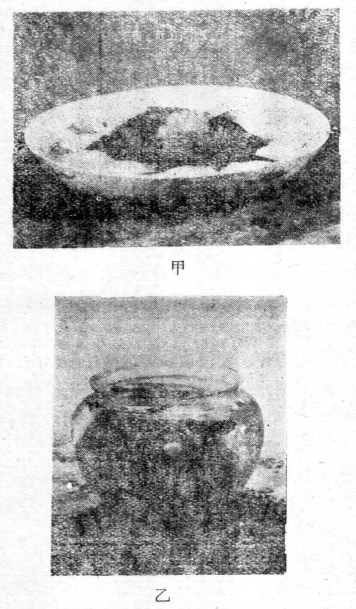
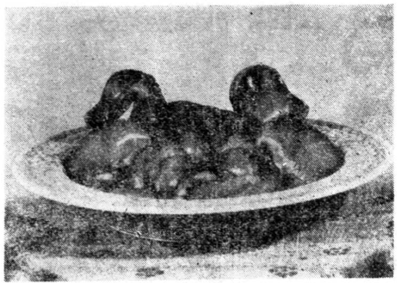

# 中国名菜谱 第八輯

商業部飲食服務局 編

輕工業出版社

1960年·北京

## 內容介紹

江蘇,浙江兩省的烹饪技術,在國內外都享有很高的声誉, 而且各大中城市都各具特色, 品種繁多。本輯為兩省名菜、名小吃專輯, 介紹了杭州、南京、揚州、苏州、镇江等五市名菜八十八種、名小吃二十九種。其中有杭州酱鸭、鸡包鱼翅、清蒸鲥鱼、枣泥拉糕、宁波湯團等著名菜、點, 以及杭州的西湖醋魚、莼菜湯, 揚州三丁包子、千層油糕, 镇江肴肉等特殊風味。

本輯是商業部飲食服務局在江蘇、浙江兩省商業廳和杭州、南京、扬州、镇江、苏州等市商业局的大力支持下, 组织當地名廚師集體研究编写而成的, 最後並經過一些名廚師的共同審查。對於原料處理、烹飪過程和裝盤藝術都作了較為詳細的敘述, 並附有必要的圖解和照片; 有關曆史掌故和名店也做了適當介紹。可供各地飲食業的從業人員, 烹飪学校師生, 以及機關、企業等公共食堂厨师参考和学屠。

中國名菜譜

第八辑

商業部飲食服務局編

輕工業出版社出版

(北京广安内白广路)

北京市發刊出版業營業許可證出字第091号

北京市印刷一厂印刷

新华書店科技發行所發行

各地新华書店經銷

787×1092 毫米×4 99 印張·104,000 字

1960年5月 第1版

1960年5月北京第1次印刷

印数: 1-10,000

定价: (10) 0.68 元

统一書號: 15042·972

***

目 录

名 菜

一、燉菜核……………6

二、清燉雞孚……………7

三、松子燴肉……………9

四、扁大枯酥……………10

五、燉生敲……………12

六、鴨包魚翅……………13

七、貴妃鷄翅……………14

八、蘆姜炒鷄脯……………15

九、鳳尾蝦……………16

一〇、松鼠魚……………18

一一、美味肝……………19

一二、蛋燒卖……………20

一三、料燒鴨……………21

一四、炸蝦球……………22

一五、鷄皮魚肚……………23

一六、燙干絲……………24

一七、清湯火方……………25

一八、大煮干絲……………27

一九、海底松芙蓉蛋……………28

二〇、安豆苗炒山鷄片……………29

二一、金蔥燒野鴨……………30

二二、野鴨菜飯……………31

二三、將軍过桥……………33

二四、扒燒整豬头……………35

二五、斑肝烩蟹……………36

二六、蠅蜜豆腐湯……………37

二七、鯊魚菜薑……………38

二八、白汁春筍……………39

二九、松子肉……………40

三〇、醋熘鱸魚……………41

三一、刀魚羹滿子面……………43

三二、荷包鯽魚……………44

三三、烤方……………45

三四、晾冬瓜……………47

三五、三套鴨……………49

三六、水晶肴肉……………50

三七、紅燒刀魚……………54

三八、清蒸刀魚……………55

三九、紅燒鱘魚……………56

四〇、清蒸鱘魚……………57

四一、白烩鯪魚肚……………58

四二、清蒸螃蟹斬肉……………59

四三、紅燒鯉魚………60

四四、拆燴鱺魚頭………61

四五、母油整鴨………62

四六、滷鴨………63

四七、胡葱野鴨………64

四八、網油野鷄………65

四九、薑菜野鷄………66

五〇、鷄油菜心………67

五一、西瓜鷄………68

五二、烟肉煎豆腐………70

五三、白汁元菜………71

五四、炒蟹粉………73

五五、黃燜鯰………74

五六、松菌大蝦仁………75

五七、巴肺湯………76

五八、薑菜川蕩片………77

五九、西湖醋魚………78

六〇、排南………80

六一、叫化童鷄………81

六二、油爆蝦………83

六三、干炸响鈴………84

六四、八宝豆腐………85

六五、番茄蝦仁鍋巴………86

六六、火腿蚕豆………87

六七、火腫神仙鴨………87

六八、魚頭湯………89

六九、西湖薑菜湯………90

七〇、龍井蝦仁………91

七一、蜜汁火方………92

七二、新風鷄………93

七三、八宝童鷄………94

七四、芙蓉肉………95

七五、糟鷄………96

七六、象牙鯪魚………97

七七、糟青魚干………98

七八、荷叶粉蒸肉………99

七九、南肉竹筍………100

八〇、火濛濛筍………101

八一、生爆鱳片………101

八二、斬魚圓………102

八三、蝦子冬筍………103

八四、東坡肉………104

八五、火腫扒魚翅………105

八六、杭州醬鴨………106

八七、鰥扣鷄………108

八八、干菜燜肉………109

名小吃

八九、酥油燒餅………111

九〇、薄皮包子………113

九一、三丁包子………115

九二、生肉包子………117

九三、蟹黃包子……… 118

一〇六、蟹黃湯包……… 134

九四、雪筍包子……… 119

一〇七、刀魚面……… 136

九五、野鴨菜包……… 119

一〇八、小刀面……… 137

九六、干菜包……… 120

一〇九、棗泥拉糕……… 139

九七、糯米燒卖……… 121

一一〇、吳山酥油餅……… 140

九八、翡翠燒卖……… 122

一一一、幸福双……… 141

九九、千層油糕……… 123

一二、西施舌……… 143

一〇〇、清蛋糕……… 125

一三、猫耳朵……… 143

一〇一、酥餅……… 126

一四、蝦爆鱈面……… 144

一〇二、徽州餅……… 127

一五、宁式鱈絲……… 146

一〇三、黃橋燒餅……… 129

一六、片兒川面……… 147

一〇四、餃面……… 132

一一七、宁波湯團……… 148

一〇五、白湯大面……… 133

## 名菜

### 一 炖菜核

(從一至四共四種根据南京市六華春[^1]制作经验整理)

#### (一) 原 料 [^*]

|                  |                               |        |        |
|------------------|-------------------------------|--------|--------|
| 青菜             | 八斤                          | 精盐   | 六分   |
| 生鸡脯肉         | 一兩二錢                      | 味之素 | 一分半 |
| 火腿片(中段瘦肉) | 六錢                          | 料酒   | 三钱   |
| 水发冬菇         | 三錢                          | 團粉   | 六分   |
| 淨冬筍           | 六錢                          | 鸡油   | 三钱   |
| 鸡蛋清           | 半个                          | 豬油   | 一斤半 |
| 鸡汤             | 三兩七錢       (約耗二兩一錢) |        |        |

#### (二) 制作方法

1. 选叶短肉厚的青菜(“矮脚黄"种最好)，去其外叶，只留最中心的四、五瓣菜心，在清水中刷洗淨灰泥，但不要弄散菜心。将菜头削成橄榄形。留菜心长约三寸（重約一斤)。

2. 將生鸡脯肉切成柳葉形的片, 長一寸半、寬三分，一邊厚一邊薄, 厚邊约半分。置碗中, 加蛋清、团粉, 抓拌均匀。

3. 炒勺置旺火上, 倒入豬油一斤半, 燒約四成開, 見油邊起小泡时, 將菜心放入“拉”[^2]至半熟, 見菜瓣鮮绿, 边缘白中微透明時, 隨即用漏勺撈起。再將鸡肉逐塊放入油中“拉"过，見起壳時(約一分鐘) 即捞出，仍装入碗内。

4. 取砂钢一只，将菜心在锅内沿边顺序排齐，根靠锅边，叶梢在锅底中心，其上复以冬菇、冬笋片、火腿片、鸡脯片, 排法系將上述四色分占圆形一角 (茹(只): 复于菜叶上，其下周围露出菜头。再放人精盐、料酒、味之素，鸡汤，盖好盖，置旺火上煮开，立即移于微火上焖透（约十五分钟)，浇入鸡油即成。

#### (三) 特 點

此菜色彩调和，菜味鮮嫩, 柔軟酥透, 入口即化, 湯味醇厚, 營養豐富。

[^*]: 本書中所有配方分量的重量單位, 都是市斤十兩制,

[^1]: 六华春是南京有名的大菜馆之一，创办于 1926 年，原仅卖“靠柜酒”小吃，至 1930 年逐漸發展為菜馆，其砂鍋炖菜核紅極一時，颇负盛誉。该店現有名厨师胡长龄、陈正华、杨继林等人，均有三、四十年以上的操作经验。砂锅炖菜的特点是原汁原味，六华春往昔用焖笼分类炖制，炖时砂锅上蒙皮纸一层，菜味更加鲜美酥透。

[^2]: “拉油”，即用火熱鍋放入冷油後, 燒至温熱(油鍋邊略有小泡上翻)，將原料放入油中稍炸一下即取出。意即在油中“走”一下, 也叫“窩油”。

### 二 清炖鸡孚

#### (一) 原    料

|                                |          |                      |                        |
|--------------------------------|----------|----------------------|------------------------|
| 生鸡肉（脯、腿各半，去骨留皮） | 三两七钱 | 葱末                 | 七分半                 |
| 生豬肉 （肥三成, 瘦七成）      | 三两七钱 | 姜末                 | 七分半                 |
| 火腿片（肥连瘦）               | 一两二钱 | 料酒                 | 三钱                   |
| 水冬菇                         | 一兩二錢 | 团粉                 | 六钱                   |
| 鸡蛋                           | 四个     | 高汤（鸡、火腿熬成） | 七两半                 |
| 精盐                           | 一分八厘 | 猪油                 | 一斤半（約耗一兩二錢） |

#### (二) 制作方法

1. 將豬肉细切粗斩成米粒大小, 用葱、姜末及精盐六厘，拌匀。將鸡皮朝下平摊在砧板上, 用悬刀在鸡肉上“排”[^1]一次，以刀口入肉為肉厚之半為度，不要排断鸡肉，每刀間隔約二、三分。再將豬肉末均勻地平铺于鸡肉上, 仍用刀口在肉上上下左右交叉“排”两次，刀口以接近鸡肉为度，使猪肉、鸡肉紧密吻合后，再将鸡肉改切成边长一寸的三角形旗帜块。

2. 鸡蛋破壳取蛋清放盘中，以竹筷搅打成蛋浆（打起白色泡沫似雪花，筷子直立其中而不倒），加入团粉拌匀，然後將鸡肉塊放入裹沾。每塊四周都要裹勻, 肉不露出。

3. 鍋置于旺火上，倒入豬油一斤半，燒至半開, 即見油微起青煙時, 將鸡块分作三次逐塊投入油鍋內炸（约一分鐘）。鸡块稍起软壳後，即用漏勺撈出, 瀝去余油, 放入砂鍋中, 並加入高湯、火腿片、料酒、 盐(一分二厘)，盖好盖，置于旺火上燒開。再移至微火上燜約二十五分鐘 (视鸡的老嫩程度时间长短不一，以鸡肉酥透为度)，放入冬菇再焖五分钟即成。

#### (三) 特点

此菜為汤菜, 湯面潔白, 襯以火腿、冬菇, 紅黑相映，色澤嬌艳。鸡肉細嫩, 湯鮮味香, 當有營養。

[^1]: ”排“, 是一種刀法，把鸡肉從頭到尾挨次切一遍，刀深至肉的一半。

### 三、松子熏肉

#### (一) 原料

<table><tr><td>五花猪肉(带皮去骨)</td><td></td><td>姜片</td><td>一錢半</td></tr><tr><td></td><td>一斤</td><td></td><td></td></tr><tr><td>松子仁</td><td>三錢</td><td>葱段</td><td>一錢二分</td></tr><tr><td>綠叶菜</td><td>二兩半</td><td>茶叶</td><td>三錢</td></tr><tr><td>冰糖</td><td>六錢</td><td>料酒</td><td>一兩二錢</td></tr><tr><td>白糖</td><td>六錢</td><td>花椒</td><td>十粒</td></tr><tr><td>精鹽</td><td>一錢八分</td><td>陈皮(中药材)</td><td>一錢半</td></tr><tr><td>醬油</td><td>九錢</td><td>香油</td><td>一錢二分</td></tr><tr><td>猪油</td><td>六錢</td><td></td><td></td></tr></table>

#### (二) 制作方法

1. 將五花猪肉一塊，切除四边不齐處修成長方形，長約五寸四分、寬約四寸二分、厚約七分。用清水洗淨后，用精鹽一錢二分及花椒十粒拌和一起，以手抓之在肉身周圍擦透醄過，夏季約二小時，冬季約四小時，取出洗淨。用鉄叉平叉入肉身內，肉皮向下在旺火上燒。待皮燒焦后(似鍋巴)浸入清水內泡十分鐘，肉皮回軟后取出，用刀刮去焦皮部分，皮剩約一分厚，再用清水洗淨。

2. 取砂鍋一只，以“篾格架”垫于鍋內底部，篾架上先放葱段、姜片，次放猪肉(皮朝下)，並加入醬油、料酒、冰糖、陈皮、松子仁及清水四兩，盖好鍋盖，放在旺火上燒開，移至微火上燴二小時，視肉皮酥透為度。

3. 取茶叶和白糖四錢三分放入空铁鍋內，其上架以铁絲格，絡上平放猪肉，皮朝上，铁鍋加盖，盖严不使漏气，置于旺火上燒約二、三分鐘。此时茶叶与糖因鍋燒灼而冒烟，肉經烟燻，色變金黃，味帶燻香即取出，肉皮朝上，平置砧板上，以香油塗擦肉皮后，用坡刀將肉斜切成八片，每片厚約六、七分，再从中腰截一刀，改成十六片，保持原狀移放腰圓形盤中央(皮朝上，仍呈長方形)。同時將砂鍋內松子仁撈出摆放于肉皮上。

4. 在爌肉切好裝盤同時，以炒勺置旺火上，倒入猪油，燒熱后即倒入綠葉菜(冬用豌豆苗，夏用莧菜、菊花菜)，放入精鹽六分、白糖一錢七分，炒約一分鐘即起鍋，以色碧綠，將熟而不爛為度，分放于腰圓盤之兩端即成。

#### (三) 特點

此菜色澤勻称，碧綠金黃，肉味酥香，肥而不膩，佐以綠葉菜食之尤为爽口，為夏令名菜之一。

### 四、扁大枯酥

#### (一) 原料

|                          |          |        |                  |
|--------------------------|----------|--------|------------------|
| 淨生猪肉(肥三成，瘦七成) | 七兩半   | 酱油   | 六錢             |
| 熟肥膘猪肉               | 一兩二錢 | 料酒   | 三錢             |
| 大米鍋巴                 | 一兩二錢 | 濕麵粉 | 六錢             |
| 綠葉菜                   | 二兩半   | 精盐   | 三分七厘         |
| 面粉                     | 六錢     | 味之素 | 六分             |
| 葱末                     | 八分     | 白糖   | 一兩             |
| 姜末                     | 八分     | 高湯   | 二兩             |
| 醋                       | 九錢     | 豬油   | 一斤半(約耗二兩) |

### (二) 制作方法

1. 將鍋置旺火上，倒入豬油一斤半燒開后，放入鍋巴，炸成金黃色（約一分半鐘）倒入漏勺。稍經吹涼后，即放在砧板上用擀面杖碾碎。

2. 將生猪肉斬碎約半个米粒大小，應細切粗斬，不要剁的过爛。熟肥臾肉切成芝蔥粒大小，同放碗內，加入碎鍋巴及面粉、蔥、姜末、精鹽(一分八厘)、味之素，用手抓拌均勻，做成圓餅五塊(直徑約二寸五分、厚約一分半)。

3. 猪油倒入鍋中置旺火上，燒至八成開，油不冒泡，即將起烟時，投入肉餅，炸約二分鐘；見其色略發黃，微起軟壳后，即用漏勺撈出，略晾一分鐘；再入油鍋重炸約二分鐘，色變金黃，並起硬壳，即連鍋端起離火，肉餅仍在油中繼續“吞”[^4.1]約三分鐘；再將鍋置旺火上，炸約兩分鐘，肉餅變赭色，已酥透，撈起瀝去余油，放于腰圓形盤中心。

4. 在肉餅进行重炸的同时，即炒綠叶菜，將鍋在旺火上燒熱，倒入豬油五錢，燒開。放入綠叶菜(豌豆苗，莧菜，菊花菜)，隨即加入鹽(一分九厘)、糖(六分，如用莧菜，即不需放糖)，約炒一分鐘，色變翠綠，將熟而不爛时即起鍋，摆放腰圓盤的兩端。

5. 在第三次炸肉餅的同时即勾滷汁：將鍋放在旺火上，倒入高湯、糖(九錢四分)、醬油燒開后，放入醋及团粉，用手勻不斷攪動，見汁變稠，順鍋邊旋入豬油三錢，隨即倒于肉餅上，發出“吱啦”响声，趁熱食用。

### (三) 注意事項

此菜炸肉餅、炒綠叶菜、勾汁的時間一定要配合好，否則肉餅一冷即變僵硬不好吃。如廚房距離較遠，勾好滷汁，可另碗盛起，臨上桌時，倒肉餅上，既闻响声，汁味更好。

### (四) 特點

此菜酥脆酸甜，色濃有聲，菜肉同食，清香爽口。因形扁大，嚼之酥香，故名。

[^4.1]: “吞”，即鍋离火后不再加热，仅利用余热，肉餡在热油內繼續炸，則外面不会过焦而胡，内里可以酥透。

### 五、燉生敲

(从五至七共三种根据南京市义记复兴[^5.1]制作經驗整理)

#### (一) 原料

|          |          |        |                |
|----------|----------|--------|----------------|
| 鳝鱼     | 二斤     | 蔥     | 六分           |
| 五花豬肉 | 一兩二錢 | 姜     | 六分           |
| 醬油     | 一兩半   | 高湯   | 一斤           |
| 白糖     | 一錢八分 | 豬油   | 九錢           |
| 料酒     | 六錢     | 植物油 | 二斤           |
| 蒜頭     | 一兩二錢 |        | (約耗一兩八錢) |

#### (二) 制作方法

1. 选鮮活肥大鳝鱼二斤，活杀后，去头及肚杂脊骨；用清水洗淨后，切成斜方形塊，長約一寸八分，再用水洗淨濾干。

2. 鍋置旺火上，倒入植物油，燒至八成開（油已抽絲），將鱈塊放入炸約三、四分鐘。魚肉發白色，油無水聲（魚身內水份已盡），只翻小泡，發油响声，即用漏勺撈起。稍晾二、三分鐘后，將油再燒至八成開，將鱈鳝塊重炸（約四分鐘），至色变金黄，形成卷狀时，即用漏勺撈起。另將生蒜头放入油內略炸一下，蒜起胡边即撈出。

3. 將炸过的鱈鳝塊、蒜头、連同生五花猪肉(切成薄片)一併放入砂鍋內，加高湯用微火煮約15分鐘，至魚肉發松，放入醬油、白糖、料酒繼續于微火上燉至全熟(約十五分鐘)。此时另以豬油入鍋置旺火上，將葱姜放入炸过，起魚發出香味后，葱姜撈起不要，將油倒入砂鍋內即成。

#### (三) 特点

鰭魚熟后形似肉卷。色澤金黃，富有彈性，用筷夾起，兩端下垂而不斷，食之極爛，其味濃厚酥香。

此菜清明节后食之最好，俗称“小暑里黄鳝赛人参”，因鳝魚性溫暖而滋補，有增氣力强筋骨之效，昔日習武藝者多喜食之。

[^5.1]: 义記复兴是南京市名菜館之一，開業虽只十余年，但本身是六華春菜館的分支。廚師高長海、田文富都具有三、四十年的烹調經驗，以圖案冷碟和红锅著称。

### 六、鴨包魚翅

#### (一) 原料

|          |            |      |          |
|----------|------------|------|----------|
| 光鴨一只 | (重約四斤) | 鹽   | 六錢     |
| 魚翅     | 一斤       | 醬油 | 一兩八錢 |
| 姜片     | 九錢       | 料酒 | 一錢二分 |
| 蔥段     | 九錢       | 高湯 | 三斤六兩 |
| 冰糖     | 六錢       | 豬油 | 一兩二錢 |

#### (二) 制作方法

1. 先將魚翅边梢剪去一、二分，放鍋內，加入冷水，水要浸过魚翅，蓋好后置灶火上煮，要用草柴，煮至將開之前，見水已在鍋边滋滾，即熄火不燒，繼續燜至八小时后，捞出擦去砂（擦砂系用燒过的小煤塊洗淨后在魚翅上擦），用清水洗淨。鍋內換清水，再如前法煮燜四小时，再擦兩次砂，擦后洗淨。第三次煮燜六小时，然后取出魚翅，用手撕下翅皮，翅尖备用（去其肉骨不用）。

2. 將光鴨在頸处用刀直开一小口，長約二寸。將鴨皮輕輕剝开，倒翻轉来，从宰口处將頸骨切断，以繩系住頸骨吊起，繼續將鴨皮連肉倒翻，隨剝隨用刀貼骨割断其骨肉相連处，剔去整骨架，皮肉不动，保持整鴨。此时皮朝里，肉朝外，用水洗淨，並用开水燙去血沫，再翻轉使鴨皮朝外恢复原狀。

3. 將魚翅就鴨頸皮處小口塞入鴨肚內，將鴨頸用繩扎好。取砂鍋一只，內以竹篾墊底，鴨置其上，放入蔥、姜、料酒、糖、鹽、醬油及高湯，在旺火上煮沸后，移至溫火上燜約三小時，將鴨取出，去掉頸处紫扎繩及蔥段姜片，另換砂鍋，倒入燜鴨滷湯，再用微火燉約十五分鐘即成。

#### (三) 特点

此菜鴨肉酥肥，翅肉滑潤，鮮嫩細膩，富有营养，色黄味香，冬令食之最宜。

### 七、貴妃鷄翅

#### (一) 原料

|              |                  |          |        |
|--------------|------------------|----------|--------|
| 光鷄翅膀     | 二十只           | 醬油     | 一兩半 |
|              | (約重一斤二兩半) | 葡萄酒   | 三錢   |
| 水發冬菇     | 六錢             | 滷湯[^7.1] | 一斤   |
| 蔥(分兩次用) | 二兩二錢         | 熟豬油   | 九錢   |
| 姜           | 一錢二分         | 植物油   | 六錢   |
| 白糖         | 三錢             |          |        |

#### (二) 制作方法

1. 选好光鷄(一斤重以上的)翅膀十对(如是老鷄, 可适量减少, 下翅膀时, 系自光鷄胁下順骨縫处切下, 再就翅膀中弯处順骨縫一刀改截成二段, 上半段叫大轉弯, 下半段叫小轉弯), 用溫水洗过, 摘淨絨毛, 挤去毛根, 去污洗淨。

2. 取蔥三錢切碎成“馬蹄蔥”。生姜切成碎米粒大小。

3. 炒勻置旺火上,倒入植物油,將生姜米和“馬蹄蔥”放入，待發出香味並見焦胡，即將鷄翅放入燉約四分鐘，再將糖一錢八分、醬油九錢放入，見鷄翅上色發紅后即起鍋。再放于砂鍋內，加入滷湯在微火上燜，在將煮開前，用勺撇去湯面浮的泡沫，共燜約四十分鐘（指仔鷄或秋鷄，如是隔年老鷄即需一小时半左右）。此時可撈起用手摸試，鷄翅如已發松，肉已離骨即不能再燜，否則肉會脫落。然後將鷄翅撈出，另換小砂鍋將“小轉彎”逐個排放于鍋底，“大轉彎”沿鍋邊排放于上層似菊花形。

4. 取香葱一兩九錢，摘去葱叶不用，把葱白切成二寸半長葱段，投入热猪油鍋中，在火上“拉”上焦色后，再將冬菇投入翻攪數下，即起鍋。用筷子將葱段最外已焦一層夾去不要，即將葱白、冬菇連同余油一併倒入砂鍋內鷄翅上層中心，再放入糖一錢二分、醬油六錢，隨將滷湯再行倒入，置微火上燜約十五分鐘，倒入葡萄酒，即成。

#### (三) 特点

此菜因鷄翅肉活絡異常，只只完整，吃時用舌舐動，肉即離骨，肥美鮮嫩，色澤金黃，很美观。

[^7.1]: 滷湯制法，以鷄骨半斤、豬骨一斤、清水二斤、鹽一錢八分放鍋內，置微火上炖，汁濃即成滷湯。一般系用历次套煮的老湯，根據原料多少，按上述比例煮制即成。

### 八、蘆姜炒鷄脯

（此菜根据南京市四鹤春菜館厨师楊吉林制作經驗整理）

#### (一) 原料

|            |                      |        |          |
|------------|----------------------|--------|----------|
| 生鷄脯肉   | 三兩七錢             | 料酒   | 一錢二分 |
| 淨蘆姜[^8.1] | 二兩半             | 鹽     | 六分     |
| 鷄蛋       | 一个                 | 味之素 | 三分     |
| 粉         | 一錢二分             | 鷄湯   | 一兩二錢 |
| 猪油       | 一斤（约耗一两八钱） |        |          |

#### (二) 制作方法

1. 將生鷄脯肉橫切成柳叶条形，長約一寸半、寬三分，厚度為一边厚一边薄，置于碗内。取鷄蛋打开，去黄用蛋清，連同团粉六分，將鷄脯拌勻。蘆姜也切成小片，長一寸、寬二分、厚約半分，放入开水碗中，燙約一分鐘，去其辣味后撈起备用。

2. 將炒勺置于旺火上燒熱，倒入豬油一斤，接着將鷄脯下鍋“拉”(約一分鐘)，用手勻攪動油鍋，油逐漸燒熱，至鷄脯變色發白后，即起鍋倒入漏勺。再將炒勺放于旺火上，放入蘆姜，倒下鷄湯，煮開后即將鹽、料酒、味之素一併放入。再用团粉(六分加水調和)勾芡，見汁稠時，即將鷄脯倒入，用炒勺將菜顛翻几个身抱汁即成。

#### (三) 特点

此菜鮮嫩味美，营养丰富，黄白相间，色澤清淡、协调，非常美观。姜具暖性，能开胃舒气，为时令佳菜。

[^8.1]:蘆姜：即嫩姜芽，以选短粗肥嫩者为佳。

### 九、鳳尾蝦

(从九至一二共四种根据南京市馬祥兴[^9.1]制作經驗整理)

#### (一) 原料

|        |          |          |                |
|--------|----------|----------|----------------|
| 河蝦   | 一斤半   | 精鹽     | 一錢二分       |
| 豌豆   | 一兩二錢 | 味之素   | 一分半         |
| 蔥白   | 一錢八分 | 鷄湯     | 一兩二錢       |
| 鷄蛋清 | 一个     | 鴨油[^9.2] | 半斤           |
| 濕團粉 | 三錢     |          | (約耗一兩二錢) |
| 料酒   | 一錢二分 |          |                |

#### (二) 制作方法

1. 先將豌豆放入开水鍋內煮熟(約三分鐘)，取出倒入冷水中冰涼后，色呈鮮綠。蔥白切成蔥花。

2. 將鮮活大河蝦去头、壳，留尾壳（剝蝦时系用双手拿住蝦身兩端，肚子向上，拿住蝦头的手向下一挤，蝦头及腹壳即一併脫落，尾壳仍完整保留連于蝦身），放入清水內，取竹筷三根將水打轉，洗掉紅筋。洗至蝦肉潔白時，取出濾干水，雞蛋清調开放入蝦肉內，加入鹽六分、团粉一錢二分，抓拌均勻。

3. 炒勺置旺火上，倒入鴨油半斤，燒約五成開，見油鍋內小泡翻上，將蝦倒入，用手勺攪散，待蝦肉發白色，尾壳呈鮮紅色時（約一分鐘）即起鍋倒入漏勺，瀝去余油（約耗去九錢）。再將炒勺置于火上（应先用小鍋帯將勺內擦刷干淨，防有胡底留存，影响色澤），將鵝湯、鹽六分、团粉（一錢八分）、料酒、味之素、蔥花一併倒入，用手勺輕輕攪動兩下，再繼續燒（約一分鐘）。熬成牛奶汁后，即將蝦子、豌豆同时倒入，边用手勺推，边將炒勺翻顛几下，順鍋周边淋入鴨油三錢，蝦在鍋內再翻兩個身抱汁即成。

#### (三) 特点

此菜蝦肉潔白，尾壳鮮紅，形似鳳尾，襯以翠綠色的豌豆愈显娇艳美观。蝦味鮮嫩，佐以鴨油烹調，其味更美。

[^9.1]:馬祥兴为南京市最负盛名的清真菜館之一，已有六、七十年以上历史。該店最早只卖“牛八件”，其后逐渐發展为菜館。該店的四大名菜声名远播，外地来宁者多慕名前往就餐。名厨师有馬定松、陈炳鈺等人，已有四、五十年的烹调經驗。

[^9.2]: 鴨油不能以植物油代替，否則蝦肉不白，色不美觀。如無鴨油，可以白脫油代之。無豌豆可用白果、青番茄等代替。

### 一〇、松鼠鱼

#### (一) 原料

|        |                   |        |                   |
|--------|-------------------|--------|-------------------|
| 活鳜鱼 | 一条 (重約一斤半) | 米醋   | 二兩半            |
| 淨冬筍 | 六錢              | 鵝湯   | 二兩              |
| 冬菇   | 一錢半            | 白糖   | 二兩              |
| 蔥     | 二錢              | 姜     | 一錢              |
| 團粉   | 半斤 (約耗一兩半) | 植物油 | 二斤 (共約耗三兩) |

#### (二) 制作方法

1. 冬菇用水泡开切絲。冬筍切絲。姜切成碎末。葱切成馬蹄形葱花。

2. 鰂魚鳜鱼去鱗破腹去淨肚杂，洗淨后自魚岔(即魚頸下)处切去魚头，再順魚脊骨用刀平剖至尾，尾亦对开切成兩片，剔去脊骨，片去腹刺(魚皮朝下平放，刀順刺根处平片即下)；魚皮朝下平放砧板上，用刀在魚肉上交叉斜切兩次，共约二十四刀，將魚肉切成菱形方塊；切的深度需接近魚皮，但不能切断。將魚放入干团粉內輕加揉搓，待魚肉外裹滿团粉后，略抖去余粉，放入旺火上的滾油鍋內，炸約十分鐘；至水分已去，油不翻花，且無响声，魚身已翻卷如鼠形時，即連鍋端离火，稍涼后，再置旺火上，重炸約一、二分鐘，魚呈金黃色即取出。置楠圓形盤中，略加整形，使尾上翹，極似松鼠。

3. 在魚重炸的同时，另用鍋在旺火上將鵝湯、白糖、米醋、葱、姜、冬菇、冬筍煮开，即將水团粉一兩(干团粉三錢調成)倒入勾芡,汁稠成糊后,再澆入滾開熱油一兩, 隨即將滷汁澆于魚上即成。

#### (三) 特点

此菜酸甜鮮嫩,脆而不枯,其味香透。因色泽金黄,肉 翻似毛,“吱吱”作响,極似松鼠,故名。

### 一一、美味肝

#### (一) 原料

|          |          |        |                  |
|----------|----------|--------|------------------|
| 鴨胰臟   | 三十条   | 料酒   | 六錢             |
| 生鷄脯肉 | 一兩八錢 | 味之素 | 一分二厘         |
| 冬菇     | 一錢二分 | 鷄湯   | 六錢             |
| 淨冬筍   | 六錢     | 濕團粉 | 五錢             |
| 鷄蛋     | 一个     | 鴨油   | 四兩             |
| 精鹽     | 一錢二分 |        | （約耗一兩八錢） |

#### (二) 制作方法

1. 將鴨胰臟放入沸水鍋內燴約十秒鐘，見其變粉紅色（白中帶紅），取出，放入冷水內冰涼，再用清水洗淨，並逐件用手撕開（每件均有兩葉）去掉当中臊筋，盛入磁盤內。將鷄脯肉切成粗絲，大小同鴨胰，放在一起；鷄蛋破壳后，取用蛋清，連同水團粉一錢八分倒入，用手抓拌均勻。冬菇用水泡開，與冬筍均切成較鴨胰略小的薄片。

2. 炒勺放旺火上，倒入冷鴨油四兩，燒至溫熱即將鴨胰、鷄脯連同冬筍、冬菇放入，用手勺攪拌約一分鐘，見油起沫時即起鍋，倒入漏勺裡去余油。隨將鷄湯、鹽、料酒、味之素、團粉三錢二分一併放入炒勺內熬成如牛奶汁子后，把鴨胰、鷄脯、冬菇、冬筍同時倒入，將鍋略顛几下，使滷汁抱住，速沿鍋邊淋下鴨油三錢再翻兩翻即成。

#### (三) 特点

此菜色泽清淡，鲜嫩味美，佐酒最佳。

### 一二、蛋燒卖

#### (一) 原料

|              |          |        |          |
|--------------|----------|--------|----------|
| 鸡蛋         | 四个     | 料酒   | 三錢     |
| 蝦仁         | 二兩半   | 鷄湯   | 一兩二錢 |
| 葱花(用葱白) | 一錢八分 | 湿团粉 | 一錢八分 |
| 精鹽         | 一錢八分 | 鴨油   | 一兩     |
| 味之素       | 二分半   |        |          |

#### (二) 制作方法

1. 先將蝦仁洗淨瀝干，置砧板上用刀橫“排”几刀(不要砌的过碎)，放碗內，加精鹽六分、味之素一分半、葱花、料酒和鴨油六錢，調拌均勻，作成餡。

2. 將鷄蛋破壳，倒碗中攪勻。隨用手勺置火上燒熱，放入鴨油一、二滴，使勺滑潤，用湯匙舀鷄蛋汁一匙倒入勺內，手持勺柄將勺一晃，鷄蛋即攤成一張圓形蛋皮(不能過熟，要內面不干，否則包餡后不粘)。即用筷子將蝦仁挑取一團(約兩顆蛋豆大小)放入蛋皮中央，用筷子將蛋皮挑起一边翻折成半圓形，再用筷子貼着餡心稍上處一夾，即成燒卖形狀。夾放盤中。如此連續制成二十個，摆放盤心成圓形，連盤置蒸籠內，在旺火上蒸約十分鐘，見籠帽頂上氣，手試捏燒卖內餡心已不發軟，蝦仁已熟，即連盤取出。

3. 炒勺置旺火上，倒入鷄湯、味之素一分和精鹽一錢二分，加入湿团粉勾成“牛奶汁子”，淋入鴨油三錢，浇于蛋燒卖上即成。

#### (三) 特点

此菜黃白相映，色澤甚美，形似燒卖，頗為別致。蛋皮蝦心，鮮嫩味美，佐酒下飯均宜。

### 一三、料燒鴨

(从一三至一五共三种根据南京市华乐园①制作經驗整理)

## (一) 原料

<table><tr><td>燒鴨肉</td><td>四兩(鴨脯、鴨</td><td>醋</td><td>二錢半</td></tr><tr><td></td><td>鴨腿肉各</td><td>醬油</td><td>三錢</td></tr><tr><td></td><td>占三分之一)</td><td>味之素</td><td>三分</td></tr><tr><td>淨冬筍</td><td>三兩</td><td>湿团粉</td><td>一錢二分</td></tr><tr><td>鹽</td><td>一錢八分</td><td>鵝(鴨)湯</td><td>五錢</td></tr><tr><td>糖</td><td>二錢半</td><td>鴨油</td><td>三錢</td></tr><tr><td>植物油</td><td>九錢</td><td></td><td></td></tr></table>

## (二) 制作方法

1. 选肥大的燒鴨一只(仔鴨最好，肉嫩)，切除头颈，取其鴨脯(用下脯較嫩)、鴨褶(腿下小腹部最肥，皮嫩而香)、鴨腿(削取其最上層处最嫩)三部分肥瘦嫩肉(此三处肉具备肥、瘦、嫩、酥、脆、香、色美的优点)，用刀片下，切成長九分、寬五分、厚一分的肉片。切时要順肉絲以“坡刀”片切。

2. 將冬筍或春筍(配菜可根據季节选用，春用春筍，夏用菱兒菜，秋用芹菜，数量相同)，切成長八分、寬四分、厚半分的小片(如用菱兒菜、芹菜即切成八分長的小段)。

3. 炒勺置旺火上，倒入植物油，燒至八成開(以不冒烟為度)，即將冬筍下鍋翻炒几下，加入鹽，隨將糖、醋、味之素、醬油等調成糖醋汁一併倒入，再略加翻炒；隨即沿勺壁

淋下鷄湯，加入团粉勾芡。接着倒入鴨油、鴨肉，边用手勺推，边將炒勺端起顛翻几下，菜翻三兩身抱汁即成。

### (三) 特點

鴨肉肥瘦相間，口味香甜而略帶酸味，外表油光，色彩美觀。

① 华乐园创办于1917年，为南京市著名清真菜馆，已故名厨师哈庆荣等份创制一些新品种，頗得消费者的欢迎与赞扬，外地遊客及不少知名人士多慕名前往食用。該店現在厨师万荣生繼承老厨师的烹调經驗，已三十余年，保持盛名而不衰。

### 一四、炸蝦球

#### (一) 原料

<table><tr><td>河蝦</td><td>一斤六兩</td></tr><tr><td>淨荸薺</td><td>六錢</td></tr><tr><td>糯米粉</td><td>五錢</td></tr><tr><td>雞蛋</td><td>一个</td></tr><tr><td>精鹽</td><td>六分</td></tr></table>

<table><tr><td>料酒</td><td>一錢五分</td></tr><tr><td>味之素</td><td>三分</td></tr><tr><td>番茄醬</td><td>三錢</td></tr><tr><td>花椒鹽</td><td>一錢二分</td></tr><tr><td>鴨油</td><td>一斤(約耗九錢)</td></tr></table>

#### (二) 制作方法

1. 选活的河蝦，去头、壳，剥出蝦仁(約重半斤)，用清水洗淨濾干，撒入精鹽抓拌勻和。醃約五分鐘后，平放砧板上用刀斬成米粒狀的小顆粒，放在碗內。

2. 莴薺用刀拍扁斬碎，鷄蛋去壳，連同糯米粉、料酒、味之素一併倒入盛蝦仁碗內，抓拌均勻(到有勁起粘为度)。

3. 將炒勻放于旺火上，倒入鴨油一斤，燒約四、五成熱時(不能过熱，否則蝦仁內水分易干，蝦球即老)，即將拌好的蝦仁用手挤成一个个如胡桃大小的丸子(約二十个)下鍋炸，同時要用手勻不斷攪動。炸約二分鐘，見油將要冒烟，蝦球表面一經鼓起，並呈淡黃色時，即用漏勺撈起，略顛兩

下澱去油，倒放橢圓形盤中。將番茄醬及花椒鹽分置于橢圓盤的兩端，以备蘸食。

### (三) 特点

此菜蝦球色澤金黃，鮮嫩香脆，配以番茄醬、花椒鹽蘸食，滋味甚美，佐酒最宜。

### 一五、鷄皮魚肚

## (一) 原料

<table><tr><td>干黃魚肚</td><td>一兩</td><td>味之素</td><td>四分</td></tr><tr><td>熟鷄皮①</td><td>一兩二錢</td><td>鵝湯</td><td>一斤</td></tr><tr><td>水發香菇</td><td>三錢</td><td>湿团粉</td><td>三錢七分</td></tr><tr><td>淨冬筍</td><td>一兩二錢</td><td>鴨油</td><td>九錢</td></tr><tr><td>鹽</td><td>二錢半</td><td>植物油</td><td>一斤</td></tr><tr><td>白糖</td><td>六分</td><td></td><td>(約耗半兩)</td></tr></table>

## (二) 制作方法

1. 先將植物油倒入鍋中，放火上燒至溫熱，將魚肚放入炸，炸時要不斷攪動和用手勺與漏勺壓軋，約半小时魚肚回軟色變老黃，即撈出放入開水內泡半小时，即為放好之魚肚。將其切成長一寸五分、寬一寸的菱形塊狀。熟鷄皮切成長一寸、寬五分長方形塊。香菇切成兩半。冬筍切成長一寸、寬五分的長片。

2. 鍋置旺火上，放入清水煮開，將魚肚放入煮几开后用漏勺取出，再用手勺压軋，挤干魚肚中所含油水，去其烟燻味，且便于吸收油汁。再將空鍋置旺火上，放入鵝湯、冬筍、香菇、鷄皮、魚肚、鹽、糖，蓋好鍋盖，煮開后移至溫火上燜三、四分鐘，見湯已減少(多吸入魚肚內)，再放入味之素、湿团粉，勾成牛奶黃汁，順鍋边淋入鴨油即成。

### (三) 特 点

汁乳白，菜金黄，色泽甚美，鵝皮微脆，魚肚內鮮汁飽滿，佐以鴨油香味，鮮美可口。

① 熟鵝皮，选較大光鵝黄約六成熟，起出撕下鵝皮即成。

### 一六、燴干絲

(此菜根据南京市永乐园①制作經驗整理)

### (一) 原 料

<table><tr><td>豆腐干</td><td>二兩一錢</td><td>白糖</td><td>一錢八分</td></tr><tr><td>姜</td><td>一錢二分</td><td>香油</td><td>六錢</td></tr><tr><td colspan="4">醬油</td></tr></table>

### (二) 制作方法

1. 切絲：將黃豆制成的豆腐干②放入鍋中煮滾后，取出攤開吹涼，次日加工切成干絲；切時砧板要平，刀口要薄，先用刀將豆腐干片成薄片，每塊約片成十五、六片；再切成絲，絲要細而勻，無大小头及粗細不均狀。將嫩生姜洗淨后，去皮，先用快刀片成薄片，愈薄愈好，再切成細絲，細如棉线，可以穿过針孔。

2. 去漿水：將切成的干絲盛入缸中，用开水泡至次日(泡时水要寬)，换开水反复燴三次，去其漿水味(以上系成批操作方法)。

3. 拌料：临吃时取已去漿水的干絲二兩一錢，放入碗中，層層复盖，推成高桩馒头形狀；用左手四个手指托住碗底，將开水澆于干絲上，至水齐碗口为止；以左手姆指捺住干絲，倒去开水。如此反复燴至四遍后，取姜絲堆放干絲上再燴一次，澆去开水，澆上醬油滷九錢(醬油与白糖和成)、

香油六錢。吃时用筷子將干絲从底挑起翻过，拌勻即成。

### (三) 特点

絲細如綫，色澤清淡，鮮嫩可口，味純而無油膩，營養丰富，飲茶下酒均宜。

① 見本書111頁註①。

② 豆腐干采用黃豆浸水去皮后，人工小磨磨制，以鹽油点漿（不用石膏）挖漿花包緊压制而成，名为“挖花干子”。其內部結構既嫩又勻，切絲后整齊美觀而不断。

### 一七、清湯火方

（从一七至二二共六种根据扬州市富春茶社①制作经验整理）

### (一) 原料

<table><tr><td>光雞</td><td>兩只 (一只重二斤半, 一只重二斤, 共重四斤半)</td></tr><tr><td>豬爪</td><td>一斤半</td></tr><tr><td>金华火腿</td><td>一斤半</td></tr><tr><td>干冬菇</td><td>九錢四分</td></tr><tr><td>天竹筍</td><td>二兩半</td></tr></table>

<table><tr><td>料酒</td><td>三兩八錢</td></tr><tr><td>蝦子</td><td>三錢</td></tr><tr><td>姜</td><td>三錢八分</td></tr><tr><td>葱</td><td>三錢八分</td></tr><tr><td>鹽</td><td>一錢九分</td></tr><tr><td>清河水</td><td>四斤</td></tr></table>

## (二) 制作方法

1. 將光鷄剖腹挖去腸臟，留下心和肚肝洗淨，一只雞剖下胸脯肉兩塊，割下兩腿，雞架、雞類同另一只雞類一齊斬成糊狀(称紅韶)，雞脯也斬成糊狀(白韶)，分別放在碗內。兩只雞腿和一只缺頭的全雞不切，备煮湯用。

2. 把猪爪及火腿摘去毛，刮洗干净，用刀修去火腿“夾黃”(走油处)，斬去猪爪尖。和缺頭的余雞及兩条雞腿一並放入开水鍋中浸洗十分鐘，再一同取出投入砂鍋內，加蝦子和姜、葱各二錢五分、料酒一兩二錢、清河水四斤，上煤爐火燉开。

3. 將五塊炭箕先在煤火里燒透，再前二塊后三塊有次序地放入燜籠cj子内（燜籠是用白鉄制成的，四面開有古錢大的排气孔，c子是專門燃炭箕的一种器具）。c子口放上三角架，把砂鍋放在三角架上。这时炭箕火苗恰好徐徐燒着鍋底，再將砂鍋用燜籠蓋起，煨煮三小時。打开燭籠，取出火腿，剔去腿骨，在肉面縱橫各划若干刀，成一寸正方花紋，刀划到肉的一半，不要切破肉皮。然后肉皮朝下，裝入大碗內，倒進清水二兩半、料酒六錢三分，上籠蒸四十分鐘，再取出滷汁泌到砂鍋里。如此共燴兩次。与此同时，冬菇、天竹筍也用碗裝起，上籠蒸兩次，每次四十分鐘，泌去水分，舖在火腿上面，再加雞湯繼續上籠蒸二十分鐘。

4. 把砂鍋移到烈火上，將斬成糊狀的雞類倒入，再加四兩四錢清水，用鉄勺輕輕攪動。湯微沸時，除去浮沫，用漏勺撈起湯內的糊狀雞類渣滓，用手捏合成圓餅形，再放回砂鍋內；撇一次浮沫，此時湯已基本澄清。使砂鍋半邊着火半邊不着火，把斬好的雞脯（白詔）再加水四兩四錢倒入砂鍋內，立即用鉄勺輕輕攪動。待再沸時撇去浮沫，用漏勺撈起雞脯，仍捏成圓餅形，放入砂鍋內。此時湯色碧綠，清徹見底，清湯已制成，把鍋移開火眼。

5. 从籠上取出火腿泌去滷汁，用清湯濾过一次，再扣入圓盤內澆上清湯即成。

### （三）特点

1. 此湯已有二百多年的历史，烹制技术精細，制成后湯色碧綠，由湯面上能見砂鍋底，味甚鮮美，俗有“七嚼七味”之贊。

2. 此湯肉清香，略帶咸味，肥爛而不膩口。

①富春茶社是揚州市最著名的茶飯館，以制作茶食出名，如富春三丁包子久已馳名國內。近年來該店又將千層油糕和其他名点集于一籠，名为“杂花色”，可饊顧客一餐兼尝多种口味，極受欢迎。点心師張广慶已有几十年的操作經驗。該店所制菜品如清湯、烫干絲等也一向出名。

### 一八、大煮干絲

## (一) 原料

<table><tr><td>豆腐干</td><td>六兩二錢</td></tr><tr><td>熟豬油</td><td>二兩半</td></tr><tr><td>深色醬油</td><td>六錢二分</td></tr><tr><td>蝦子</td><td>六分</td></tr><tr><td>熟鵝絲</td><td>一兩二錢</td></tr><tr><td>熟鵝皮</td><td>一兩二錢</td></tr><tr><td>熟火腿精肉</td><td>六錢二分</td></tr></table>

<table><tr><td>熟胞肝</td><td>二副</td></tr><tr><td>豬腰花</td><td>一兩九錢</td></tr><tr><td>蝦仁</td><td>一兩二錢</td></tr><tr><td>豌豆苗</td><td>六錢</td></tr><tr><td>筍片</td><td>一兩二錢</td></tr><tr><td>精鹽</td><td>三分八厘</td></tr><tr><td>鵝湯</td><td>一斤</td></tr></table>

## (二) 制作方法

1. 將豆腐干放在砧板上用刀片成不到半分厚的薄片，再切成和火柴棒一样粗細的細絲，放入鉢內用开水連續燙三次，燙去泔水味。

2. 鍋內放豬油七錢，用旺火燒熱，將蝦仁倒入炒一分鐘盛起。火腿切成細絲。豌豆苗用开水燙一次待用。

3. 雞湯一斤、雞絲、雞皮(切成菱角形塊)、胞肝(切成薄片)、筍片、蝦子、豬油一兩八錢和干絲一齊下鍋，用旺火煮十五分鐘湯已濃厚。隨即放入腰花、醬油、鹽，蓋好鍋盖，燜約二分鐘。盛起后，加上蝦仁、豌豆苗，最后用火腿絲蓋頂即成。

## (三) 特点

此菜碗头是火腿絲，下襯蝦仁，有紅、黃、白三種顏色，整齊美观。干絲無泔水味，綿軟而香，鮮美可口。

### 一九、海底松芙蓉蛋

## (一) 原料

<table><tr><td>海蜇(白色酥蜇)</td><td>一斤半</td></tr><tr><td>熟火腿片</td><td>二兩</td></tr><tr><td>精鹽</td><td>二錢</td></tr><tr><td>鵝湯</td><td>一斤六兩</td></tr></table>

<table><tr><td>鸡蛋清</td><td>六只</td></tr><tr><td>紫菜叶(产于苏北, 绿色)</td><td>六錢</td></tr><tr><td>味之素</td><td>一分</td></tr></table>

## (二) 制作方法

1. 海蜇入沸水煮二分鐘，取出用清水洗除砂粒，再入沸水燴二十分鐘。蜇肉經过开水燴过，肉身收縮，需用手撕开，泡在清河水中(必須用淡水)，如果蜇肉过大，可用手撕成兩片。

2. 雞蛋清放入碗內，用筷子攪成蛋漿，除去浮沫，倒入雞湯三兩、精鹽六分，用筷子攪拌均勻，上蓋盤子一只，放入沸水籠鍋內蒸十五分鐘，取出即成芙蓉蛋。

3. 鍋內放雞湯一斤三兩，燒沸，將蜇肉从清河水中撈起放入碗內，用鐵勺舀沸湯把海蜇沖洗一次。鍋內放精鹽一錢四分，用鐵勺攪一下。海蜇碗內放味之素二分，再倒上雞湯，用鐵勺把芙蓉蛋挖成大片，放入海蜇碗內，蓋上火腿片八片(每片二寸長、六寸寬)，然后將紫菜叶用沸水燴一次放在湯碗面上即成(如圖1)。

#### (三) 特点

此菜有黃、白、紅、綠等色，湯鮮、蛋嫩、海蜇脆，色味俱佳。

### 二〇、安豆苗炒山鷄片

#### (一) 原料

山鷄脯肉 六兩二錢

淨安豆苗 一兩二錢

熟冬筍片(十薄片)六錢

熟豬油 九錢

<table><tr><td>植物油</td><td>九錢</td><td>香油</td><td>三錢</td></tr><tr><td>白糖</td><td>一錢九分</td><td>鵝蛋清</td><td>一隻</td></tr><tr><td>团粉</td><td>五錢</td><td>醬油</td><td>六錢</td></tr><tr><td>味之素</td><td>一分</td><td>醋</td><td>一錢二分</td></tr><tr><td>料酒</td><td>二錢</td><td></td><td></td></tr></table>

## (二) 制作方法

1. 用刀剔去山雞脯肉的筋，片成柳叶形薄片，放入清水中浸泡五分鐘，出淨血水，取出用潔布吸去水分。把芡粉二錢半和蛋清一同放在碗內調和成漿，倒入雞片加香油二錢拌和均勻备用。

2. 鐵鍋用旺火燒熱，放入熱豬油與植物油，待油溫熱即倒入雞片，馬上用手勺撥開，散滿鐵鍋，燒約一分鐘，雞片變色時，用漏勺撈起。

3. 鍋內放筍片、安豆苗炒一分鐘，加白糖、醬油、料酒、團粉二錢半(用水調和)，用鐵勺攪拌。繼續將滷汁煮稠，即倒入雞片、香油一錢、醋及味之素，炒鍋顛动二下即熟。

## (三) 特点

豆苗鮮嫩，顏色濃綠，营养丰富，雞片酥嫩，色泽美观。

# 二一、金葱燒野鴨

## (一) 原料

<table><tr><td>光野鴨</td><td>一只</td><td>(約重一斤半)</td><td>葱白段</td><td>(二寸長)</td><td>二兩半</td></tr><tr><td>熟豬油</td><td></td><td>一兩二錢</td><td>植物油</td><td>共一斤，炸葱耗用三錢</td><td></td></tr><tr><td>香油</td><td></td><td>三錢</td><td>醬油</td><td>二兩半</td><td></td></tr><tr><td>白糖</td><td></td><td>一錢八分</td><td>濕團粉</td><td>三錢</td><td></td></tr><tr><td>料酒</td><td></td><td>三錢</td><td>桂皮</td><td>六分</td><td></td></tr></table>

味之素 一分

筍片 四薄片 (共重一兩二錢)

蝦子 二分

清水 半斤

姜片 一片

## (二) 制作方法

1. 用炭火燎去鴨子絨毛，用刀从脊背剖开，挖出肚臓，留脘肝，切开脘去淨脏物，用清水沖洗淨，再与鴨子一同入开水鍋烫洗五分鐘，提出再洗一次。把鴨胸脯用鉃釦釦十几下，挤尽淤血，用水洗一遍，与脘再一同放入垫有竹垫的砂鍋里，加清水半斤、熟豬油、醬油、葱白一段、姜一片、桂皮、白糖、蝦子、料酒，在旺火上燒开，移至微火上燜兩小時，把鴨肉燜爛为止。

2. 鍋內放植物油一斤，待油起烟时，將全部葱段投入炸五分鐘，葱段变成金黄色时，撈起，倒去植物油不用，葱白理齐，截断成寸段，整齐地摆入碗內的一边；再將脘肝切成薄片，放入碗內的另一边。然后取出燜爛的鴨放在案板上，剔去鴨骨，拆松胸脯肉，不要拆破鴨皮，皮朝下放入脘肝碗內；將剔下的鴨骨与鴨头剁成寸余長段，复在鴨肉上；澆上砂鍋內的油汁，上籠蒸半小时取出，把碗内油汁倒入鍋內。沸时，加味之素、团粉調成濃汁，淋上香油，倒入鴨肉碗內即成。

## (三) 特点

此菜野鴨肉香酥味鮮，葱白清香，顏色金黃，很美觀。

## 二二、野鴨菜飯

### (一) 原料

光野鴨 二只

光老母鵝 一只

(共重三斤)

(重三斤)

<table><tr><td>鷄脅肝</td><td>四副</td><td>豬肉(五花)</td><td>一斤半</td></tr><tr><td>生豬板油丁</td><td>八兩八錢</td><td>熟豬油</td><td>六兩二錢</td></tr><tr><td>火腿</td><td>半斤</td><td>青菜心</td><td>五斤半</td></tr><tr><td>雪里蕻</td><td>半斤</td><td>野薑菜</td><td>半斤</td></tr><tr><td>筍</td><td>二斤</td><td>鹽</td><td>六錢</td></tr><tr><td>醬油</td><td>一兩二錢</td><td>清水</td><td>三斤</td></tr><tr><td>上等大米</td><td>三斤</td><td></td><td></td></tr></table>

## (二) 制作方法

1. 野鴨和老母雞剖腹，去掉肚臍，留脇肝，用清水洗淨，猪肉用清水洗淨；再一起下鍋以沸水燙一遍取出，用清水刮洗干净，倒去鍋內湯水換清水三斤，將雞、鴨、肉再一同放入，加旺火煮爛(煮約一小时半)。

2. 筍剝壳削皮。青菜心切成二寸長，切后将菜莖与菜叶分开放二处，以便分开炒用。雪里蕻去梗留叶，和薑菜、筍、青菜一并洗淨备用。

3. 用熟豬油四兩入鍋燒熱，先剉菜莖至半熟，再放入菜叶(菜叶易熟，故后放)，剉約二分鐘就起鍋，一並盛入盤內晾开待用。

4. 將煮爛的雞、鴨和豬肉的骨都剔去(猪肉去皮)，再將豬皮、雞、鴨、肉与脇肝、火腿、筍一並切成三分見方的丁，再与炒好的青菜、生板油丁、蝦子、鹽、醬油一同投入煮雞鴨猪肉的湯內(約有二斤)，用旺火燒开。

5. 將大米淘洗干净，倒入沸湯內，加旺火燒，用縫子不停地搅拌。待鍋內湯水炒干后再舖上薑菜与雪里蕻，盖好鍋盖，停火燜二十分鐘，再以小火燒二分鐘，听到鍋內的飯有輕微的“炸”声，迅速停火再燜十分鐘。揭开鍋盖，將薑菜和雪里蕻菜取出弄掉(仅吸收它們的香味)，用縫在飯面上先

划几条印子，倒入熟猪油二兩二錢，攪拌均勻即成。

### (三) 特 点

野鴨菜飯的飯粒呈牙黃色，杂以鮮紅的火腿丁、碧綠的青菜、白色的笋丁和雞丁，顏色錯綜相間，非常美观。吃时油潤，有野鴨、雞、火腿、青菜等多种香味，鮮美可口。

## 二三、將軍过橋

(从二三至二九共七种根据扬州市菜根香①制作经验整理)

### (一) 原 料

活黑魚 一条

(重一斤半)

熟猪油 五兩

白糖 一錢三分

料酒 三錢一分

筍肉 二兩半

湿木耳 三錢一分

清水 一斤

姜片 一片

湿团粉 二錢

鸡蛋清 一只

鹽 五錢

香油 二錢半

醋 一錢二分

青菜心(已剝好的)十棵

鵝湯 一兩二錢

葱白 三根

蝦子 二分

味之素 二分

### (二) 制作方法

1. 魚去鱗、腮，削去脊髓，从魚脊背开刀，挖出腸臟，摘除魚膽，取魚腸切齊兩端，輕輕挤出腸內的污物，再用刀順魚腸刮几下，这时腸內殘余的污物已完全排出，和魚一齊洗淨。

2. 劈开魚头，將魚从脊背剖成肚腹相連的兩片，再用刀副下魚身二面的肉各一大片，稍留肚襠。另將魚肉放在砧板上，批成玉蘭花片形的薄片，把鵄蛋清放在碗內，加鹽一錢九分、团粉二錢半，調和成濃漿，再將魚片放入調和勻。

筍肉一兩二錢切成寸半長的薄片，另一兩三錢切成半寸長的薄片。葱白一根切成斜形薄片，另兩根不切。木耳洗淨。

3. 鍋內放豬油三兩七錢(實耗六錢)，燒至五成熟，將魚片放入熘二分鐘，倒入漏勺內濾去油。鍋內另放豬油一兩二錢，將筍、蔥片放入炒一下，加鵝湯、鹽一錢三分、白糖一錢三分、料酒一錢三分，用旺火燒沸加入团粉一錢，制成濃厚滿汁，加味之素，再將魚片、木耳(一錢半)倒入。这时把鍋晃動顛抄兩下，澆上香油(事先盤內放醋一錢二分)，將魚片倒入盤內即成魚榮。

4. 魚骨、魚皮、肚襠、魚腸用開水燙一次撈出，放入鍋內，加清水一斤、姜一片、蔥二根、筍片(大的)煮開；加料酒一錢八分、豬油(一兩二錢)、木耳(一錢六分)、蝦子，用旺火煮成乳白色，將事先洗淨的青菜心(十棵)放入汆熟，加鹽(三錢七分)即成魚湯。

### (三) 特点

揚州过去在魚市中称黑魚為“將軍”，在飲食業中俗称一榮兩吃為“过桥”，故名。

此榮經濟實惠，有湯有菜，黑魚炒后吃起來一般覺得粗老，但是“將軍过桥”里的黑魚却变得細嫩可口了。

魚湯濃白如乳狀，湯中魚腸彎曲如佛手，具有香、酥、鮮、脆的特有風味。在揚州有“宁丟大銀洋，不丟黑魚腸”的俗語，可見魚腸味美的程度。

① 荣根香是揚州名菜館之一，所制榮肴精美馳名。該店有名廚師王春林、戴立芝等人。

## 二四、扒燒整猪头

### (一) 原料

<table><tr><td>黑毛整猪头</td><td>一只，重十三斤</td></tr><tr><td>醋</td><td>三兩七錢</td></tr><tr><td>料酒</td><td>二斤</td></tr><tr><td>姜、葱</td><td>各三兩一錢</td></tr></table>

桂皮、八角、茴香

各二錢

醬油

半斤

冰糖

一斤

清水

十斤

### (二) 制作方法

1. 先將猪头上的毛摘淨，刮洗兩遍，猪面朝下放在砧板上，用刀由下頰处分中向前劈开，面部的皮不可切断。然后剔去全部骨头，將猪头放入清水泡二小時，漂出血污及其它脏物，再入沸水鍋內燙煮二十分鐘，取出，浸入清水內刮洗一遍。在刮洗时，用刀修去眼眶四周的毛和肉，挖出兩只眼球，用麻線穿起(防止掉入滷內难寻)。再用刀平切去豬凸嘴(四分厚)，并切下下頰肥肉，割除兩边的核子肉①再削去兩耳，摘淨耳孔黑毛。再把猪肉連續人鍋煮兩次，每次須換清水燙煮一遍，每次燙煮時間仍為二十分鐘，这时猪头已六、七成熟了。

2. 將鍋內的水倒去，放上氶垫②。猪肉面皮朝下，和猪耳、眼球、下頰肉一齐放在竹垫上，加清水十斤(以漫过猪头寸許为标准)，同时將醬油、黄酒、醋、冰糖、蔥、姜、桂皮、八角、茴香一齐投入，用旺火燒开，再用小火燜五小時，直至湯粘肉爛。起鍋时，先將猪面裝入盤中，接着將下頰肉和猪耳仍置原来部位。眼球去掉麻絲，納入眼膛內，澆上原滷即成(如圖2)。

### (三) 特點

据傳清朝乾隆年間，揚州瘦西湖法海寺蓮性和尚燒的猪头很好吃，遠近遊客皆喜嘗試。當時還傳流着“綠揚城，法佛僧，不吃葷，燒豬頭是專門，價錢銀值二尊，瘦西湖上有名声，秘訣从来不告人”的歌謠。有一位姓郎的素廚師與蓮性知交，得到蓮性的傳授，這樣才相傳下來。

豬頭燒熟後仍能保持原形，肥嫩香甜，無一般燒豬頭的腥味，且酥爛，需用湯匙舀食。

① 核子肉，形如小花生，在豬頭下腮肉內，它和豬凸嘴一樣，有腥味，不好吃，故切除。

② 竹垫，用竹节編制，亦可用筛底代替，主要防止豬头燒魚粘鍋底。

## 二五、斑肝烩蟹

### (一) 原料

<table><tr><td>活斑魚(河豚魚幼魚)</td><td>二斤</td></tr><tr><td>熟豬油</td><td>二兩半</td></tr><tr><td>醋</td><td>一錢九分</td></tr></table>

<table><tr><td>蟹肉</td><td>三兩七錢</td></tr><tr><td>香油</td><td>三錢</td></tr><tr><td>团粉</td><td>五錢</td></tr></table>

<table><tr><td>香菜</td><td>三錢</td><td>精鹽</td><td>一錢二分</td></tr><tr><td>姜</td><td>三錢</td><td>蔥花</td><td>三錢</td></tr><tr><td>料酒</td><td>六錢</td><td>清湯</td><td>一兩二分</td></tr></table>

胡椒粉(成熟后撒用)少許

## (二) 制作方法

1. 斑魚活杀，去皮，副下兩片肉，摘去胆，取出肝，用刀尖划破肝尖，挤去余血，放入清水中洗净，再用潔布吸去魚肉、魚肝的水。然后用团粉二錢、鹽二錢，把魚片漿起；魚肝放入开水鍋中燙透撈起，备用。

2. 鍋內放入熟豬油，油微热时，將魚片放入炸二分鐘，撈出。再將姜、葱花、蟹肉一同放入煎炒三分鐘，把水分煎干时，放料酒、醬油、清湯，再用团粉三錢勾芡，再放入魚片。魚肝同炒一分鐘，把炒鍋顛动兩下，澆上香油和醋，起鍋裝入八寸盤內，复上香菜，撒上胡椒粉，即成。

## (三) 特色

斑魚肉嫩肝肥，蟹肉味鮮美，烹熟后色香味俱佳，最適合秋季食用。

# 二六、蟬螯①豆腐湯

## (一) 原料

<table><tr><td>帶壳蟬螯</td><td>一斤</td><td>水豆腐</td><td>二塊</td></tr><tr><td>鮮筍片(八分 長薄片)</td><td>六錢</td><td>熟鵝皮(切成斜 象眼塊)</td><td>三錢一分</td></tr><tr><td>醬油</td><td>一錢二分</td><td>熟豬油</td><td>一兩二錢</td></tr><tr><td>蝦子</td><td>一分</td><td>胡椒粉(撒在 湯內用)</td><td>六厘</td></tr><tr><td>香菜</td><td>三分</td><td>青蒜</td><td>三分一厘</td></tr><tr><td>鵝湯</td><td>半斤</td><td>精鹽</td><td>九分</td></tr></table>

## (二) 制作方法

1. 蟬螯壳用小刀逐个劈开，取出壳內的肉，摘除腸臟，洗淨放入碗內。豆腐用刀片成一分厚片，再切成四分長、三分寬的三角形的小塊，放入沸水燙一次，用漏勺撈起，濾去水备用。

2. 把鍋放在旺火上燒熱，放熟豬油三錢，稍停即倒入蟬螯肉和醬油炒一分鐘取出，留湯滷在鍋內。再放鷄湯半斤，倒入水豆腐、蝦子、筍片、鷄皮、鹽和熟豬油九錢，燒十分鐘，再將蟬螯倒入鍋內，隨時起鍋裝碗，再撒上胡椒粉即可食。

香菜、青蒜另裝小碟佐餐。

## (三) 特点

此湯菜蟬螯肉嫩味鮮、清爽适口，最适合冷天食用。

① 蟬螯：系蛤蟆。其壳色紫，璀璨如玉，斑点如花。海濱漁民常以火炙开其壳，取肉食之。

# 二七、鯊魚菜臺

## (一) 原料

活鯊魚 約十条，重一斤半
熟豬油 二兩半
团粉 三錢
鷄湯 四兩

筍片(一寸長薄片)
一兩二錢
三斤
三錢七分
一个
一分半

熟豬油 二兩半
精鹽 三錢七分
鷄蛋清 一个
味之素 一分半

## (二) 制作方法

1. 鯊魚(虎头魚)由胸鰭處開刀，片下魚身兩半邊的肉，再从中間開一刀成兩片，去魚皮，剔去肚旁細刺，用清

水洗淨后，用潔布吸干水。將鵪蛋清一只和團粉、精鹽一錢九分一同攪拌成濃漿，將魚放入漿起。菜蓋取用嫩心，摘去葉，切成一寸二分長段，用清水洗淨待用。

2. 將鍋放在火上燒熱，放入熟豬油，將魚片投入煎一下，待魚肉變色時，用漏勺撈起。然后將菜心放入鍋內arts炒二分鐘，再倒入鵝湯、筍片、精鹽一錢八分，用旺火煮六分鐘，再將魚片倒入鍋旁繼續，煮二分鐘，加味之素即起鍋。

### (三) 特點

此菜系季节性名菜，菜蓋色碧綠，味香脆，鯊魚鮮嫩，湯色乳白，顏色美观，味道濃厚。

## 二八、白汁春筍

### (一) 原料

<table><tr><td>鮮春筍</td><td>二斤半</td><td>火腿肉(剁成細茸)</td><td>三錢</td></tr><tr><td>熟豬油</td><td>一斤</td><td>蝦子</td><td>一分</td></tr><tr><td></td><td>(耗二兩)</td><td>精鹽</td><td>二錢</td></tr><tr><td>味之素</td><td>一分</td><td>鵝湯</td><td>三兩一錢</td></tr><tr><td>湿团粉</td><td>二錢</td><td></td><td></td></tr></table>

### (二) 制作方法

春筍剝壳削皮，取用筍尖共約六兩，用刀劈成兩半，輕拍一下。將鍋在煤火上燒熱，放熟豬油一斤，油至微熱時放入筍尖汆二分鐘；泌去鍋內熟豬油八兩，倒入鵝湯，再放精鹽和蝦子同煮三分鐘。然后用湿团粉勾芡，再加上味之素，出鍋撒上火腿茸即成。

### (三) 特點

此菜用應時春筍，色白細嫩，味很鮮美。

二九、松子肉

(一) 原料

<table><tr><td>猪肋条肉(去骨)</td><td>三斤</td></tr><tr><td>蝦仁</td><td>二兩</td></tr><tr><td>醬油</td><td>一兩五錢</td></tr><tr><td>料酒</td><td>半斤</td></tr><tr><td>蔥(取三分切葱花, 其余不切)</td><td>一錢三分</td></tr><tr><td>蝦子</td><td>三分</td></tr><tr><td>清水</td><td>半斤</td></tr></table>

<table><tr><td>松子仁</td><td>三錢</td></tr><tr><td>鵝蛋</td><td>二只</td></tr><tr><td>白糖</td><td>六錢三分</td></tr><tr><td>姜(一錢切片, 五分切末)</td><td>九分</td></tr><tr><td>团粉</td><td>五錢</td></tr><tr><td>植物油</td><td>二兩</td></tr></table>

(二) 制作方法

1. 用刀將猪肋条肉修齊四边，成長方形，再割下肋条間的瘦肉，留下肉皮八分厚，用鉄叉叉起上煤火烘5分鐘(經過烘烤肉皮松軟油潤，並去掉猪毛)取出。用刀刮去肉皮上的脏物，再用刀在肉皮上划斜象眼花紋，刀深至肉皮的一半，肉面也用刀划成方格，不可划断。

2. 將蝦仁用清水洗淨，與取下的筋肉分別斬細，放在一个碗內，加醬油一錢三分、白糖六分、蝦子三分、鵝蛋一只、團粉一錢二分、蔥花三分、姜末三分和料酒二錢，調拌成厚糊狀备用。

3. 打開另一只鵝蛋，與團粉二錢調濃，取一半在划刀紋的肉面抹一次，然後倒在斬成的肉與蝦仁上，用手按平，塞进花紋內。

4. 鍋內放植物油七錢，投入松子仁炸一分鐘，炸脆后取出，嵌在肉縫里，再把余下的另一半鵝蛋團粉倒入塗勻。再將鍋內放植物油一兩三錢，油起烟時，將肉放入炸二分鐘，

炸成金黄色时捞起。

5. 砂鍋內垫上竹垫，放姜片六分、葱一根，將肉皮朝下放入，放料酒三兩、白糖五錢七分、醬油一兩四錢、清水半斤，上蓋盤子一只，在旺火上燒開，再移至微火上燜三小時。此時肉已爛熟，取出，皮朝上摆入盤內。再將湯滷倒入鍋內，用团粉一錢八分調和成滷汁，澆在肉上即成。

### (三) 特点

此菜是一大塊肉，內里藏蝦仁肉，松子仁香，湯濃肉爛如豆腐，需用調羹昏吃。

# 三〇、醋熘鰼魚

（从三〇至三五共六种根据揚州市揚州飯店①制作經驗整理）

## (一) 原料

<table><tr><td>鱸魚</td><td>一条(約重二斤)</td></tr><tr><td>香油</td><td>六錢二分</td></tr><tr><td>白糖</td><td>半斤</td></tr><tr><td>醋</td><td>九錢</td></tr><tr><td>蔥花、蒜泥、姜米</td><td>各少許</td></tr></table>

<table><tr><td>植物油四斤(头六兩)</td></tr><tr><td>醬油</td><td>一兩八錢</td></tr><tr><td>濕團粉</td><td>一斤一兩</td></tr><tr><td>料酒</td><td>六錢</td></tr><tr><td>清水</td><td>一斤</td></tr><tr><td>韮黃(或韮菜)</td><td>二兩</td></tr></table>

## (二) 制作方法

1. 將鱸魚去鱗、腮、破腹，剝去腹鰭，挖出肚臟，用水洗淨。在魚身上兩面各斜划若干刀，切成菱形花紋，刀距為五分，刀深近魚骨為宜。再用刀將魚身重拍一下，拍松魚肉，魚嘴用麻絲扎緊（防止团粉入口），在魚腦上用刀背輕斬兩下，以便于炸透。

2. 鉄鍋內放入植物油四斤，用旺火燒沸至冒烟時，將魚放入濕團粉內翻兩次身，使魚身均勻地粘上一層薄粉之

后(实耗湿芡粉约一斤一两),一手抓住鱼头、一手攥着鱼尾輕輕提起,下进油鍋內炸。炸十分鐘,魚至五、六成熟时,即用大漏勺撈起,瀝去油,拆去魚嘴上的麻絲,微晾十几分鐘。再用竹筷在魚脊背肉厚处扦几个眼(防止魚大肉厚炸不透)。待油鍋再冒烟时,將魚放入鍋內再炸一次,約二十分鐘,魚在鍋內二次翻身,撈出再晾十几分鐘。此时油沸冒大烟,行將着火,再入鍋內炸,直到油面靜止不見翻泡,魚浮起,即撈起裝在盤內。

3. 在第二次炸魚同时，另取一只鍋加入沸油二兩，先將姜、葱、蒜炸一下，接着將料酒、醬油、清水（一斤）和白糖一齐放人鍋內用旺火燒沸，撤入湿团粉（二兩半），用鐵勺充分攪和成漿糊狀。再加香油和醋，繼續用旺火燒到大沸时，放上沸油二兩和韮黃，攪拌兩下即成滷汁。

4. 在炸魚和滷汁制成的同时另把一只鐵鍋放到旺火上燒到漸紅，倒入沸油二兩，隨即將滷汁倒入，馬上連鍋端上餐桌（鍋里放滷汁着火时，動作要敏捷，否則滷汁有焦味，且無光亮）。一个人捧魚上桌，另一人將滷汁澆到魚身上，这时听到魚汁發出吱吱响声，再用筷子將魚拆开，使滷汁浸入魚肉即成。

在做这个菜的时候应注意：三只鍋要相互适应。魚炸好后，滷汁也要同时做成，次序不能有先后，有先后則不能保證魚味鮮美，色澤也不好看。

### (三) 特点

此菜將魚脊骨炸酥，而魚背肉却保持鮮嫩，魚肉味香，外焦里嫩；滷汁甜酸适口，魚色淡黃，滷汁為醬紅色，很美觀。

①揚州飯店原名月明軒，开设于揚州市渡江路，所制菜品精湛小巧，尤以醋壇鰾魚等名菜著称。該店名廚師丁万谷已有近五十年的烹飪經驗，所制名菜味美出众，深受各方顧客的贊許。

三一、刀魚蠶滷子面

(一) 原料

<table><tr><td>刀魚</td><td>八条(重三斤)</td></tr><tr><td>醬油</td><td>五兩</td></tr><tr><td>白糖</td><td>六錢</td></tr><tr><td>姜片</td><td>二片</td></tr><tr><td>精鹽</td><td>三錢七分</td></tr><tr><td>鵝湯</td><td>二斤半</td></tr><tr><td>刀切細面条</td><td>三斤</td></tr><tr><td>鮮春筍</td><td>二斤半</td></tr></table>

<table><tr><td>料酒</td><td>二兩半</td></tr><tr><td>味之素</td><td>一錢</td></tr><tr><td>香蔥(不切)</td><td>二根</td></tr><tr><td>濕團粉</td><td>一兩二錢</td></tr><tr><td>熟豬油</td><td>取六兩作炸料, 用, 实耗一兩三錢; 另取用六兩九錢</td></tr></table>

(二) 制作方法

1. 刀魚用筷子刮去魚鱗(不要刮破魚皮)，用手指揭开腮盖，挖去肉腮，同时將肚臓由腮口掏出，用清水將魚里外洗淨，放在砧板上切下头、尾及肚边待用。

2. 熟豬油二兩，入鍋燒熱，放入姜一片、葱一根，接着將魚身推下鍋，倒入料酒二兩、醬油三兩七錢、白糖，再加水一斤，煮十分鐘即熟。把魚撈起裝入盤內，泌下魚滷另置一处备用。

3. 事先准备清水半碗、空盤一只，用左手攥住魚身較粗的一端，右手用一双筷子夾住魚身，由头至尾將兩面魚肉全部褪入盤中，剔去大魚骨，用手指摘去魚肉里的細刺。摘刺时，要特別細心，边蘸水边摘，防止細刺粘在魚肉上。把滴淨刺的魚肉放到碗內。

4. 筍子剜壳削皮，切去老根，切成薄片(淨春筍片)；

鍋內放豬油六兩，燒到成熟時倒入筍片，炸約二分鐘，撈起裝入盤內，再將鍋內豬油倒入盞內（炸筍約耗豬油一兩三錢）。复將盞內豬油舀一兩九錢入鍋，放入刀魚頭尾和肚边，再加姜一片、葱一根、料酒五錢，剉三分鐘盛起。

5. 鍋內倒入鷄湯二斤半，同時將炸熟的筍片與魚頭、尾、肚边一同放入，用旺火燒十分鐘。然後將湯倒入湯篩濾一遍，濾出未摘淨的細刺，再將湯倒入鍋內，將魚肉、魚滷和醬油一兩三錢、精鹽三錢七分、味之素二錢，放入鍋內用旺火燒三十分鐘，下濕團粉攪勻，即成“滷子”。當魚肉及各種佐料下鍋制滷子的時候，將面条也投入另一只開水鍋里煮熟，撈起放入半冷的開水盆里，過掉面条上的粘液，再入開水鍋里煮一下，随后用筯籬將水滴瀝淨，再分裝十只碗內，每碗放豬油三錢，澆上魚滷即成。

此面点要注意“三热”，即热、面热、碗热，主要防止面条成餅，同时还可去掉魚腥，增加鮮味。

## (三) 特点

此面点魚肉与滷子混合在一起，全部粘在面上，味極鮮美而醇厚。

## 三二、荷包鲫鱼

### (一) 原料

<table><tr><td>活鲫鱼二条(约一斤半)</td><td>筍肉</td><td>一两二钱</td></tr><tr><td>猪肉</td><td>半斤</td><td>二两半</td></tr><tr><td>熟猪油</td><td>一两二钱</td><td>三钱八分</td></tr><tr><td>生猪油</td><td>一两二钱</td><td>三钱八分</td></tr><tr><td>植物油</td><td>一两二钱</td><td>一两三钱</td></tr><tr><td>深色酱油</td><td>七钱半</td><td>二钱</td></tr></table>

白糖 六錢 清水 一斤半

团汾 二錢

## (二). 制作方法

1. 鰒魚从脊背开刀，挖去腸臟，去鱗腮，用刀削去下頰部的老皮，斬去魚鰭，用清水洗淨，取出用潔布吸干魚身上的水。猪肉去皮、骨，切成細丁。筍肉六錢切成細丁，另六錢切成片。雪菜切一寸長段。生猪肉切成三分方丁。

2. 把猪肉丁、筍丁、醬油一錢九分、白糖一錢、料酒六錢三分一齊放在碗內，攪和成厚糊狀，由鰒魚开刀口灌入魚腹和腮口。灌好以后，再把魚身兩面划上十字花紋，並以醬油六分擦抹魚皮，以增加魚皮的光澤。

3. 鍋內放植物油，用旺火燒沸，煎魚。把魚煎成深金色時取出，在鍋底垫蔥、姜，再將魚放入（煎過的黃面朝上），加料酒六錢七分、白糖五錢、醬油五錢、雪菜、鹽、筍片、生豬油丁和清水一斤半，在旺火上燒開，灑上豬油，再移到微火燒一小時，至魚臍門裂開時，放入团粉即成。先把魚撈出，摆在盤內再燒上滷汁。

## (三) 特點

此菜又名鰒魚怀胎。鰒魚肉鮮嫩而略帶鮮肉的味道，鮮美異常。

## 三三、烤方

烤方又名叉肉，是揚州名菜，已有百余年的历史，很受顧客欢迎。它的特殊地方是选料考究，在烘烤过程中，不加任何佐料，經過前后五次烤（焙）出淨水分，成熟后，脂油滲透肉皮呈透明金黄色，皮酥脆，肉肥嫩，入口油而不膩，吃时佐以甜醬、花椒鹽、蔥段等調味品。用空心餠餠①夾

食，更别具風味。

## (一) 选料及加工处理

选择体重約80斤、皮約三分厚的肥豬肋条肉一塊，从正中七根肋条骨的兩边切下，將肋骨用刀从中間斬断（注意不要斬断肋肉），把肉攤平，再修齐四边，切成八寸五分長、六寸五分寬的一塊整齐的長方塊。然后用削尖的竹筷二根，在瘦肉面扦成蜂窩狀洞眼，扦至肉皮为度，不可扦通肉皮；这样烘烤时热气就可以从蜂窩眼中排出。再將肋条肉皮朝下放在案板上，用叉燒叉从第二根与第六根肋骨之間順骨縫擦肉边叉入，叉入到二寸深的地方抬叉尖，使叉尖叉出肉面，再从肋条肉的另一端距肉边二寸的地方叉入，叉尖从皮边叉出。再用兩头帶尖的竹筷子二根横叉在肋条肉的兩边，别在叉齿上，使肉塊平正地固定在叉子上面，不致在烘（焙）时，肉熟爛下垂（如圖3）。

圖3 肋条肉上叉后的形狀

## (二) 烘烤

烤方用的燃料是蘆柴。其特点是容易燃燒，火苗大，烟少，燃过后火灰的热能保持較長的時間。点火前，先將爐膛內的灰扒清放进蘆柴点着火，約燒去十五斤，火已燃旺，將火堆撥成兩头高、中間凹呈“元宝”形狀；然后用手持叉柄把肋条肉伸入爐膛当中，在距底火四寸的地方，摆动燒烤。燒烤約二十分鐘，这时肉上的水分已燒干，肉皮呈現枯黑色並起釉，即取出用湿布复在肉皮上，潤潮肉皮，再用刀刮去皮上

的臟物。然后再照以上的操作用旺火燒烤一次，刮淨肉皮的臟物，这时肉皮呈金黃色，肉已至七成熟。另取細銅扦一个，順猪皮毛孔扦入將刮皮時閉塞的毛孔扦透，使烘烤時热气暢通，免致肉皮臟起，肉皮臟起，皮肉脫节就失去了叉肉的特色。將爐膛內的火撲灭火焰微有火星，再將肉皮向下放入爐膛內烘烤約二十分鐘，肉皮再呈黑色並起釉时取出，刮淨肉皮污物，翻过来肉骨向下再烤，把前三次烤后不勻的地方着重烤均勻，見肋骨收縮、骨头伸出、肉已熟时取出。經過四次烘烤三次刮皮，肉皮已很薄，肉已均勻熟透。最后再肉皮向下用微火烤半小时，使肥腺肉油滲进肉皮發出滋滋响声时，取出再刮淨肉皮即可食用。

### (三) 裝罐

將烤熟的猪肉用刀先片下肉片切成五分寬、四分長的“斜書”塊，再將肉斜切成薄片，愈薄愈好，裝在盤內。一边切，一边送上餐桌。

① 空心: 酸制法：面粉一斤，用开水四兩半和匀，揉成面团，撮成重約三錢一分的面剂子。用小擀面杖擀成直徑約二寸半的圓形皮子，然后对合成月牙形，在弧边輕輕捏合，置于鍋內干燥，翻一次身，至酸酵鼓起时即熟。吃时用手輕輕扒开捏合处，加入烤方片、佐料，夹食。

## 三四、晾冬瓜

### (一) 原料

<table><tr><td>小冬瓜</td><td>一只</td><td>重五兩</td><td>熟鵝肉丁</td><td>五錢</td></tr><tr><td>猪油丁</td><td></td><td>五錢</td><td>熟鵝: 肝丁</td><td>五錢</td></tr><tr><td>火腿丁</td><td></td><td>五錢</td><td>天竹筍丁</td><td>二錢半</td></tr><tr><td>冬菇丁</td><td></td><td>二錢半</td><td>熟猪油</td><td>六兩半</td></tr><tr><td>湿团粉</td><td></td><td>三錢</td><td>精鹽</td><td>二錢</td></tr><tr><td>蝦子</td><td></td><td>三分</td><td>鵝湯</td><td>半斤</td></tr></table>

## (二) 制作方法

1. 用有鋒刃的磁片刮去冬瓜皮，不要刮去綠色，在生長時朝陽的一面用小刀雕成各式圖案（參看圖4），再在背陽光的一面開一寸大小的正方口（開下的部分留做蓋）。挖淨瓜瓤后放入開水鍋煮熟，撈起濾去水分，放入熱油鍋內汆透（取一只鍋放豬油半斤，以淹沒冬瓜為度，冬瓜堵严开口，放入油鍋內用溫火溫油，一次汆透，約耗用油六錢）。

甲

乙

4. 當冬瓜正面花紋圖案

2. 鍋內放熟豬油九錢，用旺火燒熱，先放入豬油丁、鷄丁、胞肝丁、天竹筍丁、冬菇丁、火腿丁，再加鷄湯二兩、鹽一錢、蝦子一分煮兩分鐘，用湿团粉一錢二分勾芡，用鉄勺推攪兩下，見湯汁變稠，即出鍋灌进冬瓜膾內(如圖5)。然后盖上开口，摆入大碗內，加入余下的鷄湯、蝦子，上籠蒸一小时半，取出。將冬瓜先盛入湯盤，湯滷倒在鍋內，放入余下的团粉、鹽和味之素調和均勻，煮开，澆在冬瓜上即成。

圖5 晾冬瓜背面

### (三) 特点

此菜瓜色碧綠，上刻花紋，很美观。冬瓜与“六丁”的味道互相滲透，“六丁”肥嫩而清香，瓜甜而帶肉味，湯鮮色美，甚是可口。

## 三五、三套鴨

### (一) 原料

光鴨 一只(約重五斤)

光野鴨 一只

(約重一斤半)

筍片 (六片) 二兩半

姜片 二兩

<table><tr><td>光鵝一只(約重七兩半)</td><td>葱</td><td>(一根)二兩</td></tr><tr><td>冬菇 六錢</td><td>团粉</td><td>一錢</td></tr><tr><td>火腿片二寸長、半寸寬</td><td>料酒</td><td>二錢</td></tr><tr><td>七兩半</td><td></td><td></td></tr></table>

## (二) 制作方法

1. 用刀从鴨子宰口处將頸骨剝断，再在鴨頸与翅膀相連处划一刀，割破鴨皮，拉出頸骨，用手翻开鴨皮。翻时用刀割开鴨肉与鴨骨連接处，使骨肉脱节，一直割到大腿的末端，留下小腿关节骨，其余骨都已剔尽。挖出腸臟，撕去胞皮，入沸水燙洗一遍，然后把鴨翻成原狀。野鴨、鵝子以同样方法剔除骨头。

2. 將野鴨、鵝子入沸水鍋燙洗一次，取出，把鵝子由野鴨出骨口处套入野鴨腹中，再放入冬菇二錢、火腿片一兩九錢。然后將“怀胎”的野鴨套入鴨腹，又放入冬菇二錢、火腿一兩九錢、筍片二片，再將鴨子入沸水鍋煮燙一次。

3. 砂鍋內垫上竹垫，鴨胸脯朝下放在竹垫上，倒入姜片、葱、团粉、料酒，加滿水，上蓋盤子一只用旺火煮开。再移至微火燉一小时半，把鴨子翻身，去竹垫，投入余下的冬菇、火腿、筍片，再燜半小时，加鹽，去姜、葱即成。

## (三) 特点

此菜肉肥細嫩，有三种口味，外表、色泽都很美观。

# 三六、水晶肴肉

(从三六至四共九种根据镇江市①制作经验整理)

## (一) 原料

<table><tr><td>猪腿</td><td>一百只</td><td>香葱</td><td>五兩</td></tr><tr><td>鹽</td><td>二十九斤</td><td>姜片</td><td>二兩半</td></tr></table>

<table><tr><td>花椒(河南椒最佳)</td><td>料酒</td><td>五兩</td></tr><tr><td></td><td>白糖</td><td>二兩半</td></tr><tr><td>茴香</td><td>一兩二錢</td><td></td></tr><tr><td>鹽硝水②</td><td>六斤四兩</td><td>五錢</td></tr></table>

## (二) 制作方法

1. 选猪前后腿各五十只，每只约重三斤，除去骨爪筋后，净重共约170～180斤左右。先将猪前腿平放在案板上，从猪腿小腿部位分中开刀，注意不要切偏，切偏则容易破坏腿内眼鏡肉。后腿直放，在骨头的陽面下刀，刀由上而下直开，开破去骨。前后腿均剁去蹄爪(爪約長五寸)，前腿不取蹄筋，后腿取出蹄筋，並將后腿上的淨瘦肉一塊名叫蹄爪，連同一根細骨又名揉灯棒一齐取下。

2. 將去骨歸肉，皮朝下、肉朝上，平攤在案板上，用鉄扦在瘦肉处不規則地戳几下(每方寸約兩、三扦)，深度为八分至一寸，以不扦破肉皮为度。扦松后洒上鹽硝水約六錢，不要多洒，过多肉色發黑，少則色淡，要注意洒均匀。如發覺肉变黑色，可將蹄肉放入溫水內浸泡二小時，肉色即可由黑轉紅。每只豬腿要撒上鹽一兩九錢用手揉擦，使鹽分滲入肉內。随着气候的变化，擦鹽和醃制的方法也略有不同，夏天每只用鹽二兩半，冬天一兩九錢，春秋季节用二兩二錢。然后叠着放入滷缸內醃制，夏天醃制六～八小时，冬天要七天，春秋二季仅需三天即可。

夏天在入缸时每層再加鹽一二兩半撒于面上，使其加速醃透，防止變質。醃成后取出，用冷水泡洗，摘淨豬毛，刮除皮上污物，再用溫水漂淨血跡。蹄爪骨与瘦肉也按照上述方法醃制。

3. 锅內放清水一百八十斤，加鹽八斤(看肉醃的日子)

多，可少加鹽)、明矾四錢用旺火將水燒開，撇去污沫。再把肥蹄肉，肉朝下一塊一塊地放入鍋內，放到最后一層，肉要朝上，皮要朝下。繼續用旺火燒開，撇去湯面泡沫，放入香蔥、姜片、料酒、白糖，再把花椒、茴香用布袋裝起，投入鍋內，其全部腿蹄应浸在滷水中，上加平底竹篾籃一只，篾籃要小于鍋口，上再加小缸一只內儲清水，使蹄腿在鍋內上下壓紧。再用溫火燒一小时，鍋內湯水始終保持沸度如芝蔔泡，不漲大開。

然后翻鍋，將下面的蹄肉翻上来，上面的翻下去，使火功熱度相等。再用溫火煮兩個半小时(冬天四小时，春秋天三小时半)，熟至夏季宜七成，春秋宜八成，冬季宜九成即可。

4. 起鍋時用直徑一尺二寸、边高一寸三分的澡湯盆盛裝，每盆靠緊平放腿蹄兩、三只，皮朝下，一盆壓一盆地疊起來，放在案板上，每疊以五、六盆為度，最上放空盆一只。疊壓約二十分鐘把脊肉乘熱壓紧，並可把油挤出(如圖6)。隨即用原鍋滷汁將澡湯盆內的油沖進鍋內，撇出此浮油(每一百只腿蹄約可出浮油五斤左右)。再用明矾二錢半，加清水五～六斤于鍋內，將滷汁燒開，去除杂沫，取出香料袋，將此滷汁加入澡湯盆內脊蹄四周，使其涼透冷冻(夏天涼透后，放入冰箱內成冻)，滷汁形如水晶，即為水晶脊蹄。余剩之滷汁應取淨桶存放為老滷(第二次煮脊蹄時用老滷六十斤、清水二百二十斤、鹽四斤即可)。

吃時根據顧客之要求切成眼鏡脊（豬之前蹄爪部分走瓜上边的二塊肉，切成片形狀如眼鏡，肉里筋纖柔軟，味美鮮香）、玉帶溝脊（豬之前蹄爪傍边的肉，彎形如玉帶，其肉極嫩）、三角当脊（豬之前蹄爪上的走瓜肉，肥瘦都有，其味清香肥嫩）、撾灯棒脊（全为瘦肉，肉嫩香酥），或切成片塊

圖 6 澯湯盆盛肴肉疊壓

圖 7 肴 肉

甲、眼鏡肴 乙、玉帶滿肴 丙、三角当肴 丁、撿灯棒肴

均可(如圖7)。

### (三) 特點

鎮江水晶肴肉馳名全國，迄今已有三百年的歷史。肴蹄皮色潔白，光滑晶瑩，故有水晶之称。肉鮮紅，其味酥香适口，食不塞牙，肉去油脂很多，故食而不膩。若蘸以鎮江香醋食之，更能感到芳香鮮潤。

① 鎮江市現有名店宴春酒樓、鎮江飯店，名廚師有丰国庆等人。鎮江名菜在我国享有很高聲譽，如“水晶肴肉”、“蟹黃湯包”，鮮美可口，聞名全國。

② 鹽硝水配制的比例是：干鹽硝六錢，清水十斤。泡二星期后方可使用。

三七、紅燒刀魚

(一) 原料

<table><tr><td>刀魚 兩条(重一斤)</td><td>姜片</td><td>三錢</td></tr><tr><td>春筍尖 一兩二錢</td><td>香蔥</td><td>三錢</td></tr><tr><td>生猪板油丁 一兩二錢</td><td>料酒</td><td>九錢</td></tr><tr><td>熟豬油 一兩五錢</td><td>味之素</td><td>一分</td></tr><tr><td>白糖 一錢二分</td><td>精鹽</td><td>九分三厘</td></tr><tr><td>湿团粉 九錢</td><td>醬油</td><td>一兩二錢</td></tr></table>

(二) 制作方法

1. 刀鱼体积扁狭，皮薄肉细，不宜剖腹取臟，必须用竹片（或用竹筷四方的一头）刮去鱼鳞，挖去腮；再用筷子从腮部伸入鱼腹，将鱼臟掏出后，用手从鱼颈部起沿腹部一直抹到尾部，以挤掉鱼内血水，用清水洗净，斩去鱼尾，用干净布揩去水分。

2. 用手蘸醬油少許塗在魚身一面，將熟豬油六錢放于鐵鍋內，用溫火燒熱，將刀魚下鍋，煎其塗醬油的一面，約五分鐘左右，即成牙黃色（不塗醬油的一面，切勿翻煎）。隨即將春筍、姜葱、料酒、白糖、生猪板油丁、醬油、鹽一併放入鍋內，再放清水三兩，先在旺火上燒沸，把魚燒至六成熟，加入熟豬油六錢；再移用微火燜煮十分鐘后，使各种佐料滲透魚肉內，改用旺火燒煮約五分鐘，放入味之素，淋上熟豬油三錢，用湿团粉和匀下鍋勾芡，用鐵勺輕輕攪动一、二下，使湯發稠，即起鍋裝盤供食。起鍋裝盤時，將魚身煎黃的一面朝上，以增加美观。

(三) 特点

肉肥細嫩，配上江南春筍烹制，味極鮮美，是清明节前

后的佳菜。刀魚鱗在清明前嫩而肥可食，不宜去除；清明後，鱗已硬化，脂肪消失，不可食，应刮去。

三八、清蒸刀鱼

(一) 原、料

<table><tr><td>刀魚 二条(重一斤)</td><td>胡椒粉</td><td>六厘</td></tr><tr><td>火腿片</td><td>六錢</td><td>三錢</td></tr><tr><td>香菇</td><td>三分</td><td>料酒</td><td>五錢</td></tr><tr><td>春筍片</td><td>九錢</td><td>鹽</td><td>一錢二分</td></tr><tr><td>生豬網油</td><td>九錢</td><td>白糖</td><td>一錢二分</td></tr><tr><td>熟豬油</td><td>九錢</td><td>虾子</td><td>三分</td></tr><tr><td>味之素</td><td>一分</td><td>鷄湯</td><td>一兩二錢</td></tr></table>

(二) 制作方法

1. 用竹筷方形一端刮去魚鱗，挖去腮，再用筷子从腮部伸入魚腹，將魚臟搗出后，用手从魚頸部起，沿腹部一直抹到尾部，以挤掉魚內血水，用清水洗淨。用手捏住魚頭，把魚身放在沸水里燙一分鐘，以除去魚身粘液和腥味，斬去尾部。

2. 把魚平放在長形盆內，將火腿片鋪在魚身上（头部要露出），每隔一寸余鋪放一片，形成格子式，再在格子空間，放上春筍片和香菇。把熟豬油、料酒、鹽、白糖、蝦子和鷄湯一併放入魚盆內，然后將整豬網油蒙在魚上，把姜、蔥放在網油上面，隨即上籠，用旺火蒸十分鐘即熟。

3. 出籠時，用筷子揀去姜、蔥，把魚滷泌在盈內，加味之素、胡椒粉拌勻，再將此滷澆在魚盆內即成。

(三) 特、点

此菜用生豬網油蒙在魚身上，使油在蒸的时候完全溶

化，滲透到魚肉內，更增加魚肉的肥嫩，口味鮮美。如用早
汛魚烹制則更佳。魚鱗在清明前肥嫩可食，不宜刮去；清明
节后，其鱗發硬，脂肪消失，不可食，应刮去。

三九、紅燒鱘魚

(一) 原料

<table>
  <tbody>
    <tr>
      <td>鱘 魚①</td>
      <td>一斤半</td>
      <td>姜、葱</td>
      <td>各三錢</td>
    </tr>
    <tr>
      <td>熟豬油</td>
      <td>一兩八錢</td>
      <td>春筍片</td>
      <td>六錢</td>
    </tr>
    <tr>
      <td>醬油</td>
      <td>一兩二錢</td>
      <td>香 茸</td>
      <td>三錢</td>
    </tr>
    <tr>
      <td>白 糖</td>
      <td>六錢</td>
      <td>鹽</td>
      <td>一錢二分</td>
    </tr>
    <tr>
      <td>料 酒</td>
      <td>一兩二錢</td>
      <td>湿团粉</td>
      <td>三錢</td>
    </tr>
    <tr>
      <td>生豬脂油丁</td>
      <td>六錢</td>
      <td></td>
      <td></td>
    </tr>
  </tbody>
</table>

(二) 制作方法

1. 选三、四斤重的鱘魚一尾，用刀剖取一片，約一斤半。除去腮，不除魚鱗（鱗有脂肪，且嫩可食），用刀靠脊背部肉厚处斜划几刀，划破血筋，挤出血水，以去腥味，用清水洗净，撈起后，再用干潔布揩去水分。

2. 用熟豬油一兩二錢放在鐵鍋內，以微火燒熱，將有魚鱗一面塗上一層醬油，使魚鱗下進油鍋中煎約五分鐘，使醬油滲透魚鱗；待呈現牙黃色時，即將魚片翻身，使魚鱗面朝上。繼將醬油、白糖、料酒、生豬脂油丁、姜、葱、鹽、春筍片、香菇、清水半斤一齊投入鍋內，先用旺火燒五分鐘，將湯汁煮沸，后改用微火燒十五分鐘，再投入熟豬油六錢。待湯汁漸少，魚肉亦成熟，即將魚撈出，魚鱗朝上，盛于橢圓形盤中。鍋內湯汁加湿团粉，用勺攪拌成稠湯，澆在魚上即成。

### (三) 特点

鱘魚油多而肥，其肉細嫩，味道鮮美，是季节时荣。

① 每年立春开始，鱘魚从黄海入長江，約于谷雨时节，來于嶺江焦山口一带产卵。幼魚仍回海生長，次年出海入江，进入嶺江焦山口时，正是鱘魚肥美鮮嫩之时，但越过嶺江区域，則魚肉变老，故有人称嶺江是天下第一泉水。

## 四〇、清蒸鱘魚

### (一) 原料

<table><tr><td>带鱘鱘鱼肉(一整块)</td><td>料酒</td><td>六錢</td></tr><tr><td>一斤半</td><td></td><td></td></tr><tr><td>火腿片(薄如双层报纸)</td><td>鹽</td><td>一錢八分</td></tr><tr><td>六錢</td><td></td><td></td></tr><tr><td>生豬網油</td><td>一兩五錢</td><td></td></tr><tr><td>熟豬油</td><td>一兩二錢</td><td></td></tr><tr><td>春筍片</td><td>一兩二錢</td><td></td></tr><tr><td>香菇</td><td>三錢</td><td></td></tr><tr><td>姜、葱</td><td>各三錢</td><td></td></tr></table>

<table><tr><td>白 糖</td><td>一錢八分</td></tr><tr><td>虾 子</td><td>三分</td></tr><tr><td>胡椒粉</td><td>一分</td></tr><tr><td>味之素</td><td>一分八厘</td></tr><tr><td>鵝 湯</td><td>二兩</td></tr></table>

### (二) 制作方法

1. 將鱘魚用刀剖肚，除去內臟和腿，繼用刀將魚身剖成兩片，再在肉面靠背脊肉厚處，斜划二、三刀，注意不可划破魚皮和弄掉魚鱗，用清水洗除血水，繼用干淨布揩去水分。

2. 用手捏住魚頭在沸水中燴一分鐘，以除去腥味和魚鱗表面上的污物，再用清水洗一遍，平放在魚盆內，使魚鱗面朝上。然後將火腿片、香菇、春筍片配色鋪成花形（如菊花、卍字形等），澆上熟豬油、料酒、白糖、鹽、虾子、鵝湯，再用生豬網油蓋上，姜、葱可放在網油上面。隨即上蒸籠，用旺火蒸十分鐘即熟。

3. 出籠时用筷子揀去姜、葱，再把魚滷泌在另一碗內，加上味之素、胡椒粉，拌勻后，澆在魚盆內，即可供食。

### (三) 特点

清蒸鯖魚，口味香酥，肥嫩鮮美，清爽不膩。

## 四一、白烩鯖魚肚

### (一) 原料

<table><tr><td>干鯖魚肚</td><td>二兩半</td></tr><tr><td>蟹肉</td><td>一兩二錢</td></tr><tr><td>冬筍片</td><td>一兩二錢</td></tr><tr><td>鷄肺肝(切片)</td><td>一副</td></tr><tr><td>鷄湯</td><td>一斤半</td></tr><tr><td>料酒</td><td>九錢</td></tr><tr><td>濕團粉</td><td>九錢</td></tr><tr><td>姜片</td><td>三錢</td></tr><tr><td>熟豬油</td><td>一斤</td></tr></table>

(耗三兩六錢)

<table><tr><td>青菜心</td><td>五兩</td></tr><tr><td>熟鷄肉絲</td><td>一兩二錢</td></tr><tr><td>火腿片</td><td>一兩二錢</td></tr><tr><td>虾子</td><td>一錢八分</td></tr><tr><td>味之素</td><td>六分</td></tr><tr><td>精鹽</td><td>二錢半</td></tr><tr><td>香蔥</td><td>三錢</td></tr><tr><td>碱水</td><td>三滴</td></tr></table>

### (二) 制作方法

1. 用熟豬油以微火燒溫，將干魚肚投入溫油內“養”20分鐘左右，使其毛孔扩大。油不能过热，应始終保持溫油，取出迎光照时透明即“養”透。繼用旺火將油燒沸，把魚肚投入沸油內炸爆，在油內反复炸成金黃色為限，濾除沸油，約耗去豬油六錢。

2. 在烩魚肚前，先將炸过的魚肚放在溫水內泡十分鐘，同時滴入碱水三滴，把灰垢洗清。然后用手將水挤干，切成一寸見方的斜角塊，如有厚塊用刀片開。

3. 用熟豬油一兩二錢先將葱姜下鍋爆炒，待葱炒成黃

色，把蔥姜去掉。再將青菜心放入炆炒三秒鐘，然后將全部配菜投入鍋內的半边，同時將魚肚投入鍋內的另半边，把料酒、白糖、豬油一兩二錢、鷄湯一齊投入鍋內，用旺火燒煮十分鐘左右。再用湿团粉勾芡，待湯稠后，加味之素和豬油六錢即可起鍋。

### (三) 特点

鮪魚肚与其他魚肚不同，以細軟松爽為特点，其味濃厚鮮美。

## 四二、清蒸螃蟹斬肉

### (一) 原料

<table><tr><td>去皮五花豬肉一斤六兩</td><td>香葱</td><td>一兩二錢</td></tr><tr><td>螃蟹肉 三兩七錢</td><td>姜米丁</td><td>一兩半</td></tr><tr><td>料酒 一兩八錢</td><td>湿团粉</td><td>一兩半</td></tr><tr><td>虾子 一錢八分</td><td>鹽</td><td>三錢</td></tr><tr><td>青菜 五斤</td><td>熟猪油</td><td>七錢</td></tr></table>

### (二) 制作方法

1. 將五花豬肉切成如石榴米大的丁，再用刀斬，但不能过細，斬成如半粒米大小，盛于甁內。再將香葱、姜米各一半用清水三兩連同料酒、蟹肉和蝦子一錢二分、鹽一錢二分、湿团粉、葱姜搓成汁一併放入甁內，用手拌勻透成糊狀备用。

2. 青菜去边皮取菜心二斤半（留菜叶六片）洗净，切成一寸長段，連同蝦子六分、豬油六錢四分放在砂鍋內，用旺火炆一炆，將菜心炆至倒角。隨即放入鹽一錢八分，用鐵勺攪拌一下。放菜心之前，要用豬油六分把砂鍋底擦一擦，

防其粘底，菜心放进砂鍋內，要把青菜攤平放在炭火上，俟其燒沸才能放斬肉。

3. 把斬肉（分成十二只）抓在手中，用双手来回搗三、五下使斬肉光滑成丸，放入砂鍋青菜上面。如此一一制好放整齐后，放上余下的香葱、姜米丁，用青菜叶子六片盖在斬肉上面，再把砂鍋蓋盖好，先用旺火燒滾，把爐門塞起，再用微火燉四十分鐘，斬肉即熟。吃时把盖的青菜叶夾去，用湯匙盛吃。注意此菜一熟就食用，要人等菜，不能菜等人，如果時間長斬肉就不嫩，味也不太可口了。

### (三) 特点

此菜又名獅子头，色香味美，而青菜心香酥胜于斬肉的味道，斬肉肥嫩內有蟹肉，鮮美可口。每年重陽前后，蟹肉肥嫩，烹制此菜更另有風味。

## 四三、紅燒鯇魚

### (一) 原料

<table><tr><td>鯇魚</td><td>二斤</td><td>春筍</td><td>一兩八錢</td></tr><tr><td colspan="4" style="text-align: center;">(切成菱角塊)</td></tr><tr><td>熟豬油</td><td>三兩</td><td>姜、葱</td><td>各三錢</td></tr><tr><td>醬油</td><td>一兩八錢</td><td>料酒</td><td>六錢</td></tr><tr><td>白糖</td><td>六錢</td><td>味之素</td><td>一分八厘</td></tr><tr><td>鹽</td><td>一錢二分</td><td>湿团粉</td><td>六錢</td></tr></table>

### (二) 制作方法

1. 用刀將魚肚剖開，除去內臟和腮。將魚前身剝成約一寸五分大的塊子，厚一寸。另將魚头剝开，剝魚头时要离开魚眼（否則魚头上的道士冠要被剝碎）。魚尾要剝成二寸長。剝好后，用溫开水浸洗，把粘液洗淨，再用冷水把血水

腥味洗去。

2. 將熟豬油放在鉄鍋內，用微火燒熱，把蔥、姜投入稍炸一下，取其香味。隨即將爛好的魚塊倒在鍋內，加入醬油、鹽、白糖、料酒、春筍，再放水六兩二錢。先用旺火燒五分鐘，再用微火燂五分鐘，再移至旺火燒五分鐘，用濕团粉勾芡，稍攪动一下，湯稠即出鍋。

### (三) 特点

鯪魚肉肥嫩無刺，口味香酥，以三月間鯪魚為時品，有菜花鯪之称。

## 四四、拆烩鯰魚头

### (一) 原料

<table><tr><td>白鯰魚頭半斤(重五斤)</td><td>熟豬油</td><td>二兩半</td></tr><tr><td>蠻肉 一兩二錢</td><td>青菜心</td><td>五兩</td></tr><tr><td>冬筍片 一兩二錢</td><td>鵝肉絲</td><td>一兩二錢</td></tr><tr><td>鵝腫肝(切片) 一副</td><td>火腿片(精肉)一兩二錢</td><td></td></tr><tr><td>鵝湯(一碗) 七兩半</td><td>虾子</td><td>一錢八分</td></tr><tr><td>料酒 一兩八錢</td><td>精鹽</td><td>二錢半</td></tr><tr><td>白糖 三錢</td><td>味之素</td><td>三錢</td></tr><tr><td>濕團粉 一兩二錢</td><td>姜、葱</td><td>各三錢</td></tr><tr><td>胡椒粉 一分</td><td></td><td></td></tr></table>

### (二) 制作方法

1. 选十斤重的白鯰魚頭用刀劈成兩片，取其一片（五斤重），除去魚腮，洗淨血水，放入鐵鍋內，加入清水（以魚頭能漂動為限），以旺火煮約十分鐘左右，以肉离骨為限。傾去污水，將魚頭取出，拆除全部骨头。把淨魚肉放入鐵鍋內，加清水一勺，並加姜、葱、料酒各一半，用旺火煮沸后，濾除腥湯，以除腥味。

2. 熟猪油六錢放入鐵鍋內燒熱，將蔥姜投入炸一炸，取其香味；再把菜心投入勗炒至半熟（以菜叶倒角为度）。繼將全部配菜和勗好的菜心一併倒入砂鍋的半边，再將魚肉投入砂鍋的另半边，把白糖、料酒、姜、葱、精鹽、熟猪油一兩九錢同時一次投入砂鍋內，蓋緊鍋蓋，用旺火烟煮十分鐘左右即熟。隨將味之素撒入鍋內。

3. 起鍋時將配菜一半盛入碗內為垫底，繼將魚肉盛置其上，还余一半配菜即蓋在魚肉上面。然后將砂鍋內的魚湯用湿团粉和勻后投入湯內煮沸，待湯成稀糊狀后，撒入胡椒粉。然后將糊狀湯澆在菜的浮面，食時鮮魚代滷，好吃耐看。

### (三) 特点

白鯁魚為鎮江本江特产,以小雪节令出水者为上品,其魚头肉肥嫩,头皮狀如海參,烹調后膩滑爽口。食时蘸以鎮江香醋,則更别具風味。

## 四五、母油整鴨

(从四五至五八共十四种根据苏州市名菜馆①制作经验整理)

### (一) 原料

活鴨一只(重四~五斤)

深色醬油 二兩半

筍片 六錢

熟豬油 九錢

白糖 一兩

蔥(切成寸段) 一兩

水發香菇 三錢

### (二) 制作方法

1. 將鴨宰杀，去毛，洗净，从肛門处开刀，取出肚臓，再洗一遍。然后把鴨放在冷水中燒沸，取出用冷水洗淨污沫，撇去湯鍋泡沫，酌加一些冷水，再燒沸除去泡沫（这种

湯簡稱原湯)即成。

2. 把鴨放入砂鍋內，加上醬油、白糖、蔥(打成結)、原湯(以淹沒鴨身为度)，盖上盖，用微火煨燒三小時。随后加上筍片、香菇再煨沸。

3. 另用鐵鍋將熟豬油燒熱，加入蔥段熬成蔥油，澆在鴨上面即成。

### (三) 特点

此菜鴨肉熟爛，只要用筷子夾起骨头，肉自脫落，湯濃厚，浮面蔥油香气撲鼻。

① 苏州市目前有名菜館松鶴樓、新聚丰、义昌福、味雅等五家，尤以松鶴樓菜館最为有名。該店始創于1780年，烹飪技术以燒、煨、爛、燉、蒸著称，長于时菜，講究花色，並擅長精制甜品，深为广大消費者贊賞。

## 四六、滷鴨

### (一) 原料

<table><tr><td>鴨</td><td>一只(約重四斤半)</td></tr><tr><td>紅米粉</td><td>一兩二錢</td></tr><tr><td>白糖</td><td>一兩二錢</td></tr><tr><td>团粉</td><td>九錢</td></tr><tr><td>料酒</td><td>九錢</td></tr><tr><td>醬油</td><td>一兩八錢</td></tr></table>

<table><tr><td>桂皮</td><td>四錢三分</td></tr><tr><td>冰糖末</td><td>一兩半</td></tr><tr><td>姜</td><td>四錢三分</td></tr><tr><td>茴香</td><td>一錢八分</td></tr><tr><td>蔥</td><td>一錢八分</td></tr><tr><td>精鹽</td><td>一錢</td></tr></table>

### (二) 制作方法

1. 鴨宰杀后去净毛，在翅膀下割一口，掏出内臟，洗淨，鴨背朝上放入鍋內，加水（有原滷时先加原滷再加水），以淹沒鴨身为度。再加紅米粉、醬油、精鹽、料酒、冰糖、桂皮、茴香和姜葱，用旺火燒一小时，將鴨翻一个身，改用微火燒半小时，取出冷透（如圖8）。

2. 將燒鴨的滷汁留一斤半在鍋中（多余的滷汁留下次

圖8 滴鴨

用)，加入白糖，熬到起粘性时，用漏勺撈去香料，加团粉勾芡(团粉加水一兩調勻)，調成糊狀晾涼。吃时，將鴨斬成小塊，澆上滷汁即成。

### (三) 特点

滷鴨肥嫩，甜鮮而成，色鮮紅很美观，是苏州松鹤楼夏秋季的名菜。

## 四七、胡葱野鴨

### (一) 原料

<table><tr><td>野鴨</td><td>二只</td><td>胡葱</td><td>三兩七錢</td></tr><tr><td colspan="4" style="text-align: center;">(每只約二斤半)</td></tr><tr><td>精鹽</td><td>二兩半</td><td>料酒</td><td>二兩半</td></tr><tr><td>硝滷①</td><td>六錢</td><td>小茴香</td><td>六厘</td></tr><tr><td>砂仁末</td><td>三厘</td><td>姜</td><td>一錢二分</td></tr></table>

### (二) 制作方法

1. 把野鴨去掉毛，在翅膀下割一口，取出内臟，洗淨。然后用鹽一兩三錢在鴨皮上搓一遍，放入甕內，洒上硝滷，加盖，滷一天，取出洗淨。

2. 把胡葱洗淨，切成一寸長的段，与砂仁末、小茴香和精鹽(六錢)拌在一起，塞入鴨腹。把鴨子放入冷水鍋中，

在旺火上燒沸，將鴨取出，用尖頭鉄扦（或竹扦）在鴨身和腰部戳几个洞，使肚內和腿肉內血水滷出來，然后再洗淨。將原湯撤去泡沫待用。

3. 把鴨放入砂鍋中，加入原湯、料酒和精鹽（六錢），用微火（木炭已燃至沒有火苗時）焖燒四小時，取出晾涼后切成塊。把鴨腹中香料放在盤底，鴨塊整齐地摆在上面，再燒上原湯即成。

### (三) 特點

采用太湖边苏州附近的野鴨（又名湖鴨）作原料，肉鮮嫩，味異香。

① 硝油：硝六錢加開水一斤半溶解晾涼即成。

## 四八、網油野鴨

### (一) 原料

<table><tr><td>野鴉</td><td>一只（重二斤半）</td><td>筍片</td><td>三錢</td></tr><tr><td>南筒片</td><td>一兩二錢</td><td>網油</td><td>三兩七錢</td></tr><tr><td>水發冬菇</td><td>三錢</td><td>鵝湯</td><td>一斤</td></tr><tr><td>料酒</td><td>三錢</td><td>精鹽</td><td>一錢二分</td></tr><tr><td>香葱</td><td>二根</td><td>姜塊</td><td>一錢二分</td></tr></table>

### (二) 制作方法

1. 野鴉拔去毛（干拔），在肛門的上部割一小口，除去腸臟，洗淨，瀝去水分。取料酒、鹽各少許調合后，倒入鴉腹中，使其沾滿鴉腹放入罎中腌漬一小時。網油用溫水洗淨，再用冷水漂清擇平晾干。

2. 將鴉放入冷水鍋中，在旺火上燒開后捞出，洗淨血沫。然后把鴉湯放入煮鴉的湯鍋中，燒開后撤去浮沫（湯要

清)。

3. 把網油攤到案板上，再將料酒、鹽調合，塗滿鷄身後，鷄肚朝上置網油中部。再在鷄肚的上面整齐地放上冬菇、南筒片和筍片隨即用網油包起(鷄腹朝上)，放入瓷甕里，加入熬好的鷄湯(以淹沒鷄身为度)，再放入蔥結、姜和剩余的料酒、鹽，用桑皮紙封口。然后上籠蒸三小時半，取出揀去葱姜即成。

### (三) 特点

野鷄酥香脫骨，其湯清澈見底，香味濃郁。在臨吃時才开封口。

## 四九、薑菜野鷄

### (一) 原料

<table><tr><td>野鷄脯肉</td><td>五兩</td><td>鷄蛋清</td><td>一个</td></tr><tr><td>料酒</td><td>一錢二分</td><td>猪油</td><td>一斤(耗二兩)</td></tr><tr><td>香油</td><td>二錢</td><td>薑菜</td><td>一兩二錢</td></tr><tr><td>白糖</td><td>六分</td><td>甜瓜姜末</td><td>一錢二分</td></tr><tr><td>味之素</td><td>六厘</td><td>深色醬油</td><td>二錢</td></tr><tr><td>清湯</td><td>二兩</td><td>精鹽</td><td>六分</td></tr><tr><td>干團粉</td><td>二錢半</td><td></td><td></td></tr></table>

### (二) 制作方法

1. 將野鷄胸脯肉摘去筋，放到菜墩上，用刀片成二寸長、半寸寬、半寸厚的薄片，放入碗內，加鷄蛋清、醬油一錢、鹽二分、甜瓜姜末、香油一錢，攪拌均勻。再撒上團粉一錢拌勻。

2. 把熟豬油放入鐵鍋中，上旺火爐燒到六成熱時，把拌好佐料的野鷄肉片倒入鐵勺內熘(注意油不能過熱，過

热就会把鷄肉燒老，失去鮮嫩味），要立即用鐵筷子翻動鷄片。隔一分鐘，鷄片呈現嫩熟時，即將鷄片倒漏勺內，濺去猪油。鐵鍋內留少許猪油，仍放在旺火上，倒入薑菜拌炒，炒到薑菜發綠，即加入醬油一錢、鹽四分、料酒、糖、味之素、清湯，用勺攪和一下，將熘熟的野鷄片倒入鍋中，輕輕炒拌，馬上用團粉一錢半（用水調和）勾芡，將鍋顛翻兩下，加入熟豬油一兩、香油一錢，再翻个身即出鍋。

### (三) 特点

此菜选用稻麦田所产的野鷄，肉細而鮮嫩，薑菜清香，鷄肉呈紫紅色，配以綠色薑菜，很美观。

## 五〇、鷄油菜心

### (一) 原料

鮮青菜心 十二个 熟鷄油 一兩二錢
(每个重九錢) ●
熟豬油 一斤(耗六錢) 鷄湯 半斤
味之素 九厘 精鹽 六分
湿团粉 五錢

### (二) 制作方法

1. 青菜剝去老的叶莖，用清水洗淨后將根部削成橄欖形，再把青菜豎起，划兩刀成十字形，划的深度以触及菜根为度，然后扒去外面松散的菜叶。

2. 將鍋放到旺火上，加入豬油，待燒至五成熱時放入菜心，用手勺推動几下，待菜心呈翠綠約五成熟時，即將豬油和菜心倒入漏勺中灑去油。接着在原鍋中加入鷄湯、鷄油、鹽和炸好的菜心，用旺火燒開，再用微火燒三分鐘左右，再轉用旺火燒至湯近干，薑酥爛時，加入味之素，用團

粉勾芡即成。

### 三 特 点

此菜清鮮而香酥。

## 五一、西 瓜 鷄

### (一) 原 料

<table><tr><td>嫩母鷄</td><td>一只(重二斤半)</td></tr><tr><td>西瓜</td><td>一个(重三斤半)</td></tr><tr><td>生火腿</td><td>一兩二錢</td></tr><tr><td>鮮筍</td><td>一兩二錢</td></tr><tr><td>清水</td><td>二斤</td></tr></table>

<table><tr><td>料酒</td><td>六錢</td></tr><tr><td>精鹽</td><td>一錢八分</td></tr><tr><td>姜片</td><td>六分</td></tr><tr><td>水發冬菇</td><td>六錢</td></tr></table>

### (二) 制作方法

1. 鷄宰杀后，除去毛和肚臓，用清水洗淨。鐵鍋內放入清水二斤，放入鷄后在旺火上燒沸，撈出再用水洗淨，放入圓盅內。鍋內湯中加入精鹽和料酒，將湯撇去濁沫，倒入圓盅內，再加火腿、冬菇、筍和姜片，加盖上籠蒸二小時鷄肉近爛時取出。

2. 在整个西瓜的上端五分之一的地方开一盖，挖去瓜瓤，挖到只剩西瓜皮四分之一厚时为止。然后用磁碗片刮去瓜皮(保持青色)，並在瓜皮上彫上各式各样的圖案(如圖9甲)，再用沸水稍燙一次，撈出浸在凉水内冷透，取出放在碗内。將蒸爛的鷄放在西瓜内(腹部朝上)，把火腿、筍(均切成長一寸、寬半寸、厚一分的片)和冬菇放在鷄腹上，灌入煮鷄的湯。再把瓜瓤去籽，切成厚片，放入湯內，蓋上蓋(如圖9乙)，用牙签别住，上籠蒸十分鐘，連西瓜觀碗端到桌上，拔去牙签，揭开瓜蓋靠在一旁(如圖9丙)即成。

甲、西瓜切下盖，彬上圖案花紋

乙、制成的西瓜雞外形

丙、西瓜鵝上桌時的形狀

圖9 西瓜鵝

### (三) 特點

苏州产西瓜皮薄而清香，鷄肥嫩，湯清鮮，是夏季消暑的好菜。外形彫有美丽的圖案，很好看。

# 五二、燜肉煎豆腐

### (一) 原料

<table><tr><td>燜肉①</td><td>三兩七錢</td><td>豆腐</td><td>一斤半</td></tr><tr><td>熟豬油</td><td>一兩八錢</td><td>料酒</td><td>三錢</td></tr><tr><td>食鹽</td><td>一分</td><td>醬油</td><td>一兩</td></tr><tr><td>白糖</td><td>五錢</td><td>蔥花</td><td>六分</td></tr><tr><td>味之素</td><td>一分</td><td>鵝湯</td><td>三兩</td></tr><tr><td>团粉</td><td>一錢</td><td></td><td></td></tr></table>

### (二) 制作方法

1. 將燭肉切成二分厚、二寸長的塊。豆腐切成兩寸

長、五分寬、二分厚的塊。

2. 把鍋放在旺火上燒熱，放入豬油(一兩三錢)后，將豆腐一塊塊地平摆在鍋中煎，煎黃一面，再煎另一面。煎好后盛出，泌去鍋中余油，乘鍋熱投入蔥花在旺火上搗一下，再放入豆腐、鷄湯、醬油、白糖、味之素和精鹽，燒沸后，挪到微火上燒五分鐘，放入燜肉。再端到旺火上燒到湯半干時，加入團粉和豬油五錢拌勻起鍋。

### (三) 特點

燜肉肥而爛，外形整齊，入口即酥，豆腐色金黃，味鮮嫩，為四季名菜。

① 燃肉制法：用猪肉十斤切成兩寸半長、寬六寸的長条塊，放入大鍋中，加水二十斤，燒沸后撇去浮沫，在鍋中滬一小时，取出用冷水洗淨。另取一鍋放入醬油五斤、精鹽一兩，在旺火上燒沸，撇去沫，即將肉放入，加料酒一斤、蔥八兩、姜一大塊，燒沸后用微火燉四小時即成。

## 五三、白汁元菜

### (一) 原料

<table><tr><td>活甲魚</td><td>一斤</td></tr><tr><td>料酒</td><td>一兩八錢</td></tr><tr><td>大蒜</td><td>三錢</td></tr><tr><td>姜塊</td><td>一錢八分</td></tr><tr><td>植物油</td><td>六錢</td></tr><tr><td>冰糖末</td><td>七錢半</td></tr><tr><td>香油</td><td>一錢八分</td></tr><tr><td>豬肉白湯</td><td>七兩半</td></tr></table>

<table><tr><td>猪肥臍肉丁</td><td>三錢</td></tr><tr><td>去皮熟土豆</td><td>一兩二錢</td></tr><tr><td>熟豬油</td><td>六錢</td></tr><tr><td>春筍</td><td>九錢</td></tr><tr><td>精鹽</td><td>一錢八分</td></tr><tr><td>水發香菇</td><td>六錢</td></tr><tr><td>團粉</td><td>六分</td></tr><tr><td>香葱</td><td>三根</td></tr></table>

### (二) 制作方法

1. 將甲魚背朝下放在案板上，使它伸出頭頸，迅速把頭斬下，再在咽喉處割開一个小口，扯掉氣管。然後從尾巴

起剖腹，在四脚股內各割一刀（割斷階門），挖出內臟（甲魚蛋洗淨待用），斬去尾和四脚。把甲魚同甲魚蛋一起放在钵中，加葱、姜、精鹽（一分）和水（以淹沒甲魚為度），上籠蒸一刻鐘左右，連钵一起取出（甲魚蛋先行取出待用），兌入热水泡洗並搓去污衣。再換用攝氏八十度的热水浸十五分鐘，剥去薄衣（或用刀刮淨）后，移入七十度热水中浸十分鐘取出，揭去甲魚壳，斬成骨牌塊（每只甲魚切六塊或四塊）。

2. 將甲魚塊放入鍋中，加水一斤半，在旺火上燒到九成開，撈出浸入冷水中再刮洗一次。然后肚皮朝上連甲魚蛋一起放入裝有鍋算子的鍋中（老一些的放底層，嫩的放上面），上面放上大蒜和肥肉丁。同时另取一鍋，在旺火上燒熱，加入植物油，將葱結、姜塊炸成黃色時，將甲魚端到旺火上，隨即把鍋中的熱油澆在甲魚上面，再加入料酒（一兩），蓋上蓋燜燒一会，以除去腥味。接着舀入豬肉白湯（以淹沒甲魚為度）和鹽（一錢二分），用旺火燒至六成干，轉用微火燉兩小時，甲魚肉酥爛時，挪到旺火上熬鹽，加猪油（二錢），起鍋扣入碗中。

3. 在臨吃以前，將熟的筍和土豆去皮，切成滾刀塊，香菇去根莖，甲魚蛋煮熟一起放入碗中。

4. 鍋放在旺火上燒熱，加猪油（四錢），隨即加入香蔥末和碗中各種配料；接着把嫩好的甲魚倒入鍋中，加入料酒（八錢）、精鹽（五分）、白糖、姜汁和白湯；燒開后挪到微火上燉滾湯汁，加入水團粉（團粉加水調勻）勾芡即成。

### (三) 特點

此菜选用菜花盛开季节特別肥嫩的紫烏背、白玉腹的甲魚为原料，人称为菜花甲魚。甲魚裙边燜熟后透明如水晶，

香軟脫骨，其味咸中帶甜，極富營養。

五四、炒蟹粉

（一） 原料

<table>
  <tbody>
    <tr>
      <td>活大蟹</td>
      <td>一斤半</td>
      <td>熟豬肥臍肉(去皮)</td>
      <td>二兩</td>
    </tr>
    <tr>
      <td>熟豬油</td>
      <td>三兩</td>
      <td>蔥</td>
      <td>二錢</td>
    </tr>
    <tr>
      <td>料酒</td>
      <td>一兩半</td>
      <td>精鹽</td>
      <td>一錢</td>
    </tr>
    <tr>
      <td>姜汁</td>
      <td>五錢</td>
      <td>白糖</td>
      <td>二錢</td>
    </tr>
    <tr>
      <td>深色醬油</td>
      <td>一錢</td>
      <td>鷄鴨湯</td>
      <td>三兩</td>
    </tr>
    <tr>
      <td>干团粉</td>
      <td>二錢</td>
      <td></td>
      <td></td>
    </tr>
  </tbody>
</table>

(二) 制作方法

1. 活螃蟹一斤半，其中帶蟹黄和不帶蟹黄的蟹各一半，用清水洗淨。煮熟晾涼后剝去蟹壳，取用蟹肉、蟹黄和蟹油共十兩，放入碗內。

2. 將豬肥臍肉斬成細末，放入蟹粉(蟹肉蟹油)碗內。
把葱切成末。干团粉用清水調成稀汁。

3. 鐵鍋內加熱豬油二兩，放到微火上燒熱，加入蔥末，待葱末炸到淡黃色時，即將蟹粉倒入鍋中，用小鐵勺輕輕拌炒，使蟹肉炒勻而不碎。隨即加料酒一兩半和鹽、醬油、糖、鷄鴨湯等配料，繼續燒三分鐘，湯沸起就用調好的團粉勾芡；再加熱豬油一兩，輕輕地拌動兩下即起鍋。

吃时另备醋和姜絲各一盆蘸食。

(三) 特点

此菜蟹肉潔白鮮嫩，加上蟹黃陪襯，很美觀。口味清鮮而略帶甜味，俗語說：“吃蟹之后百無味”，可見蟹味之美。

五五、黃燜鯰

(一) 原料

<table><tr><td>活鰻魚①</td><td>一斤半</td><td>水發筍片</td><td>六錢</td></tr><tr><td>水發木耳</td><td>三錢</td><td>豬油</td><td>一兩二錢</td></tr><tr><td>香蔥結</td><td>三根</td><td>生猪板油丁</td><td>二錢半</td></tr><tr><td>植物油</td><td>六錢</td><td>姜塊</td><td>一錢八分</td></tr><tr><td>大蒜(去皮)</td><td>三錢</td><td>醬油</td><td>一兩二錢</td></tr><tr><td>团粉</td><td>一錢</td><td>冰糖</td><td>六錢</td></tr><tr><td>精鹽</td><td>一錢二分</td><td>猪肉白湯</td><td>一斤二兩</td></tr><tr><td>白糖</td><td>二錢半</td><td>香油</td><td>一錢八分</td></tr><tr><td>姜汁</td><td>三錢</td><td>洋紅食色</td><td>少許</td></tr><tr><td>料酒</td><td>一兩八錢</td><td></td><td></td></tr></table>

(二) 制作方法

1. 在鰻魚头部横割一刀(不要割断)，空去血，放入碗内，用攝氏七十度的热水泡一泡，再用稻草勒净鱼身上的白色粘液和污物，但不要損破魚皮。然后剪去魚鰭，並在胸鰭与腹鰭处横割一刀，深至脊刺，切断腸臟連接处。再在魚肚皮的中部(兩刀口之間)橫割一小口，以見腸臟为度(鰻魚肉細嫩，不能直着剖腹，否則烹熟后魚皮收縮，魚肉翻卷不美观)，由此口掏出腸臟，隨用較長的竹筷子伸入腹中把內臟卷淨，剜去头尾不用。最后切成二寸長的段，用冷水洗淨。

2. 將魚段豎直排列于算子上。將鍋置旺火上燒熱，放入植物油，先放姜煎成老黃色，再放蔥結一根煎黃撈出。隨即把鰻魚段連同算子一起放入鍋中，要防止魚段傾倒粘破魚皮。然后把炸好的蔥姜放在魚段上，再放大蒜、料酒(一兩)，加盖燜一燜；放入豬油(二錢)、白湯(七兩)、洋紅食色、醬油(五錢)、冰糖、精鹽和豬板油丁；燒到鰻段着色、湯剩八

成許的时候，挪到微火上燒約二小時。魚熟爛時，加豬油二錢，在旺火上熬濃湯汁即成。

3. 鰻魚煮好后，另取鐵鍋一只放旺火上，倒入豬油（八錢）燒熱，放入香蔥結二根煎至黃色。再放木耳、筍片和鰻魚，加料酒（八錢）、醬油（七錢）、白糖、姜汁和白湯（五兩），用微火燒至湯汁呈紅黃色，加入團粉勾芡，淋上香油，盛入盤內即成。

### (三) 特點

此菜色澤紅黃，鰻肉肥嫩而細膩，潔白如珠粉，色香味俱佳。

① 苏州金鵝湖、洋澄湖的清水鳗是著名特产。鳗背面如藍鯨，有光澤，腹潔白如珠，又名粉鳗，性好靜，以銀魚、小蝦作食料。

# 五六、松菌①大蝦仁

## (一) 原料

<table><tr><td>虾仁</td><td>三兩七錢</td></tr><tr><td>松菌子</td><td>五兩</td></tr><tr><td>熟豬油</td><td>七兩</td></tr></table>

(約耗四兩半)

<table><tr><td>干团粉</td><td>二錢半</td></tr><tr><td>姜</td><td>六分</td></tr><tr><td>味之素</td><td>六厘</td></tr><tr><td>精鹽</td><td>九分</td></tr></table>

<table><tr><td>鸡蛋清</td><td>一个</td></tr><tr><td>香油</td><td>一錢八分</td></tr><tr><td>料酒</td><td>六分</td></tr><tr><td>香葱</td><td>一根</td></tr><tr><td>清湯</td><td>一兩半</td></tr><tr><td>清水</td><td>半斤</td></tr></table>

## (二) 制作方法

1. 松菌子剝去根上的泥土，用水反复洗三、四次，把泥土完全洗淨为止。放入鍋中，加清水、香蔥、姜，置旺火上燒沸，隨即撈出，揀去香蔥、姜，瀝干水。

2. 把蝦仁用清水洗淨，瀝干，放入碗內加鵝蛋清、鹽（六分）拌勻后，再加團粉（一錢九分）拌勻待用。

3. 將鐵鍋燒熱，加入熟豬油七兩，燒到五成熟時，投入蝦仁，炸到九成熟，端起鍋把油和虾仁一齊倒入漏勺中，瀝去油（約耗去油一兩半）。再將鍋放于旺火上，加豬油三兩，油熱后投入松菌子拌炒，加料酒、清湯、鹽（三分）和味之素，燒沸后倒入熟蝦仁顛炒几下，用團粉（加少許清水調勻）勾芡，淋上香油即成。

### (三) 特點

蝦仁潔白加上松菌褐色，非常鮮艷，口味鮮嫩清香，甚是可口。

① 松菌：即蠶，一种寄生在松栗等枯皮上的菌类植物。

# 五七、巴肺湯①

## (一) 原料

活巴魚 一斤
熟火腿瘦肉片 三錢
水發香菇 二錢
水發春筍 二錢
鵝鴨湯 一斤
精鹽 二錢二分
味之素 一分
料酒 四錢
蔥椒酒 二錢
猪油 三錢

## (二) 制作方法

1. 將活巴魚橫放在菜墩上，一手捏住魚的肚皮拉長，一手持刀將魚肚皮剖開，取出內臟。然后拉住魚的肚皮开口，刀刃向外用平刀沿魚肉剝去魚皮。再从魚的胸鰭下面着刀，沿脊骨一直片到尾部，將魚肉片下。再將魚翻过身来，仍照样片下另一面魚肉，去掉魚頭和魚骨。

2. 取用魚肝(摘去肝边的苦胆)，大的肝要片成兩片，

小的可以不片。將魚肉放入冷水內，摘去魚肉面上和胸腔內的粘膜（粘膜味腥，放入水內容易剝掉），再將魚肉放在菜墩上切成一寸長、一分半厚的薄片。然后連同魚肝投入清水中洗淨，澱干水，放入碗內，加入精鹽三分、蔥椒酒一錢，用手抓拌勻和，稍停片刻，使佐料浸入魚肉，排除腥味，再泌掉汁水，加上香菇、火腿片、水發春筍等配料待用。

3. 鐵鍋內加鵝湯一斤，放在旺火上燒沸，將魚和配料倒入鍋內，接着加黃酒和鹽（一錢九分），待湯再沸時，即將魚和配料撈起，放入碗中，加蔥椒酒一錢拌勻。再泌去汁水，加入味之素、豬油三錢，泌去湯面上的泡沫，把湯澆在魚肉上面即成。

吃時薑以胡椒粉為佳。

### (三) 特点

此菜系湯菜，魚肝肥嫩，魚肉堅實，魚湯清爽，味道鮮美，是每年七、八月間的時菜。

① 巴魚是苏州特產，生長于太湖，魚肉鮮美，魚肝肥嫩，每年夏秋季上市，桂花開時最為肥嫩，魚頭大尾小，背上有花斑，又名斑魚。巴肺湯原名斑肝湯，為1929年苏州木瀆頭石家飯店創制，當時有李振遠者，食后贊賞不已，作詩云：「老桂花開天下香，香花走遍太湖旁，歸舟木瀆犹堪記，多謝石家巴肺湯」，始將斑肝湯改為巴肺湯，流傳至今。

## 五八、蘿蔔川蕩片

### (一) 原料

<table><tr><td>活蕩鯉魚</td><td>一斤</td></tr><tr><td>火腿絲</td><td>一錢二分</td></tr><tr><td>精盐</td><td>一錢三分</td></tr><tr><td>清湯</td><td>七兩半</td></tr><tr><td>味之素</td><td>六厘</td></tr></table>

<table><tr><td>蔬菜</td><td>三兩</td></tr><tr><td>料酒</td><td>二錢半</td></tr><tr><td>猪油</td><td>一錢八分</td></tr><tr><td>葱末</td><td>少許</td></tr><tr><td>胡椒粉</td><td>少許</td></tr></table>

## (二) 制作方法

1. 將活蕩鯉魚(蕩是指活水塘)放菜墩上,左手按住魚头,用刀在胸鰭與鰓之間橫割一刀,翻面后在相同位置再割一刀,深至脊骨為度。然後把魚身調頭,由刀口處沿脊骨片下兩面魚肉成兩大片。用冷水洗淨,瀝去水,放在碗中,加蔥末、料酒(六分)、精鹽(二分),用手輕輕捏一捏,以挤除腥味。

2. 把清湯、火腿絲、魚片和精鹽(一錢一分)同時放入鍋中,待湯滾開時,加入料酒(一錢九分)再沸時撇去浮沫,加入味之素即成。

3. 在煮魚片的同時,把嫩蔴菜用冷水洗淨,放入八成熱的水鍋中,在旺火上煮沸撈出,與蕩鯉魚片湯同放碗中,加豬油和胡椒粉少許即成。

## (三) 特点

蕩鯉魚是苏州名产，蔬菜是太湖特产，是春令佳肴。鱼肉細嫩，湯清鮮，蔬菜滑潤而清香。

# 五九、西湖醋魚①

(从五九至六九共十一种根据杭州市楼外楼②制作经验整理)

## (一) 原料

活草魚③一尾一斤二兩
姜末 三分
深色醬油 - 錢 白糖 七錢
料酒 一兩 醋 七錢
湿团粉 一兩

## (二) 制作方法

1. 把从湖中捕获的草魚，裝入特制的竹籠中（如圖10），放入（湖）水內餵養（不給食料）一～二天，使魚肉

结实，且消失泥土味。

2. 烹制时，将鱼从籠中取出活杀，去鳞、腮，剖腹去内臟，放在水盆中，用竹刷將魚身刷洗干淨。然后將魚背朝外、魚肚朝里放在菜墩上切。切法：一手按住魚腰部，一手持刀从尾部肉身起入刀，用平刀沿背脊骨切至頜下为止；取出刀，把魚身豎起，头部朝里，用刀再順原頜下刀口

圖 10 草魚

处对劈开鱼头，使鱼身分成雌雄二片（连背脊骨称雄片，另一称雌片）；再斩去鱼牙齿；在鱼的雄片，离頜下五分起每隔五分斜切一刀，刀口斜向头部，刀深三分；切第三刀时要斜切成二段，以便于燒煮；雌片靠脊背部位从内面进三分的地方斜切一刀，从尾部直切至頜部，刀口斜面深三分，以不損皮面为原則。因魚身上肉头有厚薄，肉头厚的部分用刀切开，燒煮时可以均均成熟（如圖11）。

3. 鍋內放清水二斤（以不全部淹沒魚身为度 使魚的兩根胸鰭翹起，水过少則魚不易煮熟，过多淹沒了魚体則容易把魚肉煮老），用旺火燒开，將魚放入鍋內（下鍋時，先下魚头后下魚尾，魚皮朝上），蓋上鍋蓋。待鍋內水再沸時，掀去鍋蓋，除去浮在鍋面的泡沫，再將鍋轉動一

圖 11 切西湖醋魚的刀法

下，繼續在旺火燒煮。前后共燒煮約三分鐘，用竹筷輕輕地扎

魚的雄片頜下部，如能扎入，即熟。泌去鍋內多余的湯水（留下約半斤左右湯水即可），放入醬油、料酒、姜末，馬上將魚撈起，使魚的背脊相連，魚皮向上，整齊地盛入盤內。然后，將鍋內原汁水加入白糖，將濕团粉和醋調和后加入鍋內，用鉃勺攪拌成濃汁即取出，从魚头到魚尾澆遍全身即成。

### (三) 特点

此魚活殺，做成菜色澤光亮，質地鮮嫩，有蟹肉滋味，是杭州名菜之一，名聞國內外。

① 西湖醋魚，又名“宋嫂魚”。相傳在很久以前，杭州靈隱地方，有一宋姓居民，叔嫂二人以捕魚為生。宋叔偶患重病，因家境貧困沒有好吃的食品，宋嫂將從湖中捕获的鮮魚，加上醬、醋燒制，供叔食之，味極鮮美，食后病愈，人傳為美談。后當地菜館如法燒制，並逐步在烹制和配料上加以改进，口味更加鮮美，博得各地遊客的贊揚，流傳至今。現在西湖边樓外樓菜館壁上尚留有：“梢廂聯翻买醉来，綠隔影里上樓台，門前多少遊湖艇，半自三潭印月回。何必归尋張翰壇（松江產鱸魚，味美适口，遊客譽西湖醋魚胜过它），魚美風味設西湖，亏君有此調和手，誰得当年宋嫂無”等詩句。

② 楼外樓菜館是有百余年歷史的老店，以選料严格、烹制精良著稱。該店居于孤山之麓，面臨西湖，門前垂柳碧桃，風景秀丽雅致，登樓眺望西湖，更是美不胜收，為各地菜館所少見。名廚師有蔣水根、李庭坤等人，擅長各種杭州名菜，其中西湖醋魚、叫化童雞、西湖蔬菜湯尤为出名，在國內外久负盛譽。

③ 草魚原名鯉魚，生長于西湖及市郊湖塘中，以青草作飼料，故俗称草魚。

## 六〇、排 南

### (一) 原 料

甲級火腿④ 三兩七錢 白糖 三錢
(毛重一斤一兩) 料酒 三錢

### (二) 制作方法

先將生火腿煮熟，去掉表面油膿，再出骨去皮，切成寬五

分、長一寸、厚三分形似骨牌的小方塊。每塊略帶油臍，合二十塊裝一盆，盆內分三層，中層和底層各放八塊，上層四塊。上面加上白糖、料酒，放在蒸籠內蒸一～二分鐘即成。

### (三) 特點

色澤美观，香甜味鮮，是下酒佳肴。

① 火腿选上腰峯部分精肉为佳，如圖12。

上腰峯

圖12 火腿

# 六一、叫化童鷄①

## (一) 原料

<table><tr><td>活母鷄②</td><td>一只</td><td>生猪板油(整塊)</td><td></td></tr><tr><td></td><td>(毛重三斤)</td><td></td><td>三兩七錢</td></tr><tr><td>豬腿瘦肉</td><td>一兩三錢</td><td>料酒</td><td>三錢</td></tr><tr><td>蔥</td><td>一兩二錢</td><td>鹽</td><td>一兩八錢</td></tr><tr><td>川冬菜</td><td>六錢</td><td>姜</td><td>三分</td></tr><tr><td>味之素</td><td>三分</td><td>酒脚(即白酒沉淀下 的渣子)</td><td>一兩八錢</td></tr><tr><td>深色醬油</td><td>三分</td><td>大荷叶</td><td>四張</td></tr><tr><td>辣醬油</td><td>三分</td><td>箬壳</td><td>二張</td></tr><tr><td>熟豬油</td><td>六錢</td><td>細蔴繩</td><td>十二尺</td></tr><tr><td>花椒鹽</td><td>一錢八分</td><td>湿白布(約一尺 見方)</td><td>一塊</td></tr><tr><td>山奈粉(香料)</td><td>六分</td><td>粘性泥土(用紹酒封口 土最佳)</td><td>八斤</td></tr><tr><td>廢报纸</td><td>一張</td><td></td><td></td></tr></table>

## (二) 制作方法

1. 杀鷄：燙毛、退毛与一般的鷄鴨处理相同。燙毛时要用攝氏八十到九十度的热水为宜，水过热則燙坏鷄皮，鷄皮上的黄衣也不易洗掉。然后在鷄左腋下用刀开長約一寸的口，取出內臟、气管和食道，用水淋洗淨，瀝干。用刀背將鷄翅骨和腿骨敲断，剝去二脚，在鷄的大腿肉厚部位順割一刀，以使各种佐料从刀痕处滲入肌肉。再在齐脖子处的头頸骨上敲几下，用手輕輕將头頸骨折断（皮面不破），便于煨烤时包紮。

2. 醬制：用花椒鹽和山奈粉各擦鷄身一遍（先擦花椒鹽，后擦山奈粉）。把姜切成絲，与辣醬油、料酒拌和，和鷄同时放进钵头內，將鷄翻动二、三次，使料汁浸滿鷄身，用盤子蓋上钵口醃十五分鐘后取出。

3. 炒副料：先將豬腿肉、葱切成絲，加上熟豬油放入鍋內，用旺火燒至半熟，再加入川冬菜（切成末）、料酒、味之素繼續炒熟，裝盆內待用。

4. 包紮：將炒好的副料用竹筷从鷄腋下刀口处灌入鷄腹，把鷄腿搬到鷄胸部，鷄翅、鷄头都紧貼于背部，然后用豬網油包裹鷄身。網油外包上一層箬壳，箬壳外層包上四張大荷叶（荷叶用热水浸一下，以增加韌性），再用蔬繩捆紮。捆紮时，先捆二道十字花，随后象纏毛綫团一样平正捆紮成鴨蛋圓形狀（如圖13）。

圖13 包紮成鴨蛋圓形狀

5. 塗泥：將粘土軋成粉碎，篩去土塊雜質，拌入酒脚

和鹽水，搗搗，平攤在濕布上。把包紮好的鷄放在泥中間，將濕布四角摺起，紧紧裹住鷄身，再用手沾水拍打濕布四周，使泥牢固地貼在麻繩上。然後除掉濕布，換用廢报纸包裹，以防燒烤時泥土脫落。塗泥要均勻，每面都是八分厚，薄厚不均勻就会有燒魚或不熟的現象。

6. 燒烤：先用松枝柴燒至呈一堆紅火炭，把鷄放在火心中間，在鷄身上面架旺火燒半小时破开火堆，把鷄翻个身，再架火燒半小时。然後將鷄埋在燒尽的火灰中，埋二小时左右即熟。

### (三) 特点

此菜經密封燒烤，保住了原汁和鷄的原味，燒熟去泥以后清香撲鼻，肉肥嫩可口，營養極丰富。

① 叫化童鷄，又名叫化鷄(童鷄即童子鷄)。据说若干年以前，在江苏省常熟地方，有一个乞丐搞到一只鷄，自己無法烹制，就在鷄上面塗上泥土，露天架柴燒熟，敲开泥土后，鷄毛亦隨之脫落，香味四溢，惊动四鄰，大家对此吃法頗為欣賞。后来，菜館吸取其經驗，並配以各种佐料，口味更加鮮美，成為現有的叫化童鷄。

② 母鷄要选用沒有生过蛋的为最佳。杭州菜館習慣用紹興鷄(越鷄)，該鷄肉肥嫩，脂肪多，每只毛重3斤左右。从市場采購來的鷄，一定要放入鷄籠中(最好不見陽光)飼養五、六天，用米糠和細米喂食，使肉体增肥。

## 六二、油爆蝦

### (一) 原料

活蝦① 六兩二錢

熟豬油 一斤二兩

(約耗一兩三錢)

白糖 五錢

深色醬油 六錢二分

料酒 三錢

醋 五錢

### (二) 制作方法

1. 蝦用剪刀剪去蝦鬚、蝦枪，洗淨，放入竹籃內瀝干

水。

2. 鉄鍋內放入一斤二兩熟豬油，燒至十分開，將蝦倒入，連續炸兩次，共炸約三、四秒鐘左右（炸除水分，使蝦肉與蝦壳脫開），用漏勺撈起。將鍋內豬油倒出，再將蝦倒入鍋內，加入醬油、料酒、白糖，用旺火爆炒，翻动二次，加上醋，即出鍋。

### (三) 特点

蝦壳松脆紅艳，蝦肉鮮嫩香甜，是下酒佳菜。

① 以西湖大河蝦肉最肥嫩，每只約重三錢左右為宜。

## 六三、干炸响鈴

### (一) 原料

<table><tr><td>豆腐皮</td><td>十二張</td></tr><tr><td>雞蛋黃</td><td>一只</td></tr><tr><td>精鹽</td><td>一分八厘</td></tr></table>

料酒 一錢九分

熟豬油一斤半(耗三兩)

猪腿瘦肉 二兩

### (二) 制作方法

1. 把猪肉剁成細末放入鮮肉，加鹽、料酒和雞蛋黃，拌成肉餡。然后分成六份，每份用腐皮二張包卷起。包卷时先把腐皮放在菜案上用刀切去四周的硬边皮，把肉餡放在腐皮上，用刀刮成二寸寬的薄条，再卷成筒狀。卷时不宜太松或太紧，卷到最后腐边时，要稍粘点清水，使腐皮貼牢，再切成寸段。

2. 鍋內倒入豬油(一斤半)，燒熱后，將卷筒段陸續放入油鍋中炸。炸時要用微火不使油大開，並用鉄勺不斷推動，使腐皮不要貼連。待鍋內腐皮色逐漸变成黃亮時，立即撈起，瀝去油，即可食用。如外蘸甜醬、蔥头同吃，味更佳。

### (三) 特点

味松脆，色黄亮，外蘸甜酱、葱头同吃，香甜可口。

六四、八宝豆腐

(一) 原料

<table><tr><td>豆腐一塊(長二寸半, 厚、寬各一寸半)</td><td></td><td>桃仁末</td><td>六分</td></tr><tr><td>火腿肉末</td><td>六分</td><td>鵝蛋清</td><td>三个</td></tr><tr><td>冻熟猪油</td><td>六錢</td><td>干团粉</td><td>三錢</td></tr><tr><td>水团粉</td><td>九錢</td><td>精鹽</td><td>六分</td></tr><tr><td>淡奶油(听裝)</td><td>六錢</td><td>味之素</td><td>六分</td></tr><tr><td>熟鵝肉末</td><td>六分</td><td>冬菇末</td><td>六分</td></tr><tr><td>熟豬油</td><td>一兩二錢</td><td>松仁末</td><td>六分</td></tr><tr><td>熟鵝油</td><td>一錢二分</td><td>原汁鵝湯</td><td>五兩</td></tr></table>

(二) 制作方法

1. 先將豆腐攪碎，放入細篩里濾二次，去掉豆渣，放入大碗中，加入蛋清(一个半)和鹽，用竹筷攪勻(至蛋清粘住豆腐为止)。再加蛋清一个半拌和，加冻猪油、干团粉、奶油、味之素、水团粉再攪，使碗内豆腐漸漸加厚。

2. 鍋置旺火上，加熟猪油一兩二錢在鍋中心布勻。取鵝湯二兩半調入豆腐中，再取鵝湯二兩半同碗內豆腐同时倒入油鍋內，用鉄勺連續在鍋內攪一分鐘左右，至鍋內豆腐变成玉色时，加入鵝肉末、火腿末(四分)、冬菇末、核桃末、松仁末再攪勻，即出鍋，盛入高脚碗內。將剩下的火腿末在面上撒成花，再淋上鵝油即成。

(三) 特点

此菜又名王太子豆腐，原载“随园食谱”，近年来由楼外楼厨师研究改制而成。色美味佳，营养丰富，老幼食用均宜。

六五、番茄蝦仁鍋巴

(一) 原料

<table><tr><td>大河蝦仁</td><td>三兩</td></tr><tr><td>鍋巴(大米飯鍋巴)</td><td>二兩二錢</td></tr><tr><td>瓶裝番茄</td><td>二兩半</td></tr><tr><td>熟豬油一斤(耗二兩半)</td><td></td></tr></table>

<table><tr><td>料酒</td><td>三錢</td></tr><tr><td>味之素</td><td>三分</td></tr><tr><td>干团粉</td><td>一兩二錢</td></tr><tr><td>精鹽</td><td>一錢二分</td></tr><tr><td>鵝湯</td><td>半斤</td></tr></table>

(二) 制作方法

1. 將蝦仁在冷水中洗兩遍，洗到雪白，瀝干水，撒上精鹽六分、干团粉六錢和冷水三錢，用筷子拌勻。过三小时，使蝦仁与佐料互相脹透，脹足就可取用。

2. 选取薄片的鍋巴，刮淨面層上的飯粒，切成一寸半見方的小方塊。然后用小火烘干，使之發脆为止。

3. 把鍋放到旺火上燒熱，放入熟豬油一斤。待豬油面上出現小气泡，即燒到六成熱時，倒入蝦仁，馬上用筷子將蝦仁一个一个地撥開，不使相互粘貼成團。蝦仁炸到嫩熟狀態時，即連油倒入漏勺，瀝去豬油。鍋仍放在火上，放入料酒、番茄和鵝湯半斤，撒上鹽六分，再將蝦肉倒入鍋內，鍋內湯沸起，倒入团粉勾芡，(干团粉六錢加清水一兩二錢調和)。这时番茄蝦肉已成为稀汁，即盤入碗內。

4. 鍋內放入豬油一斤，用旺火燒至九成熱，油面起青烟時倒入鍋巴，用漏勺翻兩下，直到鍋巴被炸呈金黃色時，再用漏勺撈出，盛在深的大湯盆里。和番茄蝦仁湯汁同时送上餐桌，于食者面前將番茄蝦仁傾倒在鍋巴上面，使鍋巴發出吱拉拉的响声。

(三) 特点

此菜色澤美观，蝦仁肥嫩，鍋巴松脆，略甜而帶酸。由于在餐桌上燒汁時發出吱拉拉响声，故又有“平地一声雷”之称。

## 六六、火腿蚕豆

### (一) 原料

<table><tr><td>甲級金华熟火腿腰</td><td></td><td>白糖</td><td>六分</td></tr><tr><td>峯肉</td><td>一兩九錢</td><td></td><td></td></tr><tr><td>蚕豆</td><td>七兩半</td><td>干团粉</td><td>一錢二分</td></tr><tr><td>熟猪油</td><td>九錢</td><td>味之素</td><td>一分九厘</td></tr><tr><td>清湯</td><td>二兩半</td><td>精鹽</td><td>六分</td></tr></table>

### (二) 制作方法

1. 蚕豆剝去(清明节以前的)壳，用冷水洗淨。火腿肉切成骰子丁。

2. 用微火把鍋燒熱，放进熟豬油六錢，再將蚕豆粒和火腿丁同时倒进油鍋，立即顛动鍋(鍋不离火)，使鍋內的豆粒与火腿丁翻两个身，隨將白糖、鹽和清湯放入鍋內。繼用微火燐一会(不盖鍋盖)，使豆肉燐熟。再加入味之素，將干团粉先用冷水六錢調和，洒在火腿蚕豆上，隨手用勺子拌勻。再用熟豬油三錢順鍋边淋于火腿蚕豆的四周，顛动鍋，使鍋內的火腿蚕豆翻两个身盛入盤內即成。

### (三) 特点

此菜口味清香，帶有咸甜。

## 六七、火腫①神仙鴨

### (一) 原料

<table><tr><td>肥鴨 一只(毛重四斤)</td><td>味之素</td><td>三分</td></tr><tr><td>金华火腫一只(重一斤)</td><td>料酒</td><td>二錢五分</td></tr></table>

(二) 制作方法

1. 將鴨宰杀后烫毛、退毛，斬掉鴨脚，平放在桌面上，鴨肚貼住桌面，在距肛門前面約一寸的地方橫切一刀，刀口深一寸、寬一寸半，由此洞口挖出內臟、食道和气管。再于尾尖后边肛門的上部开一小刀口，挤出鴨梢。然后以冷水洗淨鴨身，放入沸水鍋中，用旺火煮三分鐘，煮掉鴨身和胸膛里的髒物，取出，再用冷水洗淨。

2. 把火腫(火腿的上腰案部)放在沸水中,用竹帚刷淨表面的污膩,再用冷水刷洗潔淨。

3. 取大砂鍋一只，在鍋的內底上垫上一只同砂鍋底一般大小的平底小竹架，把鴨子肚皮朝下、和火腫並排摆在上面，加进清水七、八斤，盖好鍋盖，并用牛皮紙密封鍋盖四周的边缘。然后在微火上燴二小时左右，至火腫鴨子均成半熟狀態时，去封，揭开鍋盖，撈出火腫，剔去骨头。把鴨子和火腫翻个身，仍放入鍋內，照旧盖好鍋盖，如前密封，在微火上繼續燴一小时，至火腫鴨子酥熟为止。随即去封啓盖，撈出火腫，切成三分厚的薄片，仍放进砂鍋，加上味之素、料酒和精鹽，盖好鍋盖(不必再加封)燴五分鐘。使佐料和汁水滲入肉里即成。

(三)特色

鴨肉自嫩，表皮不破。火腫熟后呈現鮮紅色，湯汁为白色，味芳香，鴨肉酥軟而不膩口。

①火腫，即火腿，系杭州方言。

六八、魚头湯

(一) 原料

包头鱼①带肉鱼头

姜

六分

(半片)淨重一斤三兩

熟猪油 一兩二錢

精鹽

三錢一分

熟火腿(瘦肉)三錢八分

味之素

一錢一分

料酒

六錢

鮮牛奶

二兩一錢

香葱

一支

## (二) 制作方法

1. 把魚頭先用開水燙一下，取出，用清水洗淨。將葱剥皮去根，姜刮掉老衣，洗淨。熟火腿切成寬一寸，長二寸，厚二、三分的小方塊。

2. 用旺火燒熱鍋，將豬油滷勻鍋內底壁，放入魚頭，放入時，先面朝鍋底，在油鍋內一煎，立即反过来，再加入料酒、蔥、姜、滾開水四斤，蓋上鍋蓋，用旺火煮約七分鐘，用竹筷輕輕扦領下肉，如竹筷能扦入，表示已熟。先加入鹽，再將魚頭從鍋內取出，盛入品鍋內，隨即將鍋內蔥、姜撈出，撇去湯面泡沫，再放进味之素、牛奶，待鍋內湯小開，湯即好，倒入品鍋②內，再蓋上熟火腿即成。

(三) 特点

魚頭湯是解放后“樓外樓”廚師創造的著名湯菜，魚頭油潤肥嫩，用奶油火腿佐料，鮮美無比，能促进食慾，受到国内外宾客賞許。

① 包头鱼产于西湖及西郊淡水河内，头大尾小，肉肥嫩，故又名淡水包头鱼，选用三斤半重一尾者最适宜。

② 品鍋，即盛湯的大瓷盆。

六九、西湖藕菜①湯

(一) 原料

<table><tr><td>鮮藕菜(淨重)</td><td>半斤</td></tr><tr><td>熟鷄胸肉</td><td>一兩</td></tr><tr><td>味之素</td><td>五分</td></tr><tr><td>火腿鷄湯</td><td>七兩半</td></tr></table>

<table><tr><td>熟鷄油</td><td>二錢</td></tr><tr><td>熟火腿(上腰峯)</td><td>一兩</td></tr><tr><td>精鹽</td><td>一錢二分</td></tr></table>

(二) 制作方法

1. 鍋內放清水一斤，置于旺火上燒沸，將藕菜放入。至水再沸，立即用漏勺撈起，瀝去水，盛入湯碗內。

2. 將熟雞肉和熟火腿切成二寸長的細絲，注意切均勻。

3. 把雞和火腿燒成的原汁湯及鹽和味之素放入鍋內燒開后，澆在藕菜上，撒上雞絲、火腿絲，再澆上熟雞油即可。

(三) 特点

藕菜經過烹調后，顏色青翠，口味清香鮮嫩，營養丰富，相傳有潤肺之功能。

圖14 藕菜

① 藕菜如(圖14)是一种水生的宿根植物，書名蓴菜。我国出产藕菜的地区，只有江苏太湖、肖山湘湖和杭州西湖三处，但以西湖三潭印月出产的最为肥嫩。藕菜的叶子呈橢圓形，有長叶柄，狀如新生的小荷叶，叶長約二寸，寬約一寸，色濃綠。地下莖白色，匍匐于泥中，每隔二、三寸生一节，节上簇生黑色細根，鑽入污泥中。节的上面生蔓一或二条，綠褐色，蔓上生叶，叶的下面及莖上包含着一种洋藕膠狀的透明粘液物，这就是食时最鮮美的部分。

初春时节，正是藕菜生長的时候，嫩莖叶伸向水面，起初是卷叶，后来慢

優地展开成为浮叶。人們把初生的蔬菜叫做雄尾尊或局歸尊，到夏天就漸变老，到了秋天，又生出嫩叶，叫做秋尊。每年三月至十月是蔬菜的收穫期，十月以后，菜叶小而味苦，往往硬化，不能食用。

七〇、龙井虾仁

(从七〇至七七共八种根据杭州市杭州酒家①制作經驗整理)

(一) 原料

活大河虾(毛重)一斤半

味之素 五分

清明节前的甲級龙井茶叶

香葱(切成一寸長的段)

九分

六分

鷄蛋清 一个

干团粉 三錢七分

熟豬油一斤(耗一兩八錢)

精鹽 一錢一分

料酒 一錢八分

(二) 制作方法

1. 河蝦去掉壳，挤出蝦肉（以兩手拇指和食指分別捏住蝦的头部和尾部，稍用力併向中間一挤）。放入較多的冷水中，用筷子輕輕地撥动（不能用手洗，手熱容易使蝦仁變成紅色），洗二、三分鐘后，換水再洗，這樣反复洗三遍，把蝦仁洗得雪白，泌掉水，瀝干。然後盛入盆內，撒上精鹽，倒入鷄蛋清用筷子拌勻，再撒上干團粉，再拌勻。隨后放置三小時，使蝦肉与佐料互相脹勻滲透。

2. 取茶杯一只，放上茶叶，以沸水一兩三錢泡开，蓋好杯蓋。放五分鐘后，倒出一半茶水，剩下的一半茶水和茶葉待用。

3. 用大火燒熱鍋，倒入熟豬油一斤，待油面起小气泡时，將蝦仁倒入，並迅速地用筷子撥散，以防相互粘貼成團。等蝦仁炸成嫩熟時，立刻把鍋端离火，把蝦肉連豬油一併倒

入漏勺。然后仍把鍋放在火上，將茶叶倒入鍋內炒，放入香
蔥和味之素、料酒，再把蝦仁倒入，連續頻動炒鍋，讓蝦仁
在鍋內不斷翻動，稍微炒一会，在蝦仁还十分鮮嫩的時候出
鍋。

### (三) 特点

甲級龍井用沸水泡后，色碧綠清香扑鼻，味稍甜。蝦仁
肥嫩而鮮美。

① 杭州酒家，是杭州規模較大的菜館，以服務優良著名。該店有名廚師傅春桂、林阿林、張小山、謝金友等人，經驗丰富，技艺精湛，在杭州有較高的聲譽。

# 七一、蜜汁火方

## (一) 原料

帶皮上腰峯火腿肉

<table><tr><td>一塊</td><td>(重七兩半)</td></tr><tr><td>蓮子</td><td>一兩二錢</td></tr><tr><td>紅櫻桃</td><td>五粒</td></tr><tr><td>蜜餞青梅</td><td>六分</td></tr></table>

<table><tr><td>白糖</td><td>三兩九錢</td></tr><tr><td>糖桂花</td><td>六分</td></tr><tr><td>干团粉</td><td>三錢一分</td></tr><tr><td>料酒</td><td>六錢</td></tr></table>

## (二) 制作方法

1. 在火腿肉瘦肉的一面橫切三刀，豎切六刀，切成为骨牌塊的形狀，刀口深至肉皮，但不要切破肉皮面。

2. 取用大碗一只，把肉摆在碗中（皮貼碗底），加上清水二兩半、白糖一兩三錢、料酒三錢，放在蒸籠中，用旺火蒸一小时后，取出，泌去汁水。再加入清水二兩半、料酒三錢、白糖一兩三錢，仍用旺火蒸一小时，取出，泌去汁水。將已經煮熟的蓮子摆在肉的上面，再加入清水二兩半、白糖一兩三錢，蒸一小时后取出，泌出汁水倒入碗內。經過三次蒸煮，火腿咸味已經从汁水中排出，肉已蒸成酥爛，把肉連同蓮子一起扣入高脚盤內。

3. 鍋用旺火燒熱，倒入火腿汁水，燒沸時，注入白糖和团粉漿（干團粉三錢一分與冷水一兩二分調成），馬上用勺攪拌，至汁水成薄漿狀時，即起鍋均勻地灑在“火方”上，把櫻桃一粒摆在“火方”的中心，在其周圍放上青梅片和四粒櫻桃，撒上糖桂花，構成一幅美丽的圖案。

### (三) 特點

外形十分美观。味酥糯而香甜，富有蜜諧風味。

## 七二、新風鷄

### (一) 原料

<table><tr><td>嫩肥母鷄</td><td>一只</td><td>料酒</td><td>三錢</td></tr><tr><td colspan="2">(毛重二斤半)</td><td>精鹽</td><td>八分</td></tr><tr><td>花椒粒</td><td>六粒</td><td>味之素</td><td>五分</td></tr><tr><td>香葱(剝干淨)</td><td>三支</td><td>鮮荷叶</td><td>一張</td></tr><tr><td>姜</td><td>三分</td><td></td><td></td></tr></table>

### (二) 制作方法

1. 將宰杀好的母鷄沿背脊骨用刀劈开，讓鷄的胸部和肚皮仍然連接。把鷄身掰开，用鹽將身内外擦抹一遍，鷄腿肉因肌肉較厚用刀切几道刀口，並且多擦二次鹽，擦好后，把鷄身合攏，腹內放入蔥、姜、花椒、料酒。然后將鷄放到品鍋里，背脊朝上，腹部朝下，蓋上鍋蓋，放上蒸籠內用旺火蒸半小时，即熟。

2. 蒸好后取出，切成八分長、五分寬的小方塊三十五塊左右（切时注意鷄皮朝上，以免菜燉貼破鷄皮）。荷叶一張用热水浸过，剪成鷄臥影的形狀，垫在盤內，上面放上鷄塊。然后將品鍋內原汁湯，加入味之素，用細篩濾出血蒙、花椒、蔥、姜等以后，澆在肉上面。

### (三) 特点

此鷄極鮮嫩，清香可口，為夏令應時佳菜。

## 七三、八宝童鷄

### (一) 原料

<table><tr><td>嫩母鷄</td><td>一只(毛重三斤)</td></tr><tr><td>干糯米</td><td>二兩半</td></tr><tr><td>熟火腿</td><td>瘦肉</td><td>一錢二分</td></tr><tr><td>熟鷄胇</td><td></td><td>一个</td></tr><tr><td>干冬菇</td><td></td><td>六錢二分</td></tr><tr><td>干貝</td><td></td><td>六錢二分</td></tr><tr><td>蓮子</td><td></td><td>六錢二分</td></tr></table>

<table><tr><td>料酒</td><td>三錢一分</td></tr><tr><td>味之素</td><td>六分</td></tr><tr><td>香葱</td><td>三支</td></tr><tr><td>姜</td><td>三錢</td></tr><tr><td>干团粉</td><td>一錢八分</td></tr><tr><td>鹽</td><td>二錢一分</td></tr></table>

### (二) 制作方法

1. 將鷄宰杀后烫毛、退毛，用冷水洗淨，斩掉鷄脚。在鷄頸根部右側直割一刀，刀口長二寸，接近肩胛部。由此刀口先取掉气管和食道，再使頸骨成弓形，于咽喉往下一寸的地方斬断頸骨，並將頸骨拉出刀口外，然后，拉住頸骨脫骨，用鋒利小刀順肩骨轉身往下割剝。一边割剝，一边將鷄肉連皮往外翻。到翅跟时，就順着翅膀骨割剝，先取掉翅膀上部的二根骨头(翅尖骨不要取出)，再順背骨、筋骨及腿骨自上而下剔取。待剔好腿骨时，鷄的全身骨骼已完整地脱离鷄肉(其中包括全部內臟)。最后將鷄肉翻回原狀。

2. 將冬菇用沸水浸五分鐘，再用冷水洗淨。蓮子用沸水浸三分鐘后，取出剝去皮，挖出蓮心。干貝先用冷水洗一遍，盛入碗內，加入冷水一兩二錢，用旺火蒸熟(約蒸十分鐘)。

3. 把火腿肉、鷄胇和冬菇分別切成如蓮子大小的小

塊，加糯米、干貝、蓮子心及鹽一錢二分、味之素三分、干团粉九分拌勻，灌入鷄肚內，並把鷄脖子打一个結，以防肚內的东西外溢。然后將鷄投入沸水中燙三分鐘，使鷄肉縮紧，再用冷水洗一遍。隨即摆入大碗內，加上料酒和清水半斤、香蔥、姜塊，上籠用旺火蒸二小時左右，待鷄肉酥熟時取出。

將鷄摆在長盤內（鷄肚朝下），將汁水倒入另一只鍋內，加入鹽九分、味之素三分燒沸，再加入湿团粉（干团粉九分加水少許調勻）攪拌成濃汁時，淋在鷄身上即成。

### (三) 特点

此菜色澤光亮，嫩鮮香酥，营养丰富。

## 七四、芙蓉肉

### (一) 原料

淨里脊猪肉 五兩

猪板油 一兩二錢

大河虾仁 二十只

（重三兩）

酒釀汁 六錢

香油 四兩（耗一兩半）

醬油 二錢五分

味之素 九分

料酒 三錢

花椒 六分

### (二) 制作方法

1. 將里脊肉切成二寸長、一寸寬、二分厚的肉片二十片，平放在竹籃上濾四小時使干。

2. 板油一兩二錢平均切成二十塊，每塊里脊片上放板油一塊，用菜刀平面輕輕一拍，使板油緊貼肉面。然后再在板油上放蝦仁一只，用刀輕輕一拍，把板油、蝦仁、里脊片拍平。

3. 將鍋燒熱，放入香油，略沸時倒入花椒汆二、三秒。

鐘，等花椒發黑時即撈出。然後將里脊肉片平鋪在漏勺上用開熱香油燒三、四次，至蝦仁、肉片已熟至一半時，從鍋內取出香油。

4. 將里脊片平鋪在鍋內，灑上酒醃汁、醬油、味之素、料酒烹三、四秒鐘，至肉蝦已熟時，即按照鍋內鋪放原樣，倒入橢圓形的菜盆內。

### (三) 特點

此菜是解放后從一千多年以前的菜譜中發掘出來的，又經過杭州酒家的廚師加工烹制。里脊肉、蝦仁是用香油燴熟的，所以十分鮮嫩，又有花椒、香油的香味，頗受顧客歡迎。

## 七五、糟 鷄

### (一) 原料

<table><tr><td>閹鷄①一只(毛重五斤)</td><td>高粱酒</td><td>半斤</td></tr><tr><td>酒糟</td><td>精鹽</td><td>二兩五錢</td></tr></table>

三斤

### (二) 制作方法

1. 鷄宰杀后烫毛，拔毛，掏去内臟，用清水洗淨。瀝干后，用精鹽一兩二錢，塗抹鷄身和膛腔，放入碗內，过一小时使鹽分滲入肉內（切忌加水，以保持鮮味）。然後上籠用旺火蒸，蒸一小时，至鷄肉已酥熟，取出，待冷却后，切成二片。

2. 將酒糟、高粱酒、精鹽一兩三錢，放入碗內攪勻，上籠用旺火蒸約十五分鐘，使酒和精鹽完全被酒糟吸收，取出放在陰涼處冷却。

3. 取混合后的酒糟一半放入瓦罐底，面上鋪白布一塊遮沒酒糟，再將二片鷄平放在布上，在鷄身上再蓋白布一塊遮沒鷄身，再將下余的酒糟全部放入，注意不要使糟與鷄粘。

贴在一起。裝好后密封，存放七天，即可取出食用。

### (三) 特点

浙江香糟芬芳，撲鼻，用冬令閤鷄糟制，更是肥嫩油潤，食時鮮美而清香。

① 閤鷄：雄雞飼養到三、四个月后，即割出舉丸，使鷄冠不再長高，鷄肉成長率加快，且肉嫩多脂肪，飼育半年左右，重量可達四、五斤，閤鷄以越鷄（紹興）為最佳。

## 七六、象牙鮪魚

### (一) 原料

<table><tr><td>鯪魚①</td><td>二斤</td><td>鷄蛋清</td><td>一只</td></tr><tr><td>筍肉</td><td>一兩二錢</td><td>干團粉</td><td>一兩二錢</td></tr><tr><td>冬菰</td><td>三朵</td><td>蔥(一支)</td><td>一錢二分</td></tr><tr><td colspan="2">火腿片(三小片)</td><td>鹽</td><td>六分</td></tr><tr><td colspan="2">青菜(豆苗亦可)</td><td>味之素</td><td>二錢半</td></tr><tr><td>熟豬油</td><td>一斤(耗二兩)</td><td>料酒</td><td>一錢三分</td></tr><tr><td>鵝湯</td><td>一兩二錢</td><td></td><td></td></tr></table>

### (二) 制作方法

1. 魚刮淨鱗，破肚去內臟，用清水洗一遍。然后把魚對劈開，从尾部落刀沿着魚的背脊和魚旁骨劈成二片，斬去魚頭，最后剝去魚皮，用清水洗淨魚肉。

2. 將筍肉、冬菰、火腿切成一寸半長的薄片，青菜、蔥都切成一寸半長的小段。在沸水中燙一燙，再用清水涼過。

3. 魚肉用蛋清、鹽少許、干團粉六錢攪拌后放二小時，鹽其脹透。

4. 將鍋燒熱，倒入豬油，用慢火把油燒至五成熱，將

魚片一片一片地放入鍋內，用筷子挑动魚片，使之在鍋內旋轉兩遭，魚肉呈現雪白色時取出。將鍋油倒出，鍋內剩半兩油，將筍肉、冬菰、火腿、青菜、蔥放入，用旺火炒勻；再將魚片放入，灑上味之素、鹽、料酒、鵝湯，用清水一兩三錢將團粉調和勾芡。再加入豬油三錢即出鍋。

### (三) 特点

此菜是春节前后最鮮美的时菜。春节前后，鯵魚尚未开眼，春筍也未出土，二者均鮮嫩而清香。加上冬菰、火腿、青菜陪襯，有紅、綠、黑、白、黃五种顏色，十分美观。

① 鮵魚身呈黑色，略帶灰白斑點，眼小頭大，体長約三、四寸左右，多飼養于塘內，喜沿塘邊游来游去。鯵魚閉目過冬，春节前后尚未开眼，正是捕食期間，如開眼後肉老而不鮮。

## 七七、糟青魚干

### (一) 原料

<table><tr><td>青魚①一条(重二十斤)</td><td>紹興酒</td><td>七斤半</td></tr><tr><td>精鹽</td><td>一斤七兩半</td><td>酒釀</td><td>二斤</td></tr><tr><td>高梁酒</td><td>三斤半</td><td>硝</td><td>三錢</td></tr><tr><td>白糖</td><td>四斤</td><td></td><td></td></tr></table>

### (二) 制作方法

1. 將青魚平放在菜墩上，不去魚鱗，用刀从魚的脊背部開刀，从尾部剖至头部，剖成魚腹相連的二片，挖去內臟、腮，斬掉牙齿，刮淨肚內黑衣，魚膾用潔白濕布揩淨。

2. 鹽和硝充分攪拌，从魚尾部开始在魚肚、魚鱗上擦抹。周身都要擦到，再放入大瓦缸內，魚鱗朝下，上用大石头压住。过七天后取出，用清水洗淨，放在風涼的地方，在日光下晒一个月，直至魚肉干硬为止。

3. 將魚干切成三寸長、一寸寬的小塊，裝进小瓦罐內，

放入酒酿、白糖、绍兴酒、高粱酒，然后用粘泥密封罐口，放置阴暗处糟六个月，时间愈長，糟得愈透，魚味愈鮮美。

食前將酒酿与魚干同时放入碗內，上籠蒸熟，蒸約一小時至
魚肉呈鮮紅色時，即可食用。

### (三) 特 点

魚鱗發光，肉色白里透紅，酒香扑鼻，味甜而鮮美。每年冬季青魚肥嫩，适于釀制，夏季食用，魚味爽口，別有風味。

① 青魚又名螺絲青，以紹興產的為最佳。魚鱗青色，嘴尖，每到冬季魚肉結實而鮮嫩。選做魚干之青魚宜每条重量在二十斤左右。如过大肉身太厚，不易干燥，且易發霉，過小者肉薄，晒干以後鱗肉緊貼一片，食之無味。

## 七八、荷叶粉蒸肉

（从七八至八三共六种根据杭州市知味观①制作经验整理）

### (一) 原 料

<table><tr><td>五花連皮豬肉</td><td>一斤</td></tr><tr><td>甜醬</td><td>一兩二錢</td></tr><tr><td>深色醬油</td><td>一兩二錢</td></tr><tr><td>白糖</td><td>三錢</td></tr><tr><td>料酒</td><td>六錢</td></tr><tr><td>姜末</td><td>六錢</td></tr><tr><td>西湖大鮮荷叶 (直徑長二尺)</td><td>二張</td></tr></table>

<table><tr><td>粳米</td><td>二兩半</td></tr><tr><td>香蔥</td><td>六錢</td></tr><tr><td>山奈粉</td><td>三錢一分</td></tr><tr><td>茴香粉</td><td>三錢一分</td></tr><tr><td>丁香粉</td><td>一錢二分</td></tr><tr><td>桂皮片</td><td>三錢</td></tr><tr><td>粳米</td><td>二兩半</td></tr></table>

### (二) 制作方法

1. 將粳米和粳米放在水中淘洗干净，澱干水分后晒燥。把茴香粉、山奈粉、丁香粉、桂皮片等香料同米一起，放入鍋內用慢火拌炒，到呈現黃色時（不要炒焦）取出，待冷却后磨粉。

2. 猪肉刮去猪皮上的細毛，用清水洗淨，切成寬六分、長一寸半的小塊八塊，每塊約重一兩二錢。在肉面中間直切一刀，但不能破損皮面，塞入米粉。

3. 將塊肉盛入瓦缸，加上甜醬、糖、料酒、蔥、姜末，用竹筷拌和后醃一小時，醃汁水滲入肉內。再倒入米粉攪勻，醃每塊肉上都貼上一層薄粉。

4. 將荷叶用热水烫过，每大張切成四小張。然后在每張荷叶上放肉一塊，包成小方塊，上籠用旺火蒸三小时左右，即熟。

### (三) 特点

此肉有荷叶清香味道，酥糯可口。

① 知味覌菜館，选料严格，制作精細，不但杭菜馳名，其所制点心亦極為精巧，久已脍炙人口。名厨师有樊紀德、平增榮，点心师有赵阿牛等人。

## 七九、南肉竹筍

### (一) 原料

<table><tr><td>熟五花南肉</td><td>四兩</td></tr><tr><td>嫩春筍尖</td><td>五兩</td></tr><tr><td>熟猪油</td><td>一錢八分</td></tr></table>

<table><tr><td>料酒</td><td>一錢八分</td></tr><tr><td>味之素</td><td>五分</td></tr><tr><td>精鹽</td><td>一分二厘</td></tr></table>

### (二) 制作方法

1. 將熟南肉切成一寸見方小方塊。把嫩筍尖剝壳，用清水洗淨，切成斜三角形小塊。

2. 鍋內放清水一斤，用旺火煮沸后，把南肉塊和嫩筍塊同時下入。然后把鍋移到微火上煮十分鐘，此時南肉已酥軟，筍已熟，立即加入鹽和味之素，淋上豬油即成。

### (三) 特点

此菜肉香糯，筍鮮嫩，味美爽口。

八〇、火濛边筍

(一) 原料

<table><tr><td>边筍嫩尖</td><td>六兩二錢</td><td>熟豬油</td><td>九錢</td></tr><tr><td>精鹽</td><td>六分</td><td>熟精火腿</td><td>三錢</td></tr><tr><td>味之素</td><td>五分</td><td>鵝湯</td><td>五兩</td></tr><tr><td>水团粉</td><td>六錢</td><td></td><td></td></tr></table>

(二) 制作方法

1. 边筍剁去壳，取用嫩尖（約一寸半長），对切成四开，如象牙形狀，用清水洗淨。

2. 將鍋放到微火上，用豬油滴勻鍋底，放入边筍拌炒，注意不要燒魚，边筍半熟時加上鵝湯和鹽，加盖，用微火煮三分鐘，再加进味之素和水团粉，調和均勻。此时筍已煮熟，湯汁很稀薄，再加熟豬油，即出鍋。然后，將切好的火腿末撒在边筍上面即成。

(三) 特点

边筍色白鮮嫩，清爽可口，是夏季时令菜。

八一、生爆鱈片

(一) 原料

<table><tr><td>鱈魚(毛重)</td><td>一斤半</td><td>醋</td><td>五錢</td></tr><tr><td>水团粉</td><td>一兩二錢</td><td>料酒</td><td>三錢</td></tr><tr><td>面粉</td><td>九錢</td><td>白糖</td><td>三錢</td></tr><tr><td>醬油</td><td>六錢</td><td>蒜末</td><td>少許</td></tr><tr><td>豬油</td><td>八兩</td><td>鹽</td><td>一錢二分</td></tr><tr><td>(約耗一兩八錢)</td><td></td><td>香油</td><td>一錢八分</td></tr></table>

(二) 制作方法

1. 將鱈魚摔死，在头部下頦处割一刀，再从尾部落

刀割去背脊骨，斬去头尾，用清水洗淨，斜切成一寸半長的菱形小塊，盛入碗內。随后擦上鹽，加入水团粉，再將干面粉拌勻輕輕粘在魚肉上，使魚肉松脆。

2. 鍋內放入豬油，燒至八成熱時，將拌好的鱗片放入鍋內，爆三分鐘，至鱗片外皮結小泡時，即用漏勺撈起。待油鍋加热到十分旺時，將鱗片下油鍋重爆，爆到松脆撈出放在盤內。

3. 將蒜末、醬油、白糖、醋、料酒、水团粉等調和后，放入鍋內攪勻成濃汁，澆在爆好的鱗片上，灑上香油即成。

### 三、特点

此菜松脆鮮美，酸甜爽口，是下酒佳肴。

## 八二、斬魚圓

### (一) 原料

活鯢魚 一条(二斤半)

熟火腿 (精肉)

五錢六分

大冬菇 一朵

熟豬油 六錢二分

精鹽 一錢二分

料酒 三錢

姜末 一錢二分

味之素 五分

蔥 二支

原汁鵝湯 五兩

### (二) 制作方法

1. 魚去鱗、鰓，剖腹去內臟，洗淨，劈成二片，切去头尾，除去魚肋骨和背脊骨，再用刀刮除魚皮，取用魚肉二塊（約重一斤半）。熟火腿一錢九分切細末，三錢七分切成長二寸、寬一寸的小塊。蔥去皮洗淨，一支切成寸段，另一支切成細末。

2. 把魚肉切成一分的薄片，用清水洗淨，再用手挤去水分，放在菜墩上砌成如花椒大小的碎粒。隨即放入瓦甕內，加清水三兩、鹽六分，用手搗（或用筷子攪拌）到魚肉有粘性時，再用手在甕內搗十分鐘，見魚肉有細泡時，放入清水三兩、鹽六分，再用手搗動，待魚肉中又見細泡時，魚肉即已搗成魚茸，取出少許放在水面上不沉，即表示已經搗好。如果沉入水底，說明沒有搗好，或是加鹽太多了，應該繼續搗，至搗勻为止。

3. 魚茸內加進料酒、豬油(四錢三分)、姜末、葱末、火腿末、味之素等拌勻(最好放到陰涼處過一、二小時，讓魚肉脹發)，然後用手抓起魚茸，輕輕握拳，使魚茸在大拇指和食指的中間挤出，成直徑約半寸的小圓球，即成魚圓。把魚圓放入冷水鍋內凝結十分鐘，然後把鍋移到微火上將冷水漸漸加热，不能使水滾開，如水稍滾，即加入冷水(防止魚圓變老)，把魚圓輕輕地翻个身，到全部變白色，即已成熟撈起。

4. 原汁鵝湯加热后，加味之素，盛入湯碗內，放入魚圓，蓋上火腿片、冬菇、蔥段，再灑上熟豬油(一錢九分)即成。

### (三) 特點

此菜是杭州名菜之一，魚肉鮮嫩松軟，味美爽口，燴受顧客歡迎。

## 八三、蝦子冬筍

### (一) 原料

冬筍肉 一斤

白糖 六分

蝦子 一錢九分

料酒 一錢八分

熟豬油 一斤 干团粉 一錢二分

(耗一兩六錢)

醬油 六錢 味之素 一分八厘

## (二) 制作方法

1. 將筍剝去壳，斬掉老根，筍肉用冷水洗淨后，切成長一寸二分、寬厚各二分五厘的条。

2. 锅以中火烧热，倒入熟猪油一斤(约耗用一两)，等油到五成热时，把筍肉倒入，炸二分鐘，以蒸發筍肉內的水分，即提鍋將筍肉連油一併倒入漏勺，瀝去猪油。

3. 再以熟猪油三錢放入鍋內，並將蝦子、筍肉、醬油、料酒、白糖相繼放入，加湯水二兩半，盖好鍋盖，用小火煨三分鐘。至筍熟时，放味之素，再將干团粉用冷水調和勾芡，然后順鍋边四周倒入熟猪油三錢，立即將鍋提起顛动二下，使蝦子冬筍翻两个身，即出鍋。

## (三) 特点

冬筍現掘現炒，雪白肥嫩，宛若象牙，点綴蝦子，色艳味佳。

八四、东坡肉①

(从八四至八八共五种根据杭州市天香楼②制作经验整理)

## (一) 原料

<table><tr><td>生五花三层猪肉</td><td>料酒</td><td>一兩七錢</td></tr><tr><td></td><td></td><td>八兩七錢</td></tr><tr><td>冰糖(整塊)</td><td>三錢七分</td><td>香蔥</td><td>二錢半</td></tr><tr><td>醬油</td><td>一兩半</td><td>姜</td><td>二錢半</td></tr></table>

## (二) 制作方法

1. 选用肥嫩、皮薄、肉厚一寸的生五花三層猪肉，

刮去肉皮上的猪毛，用溫水洗淨，然后切成四塊方塊。

2. 取砂鍋一只，盛入清水（以放进肉后，把肉淹沒為度）。燒沸，將切好的猪肉下入，用旺火煮五分鐘，以煮出猪肉上的血。然后取出，用冷水洗淨。

3. 把鍋內肉湯倒去，取一平底小竹架垫入鍋底，將豬肉皮朝下有次序地摆入鍋內，再放入冰糖、醬油、料酒。將香蔥摘掉鬚根，剝去老皮，姜塊剝掉皮，用刀拍裂，放在肉面上。然后蓋上鍋蓋，取少量面粉用冷水調湿，搓成面条，密封鍋盖邊縫的四周，用微火燂二小時。隨即开封揭去鍋蓋，拿掉蔥、姜不用（如果肉不爛可將猪肉翻身，再加盖密封，繼續用小火燂，使肉酥爛为止），撇去肉汁上的浮油。另取小瓷罐一只，將肉放入罐中，放時底層平放三塊，上層平放一塊，加上原汁，照旧密封罐盖。食前再放入蒸籠，用旺火蒸約十分鐘，以保証热食，增加香味。

### (三) 特点

此菜以副料作湯水，原汁未动，油潤鮮紅；肉酥爛如豆腐而不碎，香糯而不膩口。

① 据傳宋代苏东坡被贬黄州后，喜好自己燒菜，以紅燒豬肉最为拿手。后来被調杭州，曾亲自烹制此菜餉客，食者盛贊不已。当地菜餉效其法，烹制此菜供应于世，名为“东坡肉”。这一別具風味的名菜遂流傳至今。

② 天香樓菜餠以烹制東坡肉、杭州醬鴨著稱。名廚師有李春榮、陳錦林等人。

## 八五、火腫扒魚翅

### (一) 原料

<table><tr><td>水發玉节魚翅一斤</td><td>甲級金华火腫(去骨帶皮)三兩七錢</td></tr><tr><td>(淨重)</td><td></td></tr><tr><td>熟豬油三兩</td><td></td></tr></table>

味之素 一錢八分

料酒 一兩二錢

水团粉 七錢

香葱 三支

熟鷄粉 一錢二分

姜 六分

鷄湯 一斤四兩

精鹽 六分

## (二) 制作方法

1. 將發好的魚翅放入大碗內，灑上料酒五錢、熟豬油一兩半和鷄湯半斤。香葱二支，摘掉鬚根，用冷水洗淨，姜扒掉皮，用刀拍裂，一起放在魚翅上面，放入蒸籠用旺火蒸半小时，使佐料汁滲入魚翅內。然后取出魚翅，拋掉湯水葱姜。

2. 將熟火腫切成骨牌狀的小塊，摆放在菜盆內，加料酒二錢和鷄湯二兩半(以浸沒火腿為度)，放入蒸籠，用旺火蒸半小时，至火腿酥熟時取出，泌去鹵水待用，將肉留出二塊蓋面，其余裝入菜盤中心。

3. 锅用微火燒熱，放入熟豬油一兩二錢使油湍滿鍋底，然后先放香蔥一支(切成蔥段)，接着加入料酒五錢、鷄湯半斤和火腿湯。待湯水沸起時，撈出香蔥段，加入魚翅、精鹽繼續煮約一分鐘，放入味之素，用水團粉勾芡，再用豬油三錢沿鍋边淋下，立即將魚翅倒在盤中的火腫塊上面，澆上鷄油，再將原留出的二小塊火腫蓋于面上即成。

## (三) 特点

此菜蒸熟后，魚翅根根完整不碎，味清香，是下酒佳菜。

# 八六、杭州醬鴨

杭州醬鴨是杭州名产之一。它选料極严，必須用苏州种的当年孵化成長的肥嫩而壯的鴨子，每只毛重五斤，經過近十道比較繁杂的工序精心制作而成；肉色鮮紅，味鮮嫩可口，

芳香油潤，可與北京填鴨、南京板鴨媲美，故人們將其列入
全國三大名鴨之一。

## (二) 制作方法

1. 宰杀：鴨在空肚時從籠中取出宰杀，杀时卡住鴨股雙翼，右脚翻轉，以防顛动，再將鴨頸扭轉，使鴨翼、右脚、鴨頸連在一起，先拔去喉腔鴨毛，用鋒利小刀割斷氣管與食道，將鴨倒竖，刀口于下，膿鴨血流入鹽水碗內（鹽一錢二分加水半斤）。

2. 烫毛：將鴨放入熱水里（以攝氏七十度沸水七成、冷水三成和勻，如鴨老，則水的热度应略增三、四度），用小木棍掀松鴨毛，使水滲入，待翅毛能一把拉下時，即可退毛。

3. 退毛：先退大毛，后退細毛，但不要將鴨皮退碎。

4. 挖肚：切去鴨爪，在下腹距肛門一寸的地方直切一刀，刀口長一寸，深度以割開鴨皮、碰到鴨板油为止。將鴨皮从兩側拉开，不要拉大，先取油与胞，再取內臟，然後用清水洗淨，並以潔白毛巾揩干肚內水分，用小鉄勾勾住鴨鼻孔，在陰涼通風處掛三小時晾干。

5. 擦鹽：這是制作过程中的主要环节，关系着鴨的質量好坏，以必須掌握鹽的用量，以使鴨肉紅而香，否則易使鴨皮崩裂或肉色發黑。取鹽一兩二錢、硝五厘攪勻，在鴨身里外均勻地擦三遍，再在鴨嘴與宰口處塞入鹽硝一錢。

6. 醬制：將鴨頸朝前胸扭轉，夾入右腋下，平正地放入缸內，放上平竹架蓋住，用大石头压实，在零度左右的冰冻天經過三十六小時將鴨翻身，並互換位置，再過三十六小時即出缸（如在七度以上，可縮短醸制時間十二小時），隨即倒盡肚內的滌水。

7. 漿醬：將鴨放入缸內，加入醬油，以浸沒為度，再

放上平竹架盖住，用大石头压实，在零度左右时須浸四十八小时將鴨翻身，再过四十八小时出缸（如在七度以上时可縮短十二小时）。

8. 染色与日晒：在鴨鼻孔內穿四寸長的細繩一根，將細繩二头打結，再用一分五厘厚、四分寬、一尺六寸長的竹片一根，齐二端弯轉成弧形，从腹部刀口处塞入鴨肚內，使鴨的胸、腹肚肉向二側彈开。然后放入燒沸了的醬油鍋內浸一浸，在日光下晒二、三天即成醬鴨。

9. 蒸与切：將醬鴨裝入大盤內，切忌加水，放入沸水鍋內上籠用旺火蒸二小時，至鴨翅上有細裂縫为止，即熟而不酥，倒出肚內滷水，使其冷却。

切时，先切左頸部，从尾部进口切成二片，斩下翅膀，再齐腿跟部倾斜切断，將半片鴨分成二段；最后切下腿部。装盤时，可切成不同大小的長方形塊，摆成圖案即成。

八七、燸扣雞

（一）原料

<table>
  <tbody>
    <tr>
      <td>淡白鰃①一片 (重二兩 半)</td>
      <td>香葱(切成一寸長)六段</td>
    </tr>
    <tr>
      <td>熟白雞肉</td>
      <td>熟雞油 一錢八分</td>
    </tr>
    <tr>
      <td>六兩二錢</td>
      <td>雞汁湯 七兩半</td>
    </tr>
    <tr>
      <td>料酒 三錢</td>
      <td>精鹽 六分</td>
    </tr>
    <tr>
      <td>味之素 五分</td>
      <td></td>
    </tr>
  </tbody>
</table>

（二）制作方法

1. 选取雞的胸部肉一塊，重三兩七錢。切成同样大小的如条形的小塊二十塊。再取雞頸或翅膀肉二兩半，斬为骨牌狀小塊。

2. 將淡白鰥片刮去魚鱗，用竹帚在冷水中刷淨。然后

切成長二寸、寬五分的長条塊十塊，並將多余部分也斬成骨牌狀的小塊。

3. 取大碗一只，先將十二塊雞肉並排摆入碗的中間，使雞皮朝下，再將十塊鰣片貼碗边摆放在雞肉的左右兩側，然后將剩下的雞肉塊與鰣塊摻和，摆入碗中心。再加入料酒、鹽和原汁雞湯三兩七錢，放进蒸籠，用旺火蒸二十分鐘，使鰣片發軟熟透为止。随后取出，扣在另一只碗里，使雞皮朝上，撒上味之素，再加入香蔥和原汁雞湯三兩八錢（已燒開），把雞油淋在上面即成。

### (三) 特色

淡白鰣味淡肉緊，鮮而不腥。與肥嫩的雞肉在一起烹調，清口開胃。

① 鰣晉“想”是醃干魚的意思。淡白鰣是未經過鹽醃，直接于烈日下曝曬而成。故淡鰣產于夏季，其味淡而不腥。

## 八八、干菜燜肉

### (一) 原料

<table><tr><td>五花連皮豬肉(淨重)</td><td>白糖</td><td>三錢</td></tr><tr><td></td><td></td><td>一斤一兩</td></tr><tr><td>料酒</td><td>三錢</td><td>深色醬油</td><td>九錢</td></tr><tr><td>干菜①</td><td>一兩二錢</td><td></td><td></td></tr></table>

### (二) 制作方法

1. 連皮豬肉刮去皮上的猪毛，用清水洗淨，切成一寸見方的小方塊。干菜用冷水冲洗后，瀝干水分，切碎。

2. 將肉放入砂鍋內，加清水一斤和醬油、白糖、料酒，蓋上鍋蓋，放在微火上燒煮半小时，待鍋水近干时，肉色已變紅，將干菜倒入鍋內，燒一会即出鍋。取中碗一个，碗底

摆上一部分干菜，再把肉皮朝下整齐地摆好，剩下干菜盖在肉的上面，上籠用旺火蒸三小时左右，肉即酥軟，取出扣在盤內。

### (三) 特点

此肉油而不膩，香气樸鼻，为夏令季节应时佳菜。

① 干菜：用大叶芥菜乾制而成，鮮嫩味香，以浙江省绍兴、慈谿等地产品为最佳。

## 名小吃

### 八九、酥油燒餅

(根据南京市永乐园茶館①制作經驗整理)

(一) 原料

<table><tr><td>上白面粉</td><td>七十五斤</td><td>精鹽</td><td>一斤</td></tr><tr><td>面肥</td><td>二兩半</td><td>餡糖</td><td>一斤</td></tr><tr><td>生豬板油</td><td>十斤</td><td>芝醬</td><td>五斤</td></tr><tr><td>熟豬油</td><td>十斤</td><td>碱</td><td>八兩七錢</td></tr><tr><td>香蔥(切成葱花)</td><td>六斤</td><td>扑面一袋</td><td>約一斤半</td></tr></table>

(以上原料，共制燒餅一千二百個)。

(二) 制作方法

1. 和面發面：以面粉五十五斤，和水二十六斤半（冬天用九成开水、一成凉水；春秋用八成开水、二成凉水；夏天和水二十五斤，用六成开水、四成凉水），加面肥二兩半，放缸中用拳头“揣”到起筋后，加水兩小碗（約半斤，冬天用热水，夏天用凉水），再揣，揣到面光，缸光，手光为止。揣成后切開成大条塊狀，放案板上晾（夏天要晾到冷透，冬天要留点热气），晾透后再揉成一团使其發酵（冬天要放入缸内），面上加布罩（干燥天气用湿布，潮湿天气用干布，夏天用單布，冬天用小棉架）。約二小時后，將碱溶成碱水二斤，加入面中再揣勻透；冬天要揣五、六百下，夏天要揣一千下。

2. 和酥：將面粉二十斤倒入缸內，再將熟豬油十斤倒

于面粉上，用手掌擦，擦至油完全滲入面中混合均勻即成油酥。

3. 拌餡: 將生猪板油撕去薄皮后切成豌豆大小粒狀, 加鹽一斤拌勻醃透即成油餡(如吃甜味, 即改用白糖五斤拌和)。

4. 包酥：取發酵后的面十一斤，壓成長五尺、寬六寸的条狀，取酥四斤二兩半攤放其上，用手擦勻。然後將面从一端掀起，向另一端翻轉對折，用手再揉，揉過再折，折過再揉，至油酥均勻包入面中为止（此种作法叫“大包酥”，如將燒餅一个一个地包酥，即叫做“小包酥”，小包酥好吃，但費時費力）。

5. 做餅：將包过酥的面，摘成重九錢九分的劑子，用手按成圓餅（厚約四、五分），包入油餡九分及蔥花少許，用擀面杖擀成直徑二寸的圓餅，要厚薄均勻，不能露出餡。用排筆蘸糖稀（用餡糖一斤，加水三兩七錢、植物油一兩二錢，用筷子攪勻）涂刷在餅的一面上，然后撒上芝蔥，即成生坯。

6. 烤餅：將生坯逐个取在手掌中，背面蘸水少許，隨即貼在燒餅爐膛內壁；貼時自下而上，烤時要用瓦片將爐火圍住，使底火與面火均勻。烤約五分鐘，呈金黃色，發出香味，即用鏟子鏟下，鏟時用鐵絲網兜將餅兜住取出即成。

### (三) 特点

燒餅內松外酥，一咬即碎，香酥可口。

① 永乐园创于1938年，为南京著名茶館之一，开业不久即以烫干絲、酥油
燒餅聞名远近，外地食客多大批外帶馈赠亲友。该店燒餅原只有蔥油、糖油二
种，后增蝦仁、火腿、鵝丝、棗泥、豆沙及加酥燒餅等多种。

九〇、薄皮包子

(根据南京市刘長兴面点館制作經驗整理)

(一) 包皮制法

取好面粉半斤，加清水二兩二錢、面肥（酵母）六錢和面（根据气候不同，用量可适当增减，天热可少放老肥，天冷需酌量增加），用力揉揣。經充分揉透后，放入碱水（用碱一錢二分經水蒸化），再用力揉至面团吃水均匀，外表光滑，軟硬适度。隨即搓成長条，揪成大小相同的二十三个面剂，撒上撲面少許（另取），用手按扁。再用兩根小擀面杖擀成直徑約二寸半、厚約半分、边薄中央厚的包皮（每只約重三錢）。

(二) 馅心制法

1. 原料

<table><tr><td>去皮骨鮮猪肉</td><td>(瘦肉七成,肥肉三成)</td><td>一斤</td></tr><tr><td>白糖</td><td>二錢半</td><td></td></tr><tr><td>醬油</td><td>一兩二錢</td><td></td></tr><tr><td>姜</td><td>六錢</td><td></td></tr><tr><td>蔥</td><td>六錢</td><td></td></tr><tr><td>清水</td><td>(天热适当减少用量)</td><td>二兩二錢</td></tr></table>

猪皮膏① 按季节分品种用量不同：四至六月份用水皮膏三兩七錢，七至十月份用紅皮膏二兩半，十二至三月份用皮湯四兩七錢

## 制作方法

猪肉用刀斬成較半顆米粒略小的碎粒，盛入甕內，放入醬油、白糖用手攪打，要打上勁來（即發粘），再用手抓起向甕內連撈几下。随后加入蔥姜汁水一兩二錢后（蔥、姜各六錢分別用刀拍碎，浸泡于二兩二錢清水內，用手抓挤出其汁

水，用細銅絲篩濾淨渣滓不用，留其汁水），再攪打一次，然后再放入蔥姜汁水九錢（天熱時吃水要少百分之四十）。攪打均勻后放入豬皮膏，繼續攪和勻淨即成。

### (三) 包捏蒸制

1. 取包皮一只平托于掌心内，挑餡心八錢五分，放在包皮中心，以另一只手的姆指、食指、中指沿包皮周边轉捏（托皮的手要配合托轉，以姆指压住餡心）合攪，每只共捏十四至十六个摺子。每只包子标准重量为八錢四分。如法將包子逐个捏好置蒸籠内，每層蒸籠共放六十只。

2. 鉄鍋置旺火上（蒸时火一定要旺，蒸熟包子外有光澤，好看且好吃），鍋內放滿清水（水要平于鍋口里圈的竹制“水圈”——架放蒸籠用），水沸后，上蒸籠蒸（水不开不能蒸，否則包皮易爛，無法取出，火不旺，包皮会粘于籠布上，即“掉底”，吃时也粘牙）。蒸約十二分鐘（如四層籠屈同时套蒸，蒸約十分鐘時將上兩層与下兩層对調一次，共約二十至二十二分鐘即可全熟），蒸籠外气很足，直向上噴，揭開見包皮上無水气，雪白色有亮光，手捏包皮不粘手即熟透，取出上餐。

### (四) 特点

包子皮薄、餡大、滿多、汁滑而不膩，味鮮美爽口。餡心不用鹽、不用味之素，仅用少許醬油調味，且餡心大而不散，不同于揚帮的湯包。

① 猪皮膏制作方法：

1. 水皮膏，取鮮豬皮一斤，摘去毛，用碱水洗淨，放入清水鍋（或湯罐）中，用旺火煲約一小时。捞出趁热用刀斩碎（斩成蚕豆大小塊狀），再放入鍋中，加高湯一斤煲約五分鐘，至已起粘劲，加入醬油一兩八錢、姜一錢二分、葱一錢二分再煲約十分鐘后連湯起入锅內，置于通風处冷凝。次日用时以绞肉机绞碎如芝麻粒大小即可。

2. 紅皮膏：生豬皮一斤，摘淨毛，用碱水洗去驢污，清水漂淨后，下湯鍋裏至七成熟（皮不能爛爛，約四十分鐘）。捞出用水过清后，置砧板上用刀切成粗如手指、長三～四寸的肉皮条，加醬油三兩、姜一錢二分、蔥一錢二分，放入鍋內置旺火上煮約六、七分鐘。上色后即捞出，用篋篩盛放于風口处吹冷。用时以绞肉机绞成芝蔥大小的碎粒即成。

3. 皮湯：鮮豬皮一斤洗淨后烫爛（約半小时），捞起用绞肉机绞成半个米粒大小碎粒，放入鍋內加水煎濃。随后放入醬油二兩半、姜一錢二分、蔥一錢二分再煮，撇淨上面浮沫，煮成濃汁（似膠狀）起鍋入甕置風口处，使其冷凝。次晨用时以手揣碎，即可拌入餡內。

# 九一、三丁包子

（从九一至一〇一共十一种根据揚州市富春茶社制作經驗整理）

## (一) 包皮制法

### 1. 原料

<table><tr><td>好面粉</td><td>一斤</td></tr><tr><td>溫水(攝氏十度)</td><td>半斤</td></tr></table>

<table><tr><td>碱</td><td>一錢半</td></tr><tr><td>面肥</td><td>一兩</td></tr></table>

### 2. 制作方法

將面粉倒入缸內，从中心扒一小窩，放入面肥，倒入溫水（冬天气候干燥，可增加六錢水），用手攪拌均勻，揉和成面团，即放入木桶內蓋好“肥衲”①發酵。約三小時即發好，用手揪一塊面，見面里出現許多小孔，即可倒入碱水再揣揉，至完全混和。此时面团顏色不黃、不白，既無酸味也無碱味，用手拍击，發出空松的声音，用手按撕不粘手，即可使用。

把面团揉成長条，用手揪成每只一兩二錢的面剂待用。

## (二) 鍮心制法

### 1. 原料

<table><tr><td>猪肋条肉(去皮骨)</td><td>一斤一兩</td></tr><tr><td>熟鵝肉</td><td>一兩七錢</td></tr></table>

<table><tr><td>虾子</td><td>六分</td></tr><tr><td>深色醬油</td><td>一兩九錢</td></tr></table>

熟筍

一兩七錢

白糖

一兩

純鷄湯

三兩

团粉

二錢半

## 2. 制作方法

把豬肋条肉放入鷄湯鍋內煮至七成熟，用竹筷能輕輕插入时，即取出斬成二分或二分半見方的肉丁。熟筍、熟鷄肉也分別斬成与肉丁同样大的丁。

鐵鍋內放入鷄湯、蝦子、醬油、白糖，調和后再放入“三丁”，用旺火煮沸，將团粉用少量清水調成粉汁灑入鍋內，隨即用鐵鏟上下翻動，使滷汁部分浸入“三丁”內，即出鍋盛到盆里，晾涼后即可使用。

## (三) 包法

1. 取面剂一塊用手按成圓形(直徑三寸三分)的边稍薄、当中稍厚的包子皮，放在左手心，右手用竹刮子將餡心一兩一錢八分刮入皮子中心，左手端平从右至左捏攏成三十到三十二个摺子花紋。

圖 15 三丁包子

2. 把包好的包子摆入蒸籠內用旺火蒸十五分鐘，見包子嘴上（即捏攏縫口处），濕潤，滷汁外溢，包皮不沾手时即熟。

## (四) 特点

三丁包子是揚州最著名的小吃。包子大而餡多，包皮吸

收了馅心的油汁，馅心松散，味道濃厚，油而不膩，甜咸可口。

① 肥钠，是盖發面的物件，冬季多用棉布內加棉絮，夏天用紗布，秋天用夾布。

## 九二、生肉包子

### (一) 原料

<table><tr><td>好面粉</td><td>一斤</td></tr><tr><td>猪肋条肉(去皮骨)</td><td>七兩半</td></tr><tr><td>鮮肉皮</td><td>一兩三錢</td></tr><tr><td>白糖</td><td>六錢二分</td></tr><tr><td>姜葱汁(以三錢姜葱</td><td>搗成汁)</td></tr></table>

<table><tr><td>料酒</td><td>六分</td></tr><tr><td>深色酱油</td><td>二兩半</td></tr><tr><td>香油</td><td>三錢二分</td></tr><tr><td>蝦子</td><td>六分</td></tr><tr><td>清水</td><td>七兩半</td></tr></table>

### (二) 制作方法

1. 包皮制法

与三丁包子同，仅將每只面剂重量改为六錢三分。

2. 膾心制法

(1) 將鮮肉皮放入鷄湯鍋內，煮至七成熟，用竹筷能輕輕插入時，即取出放在冷水中冷透。撈出切成細条，連同醬油(六錢)、蝦子、姜葱汁少許入鍋，用旺火煮沸，至肉皮呈紅色時，用漏勺將肉皮撈起，置于竹篩內冷透，然後斬成米狀細粒，即成皮膏。

(2) 將豬肋条肉洗淨，用雙刀斬成安豆大小的肉丁，加入醬油六錢拌勻再斬，至菜豆大小時，用刀鏟起放入盞中，加入白糖、冷水二兩半、醬油一兩三錢、姜葱少許和皮膏，拌勻，澆上香油即可使用。

### (三) 包 法

与三丁包子同，每个馅心约重六錢三分。蒸熟时间約在七、八分鐘。

### (四) 特 点

包皮棉軟而薄，馅肉鮮嫩而松酥。

## 九三、蟹黃包子

### (一) 原 料

<table><tr><td>猪肋条肉(去皮骨)</td><td></td><td>白糖</td><td>六錢</td></tr><tr><td></td><td>七兩半</td><td>虾子</td><td>六分</td></tr><tr><td>蠔肉</td><td>二兩半</td><td>香油</td><td>一錢二分</td></tr><tr><td>鮮肉皮</td><td>一兩二錢</td><td>姜葱汁</td><td>(以一錢九分姜</td></tr><tr><td>熟豬油</td><td>一兩九錢</td><td>蔥搗成)</td><td></td></tr><tr><td>料酒</td><td>六分</td><td>精鹽</td><td>六分</td></tr><tr><td>深色醬油</td><td>二兩二錢</td><td>清水</td><td>二兩</td></tr></table>

### (二) 制作方法

1. 將鮮肉皮放入鷄湯鍋內煮至七成熟，于冷水中冷透。撈出切成細条，連同醬油(六錢)、蝦子和少許姜葱汁入鍋煮至肉皮呈紅色時，撈起冷透，斬成米狀細粒，制成皮膏。

2. 將猪肋条肉洗淨，用双刀斬成安豆大小的肉丁，加入醬油六錢拌勻再斬。至菜豆大小時，鏟入甕中，加入白糖、清水二兩、醬油一兩、姜葱汁少許和皮膏，拌勻，澆上香油二兩成為肉餡。

3. 將鍋燒熱，倒進熟豬油，待油微熱，將蠔肉精鹽一齐下鍋，用鏟炒二下，視蠔肉不粘鍋時，盛起冷却凝結為蠔油。

4. 將肉餡和蠔油拌和均勻，即成为黃色的蠔黃包餡。

5. 包皮和包法同三丁包子。

### (三) 特点

包子成熟后黄油浮溢，味極鮮美。

## 九四、雪筍包子

### (一) 原料

<table><tr><td>酥雪里蕻</td><td>四兩三錢</td><td>熟豬油、</td><td>三兩一錢</td></tr><tr><td>冬筍(去皮壳)</td><td>六錢</td><td>白糖</td><td>三錢一分</td></tr><tr><td>熟豬肋条肉</td><td>三兩</td><td>深色醬油</td><td>一兩半</td></tr><tr><td>虾子</td><td>六分</td><td></td><td></td></tr></table>

### (二) 制作方法

1. 將雪里蕻摘洗干净，剁成米粒大小的細末，放入钵里用开水燙一次，裝进麻布袋內將水分撑挤干。

2. 猪肋条肉、冬筍分別斬成細丁，和醬油、白糖、蝦子一齐倒入鍋內，加清水一斤，用旺火煮沸。再將雪里蕻，放入鍋內炒拌，待滷汁被吸收以后，倒入熟豬油，用微火烟十五分鐘，出鍋冷却即成餡。每只包子用餡心六錢二分包好蒸熟即成。

### (三) 特点

雪筍鮮嫩，香潤可口，是冬季包点中的佳品。

## 九五、野鴨菜包

### (一) 原料

<table><tr><td>熟野鴨肉</td><td>一斤半</td><td>料酒</td><td>三錢一分</td></tr><tr><td>豬瘦肉</td><td>四斤</td><td>白糖</td><td>九錢四分</td></tr><tr><td>冬筍肉(淨)</td><td>一斤</td><td>香油</td><td>二兩半</td></tr><tr><td>虾子</td><td>二錢半</td><td>青菜</td><td>六兩二錢</td></tr><tr><td>深色醬油</td><td>二斤</td><td>熟豬油</td><td>二兩</td></tr></table>

五香面 一錢九分 清水 六兩三錢

## (二) 制作方法

1. 將豬瘦肉洗淨，入鍋煮至七成熟（用竹筷能插入即可），撈出涼透，切成一分方丁。熟野鴨肉、冬筍肉（如實量較差，須煮熟漂洗后使用）也切成一分方丁。

2. 將鍋燒熱，倒入熟豬油（六錢），抹刷鍋壁，隨即倒入猪肉丁和野鴨肉丁，稍加炒拌，加入醬油、白糖、蝦子、料酒、清水，煮至豬、鴨肉丁呈紅色時倒入冬筍丁，再繼續用溫火煮至筍丁成牙黃色，滷汁恰好淹沒肉丁，燒上香油和五香面，立即盛入鉢中冷凝，即成鴨肉餡。

3. 將青菜削去菜根、黃葉，洗淨，用開水燙透，撈在冷水內過一次，切成細末，然後裝入麻布袋搗干水分。

4. 使用時隨取青菜細末三兩八錢，鴨肉餡三錢一分，加入熟豬油一兩九錢、香油一兩二錢，拌和均勻，即成野鴨菜包餡。每只包子包入餡六錢二分蒸熟即成。

## (三) 特點

肉鮮鴨香，食之不膩。

# 九六、干菜包

## (一) 原料

<table><tr><td>猪肋条肉(去皮骨)</td><td></td><td>熟猪油</td><td>一斤半</td></tr><tr><td></td><td>一斤半</td><td>白糖</td><td>三兩一錢</td></tr><tr><td>熟干咸菜</td><td>一斤</td><td>虾子</td><td>三錢一分</td></tr><tr><td>深色酱油</td><td>六兩二錢</td><td></td><td></td></tr></table>

## (二) 制作方法

1. 將干咸菜放在盆里，用開水泡二小時半，泡除咸滷，撈起用冷水洗一遍，切除菜头与黄叶，再剁成米粒大小

的細末。然后放入钵里用开水烫一次，裝进麻布袋內將水分搗挤干。

2. 將豬肋条肉洗淨，下鍋用旺火煮至能用竹筷輕輕插入时，取出切成一分方丁。

3. 鍋內放入醬油、白糖、蝦子、豬肉丁，另加清水一斤用旺火煮沸后，將干咸菜放入鍋內用鉄鏟炒拌。待滷汁被干咸菜吸收以后，倒入熟豬油，稍微炒一会，就移用溫火燜十五分鐘，出鍋冷却即成。每只包子包入餡六錢二分蒸熟即成。

### (三) 特点

此包子咸甜适口，清爽不膩，在夏季菜餡也不變味，夏令食之最为适宜。

## 九七、糯米燒卖

### (一) 包皮制法

取好面粉一斤加冷水三兩八錢和成面团，經過充分攪揉，面团至軟韌發光时，再搓成長条，揪成每只四錢四分重的面剂。擀皮前，先用手將面剂拍扁，再用棗核形的擀面杖壓着面剂的边沿，右手擀面杖向前推滾，左手將面剂轉动，迅速擀成中央稍厚、邊緣較薄、並略凸起呈荷叶形的包皮。

### (二) 餡心制法

1. 原料

<table><tr><td>糯米</td><td>一斤</td></tr><tr><td>白糖</td><td>九錢半</td></tr><tr><td>熟豬肋条肉(切細丁)</td><td></td></tr><tr><td></td><td>一兩二錢</td></tr></table>

<table><tr><td>熟豬油</td><td>六兩二錢</td></tr><tr><td>深色酱油</td><td>二兩半</td></tr><tr><td>虾子</td><td>六分</td></tr></table>

2. 制作方法

將糯米一斤淘洗干净，倒在桶內用攝氏五十度的热水浸泡兩小時，把米粒泡脹，取出放在竹籠內瀝去水。然后放人籠內用旺火蒸熟，約蒸一小時，取出攤在竹篩里冷却。

鍋內放開水六兩九錢，將醬油、白糖、肉丁、蝦子一起放入鍋內，用旺火煮沸。这时白糖已溶化，蝦子紅熟，再將冷却的熟糯米放入，用鑷子拌炒，待滴汁完全被米吸收，再加熱豬油攪拌和勻，即成餡心。

### (三) 包 制

左手托面皮，右手拿竹刮將餡心一兩八錢刮到皮子中心，隨即左手輕輕攞起五指捏攪，恰好掐合燒卖皮的頸口，臺餡心微露口外，面皮边交錯摺壓，呈荷叶狀。再把燒卖在手心轉動一下，用大姆指与食指再掐緊“包合”，即上籠鍋用旺火蒸五分鐘。揭开籠盖，見面皮油潤不粘手即熟。

### (四) 特 点

此小吃餡米綿軟，油潤異常，香肥可口。

## 九八、翡翠燒卖

### (一) 原 料

<table><tr><td>青菜</td><td>二斤半</td><td>石碱</td><td>六分</td></tr><tr><td>精鹽</td><td>一錢二分</td><td>白糖</td><td>三兩七錢</td></tr><tr><td>熟豬油</td><td>三兩一錢</td><td></td><td></td></tr></table>

### (二) 制作方法

將青菜用水洗淨，削去菜根與黃葉，放入開水鍋里，加碱(以保持菜的青色)，煮四、五分鐘，出鍋再用冷水過兩次。然后放到砧板上用刀斬碎如泥，裝入洋布袋內，搗淨水分。倒入斛內，撒上精鹽、白糖，攪拌均勻，再放入豬油調和均勻，即成餡，每只燒卖皮重三錢一分，餡重六錢八分，

包皮方法与糯米烧卖同。

### (三) 特点

翡翠燒卖是揚州著名甜菜之一，皮薄如紙，餡心碧綠如翡翠，味甜潤稍帶清香，頗受顧客欢迎。

## 九九、千層油糕

### (一) 原料

<table><tr><td>好面粉</td><td>三斤半以上</td></tr><tr><td>白糯米</td><td>一斤八兩</td></tr><tr><td>生猪肉丁</td><td>(三分見方)</td></tr><tr><td>清水</td><td>一斤一兩二錢</td></tr><tr><td>面肥</td><td>六兩二錢</td></tr><tr><td>咸肉</td><td>九分三厘</td></tr><tr><td>熟猪油</td><td>四兩四錢</td></tr><tr><td>紅絲</td><td>六錢</td></tr></table>

七兩半

### (二) 制作方法

1. 和面及擀皮：將好面粉一斤半倒在案板上，中間扒一直徑六寸的洞，露出案板，將面肥加碱揉勻，用手揪成胡桃大小的小塊，投入洞內。然后，一手拿水碗徐徐倒水于面肥上，一手攪拌，待水倒尽，用双手將面調和均勻，揣揉至如生面筋狀，用手可以拉起長条時，用手將面团移到案板的另一端，案板上撒一層干面粉，使面团翻滾二下以不粘手為度，再移開；用擀面杖輕輕擀成一尺許寬、一分厚的長方形的面皮(边擀須边撒面粉，以防粘)。

2. 折疊：在擀成的長方形面皮上，先用手塗上熟豬油，再撒白糖，舖上豬油丁，注意要舖撒均勻(如圖16甲)。然后橫向折疊十六層，第一折為二寸寬，以下依次卷折疊起，成一長条，先用擀面杖从頭到尾輕輕壓一遍，避免擀時脫層，再輕輕擀成長方形薄片(如圖16乙)。把薄片兩頭各折回一點壓紧，防止漏油，再从兩端對疊四折成正方形，每折

甲

乙

丙

丁

圖16 千层油糕制作过程

甲、猪油、白糖、油丁；

乙、擀压；

丙、折成六十四层；

丁、切成菱形塊。

十六層、共為六十四層（如圖16丙）。

3. 蒸糕，在直徑一尺八寸的竹籠里垫上潮屉布一塊，兩手捧糕放入籠內，用手拍平，均匀地撒上紅絲，盖上籠蓋。上鍋用旺火蒸四十五分鐘，揭开盖，視糕面鼓起不粘手，即熟。倒入竹篩內涼透，用刀修齐四边，切成菱形塊（可切四十八塊）如圖16丁。吃时再蒸热。

### (三) 特点

千層油糕(圖17)是揚州最著名的点心之一。糕呈白色，半透明，層層分清，綿軟而嫩，甜潤适口，油糖虽多而不膩。

圖17 千层油糕

① 面肥用量，視季节变化而不同，此处所指为春秋季的用量。夏季可减为5兩，最热时（气温三十五度左右）可减为三兩七錢；冬天可增为八兩七錢，冰冻天应增为一斤。每增加面肥一兩，减去面粉五錢。

② 紅絲用茭白菜切絲染色而成。

# 一〇〇、清蛋糕

## (一) 原料

<table><tr><td>大鷄蛋</td><td>一斤二兩</td></tr><tr><td>好面粉</td><td>八兩</td></tr><tr><td>香油</td><td>三錢一分</td></tr></table>

<table><tr><td>棗泥</td><td>一斤</td></tr><tr><td>白砂糖</td><td>一斤</td></tr></table>

## (二) 制作方法

1. 將鷄蛋逐个打入碗中，挑除坏蛋、杂物，倒入圓底白鉢桶內，用長二尺左右的竹帚將鷄蛋攪打成蛋漿。攪打時先慢后快，逐漸用勁，中間不准停止或变更攪打方向，攪約三十分鐘后，蛋液成稀糊狀時，另一人把白砂糖慢慢撒入桶內，繼續攪打十五分鐘，蛋液漸由淡黃变为白色，即將面粉

均匀撒入，可稍稍减低攪动速度，待調和均勻为止。

2. 取直徑一尺八寸的竹籠一个，垫上干籠布，再取長二尺、寬一寸的白鉄皮条二根，分別对折成直角，拼成方形框，置于籠内，鉄皮内壁塗上香油。取一半攪好的蛋漿，用鉄勺澆在白鉄皮方形框內，澆时要注意厚薄均勻。然后蓋好籠盖，上鍋蒸二分鐘，揭开籠盖，輕輕撬动白鉄皮，用手摸糕边一試，如無粘手感覺，即將籠取下，把事先蒸熔的棗泥攤在蛋糕上面。再將余下的一半蛋液均勻地澆在棗泥上面，上鍋蒸四分鐘即熟。吃时可切成小塊。

### (三) 特点

松軟如綿，香甜可口，特別適于老年人食用。

# 一〇一、酥餅

## (一) 原料

<table><tr><td>好面粉</td><td>四兩半</td></tr><tr><td>熟猪油</td><td>一斤八兩 (耗二兩四錢)</td></tr><tr><td>蔥</td><td>一兩六錢</td></tr><tr><td>猪板油丁(一分半見方)</td><td>一兩六錢</td></tr></table>

<table><tr><td>火腿丁(米粒大)</td><td>七錢</td></tr><tr><td>清水</td><td>一兩三錢</td></tr><tr><td>小雞蛋</td><td>一只</td></tr><tr><td>芝麻</td><td>八錢七分</td></tr><tr><td>鹽</td><td>一錢二分</td></tr></table>

## (二) 制作方法

1. 面粉二兩倒入熟猪油一兩，和成酥面，另二兩半倒入熟猪油七錢半、清水一兩三錢，和成油面。

2. 將蔥洗淨，切成半顆米大小的葱末，放在碗里，加入鹽、猪板油丁、火腿丁，拌勻，成蔥油①。

3. 將油面用手按壓成約直徑三寸的圓皮，將酥面放在中央，包合成一个大湯團，再將湯團壓扁，用擀面杖擀成長條。

(厚約一分、寬約四寸半)。然后將長形面条横迭成三層，用擀面杖压紧，再擀成長形。照上法折迭后，再擀成方形薄片(五分厚)，最后卷紧，搓成圓条，用手揪成十二只面剂(每只重六錢二分)。

4. 用手將面劑壓扁成一寸半左右的圓皮，把蔥油分成十二份放在每只圓皮的中央，包成湯團，再按成扁餅(直徑約一寸七分)，排列在案板上。

5. 把鷄蛋打入碗內，用竹筷攪成蛋漿，用手蘸蛋漿塗在面餅上，並輕輕按磨至發粘，再把餅放在芝蔴盤內按一下，沾上芝蔴，另一面也如法塗蛋漿，沾上芝蔴。

6. 燒熱的鉄鍋一只倒入少許熟豬油，以能潤滑鍋壁為度，將酥餅坯放入鍋內烙，使芝蔴發淡黃色，並牢沾于餅面，再如法將另一面烙好。在另一鍋內倒入熟豬油一斤左右，在微火上燒至微熱(剛能烫手，不冒烟)，放入酥餅坯汆炸，炸至酥餅坯浮上油面，用竹筷翻一次，再炸二分鐘左右餅面成深金黃色時即熟。

注意炸酥餅必須用溫火溫油，如油沸而餅未熟，应端下降溫。

### (三) 特點

此點心分層極多且層薄如紙，外酥香，內松軟而不粘牙。

① 酥餅的餠心很多，此处仅举葱油为例，其他如糖油、棗泥、玫瑰糖油、香腸、肉松、肉絲、火腿、蘿卜（拌以猪油、火腿等）等可隨意制作。

# 一〇二、徽州餅

（根據揚州市小四子燒餅店制作經驗整理）

## (一) 原料

<table><tr><td>好面粉</td><td>一斤三兩八錢</td><td>火腿肉</td><td>二兩</td></tr><tr><td>生豬板油</td><td>三兩</td><td>植物油</td><td>五兩六錢</td></tr><tr><td>白蘿卜絲</td><td>八兩</td><td>虾子</td><td>一分</td></tr><tr><td>精鹽</td><td>三錢一分</td><td></td><td></td></tr></table>

## 二、制作方法

1. 面粉一斤加攝氏五十度溫水五兩六錢，揣揉成面团，繼續揉至面团軟韌時提起，在缸內抹些油（达到面光、手光、缸光）將面放入备用。

2. 鍋內放植物油一兩九錢，用旺火燒到油面起微烟时，把鍋移開火眼，鍋內倒入面粉三兩八錢，以縛子攪和成糊狀酥面，取出放入盆內冷却。

3. 用刀將火腿、生豬油剉成碎丁，分裝于缸內，用精鹽五錢將生豬油丁醃起。同時擣去白蘿卜絲水分，與虾子二分同拌，分別裝入缸內，以备包餅用。

4. 从面缸內取出面再揣揉一次，拉成長条，从中間扒开一道縫，將酥面五兩六錢均勻地放入縫內，兩头卷起，用擀面杖擀一下，再搓成圓長条，用手揪成三十只面剂。用时將面剂先拍成面皮子，取火腿丁六分二厘、生豬油丁一錢、白蘿卜絲二錢七分刮入面皮的中央捏成包子，放在案板上用擀面杖擀兩次，再翻过来擀一次即成餅。

5. 在平底鍋上塗上植物油，以鍋底油潤為度，將餅放于鍋底用旺火煎烙五、六分鐘，用油帚蘸植物油刷餅兩面，翻轉煎烙四次，至餅呈金黃色半透明體时即熟。

## (三) 特点

餅呈黃色，有光彩，似半透明體，酥香味美。

# 一〇三、黃橋燒餅①

(根據揚州市广陵酒楼林素紅、姜有晕制作經驗整理)

## (一) 原料

<table><tr><td>好面粉</td><td>三十一斤六兩</td><td>熟火腿丁(一分見方)</td></tr><tr><td>面肥</td><td>半斤</td><td>一斤</td></tr><tr><td>石碱</td><td>二兩半</td><td>白糖 一兩三錢</td></tr><tr><td>清水</td><td>四斤九兩</td><td>猪板油 二斤</td></tr><tr><td>沸水</td><td>十二斤六錢</td><td>芝麻 二兩半</td></tr><tr><td>熟猪油</td><td>半斤</td><td>香油 二兩半</td></tr><tr><td>料糖四兩</td><td>(实耗少許)</td><td>料酒 三錢</td></tr></table>

## (二) 制作方法

1. 把鍋燒熱，將熟火腿丁、白糖、料酒下鍋炒拌，至糖熔化滲入火腿時盛起备用。猪板油切成碎泥备用②。

2. 將面粉二十五斤倒在缸內，扒一小窩，倒入冷水三斤七兩，立即再倒入沸水八斤八兩③，快速拌勻成雪花狀的小片，倒在案板上涼至溫熱④。再在案板上揣揉至面团發光，稍經吹涼，在未冷透前加入面肥半斤⑤，合起來用勁揣揉成厚寸許的圓形，从四面向里折迭成方團，再揣開，折起，如此共七次，使面肥均勻地混入面內。然後把它割成二塊，分別放入甕內蓋上“肥衲”發酵。發酵時間約六小時(冬季約八小時，夏季約四小時)，切開面團見斷面有許多小孔即成老肥。

3. 面粉一斤加熟豬油拌勻成酥面。再把面粉六斤六兩倒在缸內，扒一小洞，倒入冷水一斤，再倒入沸水三斤二兩半揣成面團，連同老肥一起下缸。同时倒入碱水(碱用水化开)，用勁揣揉至兩种面团和碱水完全混和均勻(使面的發

酵正常疏密合用)时,即可揪成重七錢的面剂。

4. 將面劑用手壓成一寸半的圓餅，中央放酥面二錢（如圖18甲），包成湯餃样。再用擀面杖擀成六、七寸長的條（寬一寸半左右），擀時注意一边厚些，另一边薄些。隨即卷成螺絲形（如圖18乙）。再將“螺絲”底座貼案板放好，用手壓扁（如圖18丙）（直徑約一寸半左右），置于左手（有螺紋的一面向下），依次放入豬油碎泥一錢三分和火腿丁六分，包成湯餃狀，用手壓扁，擀成直徑二寸二分左右的圓餅。

圖18 黃橋燒餅制作過程

甲、包酥面 乙、卷成螺絲形 丙、壓扁

5. 用蘇刷蘆料糖刷在餅面有螺紋的一面，再沾上一層芝蔬；沒有螺紋的一面，不刷油也不沾芝蔬。

6. 烤餅用一般燒餅爐即可，揚州習慣用“桶爐”，以白煤作燃料。生着火以后，用涼水淋濕爐的內壁，借潮气蒸發

的过程，將餅送入爐內，用手沾冷水抹一下餅面（無芝麻的），把餅貼于爐膛的內壁，烘約六、七分鐘，見燒餅無芝麻的一面（即貼爐壁的一面）呈草紙色，即可鑌起，用毛筆蘸香油少許塗于芝麻面即可食用（如圖19）。

圖19 黄桥烧饼

### (三) 特点

黄桥烧饼，色嫩黄，酥層多，一触即落，食之酥松。

① 黄桥烧饼首創于泰兴县黄桥鎮。远在1939年，新四軍东进开辟抗日根据地时，在黄桥战役中，黄桥人民日夜做餅慰劳新四軍，当时有一支广为流傳的民歌：“黄桥烧餅黄又黄，黄黄烧餅慰劳忙，烧餅要用热火烤，軍队要把老百姓帮。同志們呀吃个飽，多打胜仗多繳槍……”。从此黄桥烧餅就越發出名了。

② 黄桥烧餅的餡心种类很多，除此處所舉火腿一种外，尚有葱油、肉松、香腸、蝦仁、干菜、蟹黃、糖油、細沙等多种。

③ 冷水和沸水配比，此处所舉為春秋季用量，即3:7；而夏季应为 4:6；冬季应为2.5:7.5。

④ 着晾面的時間，春秋季約二小時；冬季稍稍吹晾即可，只需一小時；夏季需經常翻拌，約四小時。

⑤ 此系春秋季情况，如在夏季，則需將面团揉成圓長条，再揪成拳头大使其冷透；冬季則無需吹晾，即可加面肥。

# 一〇四、餃 面

(根据揚州市共和春餃面館制作經驗整理)

## (一) 原 料

<table><tr><td>面条</td><td>三兩</td></tr><tr><td>面粉</td><td>一斤</td></tr><tr><td>碱</td><td>二錢半</td></tr><tr><td>鮮豬瘦肉(去皮骨)</td><td>一斤</td></tr><tr><td>深色醬油①</td><td>二兩半</td></tr></table>

<table><tr><td>香油</td><td>六錢</td></tr><tr><td>小粉</td><td>九錢</td></tr><tr><td>清水</td><td>一斤零三錢</td></tr><tr><td>虾子</td><td>一兩</td></tr><tr><td>熟猪肉①</td><td>一錢二分</td></tr><tr><td>胡椒粉①</td><td>少許</td></tr></table>

## (二) 制作方法

1. 餃皮: 在盆內放冷水四兩溶解石碱一錢九分。將面粉倒在案板上, 中間扒一小洞, 倒入碱水拌勻, 用勁揣揉, 至面团發光、不粘手、不粘板时, 用擀面杖压成長条, 卷在面杖上, 用手推滾數次后抽出面杖, 使面皮成扁圓筒形。再用擀面杖在上面用力均勻地壓一遍, 然后攤開推平从相反的方向卷紧再推滾, 抽出面杖后再压。如此共四次, 每壓一次攤平以后要撒小粉。最后壓成很薄的長方形面皮, 將面皮折疊成二寸寬的長条, 切成二寸長的段。再將每段攤開攤平一重疊, 再切成二寸長的段, 即成方餃皮。

2. 餃餠: 鮮豬瘦肉去筋后用利刀迅速切成碎泥(刀如剞得慢容易沾染木屑味), 放入盆內加深色醬油一兩九錢、蔬油、碱水(以六分石碱加二錢五分水)攪拌, 並徐徐洒入冷水六兩三錢, 一边洒水一边攪拌, 至肉泥發粘即成。

3. 包餃: 左手托餃皮, 微屈手指, 使餃皮中心窪下, 右手持竹刮子刮肉餡三錢于餃皮中央, 随用刮子柄輕輕向里挑推餃皮右下角来包肉餠, 左手手指同时輕輕一捏即成。

4. 煮餃：鍋內放清水四十五斤，用旺火燒沸后放虾子一兩，再煮五分鐘。然后投入餃子，隨時放少量冷水止沸，蓋上蓋燜一、二分鐘。掀蓋見餃子浮于水面，餃身鼓起即可。
古鍋內熱湯，从碗中央沖入碗內，再撈餃子（碗內預先放熟豬油一錢二分、深色醬油六錢、胡椒少許）。这时再將面条（共和春的面条制法，和一般面条相同，唯制作精細，含水量随季节而不同，在面机上軋三遍。）撒入鍋內，隨時用竹筷挑撥，以防滯底，再蓋上蓋燜三、四分鐘，開蓋見面条浮起即叉入碗內。每碗盛入面条三兩、餃子八只。

### (三) 特点

餃面湯鮮餃嫩，面爛而不断条，有餃有面，有干有稀，价廉味美，是一种大众化的面点。

① 深醬油、熟豬肉、胡椒粉系一碗酸面的用量，多制类推。

# 一〇五、白湯大面

（从一〇五至一〇八共四种根据镇江市制作经验整理）

## (一) 白湯

### 1. 原料 (按一百碗計算)

<table><tr><td>鮮鯛魚</td><td>十斤</td><td>虾子</td><td>一兩二錢</td></tr><tr><td>熟豬油</td><td>三斤</td><td>胡椒粉</td><td>六錢</td></tr><tr><td>豆油(植物油)</td><td>一斤</td><td>蔥</td><td>五兩</td></tr><tr><td>白糖</td><td>二兩半</td><td>姜片</td><td>五兩</td></tr><tr><td>料酒</td><td>五兩</td><td>猪骨头</td><td>二十斤</td></tr></table>

### 2. 制作方法

(1) 將鮮鯛魚去鱗，由脊背開刀，除去肚腸血筋，用清水洗淨。瀝干水，放入鍋內，用旺火將魚炒至粉碎，並用手抓不粘，捏不成團，除淨水分为度。魚不起鍋，放豆油六兩，

續用微火，手不停繡地將魚炒成金黃色粉粒，起鍋放在篩子內。

(2) 鍋內放入清水八十斤，將豬骨头放入，用旺火燒開，將湯面上浮沫撇干净。用蘇布袋兩条，將炒成的魚粉分裝入袋內，紮紧袋口（袋子要大一点，使魚粉在內松松的），放入鍋內，再放油。候湯開時，將白糖、胡椒粉、料酒、蔥、姜混合搓成汁，加清水一斤半，和拌均勻，分兩次放入鍋內，用旺火燒煮。等湯已稠变乳白色時，將蝦子放下，再滾一滾，見湯汁濃厚如牛奶時即成。

(3) 每湯時，应將骨湯在湯篩內濾一濾，以防杂有魚刺碎骨，並用鹽化成鹽水，分倒在面碗內，用此湯冲入即成白湯。

## (二) 水面(按一百碗計算)

小刀面三十五斤將面煮熟后，倒入盛好白湯的碗內（每碗水面二兩半，应湯多面少）即成。

## (三) 特点

白湯大面是用刀切面条，吃时爽口，湯濃白如奶，稍涼湯面即結薄膜。在鎮江市以宴春飯庄制作的較好。

# 一〇六、蟹黃湯包

## (一) 湯的制法

### 1. 原料

<table><tr><td>鮮猪肉皮</td><td>八兩八錢</td></tr><tr><td>純豬骨湯</td><td>六兩二錢</td></tr><tr><td>蝦子</td><td>一錢二分</td></tr></table>

<table><tr><td>大川粉</td><td>六分</td></tr><tr><td>精鹽</td><td>一兩二錢</td></tr><tr><td>碱</td><td>三錢</td></tr></table>

### 2. 制作方法

(1) 將鮮肉皮用碱水洗淨，摘淨豬毛，加清水(四斤)和

純豬骨湯，一同下鍋煨煮。夏天肉皮熟至七成，冬天熟至八成即可。

(2) 將成熟肉皮用刀斬成比茶豆小些的粒，倒入另一只鍋內，加入煨皮的原汁湯，再放入蠅子、大川粉、精鹽，熬成粘稠狀，冷却后即成膠冻。用时切成長条，放在搖肉機內搖碎，拌入餠心內(此湯應前一日做好)。

## (二) 餠心制法

### 1. 原料

<table><tr><td>淨猪肉</td><td>一斤九兩</td><td>香葱末</td><td>六錢</td></tr><tr><td>蠅肉</td><td>七兩半</td><td>姜米丁</td><td>六錢</td></tr><tr><td>醬油</td><td>二兩半</td><td>白糖</td><td>一錢二分</td></tr><tr><td>料酒</td><td>三錢七分</td><td>熟猪油</td><td>七兩半</td></tr></table>

### 2. 制作方法

(1) 先將肉切成条，再斬成如茶豆大小的肉丁，放在钵內，加上醬油、香蔥花、姜米丁、白糖、料酒和絞碎的肉皮湯。

(2) 將熟豬油放在鍋內熬化，放入蠅肉，用微火熬出蠅油，全部倒入肉丁钵內(熬蠅油時，应將水分炸淨，以便久藏)，用竹挑匙和拌調勻即成。

## (三) 包皮制法

### 1. 原料

<table><tr><td>面粉</td><td>一斤半</td><td>面肥</td><td>六兩八錢</td></tr><tr><td>碱水</td><td>一兩五錢</td><td></td><td></td></tr></table>

### 2. 制作方法

每斤面粉夏天吃水四兩三錢，冬天放盪水五兩，將石碱水和面肥一併放入，揉和成水面，搓成長条，拟成一百个包皮面剂，每个重二錢八分。再用手按成中間厚四邊薄徑約二

寸的圓皮。

### (四 包制方法)

1. 把包子皮托在左手心上，右手用“竹刮”刮餡心七錢，置于包皮中心，用手將包皮边缘捏攏成二十到二十四个花折，包口似小鯖魚嘴。

2. 上籠时，用手将包子放在籠内，用旺火蒸七～八分钟即熟。出籠时，一手拿盤靠于包子旁，一手用手指速拿輕放于盤内，切不可將包子皮捏破，使湯餡流出。

### (五) 特点

鎮江蛺黃湯包，皮薄湯多餡飽，鮮美可口。吃时蘸以鎮江名醋，更別有風味。宜現做現吃。

# 一〇七、刀魚面

### (一 原料

<table><tr><td>刀魚</td><td>四斤</td></tr><tr><td>蔥</td><td>六錢</td></tr><tr><td>醬油</td><td>一兩二錢</td></tr><tr><td>精鹽</td><td>八錢七分</td></tr><tr><td>熟豬油</td><td>三兩七錢</td></tr><tr><td>香菇</td><td>三錢</td></tr></table>

<table><tr><td>春筍片</td><td>四兩三錢</td></tr><tr><td>味之素</td><td>六分</td></tr><tr><td>小刀面条</td><td>三斤一兩</td></tr><tr><td>白糖</td><td>三錢</td></tr><tr><td>料酒</td><td>一兩二錢</td></tr><tr><td>混闭粉</td><td>一兩二錢</td></tr></table>

### (二) 制作方法

1. 刀魚去鱗、腮，用竹筷由魚鰓部將腸絞出，用清水洗净。然后把魚平放在案板上，用刀先片下大半边魚肉，再把魚肉用刀刮成肉粉，剔去魚皮和刺骨，再翻过身来，用刀將另一半面魚肉剝下，照样刮成肉粉，此面魚肉少，可不去魚皮。

2. 香菇用溫水泡五分鐘（使香菇發開），去根，用清

水洗净，切成蚕豆大小的片。香葱切成二分長的細葱花。

1. 把鍋置于旺火上，放入豬油一兩八錢，待油熱到漸起烟時，先把香葱花放入炸炒一下，接着放入魚肉、香菇片、春筍片、醬油（九錢）、白糖、鹽（二錢半），炒三分鐘，至各種配料全部熟了，即加入濕团粉勾芡，制成“刀魚羹”。

2. 鍋內放豬油一兩三錢，把去肉的魚頭魚骨放入，用旺火炸約十數分鐘，直至魚頭魚骨全現黃色時，再加入清水七斤半，鹽六錢二分繼續燒十分鐘，使湯成乳白色。再把湯水用小篩篩過濾一次，濾去魚刺和渣滓，然後加味之素、醬油（三錢）熟豬油（六錢）制成湯滷，分裝在十只碗內。

3. 把小刀面条放入开水鍋中煮熟，撈起再在溫開水中浸一浸，使吃時爽口。然後撈出滷去水分，分成十份，分別裝在湯滷碗內即成。刀魚羹同滷面分裝上桌，亦可把刀魚羹燒在滷面上面。

### (三) 特點

此面点是清明节前后的佳点，刀鱼肥大味鲜，肉細嫩鮮美，小刀面条柔潤可口。

# 一〇八、小刀面

## (一) 原料

<table><tr><td>面粉</td><td>五十斤</td><td>碱</td><td>八兩七錢</td></tr><tr><td>淀粉</td><td>三斤</td><td></td><td></td></tr></table>

## (二) 制作方法

1. 溶碱：缸內放清水十九斤半，將碱放在小竹籃內，吊于水缸水面上，使籃口平水，約一小時左右即可溶化。吊溶碱要比把碱投入缸底溶化得快。

2. 和面：五十斤面粉可分兩、三次和面，碱水亦分兩、

三次均勻倒入。面要充分揣揉，揣到不見干面粉，碱水揣入面粉內要揣透揣勻，把面团揣成一个整塊，顏色如生鷄肉相似即可。

3. 跳压：將和好的整塊水面放在面案上（面案是7.5尺×2.5尺長方形，外高內低，約有五度傾斜，朝外兩橙腿中間按一根橫木，朝內的案面中心下面裝有繩圈一个），用細長竹槤一根（長約五尺、直徑二寸半左右），一头插入繩圈內（如圖20），一头用手扶住，左脚踏在案下橫木上，右脚悬空，人坐在竹槤上跳躍壓面（如圖21），並由左向

圖 20 做小刀面工具

圖 21 跳面

右，由右向左，慢慢移动，把面跳压开来，再把面折叠起来
再压。如此反复跳压四次，此时面已压紧有力，面不开裂，
柔和、平滑、無絲毫小面粒，成一整塊。再將面压成面片，
然后折成三層（長度折短），折时要撒淀粉防止粘皮。再
来回内外跳兩次，將原折三層攤开，順長折成三層（寬度折
狹），折时撒淀粉。再来回内外跳兩次后攤开。、

4. 擀皮：將壓好的面皮卷在擀面杖上，如下面所述擀壓三次。卷面時應撒上淀粉。

第一次，兩个人分別握住面杖的一端，用力擀压，將面擀至二分厚。

第二次，將第一次擀过的面皮放开，撒上淀粉反卷起来，兩人並立，用双手齐擀。擀时兩人相互換擀兩、三次，使用力均匀，厚薄相等，擀至面皮厚度約为一分时即可。

第三次，用另一根擀面杖將面再翻过来卷起，卷时要撒淀粉。換下第一根擀面杖，兩个人用力再擀一次，使面皮厚薄均匀，擀至約半分厚时即可。

擀面皮时，面案板上放一个同面案一样大小的竹栅欄(土名叫竹笠①)，以帮助迅速將面皮擀薄。

5. 切面：將面皮放开一半，用另一根擀面杖將面皮卷成双層，再折疊成約六寸寬的面皮条。折疊时一層比一層逐漸收小，最高一層仅有半寸左右；每層均要撒上小粉，形成底大頂小的三角形宝塔狀。用一只手，一只拳头，順傾斜的三角兩面用力来回將面压緊，使刀切时面条整齐易于下刀。面皮下再放干水面头碎屑，厚約寸許，用特制大面刀切成寬的或細的面条，攤开即成为小刀面。

### (三) 特点

此面条細而有勁，毛孔松而柔和，佐料容易滲入，非常好吃，为饑江名产。

① 竹笠：形如量布用的双尺竹条，相距排列，每根竹条間距约三寸左右，一头安裝在木条上，形成栅欄狀。

# 一〇九、棗泥拉糕

(根据苏州市制作经验整理)

## (一) 原料

紅棗 一斤 豆沙 六兩

<table><tr><td>白糖</td><td>一斤</td><td>猪板油</td><td>四兩</td></tr><tr><td>糯米粉</td><td>九兩</td><td>熟猪油</td><td>三兩半</td></tr><tr><td>大米粉</td><td>九兩</td><td>棗湯</td><td>适量</td></tr></table>

## (二) 制作方法

1. 把紅棗煮爛，去皮核后搗成棗泥。猪板油斬成細泥。

2. 把白糖、棗泥、豆沙、熟猪油和猪板油放入盆內，加入热棗湯拌勻，再放入糯米粉和大米粉，用勁調和，倒在磁盤內（預先在盤內抹些油，以免粘底），鋪平約八分厚。上籠用旺火蒸五十分鐘即熟。取出，晾涼后切成菱形小塊（如圖22）即成。

圖 22 棗泥拉糕

## (三) 特點

此糕細嫩滑潤，甜美可口。

# 一一〇、吳山酥油餅 ①

（从一一〇至一一三共四种根据杭州市知味观制作经验整理）

## (一) 原料

<table><tr><td>富强粉</td><td>一兩二錢</td><td>青梅</td><td>一錢二分</td></tr><tr><td>植物油</td><td>一兩四錢</td><td>桂花</td><td>一錢二分</td></tr><tr><td>紅瓜</td><td>一錢二分</td><td>白糖</td><td>五錢</td></tr></table>

## (二) 制作方法

1. 取富强粉八錢，加四錢三分清水、植物油一錢二分揉和成面团。再取面粉三錢九分加植物油二錢半合成油酥面，用手充分揉拌，至呈金黃色時为止。

2. 取面团一兩二錢重的一小塊用手壓成面片，中間放上油酥面，把面片包攏，用擀面杖擀成五寸左右的圓片，再用手拉成八寸長條，卷攏壓成片，分中切開疊起，再卷攏用面杖壓成約四寸圓形。

3. 鍋內放入植物油，先用微火燒到七成熱，將面餅放入油鍋，爐火逐漸加旺，至九成熱，待餅浮起油面時，来回翻動三、四次，至餅微帶黃色時撈起，均勻地切成四塊，盛入盤內，撒上紅瓜、青梅、桂花、白糖即可食用。

## (三) 特點

香脆而松甜，油潤不膩口。

① 據說在宋代吳山上有酥油餅，遊客食之，盛贊不已，称为吳山第一点。后为菜館所采用，經厨师們精心研究改进，即成現在的吳山酥油餅。

# 一一、幸福双

## (一) 發面

### 原料

<table><tr><td>富强粉</td><td>三斤</td><td>小苏打</td><td>三錢</td></tr><tr><td>碱水</td><td>六錢</td><td>面肥</td><td>半斤</td></tr></table>

2. 制作方法

將富強粉倒入大盆內，加入面肥和溫水一斤半，用手揉透，合成面团放在溫暖處陳其發酵（熱天一小時，冬天四小時）。切開面团斷面出現蜂窩小孔時，加入小蘇打，再用手揉拌，至無酸味時即成水發面。

## (二) 膠餠

### 1. 原料

<table><tr><td>紅赤豆</td><td>四斤半</td></tr><tr><td>白糖</td><td>二斤二兩半</td></tr><tr><td>紅瓜</td><td>一兩二錢</td></tr><tr><td>瓜子肉</td><td>六錢</td></tr><tr><td>松子肉</td><td>六錢</td></tr><tr><td>蜜棗</td><td>一兩半</td></tr><tr><td>生猪板油</td><td>一斤</td></tr></table>

<table><tr><td>紅糖</td><td>八斤</td></tr><tr><td>青梅</td><td>一兩半</td></tr><tr><td>佛手蘿卜</td><td>一兩二錢</td></tr><tr><td>葡萄干</td><td>九錢</td></tr><tr><td>糖桂花</td><td>一兩二錢</td></tr><tr><td>金桔餅</td><td>九錢</td></tr></table>

### 2. 制作方法

1. 紅赤豆四斤半用清水淘洗淨，揀去杂質，加半斤清水，一齐放入鍋內，置旺火上燒煮一小时半，至赤豆酥爛成糊狀时，取出，加紅糖，攪拌成豆沙餠。

2. 將青梅、紅瓜、佛手蘿卜、蜜棗和金桔餅切成与黃豆一般大的細粒，加入瓜子肉、葡萄干、松子、糖桂花和白糖二斤拌和成百果糖。

3. 生豬板油剝去外皮，切成黃豆般大的小粒，加入二兩半白糖拌勻，制成糖豬油。

### (三) 制幸福双

取水發面九錢揉成面劑，再擀成四邊薄、中間稍厚的面皮，放上豆沙四錢七分、糖豬板油一錢五分、百果糖四錢七分，然後沿面皮邊捏擡，放入劑有幸福雙的木制模型上按壓成固定的形狀。倒出后裝入小籠內，上鍋用旺火蒸熟，取出，在皮面粘上玫瑰花四片即成。

### (四) 特點

皮薄餠多，面粉松軟不粘齿，餠心香甜而油潤。

# 一一二、西施舌

## (一) 原料

<table><tr><td>糯米粉</td><td>一兩半</td><td>大米粉</td><td>三錢</td></tr><tr><td>松子</td><td>五顆</td><td>棗泥</td><td>六錢</td></tr><tr><td>百果糖</td><td>三錢七分</td><td>糖猪油</td><td>一錢二分</td></tr><tr><td>粉紅食色</td><td>少許</td><td></td><td></td></tr></table>

## (二) 制作方法

1. 取米粉三錢加清水一兩八錢調勻，上籠蒸至近熟時取出，倒入糯米粉內，用手揉合成面团。再均勻地揪成面剂五个，搓成球（米粉先蒸是为了增加米粉的粘性）。

2. 將面劑捏成面窩，加入棗泥、百果糖、糖豬油、松子（每只一顆），將边捏攪，捏成一寸半長的舌头形狀，並在舌的尖端蘸上粉紅食色，再放入刻有西施舌的木模上按平，倒出。

3. 熟制方法有二：一种是水煮；另一种是油炸。水煮的方法是將西施舌放入沸水鍋內，待浮起水面時即帶湯盛出食用。油炸則是將西施舌放入滾油鍋內，炸至呈現黃色時即可撈出食用。

## (三) 特点

此点心味滑潤，甜而酥糯，粉白如玉，加以粉紅食色十分好看，所以人們把它比如西施美女的舌头。

# 一一三、貓耳朵

## (一) 原料

<table><tr><td>富强粉</td><td>一兩二錢</td><td>火腿瘦肉</td><td>二錢半</td></tr><tr><td>熟豬油</td><td>三錢</td><td>熟鵝脯肉</td><td>一錢二分</td></tr><tr><td>味之素</td><td>三分</td><td>干貝</td><td>一錢二分</td></tr></table>

虾仁 一錢八分

鹽 三分

筍肉 三錢七分

团粉 六分

## (二) 制作方法

1. 將火腿瘦肉、鵝脯肉、筍肉切成黃豆大小的方塊。
干貝用溫水洗淨，放入籠內蒸半小时，蒸軟取出待用。

2. 蝦仁放入碗内，將团粉、鹽用清水少許拌和，倒入蝦仁碗内，讓团粉滿塗蝦仁上，鹽水浸滲到蝦肉里，使蝦仁尽量膨脹。

3. 面粉里加入热水(攝氏八十度左右)六錢二分和面，用手充分揉和成面团，再搓成与筷子一般粗的面条，切成均匀的小塊九十粒左右。然后逐个放在手掌上，用食指压紧面粒捻，面粒即扁薄而微卷，成为貓耳朵形狀。

4. 將“貓耳朵”在沸水中煮約一分鐘撈起，用冷水冲一遍，再將火腿肉、雞肉、筍肉同时倒入溫水鍋中(鍋內放入水七兩半)，待水沸时，加上味之素、蝦仁，用旺火煮二分鐘，洒上豬油即出鍋。

## (三) 特点

选料講究，味鮮美而清口。

### 一一四、蝦爆鱗面

(从一一四至——六共三种根据杭州市奎元馆①制作经验整理)

#### (一) 面条制法

1. 把碱塊三兩七錢浸在十一斤二兩清水內溶化成碱水，將富强粉三十斤放入大瓦盆內，注入碱水，攪拌成面团，再用手揉和至面松軟而有拉力时为止。

2. 將面团放在面板上，撒上生粉，用五尺長的圓竹杆，一头固定在面板横头，另一头則由操作者坐在上面輕輕

跳动擀压面团。到压成椭圆形时撒上千团粉，再折成三層，繼續压榨成为薄片时，换用大擀面杖將面片卷起，边卷边撒，团粉以防粘連。然后抓住面棍的一头，用力轉动直把面片擀薄为二分左右。

3. 將薄面片折成五、六十層，每層撒上千团粉，用竹槵反复压榨，压成厚一分的面片时，用特制的鯢魚形刀把面片切成一分寬的細条。再用双手抓住面条兩头輕輕拉長，使面条消失刀痕且更加細軟。

#### (二) 蝦和鱈的爆制法

##### 1. 原料

<table><tr><td>大河虾仁</td><td>八錢</td><td>熟猪油</td><td>二錢</td></tr><tr><td>鱈魚肉</td><td>二兩</td><td>植物油</td><td>二錢半</td></tr><tr><td>干团粉</td><td>一錢二分</td><td>料酒</td><td>三錢</td></tr><tr><td>醬油</td><td>二錢半</td><td>味之素</td><td>三分</td></tr><tr><td>白糖</td><td>六分</td><td>姜末</td><td>六分</td></tr><tr><td>洋蔥片</td><td>六分</td><td></td><td></td></tr></table>

##### 2. 制作方法

(1) 大河蝦用干团粉加五、六滴清水攪勻，放在沸水鍋內煮一分鐘撈起待用。

(2) 將鱈魚肉切成一寸半長的小段，用清水洗淨瀝干。先用大鍋放入植物油，用旺火燒沸，將鱈魚肉倒入，爆三分鐘，至魚皮起小泡時撈出。再用小鍋放入豬油，先加洋蔥，后將鱈魚倒入，並撒入醬油一錢二分、白糖、洋蔥片、料酒、姜末、味之素和清水九錢，用鐵勺攪勻，旺火煮一分鐘后，將鱈魚肉和汁水取出，分裝入盆內。

#### (三) 蝦爆鱈面制法

取面条二兩半放入沸水鍋内，用旺火烧煮，待面条浮起

水面，即可捞出，浸入凉水中冷却，並漂淨面条里的碱份，以增加韧性。然后放入鍋內，加清水半斤、醬油一錢三分和鯇魚汁水同煮三分鐘，至湯水逐漸醇厚，浇上三錢猪油，取出放入碗內，再用鯇魚肉蓋面，放上蝦仁，浇上香油即可食用。

#### (四) 特点

面条下锅不糊，进口柔滑，鯇魚肉香脆鮮美。

① 至元館面店歷史較久，規模較大，專門烹制各種寧式面点，尤以蝦燴鱗面出名。名廚師有黃金三等人。

### 一一五、 宁式鳝丝

#### （一） 原 料
|          |          |        |          |
|----------|----------|--------|----------|
| 熟鳝鱼肉 | 七两半   | 味之素 | 三分     |
| 豬瘦肉   | 六錢     | 料酒   | 三錢一分 |
| 洋葱     | 四钱三分 | 白糖   | 三钱     |
| 醬油     | 九錢     | 水团粉 | 六錢     |
| 香油     | 三錢     | 筍肉   | 九钱     |
| 花椒粒   | 六粒     | 姜末   | 六分     |
| 猪油     | 一兩五錢 | 雞湯   | 半斤     |

#### （二) 制作方法
1. 將鳝鱼肉、豬瘦肉、洋蔥、笋肉都切成一寸半長的细絲。
2. 鍋內放猪一兩二錢, 用旺火燒熱, 投入洋惹、豬肉絲, 用铁勺拌炒。至肉絲呈現米色時，再將笋丝、鳝魚肉放入鍋內，搅拌一次。馬上洒上料酒、酱油、白糖和難湯，盖好锅盖，用微火烧沸，再加入味之素、团粉拌匀，取猪油三錢沿鍋邊淋入鍋內, 並颠动炒鍋, 使菜在鍋里翻两個身。马上取出盛在腰形盆内，在菜盆的中心拨出一个洞，放上姜末。另取一只炒锅加入香油，用旺火烧开，炸花椒粒。炸好后捞出花椒粒，把油浇在姜末上，菜送到顾客面前时油仍在滚沸。

#### (三) 特點
肉味鮮嫩, 略帶甜味。

### 一一六、 片 兒 川 面

#### (一) 原 料
|        |          |        |          |
|--------|----------|--------|----------|
| 面条   | 二兩八錢 | 熟猪油 | 六錢九分 |
| 瘦肉   | 一两一钱 | 醬油   | 五钱     |
| 笋肉   | 六钱     | 味之素 | 三分     |
| 咸芥菜 | 三钱     |        |          |

#### (二) 制作方法
1. 把瘦肉切成长一寸、宽六分、厚一分的薄片。咸芥菜切成细末。
2. 把鍋放到旺火上, 倒入豬油三錢桂 熱 (不等油留
烟) , 將肉片全入, 用錢勺副動。炒至肉片呈現米色時, 投
机   入警油、笨片、成芥菜末和请水九钱，用铁 勺推 鍋 底搜兒
下，盖上锅盖将一分钱，即制成肉片。
3. 先把面条者六，权过冷水过痊，然后锅内加清水中
   斤, 泌上肉片原汁, 在鬧火上燒沸。接善倒和面條, 酒上吋
之素和豬油三鐵九分, 凋煮一會, 使湯而全耐沸滾時面條期
已邹进。 把鋼端起回潮耐一起倒入碗內 上面加盖肉片。

#### (三) 特点
肉片松嫩，面味鲜美，是有名的大众化面点。

### 一一七、宁波汤团
（根据杭州市延龄合作汤团店制作经验整理)

#### (一) 米粉制法
1. 原料

|      |      |      |      |
|------|------|------|------|
| 糯米 | 十斤 | 粳米 | 三斤 |

2. 制作方法

(1) 把糯米和粳米倒入竹篓中拌匀，浸入清水内淘洗二次，洗掉糠屑和杂质，使米色白淨；再浸入清水中 (冬天浸二十四小時, 夏天浸十二小時)，取出放在電磨上, 摻入清水十五斤, 磨成水粉。

(2) 將水粉盛入白布袋里，用麻绳紧扎袋口，放在木架上，用石头压住，沥干水，使米粉不易发酸。

(3) 用时，取出袋中的米粉加清水揉成面团，在冬天需用沸水, 以防冰冻。

#### （二）馅心製法

1. 原料

|        |        |      |      |
|--------|--------|------|------|
| 黑芝麻 | 一斤   | 白糖 | 三斤 |
| 豬板油 | 七两半 | 桂花 | 少許 |

2. 制作方法

（1） 把黑芝麻放入清水中，淘洗干淨， 去掉雜質，沥干。然後放入鍋內用慢火炒至芝麻發胖並發出爆裂之聲，用手能搓捏成粉時，即可取出，放在電磨上磨，每轉三轉加一酒杯芝麻，磨成细而匀的麻酱。

(2) 板油剝去外皮，切成小方塊，放入搖肉機內搖成漿。

(3) 將麻酱、板油漿、白糖攪勻成餡, 搓成每顆重九分的馅心。

#### （三）汤团制法

取米粉二钱七分包入馅心一颗，捏拢搓圆，放入白水锅内用旺火烧煮，至汤团浮起水面时，取出盛入碗内，每碗以十只為宜，撒上糖一錢、桂花少許即可。

#### （四） 特 點

皮薄能見餡心，糯不粘齒, 油潤香甜, 深愛顧客欢迎。
