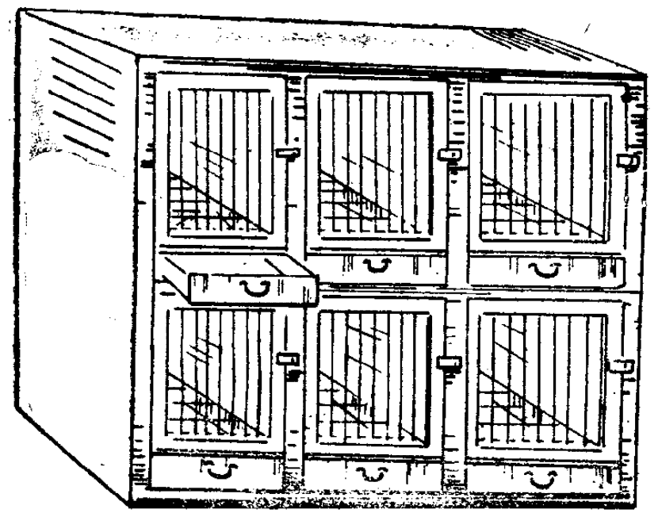
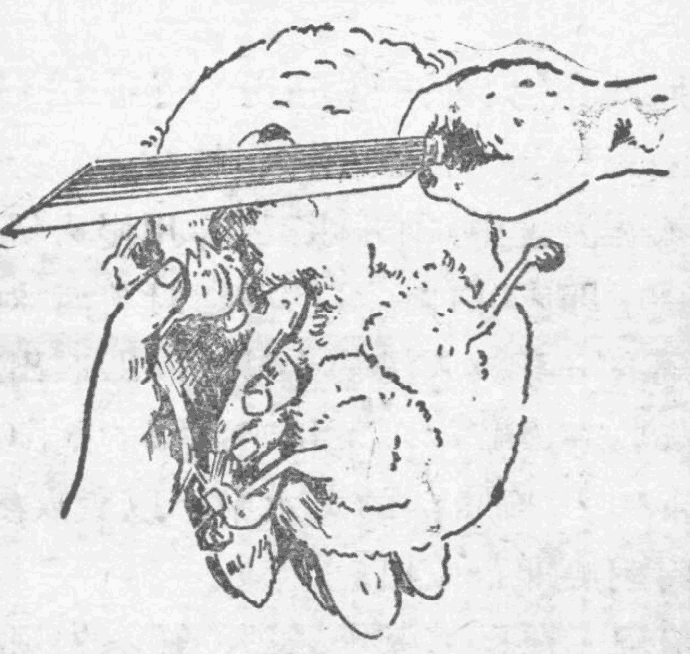
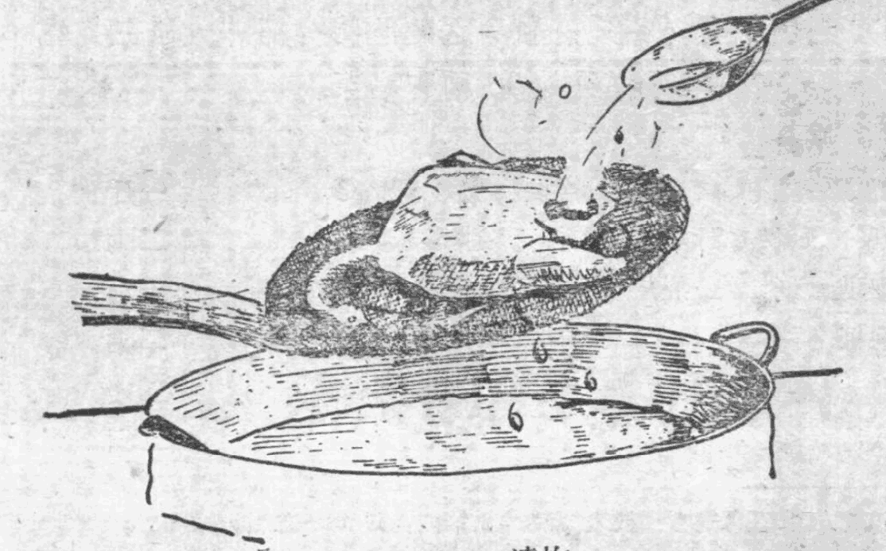
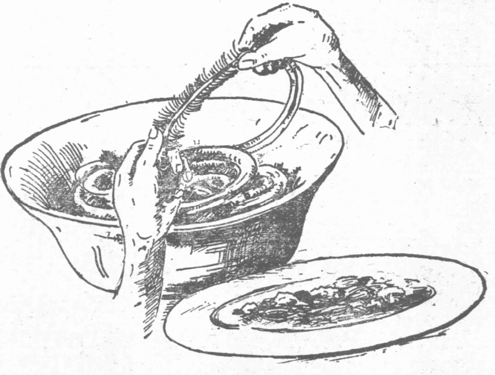

# 中国名菜譜

第四輯

商業部飲食服務局編

輕工業出版社

1959年·北京

***

# 內容介紹

广东的烹飪艺术, 在国内外都是久负盛名的。商業部飲食服務局为了把某些著名粵菜和点心的烹制經驗加以总结和傳播, 特在广州市飲食服務業公司的大力支援下, 由当地名厨师、点心师积极帮助, 編成本輯。它介紹了广州市大同酒家、北园酒家、广州酒家等五个菜館的名菜五十四种, 及大同酒家、蓮香茶楼、陶陶居等七个菜館和茶楼的名点心二十七种。其中包括名聞中外的“龙虎鳳大会”、“紅燒菜子狸”, 燒炙人口的“大同脆皮鷄”、“油泡蝦仁”, 以及深为群众喜爱的“鷄仔餅”等等。

这本書既是广东烹飪經驗的总结，也是操作的紀实。它对各种菜、点制作方法的介紹尽量从詳；必要的还附有圖片，对原料的选择和用量也力求准确；並經广州市各著名厨师和点心师共同审查核訂过。

本輯可供全国各地飲食業從業人員、厨师、訓練班师生, 以及各机关、企業食堂工作人員參考和學習。

# 中國名菜譜
(第四輯)
商業部飲食服務局

輕工業出版社出版
(北京市東安門內白銀路)

北京市書刊出版業營業許可證出字第0990號

輕工業出版社印刷廠印刷
新華書店發行

787×1002公厘·825×1220·85.000字

1959年4月第1版第1次印刷
1959年5月北京第2次印刷

印數: 10,001-15,500 宣價: (1000.56元)
統一書號: 15042-592

## 名菜

### 大同酒家

大同酒家，是广州市有名粤菜馆，历史悠久，规模大，设备新，成为广州的高级宴会场所。为了支援首都建设，該店曾于1956年8月間，分出厨师，服务员一批，到北京开設一家粤菜馆，仍名大同酒家，使首都人民亦得尝到名菜風味。該店著名厨师麦炳、何明、林海等，不但繼承了前人的烹调技艺，而且精心創制，使該酒家菜式品种，更加丰富多采，深受中外人士的讚揚。

#### 大同脆皮鷄

##### 一、选料

大同脆皮鷄所用的鷄，以广东省清远、竹寮等地出产的鷄种为佳，牠的特点是肥而嫩，脂肪多。挑选时，可先看鷄的羽毛色澤是否鮮艳和光滑，并注意脖子要短，脚要短細，然后將鷄拿在手中，以指按其胸骨，檢查是否軟嫩，再用兩指將鷄尾部羽毛分开(可用口哈气，將毛吹开)，以尾部肥滑，肛門細小不凸出(即未产卵的象征)为最好。选購來的鷄，放入鷄籠中，單只隔离飼养，不使見陽光。鷄籠(圖1)高約一尺二寸，橫寬約一尺，仅比鷄身稍大，使鷄在籠里不易走动，育肥较快。饲以細米糠和米粒，十天后則肉肥体大，骨也變軟，食時骨肉脆嫩可口，脆皮鷄所用的鷄，以毛重二斤八兩為适合。宰淨可得肉一斤六兩，浸熱約一斤四兩。

##### 二、鷄的宰殺及處理

**宰杀** 用大拇指和食指抓着鷄的兩个翅膀，用小指钩着一只鷄脚，將鷄头鈎翻向上，將鷄脖子抓实，用刀割断其气管，（圖2）鷄身下傾，使其血管內的血流清为止。否則凝血在体内鷄皮上則顯現片片的瘀紅色素，影响美观。

**燙毛** 用煮沸开水(100℃)三斤，摻入凉水一斤八兩(約60～65℃)，用手拿着鷄的兩脚，把鷄放入热水中，随手翻动，並用竹刷蘸水，迅速把鷄毛擦勻，燙約二分鐘，即行取起。燙毛時注意掌握時間，过久过快都会使鷄皮在炸时不上色，呈現深淺不一，这就不合炸鷄的規格了。

**退毛** 將鷄側放在木案上，先用左手抓住鷄的右脚膝上部，用右手退毛，从腿向上退至鷄的脇下，回过头来从鷄膝向下退去脚衣，再用手將鷄翅膀握紧，將毛向翼尖方向退去，这半边的毛退尽了，就可將鷄反轉照上法退去左側之毛。再將鷄背向上由脖子起用手退至尾部，用左手將鷄翼按住，以右手大拇指和食指將鷄脖子循繞，余指作助力，輕輕用力向头部退去，鷄头細毛用大拇指撫擦鷄冠兩旁即可去掉。將鷄放入涼水盆中，把鷄身上的細毛摘淨，並抹去污癢。退毛时不要过分用力，以防損破鷄皮。

**掏胸** 先在鷄脖子右边靠近鷄翅膀处，用刀开一寸長的口，取出气管，食道和鷄嗦(食胃)，並用刀在鷄膝下处剁去兩脚(如从膝上部剝断时，則鷄皮上縮，露出鷄骨，不好看)。然后將鷄胸向上，用左手压住双脚，使其肚漲起，用刀在鷄肚部近肛門口处剖开長約一寸五分的口，先將肚內的脂肪割出，再用食指和中指伸入肚內取出腸臟，並注意挖清鷄肺，否則食时仍有血水流出。然后用涼水把鷄內外沖洗潔淨，並用刀將鷄的眼球戳破，以免油炸时爆裂，致滾油四濺。

##### 三、制作方法

**鹵制** 將八角(大料)一錢五分、丁香二錢、甘草二錢、草果二錢、沙羌三錢、花椒二錢、桂皮一錢等药材用潔白紗布包着，放入瓦湯盆中，加开水五斤，用慢火煲[^1.1]約一小時，再加精鹽七錢，即成“白鹵水”。浸鷄時將鹵水燒沸，用手拿着鷄頭，將鷄的全身放入浸約十秒鐘，即取出。由于鷄身驟然遇熱，局部收縮成畸形，須用手將鷄的兩腿拉正，使鷄的身形平整，再放入90℃熱的鹵水中，以微火浸約十五分鐘，使鷄全身的肉剛熱即行取出。

**淋漿、晾皮** 將已用鹵水浸过的鷄，先用潔淨白布將鷄翅膀的臂部抹干，以防止該處浸後出油，糊漿時不上色，再用鐵鈎將鷄鈎起，鈎時最好穿在鷄的雙目。鈎起后用手提鈎把鷄吊在漿盆上，用手勺將糊漿(以糯米麥芽糖八錢、料酒三錢、浙醋一錢、团粉八錢調勻制成)淋在鷄身上，待全部外皮都沾上糊漿为止(圖3)。然后將它掛在當風的地方，約二至四小時，鷄身呈現一層霜狀薄粉，鷄皮已有硬性即可炸皮。如在春季，氣候潮濕。鷄身發潮不易干脆時，可用爐子以微火放在鷄的下邊約一尺五寸處，烘烤使干。

**炸皮** 用旺火將鍋燒紅，放入花生油三斤(約耗二兩)燃燒(注意不宜冒有白烟)，將鷄胸向上、背向下，放置鐵絲篳籬上，用手勺將滾油從鷄的腹部近肛門處所開的口，(圖4)淋入腹內三次，再淋全身。淋時要把鷄不斷反側傾斜，不斷用油淋炸，約三分鐘，呈現金紅色，即符合標準。炸時篳籬要離油面，不要將鷄沾入油鍋里，又最忌火太旺、油太沸。否則炸鷄外皮色焦，內肉却不够熱。火慢則皮不脆，不上色。因此炸皮時，火候必須注意掌握适当。

[^1.1]: 煲，是將主要原料放入瓦煲（陶制容器）內，再加入約等于原料量兩倍之水，不放調味品，用慢火來煮。是一种以湯为主的煮法。

##### 四、切鷄和吃法

鷄炸好后，即須及时切塊，防止涼后鷄皮不脆。切時須將菜墩抹干，先切鷄頭，繼即从脊骨切成兩半，去翼，起腿，再將全鷄分別切成每塊重約七分的小塊，以切三十六塊為合適。切時应將鷄皮朝上，不宜貼近菜墩，以防影响皮脆，並邊切邊摆在盤子上成鷄形，切完时鷄身仍热，最后在盤子週圍摆上蝦片即成，

吃时要蘸以淮鹽[^1.2]、酸辣醬、檸檬汁

##### 五、特点

此菜皮脆肉香，骨也味美。由于制法独特，深受顧客欢迎，招待外宾亦常用此名菜。

[^1.2]: 淮鹽：用精鹽一兩，放入燒熱的鐵鍋內，炒至略有焦香味即成。

#### 大同三蛇龙虎鳳大会

*蛇类为爬行动物,据说人食之,能祛風、除痰、去湿、补血养陰,而蛇的胆汁,更有奇效。所以蛇类食品,为广东人所喜爱,引为秋冬季节滋补珍品,有“秋風起矣,三蛇肥矣,滋补其时矣”之諺。到广州来者均以一尝蛇羹为快。大同酒家对调制蛇类食品更有独到之处;特介紹“大同三蛇龙虎鳳大会”及“竹絲鷄烩,五蛇羹”兩种名菜。*

##### 一、原料

|                          |              |                  |              |
|--------------------------|--------------|------------------|--------------|
| 三蛇[^2.1]一副               | 約三斤半     | 光豹狸肉[^2.2]        | 一斤         |
| 老鷄一只(按鷄身計) | 一斤半             | 生鷄絲           | 二兩         |
| 水發北菰絲[^2.3](去蒂)   | 二兩             | 水發木耳絲[^2.4]      | 三兩         |
| 水發鮑魚絲[^2.5]         | 三兩             | 水泡生姜絲[^2.6]      | 二兩         |
| 旧陈皮絲            | 一錢             | 檸檬叶絲          | 三錢         |
| 猪瘦肉            | 一斤半             | 瘦火腿            | 二兩         |
| 湿荸荠粉                 | 一兩         | 竹蔗              | 八兩         |
| 桂圓肉                   | 五錢         | 味之素            | 四錢         |
| 深色醬油                 | 一錢半       | 豬油              | 二兩半       |
| 胡椒粉                   | 少許         | 菊花              | 二朵         |
| 薄脆                     | 三兩         | 白酒              | 五錢         |
| 料酒                     | 一兩         | 蛋清              | 七只         |
| 生姜                     | 二兩         | 生蔥              | 四条         |
| 精鹽                     | 三錢         | 醬油              | 三錢         |

[^2.1]: “烏肉”(眼鏡蛇)、“金脚帶”、“过树榕”叫作三蛇，烏肉蛇以广西出产为最多；金脚带蛇与过树榕蛇，产于广东的水东、怀集等地。蛇，全年均有，但以秋季为最肥美，由于稻熟时，蛇因禾稻掩蔽，多在夜間找食物，这时蛇最肥壮，至秋收后，以無禾稻掩蔽，即少出；严寒时期即潛伏蛇穴不出。蛇的選擇，以肥硬粗壯、皮色鮮艳为佳。捕蛇者出售时，先將蛇齿用刀刮去，以免傷人。
宰蛇的方法：先用左手將蛇头抓紧，再把蛇尾抓住（如圖6），用右手順舊蛇身摸到有凸出处，用小刀割开，取出蛇胆（如圖7）。再以右手輕輕抓住蛇尾，以左手由蛇尾直往上捋至蛇脖子，以食指中指紧握蛇的喉部，使它不能把口張開（切切注意，否則会被其反噬），用右脚紧紧踏实蛇尾，然后稍將之伸直，右手拿尖利的小刀，在蛇的腹部一直割至蛇的脖子为止（約一分深）（如圖8）。再在蛇脖子下四周割一圈，揪去其头（如圖9）。再在尾部割一圈，

在割的地方掀起蛇皮一直撕至蛇頸（如圖10）。然后撕去蛇的腸臟（如圖11），將蛇放在冷水中。

蛇胆取出后，作冲酒飲或冲凉开水飲，能祛風去湿，一般消費者都在蛇宴的飲蛇胆酒。

[^2.2]: 狸有豹狸、（如圖12）菓狸、七間狸、五間狸、狗狸、鼠狸等，种类甚多。豹狸、菓狸，产于广东西北江，其他种类的狸多产于广西。豹狸比貓稍大，狀似豹。菓狸是白鼻，鼠毛，咀尖，狀似猫。質量以豹狸为最佳，营养价值较好，菓狸較次，其他狸更次一些。一般的“龙虎鳳大会”，只用蛇、猫、鷄三种，但大同酒家的“龙虎鳳大会”，选用豹狸而不用猫。
宰豹狸的方法：先將豹狸困在鉄籠內，用鉄鋤伸入籠里，把豹狸的口撬开，倒入玫瑰露酒約一、二兩。豹狸灌酒后，如果在口中噴出白沫，这就是豹狸已醉，逐漸至醉昏，便可用刀把它的喉管割斷（如果未見有白沫噴出，还要多灌一些露酒）。也可把豹狸連籠浸入水中，使其窒息而死，此法更为省事，如今多用此法。但用酒醉法味道較香甜。豹狸杀死或浸死后，用沸水約六斤（視狸的大小而定）、涼水二斤、柴灰四兩，放在大盆中和勻，然后抓住豹狸的头部，將尾部放下水里，約攪三分鐘，再將豹狸倒轉，抓住它的后脚，將头放入水里，約攪五分鐘，便可去淨大毛，用涼水洗淨后，再用火烙去幼毛，然后放入冷水中，用刀刮去豹狸皮外的焦污不潔的东西，随后开肚，取出腸臟，以清水洗淨。

[^2.3]: 發新北菰法：用清水浸廿分鐘，取起去蒂，洗淨去塵沙，淋去水便成。

[^2.4]: 發木耳法：用清水浸約四小時，取起去掉塵沙后洗淨，切成細絲，用時放入開水內。

[^2.5]: 發鮑魚法：將鮑魚用沸水浸三小時，撈起放入砂鍋內，慢火煲一小時，取出洗干淨。然后燒熱鍋，放入一些料酒、生姜二片、生蔥二条，再放入鮑魚，炒約二分鐘取起（姜葱不要。随后把清水放入砂鍋內，以旺火煲沸后，放入鮑魚，以慢火煲四小時左右取起，以手按鮑魚袉，如果軟熟，即已够火候；如果还未發硬时要再煲（切勿用冷水浸，否則会硬心）。

[^2.6]: 水泡生姜絲法：將生姜去皮洗淨，先切片，后切細絲，用沸水滾過，再用冷水浸。如是二、三次，約浸二小時便成。

##### 二、制作方法

1. **煲蛇** 將剖洗干淨的三蛇及竹蔗八兩、桂圓肉五錢、生姜一兩五錢、旧陈皮一錢，一起放入砂鍋內，加清水五斤，用旺火煲約三十分鐘，取出三蛇，很小心地拆出蛇骨，从头部順着向尾輕輕褪出肉来（用力不宜过猛，恐連蛇骨弄断，混入蛇肉内）如圖5，隨即把蛇肉切成一寸五分的小節，再用手順着肉紋把蛇肉撕成細絲。

蛇骨裝入紗布袋，繼續放回原砂鍋的蛇湯，用慢火再煮一小时半后倒出，以白潔毛巾將湯濾过（約得蛇湯四斤左右）。这些湯留作煲鷄及蒸蛇用。桂元肉、竹蔗等取出不要。陈皮、姜取出切成細絲，留待烩蛇用。

2. **煸豹狸** 將洗淨豹狸，切開四件，放入開水鍋里，約煮十五分鐘，取起晾干。隨即燒紅鉄鍋，放入豬油五錢、料酒二錢、生姜二片、生蔥二条，跟着把豹狸肉放下炒約三分鐘，即取起。

3. **煲豹狸** 把已宰淨的老鷄一只及瘦肉、火腿、豹狸肉等一同放入砂鍋里，加清水三斤，煮約一小时左右，再加入蛇湯三斤半，用慢火煮約二小時，取出老鷄、豹狸，都把骨去掉。然后把肉撕成細絲，長度要均勻，約一寸半長（瘦肉、火腿取出不要，可留作其他用）。湯用白毛巾濾淨，約得湯五斤，留作烩蛇时用。

4. **煸蛇絲和蒸蛇絲** 以旺火燒紅炒鍋，放进猪油五錢、白酒五錢、姜二片、葱二条，把蛇絲放下約焙炒三分鐘取起，去掉姜葱。再把蛇湯八兩放进瓦罉內，放入蛇絲，置于蒸籠內用慢火蒸約三十分鐘。

5. **附料的处理** 已發好的鮑魚、木耳、北菰，均切成細絲；並將木耳放入开水內燴半分鐘，北菰不用燴，鮑魚已發够身。也不用再煮。取蛋清四只、荸薺粉少許，將生鷄絲拌勻，燒熱鉄鍋，放入猪油八兩（約耗二錢），待熱至95℃后，即放入鷄絲，以微火泡油一分鐘，取起，用笊籬濾淨油。

6. **烩蛇** 以旺火燒紅鉄鍋，放入猪油八錢、料酒五錢，即將已濾淨留用的湯全部放入鍋里，繼把蛇肉、鮑魚、北菰、木耳、姜絲、陳皮絲及熟鷄絲、豹狸放入；最后放入已泡好油的生鷄絲，隨即調以味之素、深色醬油和荸薺粉等拌勻，再加猪油五錢起鍋便成。菊花洗淨只要花瓣，檸檬葉切細絲，這兩种附料和薄脆等，另用小碟盛裝，吃时摆上。

##### 三、特点

此菜香味濃郁，能祛風除濕，補中益氣，人食之健体提神，為秋冬季节營養丰富的補品。

#### 竹絲鷄烩五蛇羹

##### 一、原料

|                          |              |                  |              |
|--------------------------|--------------|------------------|--------------|
| 五蛇[^3.1]一副（宰淨煮熟得肉六兩） |              | 竹絲鷄一只（取熟鷄腿肉六兩） |              |
| 生鷄絲                   | 二兩         | 水發廣肚[^3.2]        | 四兩         |
| 水發新北菰               | 二兩         | 水發木耳絲        | 二兩         |
| 水泡姜絲                 | 二兩         | 旧陈皮絲          | 一錢         |
| 原身蛇湯                 | 一斤         | 上湯              | 一斤         |
| 檸檬葉絲                 | 三錢         | 菊花              | 二朵         |
| 薄脆                     | 三兩         | 味之素            | 三錢         |
| 深色醬油                 | 二錢         | 醬油              | 二錢         |
| 豬油                     | 二兩         | 白酒              | 五錢         |
| 料酒                     | 七錢         | 二湯              | 六兩         |
| 湿荸薺粉                 | 一兩         | 生蔥              | 四条         |
| 生姜                     | 一兩五錢     | 胡椒粉            | 少許         |
| 蛋清                     | 一兩五錢     | 竹蔗              | 八兩         |
| 桂圓肉                   | 三錢         | 精鹽              | 三錢         |

[^3.1]: 五蛇是：(1)烏肉蛇(眼鏡蛇，又名飯铲頭)，(2)白花蛇，(3)金腳帶蛇，(4)过樹榕蛇，(5)三索綫蛇。

##### 二、制作方法

1. **煲蛇** 先將蛇宰好(宰蛇方法見前面“龍虎鳳大会”)，去头、洗淨，放入砂鍋內，加入冷水五斤、生姜一兩半、旧陈皮一錢、竹蔗八兩、桂圓肉五錢，以慢火煲卅分鐘，取起，从蛇头向蛇尾輕輕褪出蛇肉。蛇骨裝入布袋里，放回砂鍋內熬湯，同时放入已宰好的竹絲鷄，再煲約一小时，待鷄熟透后，捞起竹絲鷄撕成絲，只用鷄腿肉和鷄皮約六兩，其余不要(留作其他用)。蛇骨竹蔗桂圓肉取出不要。姜及陈皮切成細絲，留作烩蛇用。砂鍋內的湯用潔白毛巾濾过，湯作烩蛇用。

[^3.2]: 發廣肚法：將廣肚用冷水浸約十二小時，再用藤絲擦乾淨，盛在瓦盆里，放入攝氏100度的沸水，用蓋蓋严。煮約十二小時，取起放在水龙头下，用冷清水漂洗三小時，再用手洗淨，去清膠膜。然後用清水浸約十小時，再用沸水煮約四小時至六小時，用刀切一下，以爽身黏刀為合標準。

2. **煸蛇和蒸蛇** 把蛇肉切成約一寸半長的塊，然后用手撕細絲。燒熱鍋后，放入豬油五錢，再灑白酒五錢，加入生姜二片、生蔥兩條，將蛇絲放入鍋里爆一爆，約一分鐘，倒出来用瓦缸盛着（姜片和蔥不要），加入蛇湯八兩，放进蒸籠內，蒸約一小时。

3. **附料的处理** 將已發好的广肚、木耳、新北菰切成細絲；廣肚用開水滾一滾，撈起。把鍋燒熱，放入豬油三錢、姜三片、蔥二条、料酒二錢、二湯六兩后，即把廣肚絲放入，煮沸后，倒出來濾干水（姜、蔥不要）。木耳絲放在鍋內，加入冷水煮沸即倒出來。把生鷄絲用蛋清1/4只、荸薺粉少許，一同拌勻，以旺火燒熱鍋，放入豬油八兩（約耗二錢），待至攝氏95度时，放进鷄絲以慢火滾約一分鐘，倒出來用笊籬隔着濾清油。

4. **烩蛇** 以旺火燒紅鍋。放入豬油五錢，灑料酒五錢，隨即放入蛇湯、上湯、候沸騰后放入北菰絲、木耳絲、姜絲、熟鷄絲、蛇絲、陳皮絲、廣肚絲、生鷄絲和精鹽、醬油、味之素等，攪勻，即用荸薺粉打芡再攪勻，同時加上豬油五錢，便可起鍋盛在瓷盤中。將菊花、檸檬葉絲分放兩小碟，隨蛇羹上桌，另以一小碟盛薄脆，吃時可按自己喜好酌加在碗內。

##### 三、特点

此菜清而不膩，多食不厭，為秋冬季节营养珍品。

#### 燕窩白鴿蛋

##### 一、原料

|                          |              |                  |              |
|--------------------------|--------------|------------------|--------------|
| 白鴿蛋                   | 二十四只     | 干碎燕窩          | 一兩半       |
| 頂湯[^4.1]                   | 二斤         | 火腿絲            | 三錢         |
| 猪肉                     | 八錢         | 味之素            | 六錢         |
| 精鹽                     | 一錢         | 上湯[^4.2]或二湯[^4.3]      | 八兩         |
| 料酒                     | 少許         |                  |              |

##### 二、制作方法

1. 將燕窩用冷水浸約兩小時，撈起用盤盛載着，然后以尖咀小鐵鉗摘去燕窩內的幼毛。幼毛摘淨后，放进开水鍋中煮五分鐘，然后搭起，把水分瀝干。

2. 用旺火燒熱鍋，放入猪油五錢、料酒少許、二湯八兩、精鹽一錢、味之素二錢。隨把燕窩慢慢放入鍋內約熬三分鐘，然后倒出来，用潔白毛巾吸干水分，放进盆子內。

3. 將白鴿蛋裝入瓦钵加入清水，以浸過面為度。用紗紙將瓦钵封好（用紗紙[^4.4]封盖，可避免蒸白鴿蛋時爆裂），然后放籠腿內蒸約十分鐘，鴿蛋便熟。取出，去其壳后，將鴿蛋排列在盆子上燕窩的四边，加上火腿絲三錢在面上。

4. 以旺火燒熱鍋，放入猪油3錢，放进頂湯二斤、味之素四錢，待湯燒至攝氏100度后，淋上燕窩鴿蛋便成。

##### 三、特点

此菜看滑濃郁，清而不膩。

[^4.1]: 頂湯：取老毛鷄六个，瘦猪肉六斤，火腿肉一斤四兩，味之素一兩，清水二十斤。先將毛鷄宰淨，除去內臟，連同以上原料放入瓦燉盆內，猛火燒沸后挪至慢火上熬五小時（最好保持蝦眼球狀態，火太猛則湯不清）。然后，將各种原料撈出，湯則用白布过滤，再撇去湯面油沫即成。

[^4.2]: 上湯：取老毛鷄四斤，瘦猪肉四斤，火腿肉一斤，精鹽一兩，味之素一兩，清水二十斤。按頂湯制法制作即为上湯。

[^4.3]: 二湯：將熬过上湯的鷄、瘦猪肉和火腿肉等，另加精鹽一兩、味之素一兩、清水十四斤，慢火熬四小時，用布过滤即成。

[^4.4]: 紗紙即薄頁紙。

#### 竹笙鷄腰

##### 一、原料

<table><tr><td>水發竹笙①</td><td>七兩</td><td>水發北菰</td><td>一兩</td></tr><tr><td>鷄腰(舉丸)②</td><td>八兩</td><td>味之素</td><td>三錢</td></tr><tr><td>精鹽</td><td>二錢</td><td>醬油</td><td>二錢</td></tr><tr><td>深色醬油</td><td>一錢</td><td>料酒</td><td>二錢</td></tr><tr><td>胡椒粉</td><td>少許</td><td>豬油</td><td>一兩半</td></tr><tr><td>湿荸薺粉</td><td>五錢</td><td>二湯</td><td>四兩</td></tr><tr><td>上湯</td><td>三兩</td><td></td><td></td></tr></table>

## 二、制作方法

1. 鍋內放入涼水燒至攝氏90度，將洗淨、撕去血筋的鷄腰放入鍋內浸兩次(每次約五分鐘，注意水要保持90度，不要煮沸，否則會爆烈)，然後倒入碗內仍用開水浸注。

2. 干竹笙(圖13)用涼水浸約四小時，洗淨后撈起，再用開水煮約五分鐘，倒在涼水中冷却，用手輕輕撥去其沙泥，再撈起壓干。然后用刀剪去頭尾不要，只要芯，每塊切成一寸長。

3. 用鍋將豬油少許燒熱，放入料酒少許，隨即加入二湯四兩、精鹽少許，並放入竹笙煮約五分鐘，然后用鐵筯籬撈起壓干。

4. 鍋放在旺火上燒熱，放入豬油一兩，候油燒開，即放入料酒少許，再加入上湯三兩，將竹笙及已發北菰放入。

①竹笙以我国四川所产为最佳，云南、广西次之。竹笙的培植方法，是在竹树旁四周地面，以馬糞和湿泥拌匀盖上，每天澆水，約二月后漸漸萌芽，長出形如網狀的竹花，約長至三寸長，即可剪去，將之晒干后，以琉璃櫃儲藏、使其雪白。

② 鷄腰即公鷄的睾丸，因含賀尔蒙素甚多，营养丰富。

***

圖13 竹笙

並加蠟油、味之素、深色醬油等配料炒勻、再將鷄腰放入，即用
湿荸薺粉勾芡，以鐵鏟輕輕和勻，炒時再加豬油少許即成。

三、特点

此菜竹笙爽滑可口，北菰味道清香，吃时别饒風味。

焗釀禾花雀

一、原料

<table>
  <tr>
    <td>禾花雀①</td>
    <td>十只</td>
    <td>熟鷄肝</td>
    <td>一兩</td>
  </tr>
  <tr>
    <td>熟腊腸</td>
    <td>一兩</td>
    <td>玫瑰露酒</td>
    <td>五錢</td>
  </tr>
  <tr>
    <td>醬油</td>
    <td>三錢</td>
    <td>生姜</td>
    <td>二錢</td>
  </tr>
  <tr>
    <td>生蔥</td>
    <td>一条</td>
    <td>白糖</td>
    <td>五分</td>
  </tr>
  <tr>
    <td>胡椒粉</td>
    <td>少許</td>
    <td>濕荸薺粉</td>
    <td>二錢</td>
  </tr>
  <tr>
    <td>二湯</td>
    <td>八兩</td>
    <td>上湯</td>
    <td>二兩</td>
  </tr>
  <tr>
    <td>上等醬油</td>
    <td>一錢</td>
    <td>豬油</td>
    <td>一斤(約耗二兩)</td>
  </tr>
</table>

***

蠟油

二錢

料酒

一錢

味之素

五分

## 二、制作方法

1. 將已宰好的禾花雀洗干净，濾去水，再將醬油、姜、葱、白糖，露酒和勻，醃制約二小時。將已蒸熱的腊腸及雞肝分別切成十條，每條約五分長、一分半粗，然後將腊腸和肝各一条釀進一只禾花雀內。

2. 以旺火燒熱鉄鍋，倒入猪油一斤（約耗一兩），待油熱至約攝氏95度把禾花雀放下泡一泡油，隨即撈出。鉄鍋去油仍置旺火上，加二湯8兩，再放入禾花雀約煮半分鐘倒出。

3. 鍋燒熱放豬油一兩，加入料酒，然後將禾花雀放下炒勻，隨即放进上湯、蠟油，味之素，深色上等醬油，將蓋蓋好，約三分鐘加荸薺粉勾芡即成。

## 三、特点

此菜甘香可口，为佐酒佳品。

① 禾花雀是海洋中小島上的一种候鳥，一年中只有一定時期出現在广东南海、番禺、順德及三水西南等地。每年中秋節為新產期，九月中旬為旺產期，其時肉質肥嫩，骨脆，至十月上旬為沒產期，為广东特產食品。

禾花雀習慣于每日黃昏時間群飛找食，晚上聚宿芒草繁殖的地方，每飞行必成群結队，且有尖兵先行，獵者可預佈大網，一網打尽。網获以后，必須立即將牠踢死或用水浸死，以保持其肥美，否則，禾花雀因被捕急躁不安，盲目飛撞，很快就消瘦，故禾花雀很少有飼養者。

宰杀禾花雀的方法，采將禾花雀踢死后，摘去其毛，然后用剪刀略剪开其尾部近肛門處的皮，再剪去脚、翼及其咀和眼前部份（不要剪破其头，以免腦漿流出）。然后撕去其頸皮及气管、食管，再用小指从其頸下胸骨处插入胸腔，挤出腸臟，再用冷水洗淨。

調制禾花雀的方法甚多，煨、焗、炸、燒、腊、鉄扒、炒炖均可，味皆甘美可口，惟焗禾花雀更为多数人所喜欢。

***

## 蟹肉扒鮮菰

### 一、原料

<table><tr><td>鮮草菰米①</td><td>一斤</td><td>热蟹肉</td><td>三兩</td></tr><tr><td>蛋清</td><td>一只</td><td>上湯</td><td>四兩</td></tr><tr><td>二湯</td><td>四兩</td><td>料酒</td><td>八錢</td></tr><tr><td>湿荸薺粉</td><td>五錢</td><td>精鹽</td><td>二錢</td></tr><tr><td>麻油</td><td>三滴</td><td>豬油</td><td>一兩半</td></tr><tr><td>胡椒粉</td><td>少許</td><td>味之素</td><td>二錢</td></tr></table>

### 二、制作方法

1. 將鮮草菰米的頭劈淨，並在其头部用刀鋤一十字形，深淺視菰的大小而定(約鋤 ~~ 米 ~~ 即可如圖14)。清水洗去泥沙，

圖14 鮮菰米

① 鮮菰系广州市夏令时荣，每年初夏上市，五六月間为旺产期。广州市郊区及清运，花县等地大量出产，福建、江西、粤北都有出产，不过大都晒干作陈草菰出售。

鮮菰的培植系以晚造禾草和湿泥漿翁种子而長成。每年农历一、二月为練种期，將泥地掘成坑，舖以一層晚造禾草，即放入一層鮮菰种子，如是一連四層，每天澆水，約四十天萌芽，再培育約二十天長成菰狀即可采摘。一直至六月都可收成。六月后可再用禾草作第二次培育，九月起开始沒造。采摘鮮菰以米（含苞）为佳，至米張开时，粗纖維增多，即远不及米的幼嫩。

***

随即放入滚开的开水鍋中，滾約5分鐘，即熟，再用涼水漂約30分鐘冷却，再瀝去水。

2. 將缺鍋燒熱，放入豬油二錢，料酒少許，隨即加入二湯四兩，將鮮草菰粧煨透，再加精鹽五分煮約5分鐘，使入味后，將菰撈出瀝去水，再用潔淨白布將水搓干。然後將鍋洗淨，燒至大熱即放入豬油五錢，下料酒少許，隨即放入菰粧，加入上湯二兩、味之素一錢、精鹽一錢，俟湯開后，即用荸薺粉三錢勾芡，再加豬油五錢，即盛入盤內。

3. 將鍋洗淨后用較旺的火燒熱，倒入豬油五錢、料酒少許，再放入上湯二兩、味之素一錢、精鹽五分，湯沸時即放入蟹肉，攪勻以后以濕荸薺粉二錢勾芡，並放入蛋清一只和勻，加豬油三錢，即把芡淋在已制成的鮮菰上边，再洒上麻油、胡椒粉即成。

### 三、特点

此菜清香爽口，味道鮮美，為夏令名菜。

## 鷄子戈乍

### 一、原料

<table><tr><td>鷄子(生鷄的睾丸)</td><td>六兩</td></tr><tr><td>鷄蛋</td><td>四只</td></tr><tr><td>味之素</td><td>三錢</td></tr><tr><td>干團粉二兩半(約耗一兩半)</td><td></td></tr><tr><td>白糖</td><td>二錢</td></tr></table>

<table><tr><td>粟粉</td><td>二兩半</td></tr><tr><td>上湯</td><td>一斤</td></tr><tr><td>精鹽</td><td>二錢</td></tr><tr><td>植物油一斤半(約耗二兩)</td><td></td></tr><tr><td>蠟油</td><td>四錢</td></tr></table>

### 二、制作方法

1. 先將生鷄子洗淨，把包着鷄子的外層薄膜撕去，並將鷄子捏爛，然后再將鷄蛋粟粉，上湯六兩，一併攪勻，成蛋糊(約攪五分鐘)。

***

2. 旺火燒紅鍋，加入植物油五錢，再放入上湯十兩和味之素、精鹽等，待燒沸後，把鍋挪開，徐徐倒入攪勻的蛋糊，用鍋鏟推動調勻。再把鍋放回爐火上，用慢火燒煮，同時用力在鍋內攪約10分鐘，然后倒入塗上植物油的盤子上，待冷却凝結后，切成約6分寬的条，再把条切成攪杭核形的塊。

3. 把切好的鷄子戈乍用干团粉拌勻。用旺火燒熱鍋，放入植物油一斤半，待燒至極沸時，方可放进鷄子戈乍，約炸二分鐘，呈金黃色便成。炸時如果油未滾，而放入鷄子戈乍，則會散開，因此必須待油滾至100度以上可以放入。

### 三、特点

此菜軟滑甘香，為熱葷菜的珍品。

## 紅燒大羣翅①

### 一、原料

<table><tr><td>水發淨魚翅</td><td>一斤半</td><td>光老鷄</td><td>一斤</td></tr><tr><td>鷄脚</td><td>半斤</td><td>火腿絲</td><td>五錢</td></tr><tr><td>頂上湯②</td><td>三斤</td><td>姜、葱</td><td>各四兩</td></tr><tr><td>上等醬油</td><td>五錢</td><td>胡椒粉</td><td>少許</td></tr><tr><td>味之素</td><td>一兩半</td><td>鷄油</td><td>四兩</td></tr><tr><td>豬油</td><td>四兩</td><td>荸薺粉</td><td>一兩半</td></tr><tr><td>料酒</td><td>一兩</td><td>白酒</td><td>四兩</td></tr></table>

① 群翅是大鯊魚脊上的翅，而翅又分為頭圍、二圍、三圍等，近头部 的脊翅叫头圍，近尾的脊翅叫二圍，尾部末端称为三圍。而群翅又以黃沙群翅、 西沙群翅為最佳，因其翅針較長且粗大，質量軟滑，膠質丰富，吃來滑軟可 口。

② 頂上湯(又名天頂湯)：原料用老毛鷄十斤，豬瘦肉十斤，火腿肉一斤 四兩，味之素一兩，清水二十斤。制法同頂湯(見燕窩白鴿蛋)。

***

瘦肉

二湯

銀針(菜豆芽菜去头尾部)

一斤

三斤

上湯

精鹽

四斤

一錢半

## 二、制作方法

1. 煲翅 取干羣翅三斤，剪去魚翅边，使翅易于吸水及翅身整齐，用冷水浸十二小时，使翅浸透水后尽量伸展。然后用沸水浸（不用火煮）六小时，取出，刮去砂粒，用清水洗净，用竹篳將魚翅一排排放好夾实，以免翅煮散，然后放进砂鍋中，以慢火煮四小时，取起剔去大骨，修改头尾，再用竹篳夾住魚翅放进盤内，用慢水龙头冲洗兩小时，把翅身的灰味冲洗干净。再用竹篳上下夾住放进砂鍋中，用慢火再煮四小时，取出，洗砂去骨翻一翻，再用清水浸二小时。然后用竹篳夾住放进砂鍋內再煮四小时，取出，再用清水洗淨，並注意看翅身老嫩如何，如果魚翅身老时需繼續煮二小时；如有些翅身已煮透时，即要將之取出，不可混在一起同煮。

2. 煨翅 姜四兩，取其三兩切成薄片，另一兩磨爛成茸，挤出姜汁，拌入白酒四兩中。葱条四兩，除鬚根及尾的綠色部分。只留葱白。將魚翅用竹篳夾住放入砂鍋內，把姜、葱放在翅針中間，加入清水沒过翅面。然后取一瓦碟复蓋于翅面，把魚翅压实，使水能始終沒过魚翅，加上姜汁白酒二兩，用慢火煮三十分鐘，取出魚翅，把鍋內的水倒出不要。以旺火燒紅砂鍋，澆以少許猪油。放入另二兩姜汁酒，再放入开水，随即把夾住的魚翅放入鍋內，水同样要沒过翅面，滾二十五分鐘后，取出魚翅，並把姜片和葱揀出，然后再取水滾二十分鐘，以沒有姜、葱及灰味为佳。

其次，用旺火燒紅鍋，放入猪油一兩，將姜葱一併放入鍋內炒香，酒上料酒，随即把二湯三斤倒入鍋內煨十五分鐘，

***

取出。然后用竹ecz垫于砂鍋內底部，將老鷄、鷄油、瘦肉、鷄脚放于底墊上，加入上湯四斤，再把竹ecz夾住的魚翅置于其上，用旺火煮沸后，改用慢火燉一时半，取出魚翅用大盤盛着，用潔白毛巾把魚翅的水分吸干。老鷄、瘦肉、鷄脚等不要，留作他用。

最后，用旺火把鐵鍋燒熱，放进猪油，洒进料酒，随即倒入頂上湯三斤燒沸，放入味之素、上等醬油、胡椒粉攪勻，把湿荸薺粉漿放入勾芡待芡稍稠（以金黃色、玻璃狀的琉璃芡為标准）即把鷄油澆于芡上，將芡淋于翅面上即成。

### 3. 銀針（或称銀芽）的做法
取炒鍋以旺火燒熱放入猪油，待起青烟時將洗淨的銀針倒于鍋內迅速炒勻，調以味之素和精鹽，炒約3分鐘，即取起分兩碟盛好，並將火腿絲放在銀針面上，跟翅一起上席。

## 燕窩鷄鴣粥

### 一、原料

活鷄鴣①一只（約重十二兩）

<table><tr><td>干燕窩</td><td>五錢</td></tr><tr><td>雞蛋清</td><td>二只</td></tr><tr><td>芯薯</td><td>八兩</td></tr><tr><td>湿荸薺粉</td><td>一兩</td></tr><tr><td>醬油</td><td>五錢</td></tr><tr><td>料酒</td><td>五錢</td></tr><tr><td>胡椒粉</td><td>少許</td></tr></table>

<table><tr><td>鷄脂肪</td><td>二兩</td></tr><tr><td>火腿蓉</td><td>二錢</td></tr><tr><td>味之素</td><td>三錢</td></tr><tr><td>上湯</td><td>三斤</td></tr><tr><td>精鹽</td><td>五錢</td></tr><tr><td>猪油</td><td>一兩</td></tr><tr><td>二湯</td><td>八兩</td></tr></table>

① 鷄鴣，全身麻毛起斑白点，甚美觀，產于廣東省從化、惠州及廣西省梧州等處，長年均有，但以二、三月間為旺產期，性怯懦，怕人，飛得很快，捕捉不易，囚于籠中飼養，往往因環境不習慣，在籠中亂撞而死。鷄鴣肉滑清甜，和以廣肚、花膠同炖，营养价值甚大，和以燕窩為糊，則更別饒風味。

***

## 二、制作方法

1. 鷓鴣(圖15)宰杀后洗淨(宰鷗鴝方法与宰鷄相同。用刀起下肉，除头、脚、翼外，其他骨不用。

圖15 鷗鴝鳥

2. 將鸚鵡肉和鷄脂肪一同剝爛放入盤中，加上湯六兩、料酒二錢、精鹽二錢、味之素一錢，再把头放在上面，裝入籠厓，蒸約三小時。

3. 將干燕窩用冷水浸約兩小時，撈起用碟盛着。然后以尖咀小鉄鉗，揀去燕窩內的幼燕毛和杂質。將鍋放在旺火上燒熱，加猪油五錢、料酒少許起鍋，再放入燕窩及二湯八兩、精鹽一錢，用慢火煨沸約三分鐘，倒出来瀝去水。

4. 芯薯(又名大薯)洗淨放进蒸籠內，蒸30分鐘；熱后去皮及其外層肉，只要薯心部分，約得四兩。然后用刀剝爛，放

***

在碗內，加入上湯四兩、精鹽一錢、味之素一錢。入蒸籠用
旺火蒸約20分鐘。

5. 用旺火燒紅燴，放入豬油五錢，隨即洒料酒二錢，並放入上湯二斤六兩、味之素三錢、精鹽一錢、醬油五錢。然后放入煨好的燕窩、蒸好的鷓鴣（連湯）及蒸过的芯薯茸，用勺推勻、煮沸后，放入湿牽薈粉、蛋清，拌勻后倒于瓷斛內，加上火腿蓉于面上便成。

### 三、特点

此菜味濃郁，甚名貴。因鷓鴣难获，在菜制好后有將鷓鴣头摆在其上的，以示为真鷓鴣。

## 清湯燕盞①

### 一、原料

<table><tr><td>干燕盞</td><td>三兩</td><td>頂上湯</td><td>三斤</td></tr><tr><td>猪油</td><td>一兩二錢</td><td>料酒</td><td>五錢</td></tr><tr><td>味之素</td><td>一兩</td><td>火腿</td><td>三錢</td></tr><tr><td>精鹽、</td><td>三錢</td><td>上湯</td><td>一斤</td></tr><tr><td>胡椒粉</td><td>少許</td><td></td><td></td></tr></table>

### 二、制作方法

1. 燕盞用冷水浸約四小時后，撈起用盆盛着，以尖咀小鉄鉗摘去其幼燕毛（摘时要注意保持燕盞的完整，勿使散乱）。毛摘淨后，將未浸透仍硬的燕盞头尾揀出，用开水浸泡，並加盖盖好，焗至發軟。然后將燕盞用潔白毛巾包好，放进冰箱冷藏至一小时（为的使其更加伸展），取出，放在冰箱中瀝去水。

① 燕盞：將燕窩中白色細条最好的挑选出来，做成盞形，为燕窩中最上乘品。

***

2. 用旺火把鍋燒熱，放进猪油五錢、料酒三錢、味之素三錢、上湯一斤、精鹽二錢調勻，燒至100度时，將載着燕盞的筍箇拿到鍋上（不可放入湯內），澆上沸湯約三、四次，並要翻轉地澆。然后，再在沸湯內加入猪油五錢、味之素二錢、精鹽一錢拌勻，按上法繼續燒燕盞二、三次；这时燕盞呈淺黃色，便是熟了。

3. 然后，用潔白毛巾吸干燕盞的水分（不能用力），盛在盆內，撒上火腿絲三錢，並澆以豬油二錢、胡椒粉少許。

4. 將頂上湯三斤放进鍋內，加味之素五錢，燒至100度后，倒入盛燕盞的盆內便成。

### 三、特点

此菜香滑濃郁。

## 紅燒果子狸

### 一、原料

<table><tr><td>宰好的果子狸</td><td>一斤</td><td>水發北菰</td><td>二兩</td></tr><tr><td>燒豬臍</td><td>四兩</td><td>冬笋肉</td><td>四兩</td></tr><tr><td>蒜肉</td><td>一兩</td><td>陈皮絲</td><td>一錢</td></tr><tr><td>生姜</td><td>二兩</td><td>生葱</td><td>三条</td></tr><tr><td>蠟油</td><td>五錢</td><td>白酒</td><td>五錢</td></tr><tr><td>料酒</td><td>三錢</td><td>深色醬油</td><td>三錢</td></tr><tr><td>醬油</td><td>三錢</td><td>荸薺粉</td><td>五錢</td></tr><tr><td>豬油</td><td>二兩半</td><td>味之素</td><td>二錢</td></tr><tr><td>檸檬叶</td><td>二錢</td><td>胡椒粉</td><td>少許</td></tr><tr><td>上湯</td><td>一斤</td><td></td><td></td></tr></table>

### 二、制作方法

1. 將宰好的果子狸切塊，每塊橫直約8分，放进鍋內煮20分鐘，取出用清水漂淨后，以筍箇盛載，瀝去水。

***

北菰用冷水浸約四十分鐘，取起剪去蒂，挤干水分。

燒猪脯切成与果子狸肉塊大小相同的塊。冬笋削去头，剝去壳，用果刀挑去毛衣，削淨笋头較粗硬部分，然后放进开水鍋內煮約三十分鐘，撈起用冷水浸一小时，換冷水兩次，以笋心冷却为标准。再用刀橇成小塊，头大尾尖如笔狀，約長一寸（用刀橇而不用刀切，系使其表面略有为参差，易于上芡）。

以旺火燒紅鍋，放进猪油八兩（約耗五錢），待油燒沸，將笋放入炸約二分鐘即撈起。另把蒜肉放进炸一分鐘。再放进生姜以微火炸二分鐘取出。

2. 以旺火燒熱鍋，放入猪油五錢、料酒二錢、深色醬油二錢，即把果子狸肉放入鍋內一起炒勻。再將上湯一斤，炸过的冬笋、及燒豬脯、姜、蒜、北菰、陈皮絲等放入，待湯沸后，加入蠔油3錢、醬油五錢、味之素一錢，拌勻后，倒入砂鍋內，慢火焙約一小时（焙的時間以狸肉老嫩来決定，以能插入筷子为标准）。然后把果子狸肉撈出摆在盤中，在原汁內加蠔油二錢、深色醬油一錢、味之素一錢、荸薺粉五錢勾芡，略加猪油少許推勻，淋在狸肉上即成。

食时加胡椒粉少許，並將檸檬叶（二錢）切細絲撒在面上。

### 三、特点

此菜香濃肉滑，清而不膩，营养丰富，为冬令补养佳品。

## 陈皮扒鴨掌

### 一、原料

鴨掌 30对
水發草菰 一兩半

***

<table><tr><td>陈皮絲</td><td>一錢</td><td>蠟油</td><td>五錢</td></tr><tr><td>醬油</td><td>三錢</td><td>味之素</td><td>一錢</td></tr><tr><td>湿荸薺</td><td>五錢</td><td>猪油</td><td>一兩</td></tr><tr><td>上湯</td><td>四兩</td><td>精鹽</td><td>一錢</td></tr><tr><td>料酒</td><td>三錢</td><td>白酒</td><td>五錢</td></tr><tr><td>胡椒粉</td><td>少許</td><td></td><td></td></tr></table>

## 二、制作方法

1. 鴨掌撕淨外面的粗皮后，用精鹽摩擦，去掉黃色污物，再用清水沖洗乾淨，入沸水中煮約15分鐘（老鴨掌需煮30分鐘，但不宜煮爛，否則脫骨后不能保持鴨掌形狀），取出，用涼水浸泡冷却，以免鴨掌上的膠質脫落。然後剔除其骨及筋，再入鍋煮3分鐘，撈起瀝干。

把鍋放在猛火上，放入猪油二錢、白酒三錢，隨即倒入鴨掌翻炒几下，加二湯三兩煨約三分鐘倒出瀝干。

旧陈皮用冷水浸二小时，洗净后又浸二小时，取出用小刀刮去陈皮内海綿紙，切成細絲，入開水中煮一下（約二分鐘），消除苦味（因有木果苷的原故）及黃色素，再入冷水浸泡，待冷却后，取出瀝干。然後加入猪油少許和上湯（沒过陈皮），入籠屈蒸約十分鐘取出。

草菰摘洗淨，入开水煮十分鐘。用刀改好，不要头。

2. 油鍋置于猛火上，放入猪油四錢、上湯四兩、紹酒三錢燒沸，將鴨掌、草菰、陈皮一齐倒入，迅速拌炒，隨即加入蠟油、醬油、味之素、胡椒粉少許拌勻，至湯沸时用荸薺粉勾芡，再加猪油四錢即成。

## 三、特点

此菜爽、滑、香、清，別饒風味。

***

# 鷄脚炖山瑞

## 一、原料

<table><tr><td>山瑞①一只(宰淨計一斤半)</td><td>鷄脚</td><td>十对</td></tr><tr><td>瘦火腿</td><td>一兩</td><td>猪嫩瘦肉</td><td>四兩</td></tr><tr><td>生姜</td><td>二片</td><td>生葱</td><td>二条</td></tr><tr><td>白酒</td><td>五錢</td><td>料酒</td><td>五錢</td></tr><tr><td>味之素</td><td>二錢</td><td>精鹽</td><td>一錢</td></tr><tr><td>醬油</td><td>一錢</td><td>豬油</td><td>五錢</td></tr><tr><td>上湯</td><td>二斤半</td><td>砂紙</td><td>一張</td></tr></table>

## 二、制作方法

1. 將山瑞放在墩上，背朝下，肚朝上，山瑞头即伸出，用手紧紧抓住其头，提起立放，用刀把硬盖切下，除去腸臓和黃色油脂（臊味很重，必須除去），放入大热水中，用篐絲擦洗干净，除去白色的外衣。然后把軟裾剔下，硬盖不要。用刀把山瑞头剝下，再当中一刀劈成兩半，模切一刀成四塊，每塊再切成三塊，脚爪切去不要，头部不要，只要頸部。可以根据山瑞的实际大小来定每塊的大小，約模寬6分即可。

① 山瑞产于大山坑中,以广西梧州、南宁出产最多,質量亦較好,广东海口、北江及海南島等处,产量較少、質量亦較次。山瑞狀類水魚,區別的地方在于山瑞軟裾起黑点如荳狀,裾底部呈粉蘭色,其性溫和,从不咬人。水魚却与此正相反。山瑞以蜆、蠻、澎湃等為食料,不怕污臭水,當飼養時,換水也不要換清,刮北風时不張口,亦不食,刮南風時始找食,壽齡很長,能延至一百几十年不死,因此四十斤至一百斤的大山瑞屢見不鮮。山瑞体含蛋白質甚丰,营养价值很大。在大筵席中,山瑞裾被視為珍饈,味香,肉滑清甜,远胜水魚,故在售价上超過水魚50%左右。山瑞長年都有出产,但以三、四月产量最丰,飲食業所用一般以三、四斤为宜。其制法則炖、爛、紅燒均可,風味各有不同,皆味美可口,有益身体。

***

圖16 宰山瑞的方法

山瑞宰淨后，每斤可得十三兩肉。把它放入开水鍋中煮三分鐘。猪肉切成十六塊，亦同时放入开水中煮三分鐘，用籴篱捞出晾干水。

鍋放在旺火上，放入猪油五錢、白酒五錢、姜、葱等，隨即放入山瑞肉炒一分鐘取出（時間不要太長，否則失去部份香味），不要姜葱。

2. 把雞脚擦去外衣，洗淨，用開水煮十分鐘取出。

3. 將猪肉、火腿放入瓷炖盆內，再放入山瑞肉，山瑞軟裾蓋在上面，雞脚摆在四周，然后加入上湯二斤半，料酒、精鹽、味之素、醬油及胡椒粉；用紗紙封密，置于蒸籠內，猛火炖二小時半便可（老山瑞需炖得更久一些）。

### 三、特点

此菜滋补有益，为冬令名贵补品。

## 冬笋鹅鶴片

### 一、原料

冬笋肉

七兩

肥鶴鶡

六只

***

<table><tr><td>水發新北菰</td><td>五錢</td><td>料酒</td><td>五錢</td></tr><tr><td>蠟油</td><td>二錢</td><td>味之素</td><td>一錢</td></tr><tr><td>醬油</td><td>一錢</td><td>精鹽</td><td>一錢</td></tr><tr><td>濕蕷薈粉</td><td>五錢</td><td>干团粉</td><td>五錢</td></tr><tr><td>豬油</td><td>二兩</td><td>上湯</td><td>二兩</td></tr><tr><td>鵝蛋</td><td>一个</td><td>大地魚末①</td><td>二錢</td></tr><tr><td>蒜末</td><td>二分</td><td>姜、葱花</td><td>少許</td></tr><tr><td>胡椒粉</td><td>少許</td><td></td><td></td></tr></table>

## 二、制作方法

1. 將鵒鶉用鐵絲籠裝着放入水中淹死，再放入大熱水中浸二分鐘，边用竹帚擦淨其毛，在其臀部開一小口，取出腸臟洗淨。

2. 用刀切下鵒鶉頭頸，並將其頭切開成兩半，用刀拍扁，然后把鵒鶉起肉去骨，將鵒鶉肉片成厚約一分、長八分、寬5分的薄片，厚薄要一致。

3. 將冬笋肉削淨頭尾，切成片狀，約七分長、四分寬、一分厚，放入開水中約煮五分鐘。

4. 鵒鶉头、頸用蛋黄和醬油一錢拌勻，撒上干团粉，鵒鶉片則用蛋清和湿荸薷粉二錢拌勻，然后燒紅鐵鍋，放进猪油一斤（約耗二兩）燒熱，放入鵒鶉头頸炸約三分鐘撈起，随即把鍋端離火位，停二分鐘，把鵒鶉片和冬笋片放下，略略拌勻，即將鐵鍋放回爐火上，泡油約二分鐘，随即連油倒出，用筯箇隔住鵒鶉片和冬笋片。鍋內留油少許，仍放火上，放入姜花、葱花、蒜末等配料，繼即放入已泡过油的鵒鶉片、冬笋片、鵒鶉头頸及北菰等，灑上料酒炒勻，然後放入已凖

① 大地魚末的制法：先撕去大地魚的皮，把鍋燒熱，放入花生油。油燒開后，將大地魚放下，用慢火炸五分鐘撈起，冷却后，以刀剝碎，使之成末。

***

备好的湯芡(由上湯二兩、湿荸薺粉三錢、味之素、精鹽、
椒油、醬油(一錢)、胡椒粉調成。)拌炒約1分鐘即起鍋,
盛于盤中,把大地魚末撒于其上便成。

三、特点

此菜爽脆，香滑可口。

## 蟹黄芥蘭炒雞翼球

### 一、原料

<table><tr><td>羔蟹</td><td>一斤半</td><td>芥蘭</td><td>三斤</td><td>(取菜梗①約五兩)</td></tr><tr><td>雞蛋</td><td>一个</td><td>鵝翼</td><td>十四兩</td><td>(做成鷄翼球約八兩)</td></tr><tr><td>料酒</td><td>五錢</td><td></td><td></td><td></td></tr><tr><td>白糖</td><td>三錢</td><td>白酒</td><td>五錢</td><td></td></tr><tr><td>精鹽</td><td>二錢半</td><td>醬油</td><td>一錢半</td><td></td></tr><tr><td>豬油</td><td>一斤</td><td colspan="2">(实耗二兩)</td><td></td></tr><tr><td>味之素</td><td>二錢</td><td>湿荸薺粉</td><td>六錢</td><td></td></tr><tr><td>湿团粉</td><td>三錢</td><td>上湯</td><td>三兩</td><td></td></tr><tr><td>二湯</td><td>八兩</td><td>胡椒粉</td><td>少許</td><td></td></tr></table>

### 二、制作方法

1. 將羔蟹放在菜墩上，背朝下肚朝上，用刀在其肚上切开，分成兩塊；再翻过来，一手抓住蟹盖，一手持刀压住蟹爪，將蟹盖起来，取出其蟹羔（即蟹黃）。然后把蟹羔用冷水輕輕泡洗一下，用碗盛好，再倒入沸水浸約五分鐘，便半生半熟。蟹身將之切成四塊，放入鍋內蒸約二十分鐘，熟后取下其肉。

2. 芥蘭三斤用剪刀剪去菜花、菜叶、菜根，取其幼嫩部分，每株切一寸長兩段，共得約五兩左右，用水洗淨。然

① 菜梗：系青叶菜的菜心除去菜花和菜根后最嫩的一段。

***

后把鍋燒紅，放下豬油一斤，（約耗五錢）俟油滾后，即將芥蘭放入鍋中泡油一分鐘，即用筯箇撈出。繼續把鍋燒紅，把白酒五錢、二湯八兩、精鹽五分、白糖三錢、芥蘭菜造等順序放入鍋里，煮二分鐘即取出濾干水。

3. 將鷄翼放在菜墩上，用刀在翼中間（轉彎肘處），割開；將鷄翼平放，从側面用刀鑿开，去其骨，將肉切成一寸長一塊，再輕輕划橫五刀、豎五刀，鑿成斜十字花紋，使它在泡油后成球狀，然后用蛋清和湿团粉拌勻。

4. 用上湯一兩開濕荸薺粉三錢，加入味之素一錢、醬油一錢半、精鹽一錢、胡椒粉少許調好。

5. 用旺火烧紅鍋，倒入豬油一斤（約耗五錢）俟油燒至約攝氏90度時，將鷄翼放下泡油約二分鐘便成球狀，随即撈起把油倒出。鍋仍置旺火上將芥蘭放入鍋中，酒入料酒（三錢），將泡好油的鷄翼球放下，炒勻，並將已調好的湯芡放入，同炒一分鐘，便起鍋，盛于瓷盤中。

6. 再燒熱鍋，放入豬油二錢，油滾后放入料酒二錢，隨即加入上湯二兩，沸后放入蟹肉蟹羔及味之素一錢、精鹽一錢、濕荸薺粉三錢、豬油三錢，將之推勻便起鍋，淋上已炒好的芥蘭鷄翼球上便成。

三、特点

此菜甘香爽脆，美味可口，是下酒佳肴。

## 蟹黄扒莧苗

### 一、原料

<table><tr><td>莧苗①</td><td>一斤</td><td>羔蟹</td><td>一斤半</td></tr></table>

① 莧苗是荷蘭豆的嫩苗，由專人培植。在莧苗長成后即摘去正芯，使它多長橫枝苗。而採摘莧苗要在每天清晨太陽未出之前。

***

<table><tr><td>上湯</td><td>四兩</td><td>味之素</td><td>二錢</td></tr><tr><td>料酒</td><td>五錢</td><td>精鹽</td><td>三錢</td></tr><tr><td>豬油</td><td>二兩</td><td>湿荸薺粉</td><td>五錢</td></tr><tr><td>胡椒粉</td><td>少許</td><td></td><td></td></tr></table>

## 二、制作方法

1. 將莧苗洗淨，洒干。然后用旺火把鍋燒熱，放入猪油一兩，燒熱后把鍋端離火口，放入莧苗，再迅速放在火口上，边炒边顛边放入少許猪油，至莧苗开始發軟時即加入料酒一錢、精鹽二錢拌勻，这时莧苗就熟了，取入筯箇里瀝去水。

2. 把鍋放在旺火上燒熱，放入猪油二錢，洒上少許料酒，再將莧苗放入鍋里炒勻，加入上湯一兩、味之素一錢、湿荸薺粉二錢，拌勻至稠時，把莧苗取出盛于小盤子上。

3. 將蟻放在菜墩上（蟻仍然細着），左手按着蟬的筭和爪；右手在蟬盖与爪相連的部位揭起蟬盖。然后把蟬翻过来，切成兩半，並把蟬刺、蟬魔除去，把蟬放进清水里輕輕泡洗一下，取出用竹片把蟬羔（即蟬黃）取出盛入碗內，注入开水，並要沒过蟬羔，約浸五分鐘，蟬羔便已半熟，呈紅色。然后把蟬放在鍋內，注入开水沒过蟬面，約煮十七分鐘，蟬便熟了。將蟬撈起，先退去蟬筭和爪，再把蟬爪放在菜墩上，用手握刀平放，輕輕把蟬爪压破，肉便順利地剔出。蟬筭要用刀輕輕拍破硬壳，把肉取出。再將蟬身肉剖成兩半，用刀順着蟬肉生長的紋路，（以免弄碎）把肉剔出。蟬肉全部取出后，隔水蒸二分鐘，使它不易變質。

4. 用旺火把鍋燒熱，放入猪油四錢、料酒少許，再放入蟬肉，加入上湯三兩、味之素一錢、精鹽一錢調味，並加入湿荸薺粉三錢，隨即放入已浸得半熟的蟬羔，再加入猪油

***

四錢輕輕炒勻，芡變稠時便可起鍋，淋在已制好的莧苗上即成。

### 三、特点

此菜香滑爽口，清而不膩。以秋季烹制为最佳。

## 什錦冷拼盤

### 一、原料

<table><tr><td>凈鷄肉</td><td>三兩</td><td>扎豬蹄</td><td>三兩</td></tr><tr><td>肉蟹筍</td><td>三兩</td><td>燒鴨肉</td><td>三兩</td></tr><tr><td>凈大明蝦肉</td><td>四兩</td><td>熟火腿</td><td>一兩</td></tr><tr><td>鹵豬舌</td><td>二兩</td><td>酸菜或酸姜芽</td><td>十兩</td></tr><tr><td>鹵胗肝</td><td>一兩</td><td>鷄蛋</td><td>三只</td></tr></table>

### 二、制作方法

1. 將肥嫩母鷄用上湯煮熟，除去筋骨，取凈肉三兩，切成長方形片狀，每塊長約八分、寬四分。

肉孵蒸熟后，取其筍部上端，用刀輕輕拍碎筍壳，仔細地剝出筍肉，要保持筍肉原形，再放到籠匣內，蒸二分鐘，原只摆在盤上。

將大明虾去壳取肉洗淨，放入滾油鍋里，旺火炸廿秒鐘，即端離火位，用篩篩撈出虾肉，濾去油。鍋內留油少许，放入虾，加鹽五分、茄汁五錢、酸辣醬，五錢、味之素一錢五分、二湯一兩，用慢火煎熟。

生豬舌放入開水中略煮一下，取出刮淨舌胎，再用清水洗淨污物，用二湯煮約一小时后，取出放入鹵水盆①中，浸一小时，便成鹵水豬舌。然后切成一分厚片上盤。

生胗肝用刀切開兩邊，剝去黃衣，洗淨內里渣滓，再用少許精鹽洗擦干淨，放置二湯鍋中，約煮十五分鐘，取出放入

***

鹵水盆中浸三十分鐘，即成鹵水胗肝。然后切成一分厚片上盤。

扎猪蹄，先用生猪蹄一只，約一斤六兩，洗淨用小鉗摘去細毛，然后由腿下离趾骨处約八分向上割开，去骨，只留其皮（注意不要割破皮），再把猪脊兩傍的嫩瘦肉一斤二兩，用刀片成薄塊（長度与猪蹄相同）。肥肉头七兩用白糖一兩醃勻醃約一天，切成与瘦肉大小相同的薄塊。再用醬油一兩二錢、玫瑰露酒七錢、精鹽五錢、五香粉三分、白糖一兩二錢，將瘦肉及肥肉放入醃約二十～三十分鐘，取出后放在火爐上烤至七成熟。再取出以一塊肥肉夾一塊瘦肉，放入豬蹄皮內，用水草紮紧，約隔五分远紮一道草，紮好后放进鹵水盆內，以慢火煮四十分鐘，即端离火位，浸六～十二小时，使它入味，即成为鹵水扎猪蹄。可取用三兩，片成半分

① “鹵水盆”制法：

一、原料：

<table><tr><td>醬油</td><td>二斤</td></tr><tr><td>冰糖</td><td>一斤半</td></tr><tr><td>八角</td><td>一兩</td></tr><tr><td>沙羮</td><td>五錢</td></tr><tr><td>花椒</td><td>五錢</td></tr><tr><td>丁香</td><td>五錢</td></tr><tr><td>开水</td><td>十斤</td></tr></table>

<table><tr><td>料酒</td><td>一斤</td></tr><tr><td>精鹽</td><td>二兩</td></tr><tr><td>味之素</td><td>一兩</td></tr><tr><td>甘草</td><td>一兩</td></tr><tr><td>桂皮</td><td>一兩</td></tr><tr><td>草果</td><td>一兩</td></tr></table>

二、制作方法：

將醬油、料酒、冰糖、味之素、精鹽放在瓦盆內，加入开水十斤和匀。再放入其余各种香料和药材（用白紗布包好）。然后把瓦盆放在慢火上，約煮一小时后便成。香料和药材包須經常浸在盆中。鹵水制成后，最好是隔日使用。所制鹵水可以長期使用，每次用后，用紗罩蓋好。再用时，要用蘊过滤后滴沸，以保持清浩。如天天使用，須一周增換一次原料。

***

厚薄塊上盤。

火鴨肉是將已烤好的火鴨去骨，取淨肉三兩，連皮切成長方形片狀，每片長八分、寬四分，即可上盤。

火腿是取已起淨肥肉、全瘦的金华茶腿一兩，切成薄片。

鷄蛋片是將鷄蛋三只，破壳后，把蛋黃、蛋清分別用小盤子盛着，每盤加上精鹽五分，蛋黃用筷子攪勻（蛋清不用攪），然后放进蒸籠，慢火蒸八分鐘，蒸熟后，成为約二分厚的塊狀。先將它四边切整齐，然后切成薄片。

酸菜和姜芽，可按季节灵活使用。醃制过程，可取淨莖的大芥菜（或肥嫩生羌），洗淨切成条狀，約二寸長，姜則要刮去外皮洗淨，均用精鹽一兩，分別醃約十分鐘，隨即用手把芥菜及姜芽洗擦，使其變軟，把鹽水挤干。然后用白醋一斤、精鹽一兩、白糖四兩，煮沸后取出冷却，注入已制好的芥菜或姜芽中（芥菜十兩或姜芽十兩），醃兩小時后即可使用。

2. 以上各种原料作好后，俟其冷却，視所拼的拼盤形狀，分別切成各式各样的厚度片狀，切时刀法要均勻，制作时注意戴上膠皮手套，随意拼成公鷄、孔雀、和平鴿、花籃、金魚、龙舞……等式样（参看圖17）。拼时盤底先放以酸菜或姜芽，拼好后，放入冷藏器中，冷冻一小时。吃时再淋上鹵水或生汁②，就更为可口。

②生汁制法：用鷄蛋黃兩只和白糖、精鹽各一茶匙，芥末半茶匙，胡椒粉少許，一同攪勻。然后边攪边滴下半杯生菜油，再加入一茶匙陳陳油攪勻，再慢慢加入半杯橄欖油攪至癢結，最后加少許白醋和陳陳汁調勻即成。

***

圖17 甲

圖17 乙

***

圖 17 丙

圖 17 丁

***

圖 17 戌

圖 17 己

***

圖17庚

圖17辛

***

圖 17 壬

圖 17 癸

***

### 三、特点

此菜原为名厨师龐溢所創制,能做成各种形象,色調美观,吃时甘香味美。曾于广州名菜美点展覽会展出,很受羣众欢迎。

## 百花仙岛

### 一、原料

<table><tr><td>蝦膠①十二兩</td><td>猪脊肥肉四兩半</td><td>熟燜肉三兩</td></tr><tr><td>味之素一錢</td><td>干團粉一兩二錢</td><td>白糖五錢</td></tr><tr><td>精鹽三錢</td><td>湿荸薺粉五錢</td><td>上湯三兩</td></tr><tr><td>料酒二錢</td><td>鵝蛋清二只</td><td>猪油一斤半(約耗三兩)</td></tr><tr><td>玫瑰露酒五錢</td><td></td><td></td></tr></table>

### 二、制作方法

1. 將肥肉切成直徑約五分,厚度約一分半的圓形片, 共24塊用玫瑰露酒五錢,白糖五錢,精鹽一錢和勻,醃約15分鐘,取出,每塊都拍上干團粉,再將冷藏好的蝦膠釀在肥肉上,用干團粉塗勻。

2. 把猪油一斤半倒入鍋中, 放在旺火上燒開, 放入已

#### ①蝦膠制法：

##### 一、原料：

大生蝦肉 一斤 猪脊肥肉 二兩 精鹽 二錢 味之素 一錢

##### 二、制作方法：

將大生蝦肉一斤洗淨,用潔淨干布吸去水分,放在菜墩上,用側刀法將蝦肉壓爛,再用刀背剞爛。將猪脊肥肉切成碎粒,放入冰箱,冷藏三十分鐘。然後將 Vijin 的蝦肉,放入精鹽二錢、味之素一錢,用手攪勻,約攪十五分鐘,使其起膠狀,至粘手有彈性時,便將冷藏过的肥肉粒加入蝦膠內,再次攪勻,用瓦盆盛好,放入冰箱內,但要防止冷水滲入蝦膠內,冷藏時間一般要二到四小時便成。

***

釀好蝦膠的肥肉片，炸約五分鐘，把油鍋端離火爐，炸片刻，再放在旺火上，便成黃金色，这时便一一取出盛在瓷盆中。

3. 用旺火把鍋燒熱，放入豬油五錢、料酒二錢、上湯三兩，隨即放入味之素一錢、精鹽二錢，拌勻后，即將蟹肉放入，再加入湿嚠薈粉五錢和蛋清，拌勻后澆在已炸好的蝦膠上即成。

### 三、特点

此菜甘香爽脆，味美鮮甜、为下酒佳肴。

## 水晶冷拼鷄

### 一、原料

<table><tr><td>光鷄</td><td>一只(約一斤六兩)</td><td>云南火腿</td><td>三兩</td></tr><tr><td>味之素</td><td>五錢</td><td>大菜</td><td>一兩</td></tr><tr><td>精鹽</td><td>二錢半</td><td>上湯</td><td>一斤半</td></tr></table>

### 二、制作方法

1. 將鷄放入白开水內煮熟(約十五分鐘)，取出晾至鷄身全部冷却后，剜去头、尾及翅留用。用刀剔除鷄骨，然后將鷄肉切成約長一寸二分、寬5分的塊，共二十四塊。

火腿切成同鷄塊大小一样的二分厚的薄片，共二十四片。

2. 將切好的鷄肉塊和火腿片交錯地疊放在大盤內，即放一塊鷄肉(鷄皮朝下)后再放一片火腿，成魚鱗狀，排成三行，每行距離約二分寬。再切連冠鷄头半个，鷄尾一个，分別摆在上下兩端，然后切翼尖置于兩旁，仍成鷄狀。

3. 大菜用涼水浸泡兩小時，洗淨捞出，放入燒沸的上湯中，煮至全部溶化，加入味之素和精鹽，拌勻成为一种透明

***

的膠汁，取出晾約十分鐘，倒在摆好的鷄上。然后連盤置入冰箱中，冷冻約一小时后取出，翻扣在另一个大盤上即成。

### 三、特点

此菜清涼爽口适于夏、秋季节食用。外形美观，因有大菜溶液所形成的透明体复盖，如同水晶一般，故名水晶鷄。

## 煎釀燴明蝦

### 一、原料

<table><tr><td>大明蝦</td><td>一斤</td><td>百花餡①</td><td>九兩</td></tr><tr><td>干团粉</td><td>一兩</td><td>面包糠</td><td>二兩</td></tr><tr><td>鷄蛋</td><td>二只</td><td>料酒</td><td>五錢</td></tr><tr><td>豬油</td><td>二兩半</td><td>蔥汁</td><td>一兩</td></tr><tr><td>白糖</td><td>五分</td><td>麻油</td><td>少許</td></tr></table>

### 二、制作方法

1. 用剪刀剪去大蝦的头、鬚和蝦槍，再剪去蝦爪，並挑去背脊上的蝦腸，再用冷水洗淨，放在菜墩上，用刀从蝦肚切开兩边(不可切断)。然后將干团粉塗滿蝦肚內，將百花餡釀上，再把攪好的鷄蛋塗在明蝦上，最后撒上面包糠。

2. 把鍋用旺火燒紅，放入豬油二兩，端离火口，放入釀好的明虾並排好，再把鍋放回爐火上用慢火煎約五分鐘。然后又把鍋端离火口，慢慢地放入豬油約八兩，再放回爐火上，約炸三分鐘，倒出(約耗去猪油共二兩半)。随后把明蝦放入鍋中，洒上料酒后，放入酸噫汁、白糖、和勻后取出即成。每只約切成三塊(吃时加淮鹽、噫汁)。

①百花餡制法：取梅肉二兩、水發多菰五錢、火腿三錢香菜一錢、葱白一錢，均切成碎粒（約如米粒狀），放在已制成的蝦膠上，用炖盆載好，然后加味之素一錢、精鹽一錢、胡椒粉少許，打勻（約打三分鐘）便成。

***

### 三、特点

此菜甘香酥脆，为下酒佳肴。

## 百花釀蟹箔

### 一、原料

<table><tr><td>蟹箔 (从每只重約八兩的肉蟹取出)</td><td></td><td>二十只</td></tr><tr><td>蝦膠</td><td>十兩</td><td>干团粉</td><td>三兩</td></tr><tr><td>鷄蛋</td><td>一只</td><td>料酒</td><td>二錢</td></tr><tr><td>豬油</td><td></td><td>一斤半 (約耗一兩)</td></tr></table>

### 二、制作方法

1. 將肉蟹宰淨取下蟹箔上段(下段不要)，用蒸籠蒸約十分鐘，呈紅色時便熟了。然後取出，用刀輕輕將壳拍裂。取出蟹箔肉(注意取肉時，要保持箔狀)。然後把蝦膠釀在蟹箔肉上，再塗上打成泡狀的鷄蛋漿，最後均勻地撒上干团粉。

2. 用旺火燒熱鍋，放入豬油一斤半，油燒開后，放入釀好的蟹箔，先用慢火，後用旺火，約炸五分鐘，便呈金黃色。隨即把箔肉和豬油一齊倒出來，用篩籬濾去油。再將鍋燒熱，加入豬油五錢、料酒二錢，然後放入炸好的蟹箔肉炒勻便成。

### 三、特点

此菜甘香脆滑，为下酒佳肴。

## 上湯泡田鷄扣

### 一、原料

<table><tr><td>田鷄扣</td><td>六十个(約十二兩)</td><td>頂下湯</td><td>三斤</td></tr><tr><td>蔥絲</td><td>一兩</td><td>味之素</td><td>二錢</td></tr></table>

***

<table><tr><td>香菜</td><td>一兩</td><td>猪油</td><td>三錢</td></tr><tr><td>胡椒粉</td><td>少許</td><td>二湯</td><td>一斤半</td></tr><tr><td>雪碱水(可再用)</td><td>一斤</td><td>精鹽</td><td>一錢</td></tr></table>

## 二、制作方法

1. 把田鷄剖开，从肚内取出“扣”（即胃，白色），用刀輕輕鋸开，撕去內衣，用冷水洗淨，晾干，再放入雪碱水內浸約十二小時。然后撈起，再用冷水浸泡約四十分鐘，並要用手捏弄。換水三、四次。至呈雪白色且有彈性为准。

2. 把鍋燒紅，放入二湯一斤半、猪油一錢半，煮沸后，將田鷄扣放入泡一泡即取起，濺干水。放在瓷湯盤內。盤內用香菜，蔥絲墊底，面上加猪油一錢半，胡椒粉少許。

3. 將頂上湯燒沸后。加入味之素二錢和精鹽。隨即淋在田鷄扣上便成（即刻吃用很爽脆。放置过久則变軟）。

## 三、特点

此菜爽口。清而不膩，为夏令佳肴。

## 上湯泡肚仁

### 一、原料

<table><tr><td>醃好豬肚</td><td>一斤四兩</td><td>味之素</td><td>二錢</td></tr><tr><td>上湯</td><td>二斤半</td><td>蔥絲</td><td>五錢</td></tr><tr><td>香菜</td><td>五錢</td><td>精鹽</td><td>一錢</td></tr><tr><td>猪油</td><td>一錢半</td><td>雪碱水</td><td>一斤</td></tr><tr><td>胡椒粉</td><td>少許</td><td>料酒</td><td>少許</td></tr></table>

### 二、制作方法

1. 猪肚取用上口較厚的地方（約佔整个猪肚30% 參看圖18），切開兩邊，去掉內衣，用刀刮淨外皮，用清水洗淨，鋸成斜十字花紋（約切猪肚厚度的一半深，不宜切断）。然后

***

每一塊再切成三角形的塊五、六塊，用雪碱水一斤浸泡約兩天，再用涼水漂約四小時。（漂水時間以浸碱水的時間長短而定，浸的時間越長，則漂的時間也要長一些，以豬肚透明為度但不宜过久，否則會變軟，不爽脆）。

圖18 泡肚仁所用豬肚部位

2. 把漂过水的猪肚瀝去水后，用沸水过一下，再用白毛巾吸干水分，放入瓷缸内，用洗淨的香菜、蔥墊底，加上猪油一錢半、精鹽和胡椒粉少許，然后燒沸上湯淋上即成，

### 三、特点

此菜爽脆不膩，适于春夏食用。

## 北園酒家

北园酒家是广州有四十余年历史的著名的菜館、居越秀山公园之傍，庭院宽敞，筑有楼台亭榭，古色古香，風景秀丽，其园林景色，为各地菜館所少見。名厨师有周新、許衡、黎和等人，擅会各种粵式名菜，其中蠔油鴨掌、郊外魚头、鹽鍋鷄等尤为出名。

## 蠔油鴨掌

### 一、原料

鴨脚

五十对

二湯

五斤

***

<table><tr><td>白糖</td><td>四錢</td><td>深色醬油</td><td>五兩六錢</td></tr><tr><td>味之素</td><td>三錢</td><td>精鹽</td><td>一兩二錢</td></tr><tr><td>湿陈皮</td><td>一錢</td><td>八角</td><td>二粒</td></tr><tr><td>干团粉</td><td>一兩</td><td>姜</td><td>二錢</td></tr><tr><td>料酒</td><td>一兩</td><td>葱</td><td>四条</td></tr><tr><td>植物油</td><td>三兩</td><td>蠟油</td><td>二兩</td></tr><tr><td>湿荸薺粉</td><td>二兩</td><td>麻油</td><td>一錢</td></tr></table>

## 二、制作方法

1. 鴨脚去掉外皮，用干团粉擦过洗净。葱去头尾，姜去皮，然后用刀把葱头和姜略拍爛。

2. 把鍋放在旺火上，倒入油二兩，再放入、葱爆一下，随着把鴨脚倒入，边爆边炒匀，然后加入料酒一兩、深色醬油一兩六錢，炒約五分鐘，撈入砂鍋內，加入白糖、精鹽、二湯、八角、深色醬油四兩，用慢火煮約三小時，取出鴨脚，分成五分，每份都扣成風車形（每只鴨脚背向着碗边，脚底向內，一只一只排列整齐，再把几个較弯曲的鴨脚放在碗的中心，用碟盖着碗口，翻过来盛在碟上）。

3. 把鍋燒熱，倒入油五錢，燒至冒烟時，將原汁加上蠟油、麻油和湿荸薺粉拌匀，倒入鍋里再淋入油五錢攪匀，然后把芡淋在鴨脚上即成。

## 三、特点

此菜是北园酒家名菜之一，色澤呈深金紅色，香軟可口。是佐酒佳肴。

## 煎鷄脯

### 一、原料

肥嫩鷄肉（連皮）十兩

鷄蛋 一只

干团粉 一兩二錢

***

<table><tr><td>醬油</td><td>三錢</td><td>隱汁</td><td>一錢五分</td></tr><tr><td>茄汁</td><td>一兩二錢</td><td>味之素</td><td>一錢二分</td></tr><tr><td>料酒</td><td>一錢</td><td>炸蝦皮</td><td>五錢</td></tr><tr><td>麻油</td><td>三滴</td><td>白糖</td><td>一錢</td></tr><tr><td>豬油</td><td colspan="3">八兩(約耗二兩五錢)</td></tr></table>

## 二、制作方法

1. 鷄肉(連皮)切成六分長、四分寬的塊，用碗盛着，放入醬油、鷄蛋拌勻，再放入干團粉拌勻。

2. 鍋燒熱后，端離火口，倒入豬油八兩湍勻后倒出，即放入鷄肉仍把鍋放回爐火上，用慢火煎三分鐘，边煎边放入豬油。煎至兩面呈金黃色時，即把鍋內的油倒出，加入料酒、隱汁、茄汁、味之素、麻油拌勻，再煎一分鐘，盛入碟內，把炸蝦片摆在碟的四周即成。

## 三、特点

此菜是北園酒家的名菜，甘香軟滑很受顧客歡迎。

## 山斑豆腐

### 一、原料

<table><tr><td>山斑魚肉</td><td>二兩</td><td>水豆腐</td><td>十兩</td></tr><tr><td>上湯</td><td>一斤八兩</td><td>味之素</td><td>一錢二分</td></tr><tr><td>精鹽</td><td>二錢</td><td>雞蛋清</td><td>二只</td></tr><tr><td>豬油</td><td>五錢</td><td>瘦火腿肉</td><td>二錢</td></tr><tr><td>姜、葱絲</td><td>一錢</td><td>湿荸薺粉</td><td>五錢</td></tr><tr><td>胡椒粉、麻油</td><td>各少許</td><td></td><td></td></tr></table>

### 二、制作方法

1. 山斑魚肉切長一寸的絲。豆腐攪爛。瘦火腿肉用刀切成末。

2. 把鍋放在旺火上，倒入油三錢，然后放入姜和魚，略

***

炒片刻，即加入上湯、胡椒粉、豆腐，待湯燒沸后，用荸薺粉調稀勾芡。然后加入蛋清、豬油二錢、葱、麻油拌勻，隨即倒入磁釜，將火腿末撒上即成。

### 三、特点

此菜入口清鮮，适于夏季食用。

## 香汁炒蟹

### 一、原料

<table><tr><td>肉蟹</td><td>一只(重十二兩)</td></tr><tr><td>蒜末</td><td>一錢</td></tr><tr><td>精鹽</td><td>八分</td></tr><tr><td>麻油</td><td>五分</td></tr><tr><td>味之素</td><td>五分</td></tr></table>

<table><tr><td>姜汁</td><td>一錢五分</td></tr><tr><td>料酒</td><td>一錢</td></tr><tr><td>植物油</td><td>一兩</td></tr><tr><td>二湯</td><td>四兩</td></tr><tr><td>湿荸薺粉</td><td>二錢</td></tr></table>

### 二、制作方法

1. 蟹宰好后，去掉內鰓、蓋和爪尖，然后將每只蟹筩用刀拍裂切成兩段，蟹身切成八塊（每塊帶蟹爪一只）。

2. 把鍋燒熱，倒入植物油一兩，燒至冒白烟時，把蟹放入，加入姜汁、料酒，再入二湯、精鹽、味之素，約炒二分鐘。然后用濕荸薺粉加上麻油、蒜末放入鍋中，與蟹同炒即成。

### 三、特点

此菜肉爽清甜，香鮮可口，與一般蒸制菜肴不同，別饒風味，為佐酒佳品。

## 郊外大魚頭

### 一、原料

大魚頭 一个(重一斤八兩)

***

精鹽 二錢五分

干團粉 三兩

豬肉絲 一兩

姜絲 二錢

蒜肉 六錢

煮老豆腐 六兩

味之素 二錢

醬油 五錢

深色醬油 五錢

二湯 一斤四兩

菜蓬 六兩

料酒 二錢

麻油 一錢

濕荸薺粉 八錢

濕香信絲 三錢

植物油 二斤八兩（耗六兩）

## 二、制作方法

1. 魚頭去鱗、挖鰓，洗淨，再用精鹽五分擦一遍，隨即撒上千團粉。豆腐切成約長一寸二分、寬八分、厚三分的塊。

2. 把油倒入鍋中，燒開后放入魚頭，用旺火炸約10分鐘后取出，盛入碗內。把砂鍋放在火爐上燒熱，倒入少量油，然后放入蒜頭炸一下，再加入料酒、上湯、豬肉絲、香信、豆腐、味之素、精鹽二錢、深色醬油和醬油與魚頭一起煮約20分鐘，取出盛入碟內。

3. 鍋燒熱后，放入菜蓬炒熱，取出摆在魚頭边上。

4. 鍋中放入油五錢，再把沙鍋內剩下的汁倒入，並放入料酒一錢，然后放入濕團粉與汁拌成芡，再放入油五錢、麻油一錢拌勻后，將芡淋在魚头上即成。

## 三、特点

此菜呈金黃色，香軟可口，是下酒佳肴。

## 煎醬明蝦

### 一、原料

大蝦（用白蝦）六只（剪淨共重五兩）蝦膠①六兩 植物油 八兩

① 蝦膠制法見本書“百花仙鳥”。

***

(約耗一兩半)

<table><tr><td>生西洋菜选②</td><td>四兩</td><td>雞蛋清</td><td>半个</td></tr><tr><td>面包糠</td><td>六錢</td><td>味之素</td><td>三分</td></tr><tr><td>精鹽</td><td>三分</td><td></td><td></td></tr></table>

## 二、制作方法

1. 將大蝦剪去蝦鬚、爪和軟翅，再剪齊虾尾部分的軟壳，剪去蝦头部近眼處的蝦槍等，使之整齊；再把剪刀尖插入虾頭中，挖淨蝦屎再略為插入蝦背各節，挑出蝦腸。然後將剪淨的蝦用涼水洗淨，在碗內用味之素、精鹽把蝦醃透，再連壳在蝦肚上切開，不可切離，蝦頭原樣不切。然後將蝦膠分別釀在切開的每只明蝦的一邊，再將鷄蛋清、面包糠（用面包烘干后研成細末就成麵包糠）塗上。

2. 选择嫩西洋菜四兩，用开水略为烫过备用。

3. 鍋中放入植物油少许，在旺火上燒至大热，端离火口，逐只放入釀好的明蝦，再端回爐火上，用慢火干煎，边煎边加油，把蝦膠、蝦壳各部份，煎至金黃色，約煎五分鐘。

4. 蝦煎好后，每只切為二段，放在碟中，四周摆上燴好的西洋菜选即成。

食时可蘸以淮鹽、噫汁（酸辣醬）少許。

## 三、特点

此菜味道鮮甜甘香可口。

## 金錢蝦盒

### 一、原料

<table><tr><td>猪肥肉</td><td>二兩四錢</td><td>团粉</td><td>三兩半</td></tr></table>

② 西洋菜选即西洋菜的嫩苗近尖端二寸左右。

***

鷄蛋清 三只 蝦膠 三兩六錢

植物油 一斤八兩（耗一兩五錢）

## 二、制作方法

1. 將豬肥肉片成直徑一寸四分，重約一錢五分的圓形薄片二十四片。將团粉二兩五錢和鷄蛋清中加入涼水二兩攪勻成稀糊漿。

2. 用菜碟一只，碟面放一些干团粉，摆上肥肉十二片，再把蝦膠分成十二个小团，逐个放在肥肉上。然后把其余的十二片肥肉，略加些干团粉，盖在蝦膠团上，用手輕輕把肉片四周捏紧成盒形，放在糊漿內粘滿糊漿。

3. 鍋中倒入植物油，燒沸时，取离火位，放入蝦盒，再用不旺不慢的火候炸五分鐘，炸至稍呈焦硬，四周呈淺金黃色即成。

## 三、特点

此菜为北园酒家名菜之一，甘香酥脆，为下酒佳肴。

## 牛油脆皮蝦仁

### 一、原料

<table><tr><td>醃大生蝦肉①</td><td>五兩</td><td></td><td></td></tr><tr><td>鷄蛋</td><td>一只半</td><td>千团粉</td><td>二兩</td></tr><tr><td>牛油</td><td>五錢</td><td>鮮牛奶</td><td>五錢</td></tr><tr><td>味之素</td><td>五分</td><td>精鹽</td><td>五分</td></tr><tr><td>干面粉</td><td>四錢</td><td>上湯</td><td>三兩</td></tr><tr><td>植物油</td><td>一斤</td><td colspan="2">（約耗一兩五錢）</td></tr></table>

① 生蝦肉五兩洗淨后，用潔白干布吸干水，與精鹽、团粉、食粉各六分，鷄蛋清半個，味之素三分拌勻，用小鐵盒裝好放入冷櫃中藏三、四小時即可用。冷藏時間至十小時則質量更佳。

***

## 二、制作方法

1. 把鷄蛋与干团粉在碗內用筷子攪勻。面粉用鍋放在微火上炒到呈黃白色(不可焦)。

2. 把醃蝦肉放入鷄蛋团粉內拌勻。把鍋放在旺火上燒熱，放入植物油，待油燒至七成熱及，即端离火位，一只一只地放入拌勻的蝦肉炸，随即把鍋放回旺火上炒一分鐘。炒時用鏈把蝦反复撥動，炒至呈金黃色，即連油倒出，用篩籬濾去油，放在盤上。

3. 鍋里放入牛油，再放入炒好的面粉拌勻，加入上湯、味之素、精鹽等同煮，煮沸時再加入牛奶和少许植物油(或猪油)勾成芡，淋在盤中的蝦面上即成。

## 三、特点

此菜因用牛油、牛奶配料，制法別致，味鮮而濃，香脆可口。

# 太史田鷄

## 一、原料

<table><tr><td>宰淨田雞</td><td>十二兩</td><td>料酒</td><td>一兩</td></tr><tr><td>干毛尾笋</td><td>三兩</td><td>上湯</td><td>二斤四兩</td></tr><tr><td>江筧柱</td><td>一兩二錢</td><td>味之素</td><td>二錢</td></tr><tr><td>火腿</td><td>三錢</td><td>团粉</td><td>一兩五錢</td></tr><tr><td>精鹽</td><td>一錢五分</td><td>姜</td><td>一片</td></tr><tr><td>冬瓜 葱</td><td>十二兩 (去皮去瓤) 一条 (去头尾)</td><td></td><td></td></tr></table>

## 二、制作方法

1. 田鷄青蛙去皮及內臟，剔出脊骨、腿骨，然後切成六塊（小的切四塊），用团粉拌勻，放入開水內煮約半分鐘，

***

取起，用冷水略洗一下。冬瓜削去外皮切成直徑八分、厚約五分的圓形塊，用开水滾二分鐘，再放入涼水內浸一分鐘。

毛尾筍用冷水浸三分鐘后洗淨，切去头部較老的部分，然后切成一寸長的塊，用开水煮約半分鐘取出。江瑤柱用涼水洗淨，再用开水浸五分鐘。火腿切成三塊，各重一錢。

2. 把鍋燒熱后，倒入油一錢五分，燒滾后放入田鷄，再加入料酒七錢炒一炒，即取出。

3. 把江瑤柱、冬瓜、毛尾筍、火腿放在瓷甕內，上面舖以田鷄，加入料酒三錢、蔥、姜、精鹽、味之素、上湯連甕放入開水鍋中燉30分鐘即成。

此湯味清而濃，富有營養，為夏季食用的著名湯菜。

## 江南百花鷄

### 一、原料

原只鷄皮(連头)三兩五錢 夜香花 (或菊花) 五錢 蝦膠 十二兩 猪油 五錢 味之素 五分 麻油 二滴 湿荸薺粉 三錢五分 胡椒粉 少許 上湯 八兩 料酒 五分

### 二、制作方法

1. 將宰好的鷄，用刀仔細地由鷄背至尾部和翼的兩旁，把鷄皮原只剝下(留下頭、翼)，舖在竹筩上，以蝦膠塗入鷄皮內糊勻，約二分半厚。

2. 把釀好的鷄連竹筩一起放入蒸籠里，用旺火蒸八分鐘，取出破成四条，再切成塊，每塊切成日字形，然后按鷄的形狀摆碟里。把鍋放在旺火上，燒熱后，放入猪油、料酒、上湯、味之素、麻油、胡椒粉等，與湿荸薺粉勾成芡，

***

淋在鷄上，鷄的旁边摆上夜香花或菊花即成。

### 三、特点

此菜为广州名菜之一，入口爽脆，味鲜甜。

## 江南酥鷄

### 一、原料

<table><tr><td>光鷄</td><td>一斤四兩</td></tr><tr><td>鷄蛋</td><td>一只</td></tr><tr><td>姜</td><td>一片</td></tr><tr><td>麻油</td><td>二滴</td></tr><tr><td>蝦膠</td><td>十兩</td></tr><tr><td>精鹽</td><td>一錢五分</td></tr><tr><td>炸杭仁末</td><td>三錢</td></tr><tr><td>味之素</td><td>一錢五分</td></tr><tr><td>深色醬油</td><td>五錢</td></tr><tr><td>料酒</td><td>二錢</td></tr><tr><td>植物油</td><td>一斤四兩 (耗三兩五錢)</td></tr></table>

<table><tr><td>上湯</td><td>五兩</td></tr><tr><td>干团粉</td><td>五錢</td></tr><tr><td>蔥</td><td>一条</td></tr><tr><td>花椒、八角</td><td>各一粒</td></tr><tr><td>蟹肉</td><td>一兩五錢</td></tr><tr><td>火腿末</td><td>一錢五分</td></tr><tr><td>白糖</td><td>五分</td></tr><tr><td>水發冬菰</td><td>三錢</td></tr><tr><td>湿荸薺粉</td><td>二錢</td></tr><tr><td>炸蝦片</td><td>四錢</td></tr></table>

### 二、制作方法

1. 把鷄宰杀后去內臟，用刀在鷄背上剖开，切除鷄爪，再用刀背略敲折脚、翼骨，以深色醬油二錢刷在鷄皮上，用碟盛着。水發冬菰切粒。

2. 鍋中倒入植物油，燒开后把鷄放入，用旺火炸三分鐘，取出盛放入燉盆內，倒入凉水，正好沒过鷄，再放入糖、鹽、醬油（二錢），煮至兩小時，取出挑去骨。待放冷后，將鷄蛋、团粉、蝦膠、蟹肉、冬菰拌勻，釀在鷄膛內，放入鍋中，半煎半炸地炸約五分鐘，取出切成四条，再切成骨牌塊，按鷄的形狀摆在碟上。再把杭仁末、火腿末撒在鷄塊上面，碟边摆上炸蝦片。然后把上湯、味之素五分、深色醬油一錢，放

***

入鍋內燒沸后，用湿嚠粉勾成芡，再放入一些油，盛在小碗，吃时一同上席。上席后把芡淋在鷄塊上即成。

### 三、特点

此菜呈金黄色，吃时甘香酥軟。

## 冬瓜盅

### 一、原料

<table><tr><td>冬瓜</td><td>九斤</td></tr><tr><td>生鴨肉</td><td>四兩五錢</td></tr><tr><td>生鴨腎</td><td>三兩</td></tr><tr><td>鮮草菰</td><td>三兩</td></tr><tr><td>夜香花</td><td>二錢</td></tr><tr><td>味之素</td><td>二錢</td></tr><tr><td>猪油</td><td>二錢</td></tr><tr><td>瘦火腿（切末）</td><td>三錢</td></tr><tr><td>燒鴨肉（六兩燒鴨剔去骨）</td><td>三兩</td></tr><tr><td>燒鴨骨（燒鴨取下肉后所剩骨架）</td><td>二兩</td></tr></table>

<table><tr><td>嫩瘦肉</td><td>四兩五錢</td></tr><tr><td>蟹肉</td><td>二兩五錢</td></tr><tr><td>鮮蓮子</td><td>三兩</td></tr><tr><td>精鹽</td><td>四錢</td></tr><tr><td>生鴨骨</td><td>三兩</td></tr><tr><td>醃鮮蝦肉</td><td>三兩</td></tr></table>

### 二、制作方法

1. 切取冬瓜近蒂部分約六寸長一整节，去瓤洗净，切时要正要平，类似“盅口”；然后把“盅口”外边約四分寬左右的皮削去（其他部分的外皮不用削），再把“盅口”刻成五分深的鋸齿口。鴨腎、瘦肉、生鴨肉、鮮草菰、燒鴨肉都切成二分見方的小丁。夜香花洗净去花蒂及花心。

2. 把冬瓜放在燉盅內（見圖19），要放稳，避免傾斜。將生鴨骨、燒鴨骨倒入冬瓜內，加上开水至八成滿，再把燉盅放入开水鍋內旺火蒸約一小時半，取出鴨骨及燒鴨骨，湯仍留在瓜內，加入鴨肉及瘦肉，以旺火再蒸一小时。待吃前十五分鐘，把鍋置旺火上，倒入油十兩，燒沸时放入鴨腎，

***

再放入醃蝦肉，至八成熟取出，將鍋洗淨。再放入鮮蓮子、鮮草菰，加上少量水，煮熟后撈出，瀝去水。然后將冬瓜盅的原湯倒入鍋中，放入燒好鮮蝦、鴨腎及味之素攪勻，待湯將沸時，即倒入冬瓜的盅內，約八成滿，再用豬油二錢塗在冬瓜盅边上，随后把蟹肉、火腿末、夜香花撒在冬瓜盅口內四周面上即成。吃时跟兩小碟精鹽（为了美观，可用碗底扣成圓形），一齐上席。

圖19 冬瓜盅

三、特点

此菜是夏季名菜，能清暑、除湿去热，色澤美观，清鮮不膩口。

拼鴛鴦鴨

一、原料

<table><tr><td>生鴨肉</td><td>十兩 (嫩鴨計)</td></tr><tr><td>精鹽</td><td>一錢二分</td></tr><tr><td></td><td>料酒</td></tr><tr><td></td><td>三錢</td></tr></table>

***

姜 八錢 葱 七分
生鷄蛋 一只 干團粉 八錢
燒鴨肉 二兩 卤鷄干 二兩
鷄蛋 一只半 炸馬鈴薯片 四兩
果子汁 三兩

金芦花（用胡萝卜 形成）一兩五錢
青料（即青菜之类）二兩
植物油 一斤（实耗二兩）
苏打粉一錢

## 二、制作方法

1. 將鴨肉切成長一寸三分、寬八分、厚二分的片。姜切成四片。鴨肉用苏打粉、精鹽、姜、葱、料酒等調料拌勻，醃20分鐘。再把鷄蛋和干团粉拌勻后与鴨片拌和一起。

2. 把鍋放在旺火上，倒入植物油一斤，燒沸后放入鴨肉炸約五分鐘，然後把油泌出，再用慢火煎七分鐘，加入果子汁拌勻，取出在碟上摆成鴨形。

圖 20 拚鴨鳶鴨

***

3. 鷄蛋一只攪爛上鍋蒸熟，切成花片四塊。燒鴨、鹵鷄干、青料都切成長一寸三分、寬八分、厚一分的十二塊，再把金笋花切成四片。把这五种原料分成四分，一塊隔一塊地分成兩直兩橫在鴨四边，摆成方形。再把馬鈴薯片摆在鴨肉四角即成(如圖20)。

### 三、特点

此菜味甘香，具有五种顏色，鮮艳悦目，可冷食也可热食。

## 碗仔紅燒鮑翅

### 一、原料

水發鮑翅一兩五錢（按一碗計）

瘦火腿（切絲） 一錢五分

葱 二条

姜 五片

上湯 四兩

料酒 六錢

味之素 五分

深色醬油 二錢

猪油 七錢

湿荸荠粉 一錢五分

蒜末 一兩

### 二、制作方法

1. 先將翅边剪开，使其外形整齐并易吸收水分，用凉水浸六小时取出。再換水（沒过翅面）用慢火煮兩小时，端离火位，密盖，煸至水凉后，刮净翅沙，用竹ecz逐排放好夾住，放入瓦礑盆內。再加水煮兩小时，然后用水冲洗並剔除其骨。再排在ecz內夾住（同时放生姜十余片以去淨灰味）連煮三次，每次兩小时，同时每次須換水冲洗，其沙方淨，待翅身有八成軟爛即取出。再用清水煮二次，每次10分鐘。

把鍋燒熱，放入豬油三錢、葱、蒜末炒香，再放料酒五

***

錢，加水，把翅放入鍋里連煨二次（每次十分鐘）后取出。

2. 把鍋放在旺火上，放入猪油二錢，待燒至昌烟后，先放入料酒一錢，再放入上湯、味之素、深色醬油拌勻，然後放入翅，再放入湿嚟薑粉、猪油二錢勾芡。随后取出盛在碗內，撒上火腿絲即成。

### 三、特点

此菜香軟，营养丰富，吃时盛以小碗，每客一碗，故名碗仔翅。

## 盐焗鷄

### 一、原料

肥嫩母鷄一只（退毛去內臟，重一斤六兩）

<table><tr><td>玫瑰露酒</td><td>八錢</td><td>精鹽</td><td>五錢</td></tr><tr><td>蔥</td><td>二兩七錢</td><td>姜</td><td>二兩</td></tr><tr><td>八角</td><td>二粒</td><td>紗紙①</td><td>三張</td></tr><tr><td>醬油</td><td>二錢</td><td>二湯</td><td>一兩</td></tr><tr><td>大粒鹽</td><td>五斤</td><td></td><td></td></tr></table>

### 二、制作方法

1. 將鷄洗淨，放在燒開的湯鍋里燴一下，取出，用手抓着鷄的兩腿拉一拉，再放回湯鍋里燴一下，照样取出抓着鷄的兩腿拉一拉（由于鷄皮燴后收縮，外形难看，經過伸拉，能保持原狀）。然后全身刷上醬油，吊起晾干，

姜去皮，葱去头尾，取姜一兩拍碎，葱一兩二錢把头部略拍爛，再把每个八角粒剝成四粒，用碗盛在一起，加入玫瑰露酒、精鹽二錢拌勻，放入鷄肚內，然后用紗紙①把鷄包好。

① 紗紙即薄頁紙。

***

將所余一兩姜磨成姜末，葱一兩切絲（長約一寸），盛入碗內，加入精鹽三錢、二湯一兩、熟油四錢拌勻，分为兩碟，在席上时蘸着鷄吃用。

2. 鍋內放入大粒鹽五斤，以旺火炒至略有焦香味时，把鹽向鍋①边扒開，放入用紗紙包好的鷄（參看圖21），再用鹽將整個鷄复盖好，盖上鍋盖，取离火位，焗約15分鐘；把鍋放回火位，再焗15分鐘。然后把鷄取出（鹽可留下次用），剝去紗紙，切成骨牌形塊（長約一寸二分、寬六分），按鷄的形狀摆在碟上即成。吃时，和葱、姜末一同上席。

圖 21 砂鍋焗鷄时的剖視圖

### 三、特点

此菜肉香骨酥，为广州特殊風味之一。

① 焗鷄最好用砂鍋。用紗紙包鷄要包好，勿使鹽侵入。

***

# 广州酒家

广州酒家是广州著名菜馆，广有庭园，風景幽雅，可举办大小宴会。該号有名厨师为黄瑞、陈律等人，名点心师为褐东玲等。

## 蟹黄生翅

### 一、原料

<table><tr><td>水發魚翅</td><td>一斤四兩</td><td>蟹黃</td><td>四兩</td></tr><tr><td>蟹肉</td><td>二兩</td><td>火腿蓉</td><td>五錢</td></tr><tr><td>豬油</td><td>五兩</td><td>上湯</td><td>五十兩</td></tr><tr><td>荸薺粉</td><td>一兩二錢</td><td>二湯</td><td>四斤</td></tr><tr><td>料酒</td><td>五錢</td><td>生姜</td><td>二兩</td></tr><tr><td>白酒</td><td>五錢</td><td></td><td></td></tr></table>

### 二、制作方法

1. 水發魚翅的制法是：取干大骨魚翅①（三斤）剪開其邊緣，使其齊整和容易吸收水分。然後以清水浸六小時取出，換以沸水（浸過翅面）密蓋焗一小時，再換沸水焗一小時。隨后將翅身的砂刮洗干净，放入瓦炖盆②內，加水用慢火煲二小時取出，洗淨砂子，除去骨和筋。再放在瓦盆里，加水煲約八小時以後，換水再煲八小時取出，濾干水。把炒勺放在旺火上，放入豬油一兩、白酒二錢五分、姜汁（用姜一兩磨成末取汁），再加入二湯二斤，和翅一起煨約30分鐘；

① 大骨翼翅是上等翅，翅針粗壯，我国青島出产。一般大骨翅每斤經過刮砂去骨以後，可得淨翅約六、七兩。

② 燐翅時要用瓦器，切不可用鋼、鐵器皿，否則翅身会變黑色。

***

然后加入相同配料再煨30分鐘，以去淨翅的灰味，如有灰味可再多煨一、二次，然后將它濾干水，便成为水發魚翅共約一斤四兩（一般大骨翅經過刮淨砂去骨后，每斤可得淨翅六、七兩左右）。

2. 將炒勺用旺火烧紅，先放猪油一兩五錢，随后放入料酒五錢，再倒入上湯五十兩，同时放入水發魚翅蟹肉（二兩），待湯燒沸时，即將炒勺端离爐火，加入蟹黄①，再端回旺火上，以荸薺粉打芡，再加入猪油一兩五錢攪勻取出，用瓷盆盛着，撒上火腿蓉即成。

### 三、特点

此菜因选用大骨翅作料，翅针粗壮，味道鲜香醇美。

## 百花煎釀鴨掌

### 一、原料

<table><tr><td>鴨脚</td><td>十二对</td><td>味之素</td><td>一錢</td></tr><tr><td>醬油</td><td>二錢</td><td>湿荸薺粉</td><td>五錢</td></tr><tr><td>上湯</td><td>四兩</td><td></td><td></td></tr><tr><td>干团粉</td><td>一兩</td><td colspan="2" rowspan="3">(实耗六錢)</td></tr><tr><td>植物油</td><td>三兩</td></tr><tr><td>蝦膠</td><td>十兩</td></tr><tr><td colspan="4">(做法同大同酒家“百花仙島”)</td></tr></table>

### 二、制作方法

1. 將鴨脚用水煮約半小时（只要骨与肉能折离即可，不可太爛），便剔去鴨脚內的骨（外皮切勿剔爛，保持原只脚形），再用开水煮約十五分鐘，取出瀝干水分。

2. 在鴨脚的一面，先蘸上干团粉，釀上蝦膠，釀时要注意厚薄均匀，否則难于掌握火候。

① 蟹黄翅必須注意稀稠适度，最好做到看来似稠，而吃起来不稠。

***

3. 將鍋用旺火燒至大熱，放入植物油，將鴨掌（釀有蝦膠的一面向下放入鍋內煎約三分鐘，便將油倒出，只留鴨腳在鍋內加盖再煎三分鐘，初时有噗噗……声响，至無响声时便熟，用盤盛裝（煎时要注意只煎蝦膠的一面，鴨掌的另一面切勿煎炸，否則鴨掌会發靨）。

4. 將上湯倒入鍋內燒開，加入味之素、醬油、荸薺粉打芡，淋在鴨掌面上便成。

### 三、特点

鴨掌爽脆，蝦肉鮮甜，吃起来香滑可口。

## 滑鮮蝦仁

### 一、原料

<table><tr><td>凈鮮蝦肉</td><td>一斤</td><td>蛋清</td><td>一只</td></tr><tr><td>味之素</td><td>一錢五分</td><td>精鹽</td><td>二錢</td></tr><tr><td>荸薺粉</td><td>五錢</td><td>姜</td><td>二錢</td></tr><tr><td>食粉</td><td>一錢五分</td><td>蔥</td><td>二錢</td></tr><tr><td>豬油</td><td>二斤</td><td colspan="2">（实耗四兩）</td></tr></table>

### 二、制作方法

1. 將凈鮮蝦肉用清水洗淨，用干淨布吸干蝦肉上的水分，再用精鹽、食粉、味之素、蛋清拌勻，盛入鋅鐵罐內，放入冰箱冷藏三小時以上（达六小時則更好）。姜切小片，蔥切成寸段。

2. 將豬油二斤倒入鍋中，用旺火燒熱到攝氏70度时，放入蝦肉，用手勺撥散，至八成熟（約一分鐘），即用鐵絲篩篩撈出。

3. 鍋內留油少許，先將姜葱下鍋，隨即投入蝦肉，以荸薺粉打薄芡上盤即成。

***

### 4. 注意事項:

(1) 淨鮮蝦肉放入冰箱冷藏時，切不可有水水侵入蝦肉內，否則蝦易發糜和不爽滑。

(2) 蝦泡油時要注意油溫，以燒到攝氏70度為宜，过高則蝦肉色澤不鮮，油溫不够，則蝦肉變糜。

(3) 在泡油和炒的過程中，動作要敏捷，火候掌握要準確。

## 三、特点

此菜选用珠江出产的淡水大头蝦，制成色青白，味鮮美，肉滑爽口。

# 干煎大蝦硯

## 一、原料

<table><tr><td>剪淨大明蝦</td><td>一斤四兩</td><td>料酒</td><td>三錢</td></tr><tr><td>鹽汁</td><td>一兩</td><td>精鹽</td><td>二錢</td></tr><tr><td>上湯</td><td>三兩</td><td>白糖</td><td>一錢</td></tr><tr><td>豬油</td><td>四兩</td><td colspan="2">（實耗二兩）</td></tr></table>

## 二、制作方法

1. 大明蝦一斤八兩（在广东选用太平咸淡水交界处出产的，特別以肉厚脂肥的“青背龙”种为最好）剪去鬚、爪和軟翅，再剪齐蝦尾部分的軟壳，剪去蝦头部近眼处的“虾槍”，使之整齐。然后把剪尖插入蝦头中挖淨蝦屎，再把剪刀略为插入蝦背中，輕輕地取出蝦腸（剪时要小心不要讓蝦头破裂，以防蝦头的脂肪流出），这样剪淨可得一斤四兩。剪淨的明蝦用涼水略为清洗后，每只大的切成三段，小的切成二段。

2. 鐵鍋中倒入豬油四兩，用旺火燒沸，即把豬放入，

***

煎炸五分鐘左右，兩面都成金黃色時取出，瀝淨豬油，放回鍋中，加入料酒三錢、上湯三兩、鹽汁一兩、精鹽二錢、白糖一錢等，使蝦身吸透汁味即成。

### 三、特点

此菜蝦身焦香，蝦肉爽滑，外形美观（如圖22）。

圖 22 煎大蝦砾

## 香滑鱸魚球

### 一、原料

<table><tr><td>鱸魚肉</td><td>一斤</td></tr><tr><td>白糖</td><td>二分</td></tr><tr><td>料酒</td><td>三錢</td></tr><tr><td>湿荸薺粉</td><td>六錢</td></tr><tr><td>葱白</td><td>二錢</td></tr></table>

<table><tr><td>精鹽</td><td>三錢</td></tr><tr><td>味之素</td><td>一錢</td></tr><tr><td>上湯</td><td>二兩</td></tr><tr><td>猪油</td><td>二斤（實耗二兩）</td></tr><tr><td>生姜</td><td>二錢</td></tr></table>

### 二、制作方法

1. 先將鱸魚肉（在广东选用珠江三角洲所产鱸魚，以每尾八斤至十斤重的魚背脊肉为最佳，魚太大，則其肉不滑）剔

***

除血絲，使其潔白，切成長方塊（長三寸、寬八分、厚三分），切時要注意厚薄均勻。切好的鱸魚肉加入精鹽拌勻。葱白切成一寸長的段，生姜切成薄片。

2. 把鐵鍋放在旺火上，倒入猪肉，燒至七成熱，便將魚片放入炸一分鐘（約八成熟）成球狀，即取出倒在油盆上的笠籬上，濾去豬油。再將鐵鍋迅速放回旺火上，先放入姜片、蔥段、料酒、上湯、味之素、精鹽、白糖，再把魚球放入拌勻，即用荸薺粉、豬油打芡盛入碟內便成。在泡油至打芡的过程中操作要快，否則魚肉太熟便会糜爛不爽滑。

### 三、特点

此菜色泽潔白，香甜爽滑，鮮美可口。

## 江南香酥鴛

### 一、原料

<table><tr><td>肥嫩鴛</td><td>二只</td></tr><tr><td>甘笋</td><td>三兩</td></tr><tr><td>植物油</td><td>一斤(耗六兩)</td></tr></table>

<table><tr><td>干团粉</td><td>一兩</td></tr><tr><td>脆漿①</td><td>六兩</td></tr><tr><td>蝦膠</td><td>十二兩(做法同大同酒家百花仙島)</td></tr></table>

① 脆漿制法：

### 一、原料：

<table><tr><td>麵粉</td><td>一斤二兩</td></tr><tr><td>荸薺粉</td><td>二兩</td></tr><tr><td>精鹽</td><td>三錢</td></tr><tr><td>泡打粉</td><td>六錢</td></tr></table>

<table><tr><td>团粉</td><td>二兩</td></tr><tr><td>清水</td><td>一斤四兩</td></tr><tr><td>碱水</td><td>二錢</td></tr><tr><td>麵种</td><td>二兩</td></tr></table>

### 二、制作方法：

把各种原料同裝一盆，攪成糊狀，便成脆漿。如果一次用不完，就会發酵，有酸味，再用时可多加一些碱水，碱水的分量看發酵程度大的，要多加一些碱水。

***

## 二、制作方法

1. 將鴿宰好后除毛去內臟，把整只鴿皮剝下，保留頭翼(切開)。然後放入鍋內，用清水以慢火煮熟，剔除鴿骨，將肉切成細粒，放入蝦膠內攪勻。

2. 將鴿皮攤開，撒上薄薄的一層干团粉(使其与蝦膠相黏連)，再釀入蝦膠(釀时要厚薄均匀，否則在蒸时生熟不均影响蝦膠爽滑)。

3. 將釀好的鴿和頭翼以盤盛裝，放入蒸籠內用旺火(蒸时要注意用旺火，否則会發糜)蒸十分鐘，蒸至八成熟取出。

4. 將鍋放在旺火上，放入植物油燒沸，端离火位。將蒸熟的鴿头翼塗干团粉，並把釀好的鴿身切开三条，塗上脆漿，同放入油內，先用旺火炸3分鐘，后用慢火炸5分鐘至呈金黄色时取出，將鴿身肉三条共切十二塊，放在盤中摆成鴿形，再將胡蘿卜、甘筍(都用清水煮熟，切成花形薄片)片，摆在盤边即成。食时蘸以准鹽、喲汁。

## 三、特点

此菜鴿肉嫩滑，且鮮美而酥脆，別有風味。所用乳鴿，在广东因石岐所产，体肥碩，多选用。

## 广州文昌鷄

### 一、原料

<table><tr><td>肥嫩鷄一只 (重二斤八兩)</td><td></td><td>生菜 (去淨外叶) 一斤八兩</td></tr><tr><td>熱火腿肉 二兩</td><td></td><td>鷄肝 四兩</td></tr><tr><td>上湯 十四兩</td><td></td><td>湿荸薺粉 五錢</td></tr><tr><td>味之素 一錢</td><td></td><td>豬油 一兩</td></tr><tr><td>白糖 五分</td><td></td><td>二湯 八兩</td></tr><tr><td>精鹽 三錢</td><td></td><td></td></tr></table>

***

## 二、制作方法

1. 將鷄宰杀后退毛去內臟，与鷄肝同放入燒开的上湯內浸（即放入后，要停火，不可使湯沸騰，如湯沸騰，鷄的鮮味便会消失）至仅熟（約三十分鐘）。然后取出冷却，除去鷄骨，將鷄肉切成長方形（長一寸二分、寬六分）的塊二十四塊，鷄肝与火腿肉亦各切成二十四塊。

2. 將鷄肝、鷄肉、火腿各一塊交相拼疊一起成魚鱗狀，三分排放在盤中。生菜不要外叶，只取近菜心最嫩处，用开水稍烫后捞出，用二湯煨过再用上湯四兩煮一下。將鷄放入籠屜蒸热，然后把生菜分四排，摆在鷄的周圍。

3. 將鉄鍋放在旺火上，加入上湯（十兩）、味之素、精鹽、白糖，燒开后用荸薺粉、猪油打芡，淋在鷄面上便成。

## 三、特点

此菜清鮮甘美，不膩口，为筵席中的名菜。

# 愉园菜館

愉园菜館是專办筵席的名館，以选料严格，烹制精良著称。該号名厨师区焰有丰富的烹調經驗。

## 油泡蝦仁

### 一、原料

<table><tr><td>生蝦肉</td><td>一斤</td><td>粟粉</td><td>二錢</td></tr><tr><td>食粉</td><td>二錢</td><td>精鹽</td><td>二錢</td></tr><tr><td>味之素</td><td>二錢</td><td>上湯</td><td>五錢</td></tr><tr><td>湿团粉</td><td>三錢</td><td>姜片</td><td>二錢(切花)</td></tr><tr><td>蛋清</td><td>一只</td><td>生葱白</td><td>三錢</td></tr><tr><td>猪肉</td><td>一斤八兩</td><td colspan="2">（約耗二兩）</td></tr></table>

***

## 二、制作方法

1. 將生蝦肉洗淨，用潔白布吸干水，再用精鹽、粟粉（团粉亦可）、食粉、蛋清及味之素一錢等拌勻，盛入小鐵罐內，放在冷藏櫃內冷藏（冷藏時間一般是二至四小時，最好是十小時左右，不要超過二十四小時）。

2. 放在鐵鍋內放入豬油，燒至九成開，看油面起蝦眼小泡時，即放入冷藏过的蝦肉，要注意用鏟撥散，勿使蝦肉粘鍋。至七、八成熟（不超過一分鐘為度），用笻籬撈起。

3. 將鍋內豬油倒出，留下少許，放入生蔥、姜片爆一下，再放入蝦肉，隨即以味之素一錢、湿团粉三錢加入上湯打薄芡炒勻即成。炒時要快，否則不爽脆。

## 三、特点

油泡蝦仁和滑鮮蝦仁都是广州名菜。广州对“蝦仁”的烹制是素有研究的，其中以榆园菜館区焰廚師所制油泡蝦仁最为顧客所贊美。此菜香滑爽脆，味美可口，为佐酒佳餚。

## 濃燉鷄鮑翅

### 一、原料

<table><tr><td>干鮑翅</td><td>二斤</td></tr><tr><td>瘦肉</td><td>二斤</td></tr><tr><td>瘦火腿</td><td>三兩</td></tr><tr><td>二湯</td><td>二斤</td></tr><tr><td>料酒</td><td>一錢</td></tr><tr><td>猪油</td><td>二兩</td></tr><tr><td>生蔥</td><td>少許</td></tr></table>

<table><tr><td>嫩肥母鷄</td><td>一只</td><td>(重約三斤)</td></tr><tr><td>豬脚</td><td>二斤</td></tr><tr><td>上湯</td><td>四斤八兩</td></tr><tr><td>味之素</td><td>二錢</td></tr><tr><td>醬油</td><td>二錢</td></tr><tr><td>生姜</td><td>四兩</td></tr></table>

### 二、制作方法

1. 將鮑翅浸透剪去边沿，放在開水中煮十分鐘后，連

***

水用盆加盖焗至水冷，即將翅外砂洗淨，再用竹篝將翅夾着用重物压住，放入燉盆內煮約二小時。然后洗淨去骨，換水再煮兩小時，复再換水繼續煮，以后每隔三小時換水一次，煮至翅膀已达九成熳①為度（用筷子挑起翅的兩端下垂）。然后取出，用冷水浸一小時，洗去翅砂，再用竹篝夾住用清水煮一次。随后夾入生姜十余片，再煮兩次或三次后，复用姜汁煮一次。如仍有灰味、腥味應繼續煮至完全沒有味为止。

然后用猪油、姜、葱起鍋，加入二湯二斤，將翅煨約五分鐘后，取出瀝干水。再用姜葱、料酒起鍋，加入上湯一斤將翅煨透。

2. 嫩肥母鷄宰好后退毛，由背上剖开，取出內臟，將猪脚用火燎去毛，刮淨，同放入鍋中稍煮片時，再用清水洗淨。

將猪脚、瘦肉、鷄、火腿放入上湯(三斤八兩)內燉四小時，取出猪脚、瘦肉、火腿不要(可另行食用)，將湯用潔淨的白砂布濾过。

3. 將熟鷄剔去骨头后放入大盅內，加上煨好的鮑翅和上湯燉一小時即成。

### 三、特点

此菜味道濃郁，香滑适口。

## 西汁焗乳鵝

### 一、原料

<table><tr><td>甘露汁①</td><td>八錢</td><td>蔥汁</td><td>一兩</td></tr><tr><td>檸檬汁</td><td>一兩</td><td>白糖</td><td>四錢</td></tr><tr><td>味之素</td><td>一錢</td><td>醬油</td><td>五錢</td></tr></table>

***

深色酱油 三錢 料酒 五錢
上湯 四兩 植物油一斤八兩(約耗二兩)
肥嫩乳鴿兩只(每只約重十二兩)

## 二、制作方法

1. 將乳鴿宰好退毛去內臟，洗淨后，以料酒、醬油及深色醬油擦勻鴿身，醃三分鐘。隨即把鐵鍋燒熱，放入植物油，油滾時將鴿放入，炸約五分鐘撈起。

2. 將原鐵鍋的油傾入油盆，再將鴿放入鍋內，用料酒爆透，把檸檬汁、甘露汁、味之素、白糖、上湯等調勻放入，至鴿肉熟約三分鐘焗時撈出。

然后切下头颈和两翼，每翼切成兩塊，腿則原只切下，再將鴿身切成八塊，在碟上摆成飞鴿形，淋上焗鴿的原汁即成，为了美观，还可摆上各种酸菜（酸菜制法可参考大同酒

① 甘露汁制法：

### 一、原料：

<table><tr><td>果子汁</td><td>十兩</td><td>鮮番茄</td><td>五斤</td></tr><tr><td>香菜</td><td>八兩</td><td>生葱</td><td>四兩</td></tr><tr><td>干葱头</td><td>四兩</td><td>洋葱</td><td>一斤</td></tr><tr><td>蒜肉</td><td>四兩</td><td>芹菜</td><td>一斤八兩</td></tr><tr><td>馬鈴薯</td><td>一斤</td><td>精鹽</td><td>三兩三錢</td></tr><tr><td>鷄骨（或鶏骨）</td><td>二斤</td><td>噫汁</td><td>十二兩</td></tr><tr><td>茄汁</td><td>二斤八兩</td><td>味之素</td><td>六兩</td></tr></table>

### 二、制作方法：

1. 香菜用冷水洗净，切去头。生葱去头尾，洗净。干葱头剥去外皮后洗净。鮮番茄洗净，每个切成兩半。芹菜去头洗净，切成一寸五分長。

2. 把大瓦罐放在火爐上，倒入冷水十四斤，燒沸后即把香菜、生葱、干蔥、洋葱、蒜肉、鮮番茄、馬鈴薯、芹菜、鷄骨（或鶏骨）放入，用慢火熬四小時，至略如稀糊、重約十斤时，即用白布濾清，再把精鹽、茄汁、噫汁、果子汁、味之素放入汁里煮沸即成（制好时汁重約十四斤）。

***

家杂錦冷拼盤)。

### 三、特点

此菜鮮美可口，下酒佐膳均可。

## 东山食堂

国营东山食堂，是綜合經營的飯館，既可舉辦宴会，又可小吃，以服务优良見称。广州名厨师龐溢，現掌該号厨房，龐經驗丰富，技艺精湛，在广州有較高的声譽。

## 脆皮鴛鴦鴨

### 一、原料

<table><tr><td>肥嫩光鴨一只(重一斤八兩)</td><td>鮮海蝦肉</td><td>四兩</td></tr><tr><td>豬瘦肉</td><td>二兩</td><td>七分</td></tr><tr><td>豬肥肉</td><td>五錢</td><td>五分</td></tr><tr><td>水發冬菰(去蒂)</td><td>四錢</td><td>二个</td></tr><tr><td>鷄蛋清</td><td>一个</td><td>七兩</td></tr><tr><td>豬油</td><td>五錢一分</td><td>二粒</td></tr><tr><td>深色醬油</td><td>一兩五錢一分</td><td>一錢</td></tr><tr><td>植物油</td><td>二斤(实耗五兩)</td><td>二錢</td></tr><tr><td>濕荸薺粉</td><td>六錢</td><td>二条</td></tr><tr><td>嫩生菜細絲</td><td>四兩</td><td>濕陳皮、胡椒粉 各少許</td></tr><tr><td>醃酸胡蘿卜細絲一兩五錢</td><td></td><td></td></tr></table>

### 二、制作方法

1. 把光鴨割去臀尖，以去掉臊味，把鴨脚由膝下切去。然后將鴨放在鉄鍋中，用沸水煮五分鐘后取出，以深色醬油一兩，把全只鴨皮塗勻。再把鉄鍋放在旺火上，燒熱后，倒入植物油，待油燒至冒起白烟時，即把鴨放入炸三分鐘，炸

***

时不断將鴨身翻轉，使全鴨身炸至焦紅色，即把鴨取出，油倒出（这时油已耗去二兩）。取瓦罐（砂鍋）一个，放入冷水二斤、八角二粒、生姜、葱白、湿陈皮，和鴨一起用旺火煮沸，再放入深色醬油五錢，以微火煲一小时后，將鴨取出（鴨湯留下六兩待用），然后先把鴨头、翼切下，再在鴨背上切开，把鴨骨全部剔除（頸部剔除頸骨后，留下頸皮），將鴨身鋪平。

把鮮虾肉晾干水分，剁爛后，把精鹽五分、味之素三分和勻放入，攪成虾膠（約攪三分鐘）。再把猪肥肉、猪瘦肉分別剁爛，冬菰切成細粒，把肉末、碎冬菰和雞蛋清一个、胡椒粉少許一齐放进虾膠內拌勻，再攪二分鐘，攪至有韌性时，便成为釀鴨用的“鴨餠”。然后把鴨餠用手釀滿在鋪平的鴨身面上（圖23）。要注意：在釀之前在鴨身面上要鋪放干团粉五錢！釀之后在鴨餠面上也要拍上千团粉，使鴨身和釀餠黏連一起並使顏色焦黃。

圖 23 把蝦膠釀在鴨肉上

2. 將鉄鍋放在旺火爐上燒熱后，倒入植物油，燒至冒白烟時，即把釀好的鴨放入炸。放時將有鴨餠的一面向上，

***

炸二分鐘，用鏟把鴨身翻过来，同时把鴨头、翼按入油里，再炸三分鐘取出，將油倒出（这时油已耗三兩）。然后把鴨由头部至尾部切开兩半，每半切成十二塊，摆在盤上。摆时，一边有餡的向上，另一边則使沒有餡的向上，这样一边呈焦紅色，一边呈淡白色，便成兩色鴛鴦鴨；再把鴨头摆在盤的頂端，鴨翼摆在盤的兩旁，成为鴨形（圖24）；然后把嫩生菜絲用溫水略燙一下，摆在盤边。另把雞蛋黄放在碟上攪爛，放入精鹽二分、味之素一分、猪油一分，拌勻后放入籠屉里蒸三分鐘取出，待涼后用刀片薄切成細絲，再与醃酸胡蘿卜絲和勻，一同放在摆好鴨背面上正中处，由头部至尾部摆成一条直綫形，作为鴛鴦鴨的分界綫。再把鴨湯六兩，用潔白布濾去杂質。然后把鍋燒紅，倒入猪油五錢，随即洒入料酒一錢，放入鴨湯，再加入深色醬油一分、味之素一分，待湯沸时即用湿蓼薑粉打芡，盛入小碗，吃鴨时蘸用。

圖 24 脆皮鴛鴦鴨的排列形狀

### 三、特点：

此菜为广东名菜之一，色調鮮艳甘香酥脆，入口即溶，是秋冬兩季的佳肴。

## 五彩滑雞条

### 一、原料

| | | |
| :*** | :*** | :*** |
| 鷄腿肉 | 八兩 | 鵪蛋清 |
| | | 一个 |

***

<table><tr><td>嫩生笋肉</td><td>二兩</td><td>鮮菰粉</td><td>六兩</td></tr><tr><td>韮黃</td><td>二兩</td><td>紅辣椒 (八个)</td><td>二兩</td></tr><tr><td>干团粉</td><td>一錢</td><td>猪油 十二兩(实耗一兩)</td><td></td></tr><tr><td>上湯</td><td>一兩五錢</td><td>味之素</td><td>三錢</td></tr><tr><td>精鹽</td><td>一錢五分</td><td>醬油</td><td>一錢</td></tr><tr><td>白糖</td><td>二分</td><td>料酒</td><td>一錢</td></tr><tr><td>湿荸薺粉</td><td>五錢</td><td>胡椒粉、蒜末</td><td>各少許</td></tr></table>

## 二、制作方法

1. 把鷄腿肉片成一分厚的片，再切成長一寸二分、寬一分的長条形，放入碗里，与鷄蛋清、干团粉一起拌勻。鮮菰極切去有沙泥的脚部，用冷水洗淨，切成条狀(与鷄条同)，用开水燴一下。嫩生笋肉也切成条(与鷄条同)，用开水煮五分鐘。紅辣椒洗淨切開去掉籽核，每个切八条。韮黃切成寸段。

2. 把鐵鍋放在旺火上，燒紅后，倒入猪油八兩，迅速在鍋里將油澆勻，即倒出(这样做，为的是使鷄肉白嫩和不黏鍋底，火力均勻)。然后另把冷猪油十二兩放入鍋里，燒至八成沸，即把鷄条放入，用鑏撥散，泡一分鐘，即連油倒出，鷄条用筯篠盛住。再把鐵鍋放回旺火上(鍋里留油少許)，放入蒜末、紅辣椒条、笋条、鮮菰条炒三、四下，即把已泡油的鷄条連同韮黃一同放入炒二、三下；再把料酒灑入，同時將上湯、味之素、精鹽、白糖、醬油、胡椒粉与湿荸薺粉打芡倒入鍋里炒勻、顛勻即成。此菜炒、顛、和放料時操作都要迅速，火力要足。

## 三、特点

此菜色調美观，味气香郁，适合南北方口味，是四季咸宜的名菜之一。

***

# 魚炸三腿

## 一、原料

<table><tr><td>鷄腿</td><td>八只 (八兩)</td></tr><tr><td>田鷄腿</td><td>八只 (六兩)</td></tr><tr><td>火腿</td><td>八条 (三兩)</td></tr><tr><td>鮮番茄</td><td>八个 (八兩)</td></tr><tr><td>紅辣椒</td><td>一个 (二錢)</td></tr><tr><td>露酒 (或汾酒) 一錢五分</td><td></td></tr><tr><td>精鹽、蔥汁 (酸辣醬) 各少許</td><td></td></tr></table>

<table><tr><td>鷄蛋清</td><td>四个</td></tr><tr><td>干团粉</td><td>四兩</td></tr><tr><td>精鹽</td><td>三錢</td></tr><tr><td>白糖</td><td>四兩一錢</td></tr><tr><td>味之素</td><td>一錢</td></tr><tr><td>植物油一斤八兩 (約耗三兩)</td><td></td></tr></table>

## 二、制作方法

1. 先选好三腿肉料(如圖25)：鷄腿要鷄脚膝部以上处，長約二寸，共八只；火腿要脚肘第二节处，不要皮，切成八条，每条長一寸六分、寬四分、厚二分；田鷄腿要切去脚趾，要至肛門处的腿部，共八只去皮。

圖 25 魚炸三腿选料示意图

2. 把鷄腿和田鷄腿用碗盛好，放入精鹽二錢、玫瑰露酒 (或汾酒) 一錢五分、白糖一錢拌勻，醃三十分鐘后取出，瀝干水。把冷水六兩放入白糖四兩煮沸，再放入火腿，煮十

***

分鐘取出，瀝干水。然后取大碗一个，放入干团粉、鷄蛋清四个、精鹽一錢和味之素一錢，用筷子攪勻成蛋糊狀，即把鷄腿、田鷄腿、火腿条放入拌勻，以使三腿每只（条）都塗上蛋糊为标准。鮮番茄去皮，每个切成三塊。紅辣椒一个，長一寸六分，用冷水洗淨，从椒尖处切至椒头部，切成四瓣，不要切断，使之形似一朵大紅花，再用冷水浸五分鐘。

3. 把鐵鍋燒熱后倒入植物油，燒至九成沸時，即將鷄腿、田鷄腿放入炸二分鐘，再把火腿放入同炸二分鐘（共炸四分鐘）呈金黃色，即全部用筍篋撈出摆在盤內。摆時按一塊鷄腿、一塊田鷄腿、一塊火腿間隔排列，近头部摆在中央，近脚尾部摆在盤邊，略似塔形（圖26）；再把鮮番茄片圍在盤邊，形似紅花的紅辣椒摆在“塔頂”的中央即成。

圖 26 鮒炸三腿

食时蘸以淮鹽、EH汁(酸辣酱)。

三、特点

此菜色彩鮮艳,形狀美观,入口甘香酥脆,是佐酒的佳肴。

***

鮮菰川蝦扇

一、 原料

大蝦 一斤四兩 (以秋香蝦为佳，廿四只)

鮮菰粧 六兩 (十二个)

<table><tr><td>菜造</td><td>一兩</td><td>上湯</td><td>三斤八兩</td></tr><tr><td>鮮笋肉</td><td>一兩</td><td>精鹽</td><td>二錢</td></tr><tr><td>干团粉</td><td>四兩</td><td>料酒</td><td>五錢</td></tr><tr><td>味之素</td><td>一錢五分</td><td>醬油</td><td>七分</td></tr><tr><td>猪油</td><td>五錢</td><td>胡椒粉</td><td>少許</td></tr></table>

二、 制作方法

1. 蝦切去头，剥掉壳（蝦尾部的壳要留下），挑去蝦腸，用冷水洗淨后，在蝦肉的肚上剖开兩半，但不可切断，用碗盛好，放入精鹽一錢、味之素五分拌匀。把一些干团粉放在案上鋪开，一手抓住蝦的尾部，一手用小木棒將蝦肉輕輕鎚扁（即似扇形），寬一寸，然后按只排列在菜碟上，不要接叠一起。鮮菰粧切去脚部的沙泥，用冷水洗淨后，再每个切成三塊，用开水煮三分鐘。菜造每条切二寸長，亦用开水煮一分鐘。鮮笋肉切成長一寸二分、厚一分、寬四分的日字形塊，亦可切成各类的花样形狀，也用开水煮三分鐘。

2. 鉄鍋放在火爐中，燒熱后，放入猪油五錢、料酒五錢、上湯一斤，湯燒沸時，迅速地把蝦扇逐只放入，燙三分鐘，即用笻箇撈出。再把鮮菰、鮮笋、菜造放入燙一分鐘后，也笻箇撈出（湯不要）。然後把菜造、鮮菰、笋片放在大湯碗的中央，蝦扇分放在大湯碗的四週，列成圓形，撒上少許胡椒粉。再把鍋放在火上，放入上湯二斤八兩、料酒一錢、精鹽一錢、味之素一錢、醬油七分，燒沸后，用湯勺把湯面的泡沫撇去，將沸湯淋在摆好蝦扇的大湯碗里便成（如圖27）。

***

圖 27 鮮菰川蝦扇

### 三、特点

此菜是名湯菜，蝦呈扇形浮在湯面上，入口爽滑，味道鮮美，湯濃而不膩，最适于春夏兩季食用。

## 蟹黄扒燕盏

### 一、原料

<table><tr><td>干燕盏</td><td>三兩</td><td>蟹黄</td><td>三兩</td></tr><tr><td>猪油</td><td>十兩</td><td colspan="2">（耗二兩五錢）</td></tr><tr><td>精鹽</td><td>一兩一錢</td><td>蟹肉</td><td>二兩</td></tr><tr><td>味之素</td><td>五錢五分</td><td>生姜</td><td>一兩</td></tr><tr><td>湿荸薺粉</td><td>四錢</td><td>上湯</td><td>一斤四兩</td></tr><tr><td>料酒</td><td>一兩二錢</td><td>胡椒粉</td><td>少許</td></tr></table>

### 二、制作方法

1. 把燕盏用冷水浸三十分鐘，取出后放入瓦盅內，倒入攝氏 100 度的开水（以沒过燕盏为度），盖好浸四十分鐘，使它發脹而軟，然后輕輕用手取出放在碟上，用小毛鉗把燕

***

盞里的杂質和小毛摘去。再照样放回瓦盅里，倒入开水，加
盖浸三十分鐘后，又輕輕取出放在碟上，再用小毛鉗进一步把
杂質和小毛摘掉，並把头尾剪去一些，便成为梳形（發好，
得十八兩），在笻籬上。生姜去皮磨爛取汁。

2. 把鐵鍋放在火上，燒至七成熱，放入豬油五錢，再灑入姜汁、料酒一兩，隨即放入上湯一斤、精鹽一兩和味之素五錢。待湯煮沸後，一手拿着放好燕盞的笻籬，一手拿着湯勺取鍋里的沸湯澆淋（笻籬要對着鍋湯，使湯漏回鍋里），這樣，連續淋五、六次，使燕盞吸入上湯味道後，再用干潔布吸去七成水分，輕輕擺齊在碟上。

3. 再把鍋燒熱，倒入豬油八兩，至七成熱時，即把蟹黃放入泡油八秒鐘，用笻籬撈出，倒去油（这时已耗油一兩）。然后再把鐵鍋放回旺火上，灑入料酒二錢，接着迅速放入上湯三兩、精鹽一錢、味之素五分、与湿荸薺粉和胡椒粉少許在鍋中打芡，略成糊狀；这时操作越快越好，慢則会把料酒燒干，失掉香味。随后即將蟹黃、蟹肉放入，輕輕攪勻，同時放入豬油一兩，用鍋鏈攪拌二、三下，攪勻后取出，澆在燕盞上面即成。

三、特点

此菜为筵席中名菜之一，底色潔白，面呈金紅，色彩美
丽，鮮香滑軟，营养丰富，适于夏秋兩季食用。

***

# 名点心

## 大同酒家

广州的茶楼酒家，不但以粤菜驰名，而所制点心亦極精巧，享有盛譽，大同酒家的点心更具有一定的代表性。出名点心师有譚鳴等人。

### 娶姐粉果①

#### 一、原料

<table><tr><td>澄麵(即麦淀粉)</td><td>八兩</td><td>豬油</td><td>八兩</td><td>(約耗二兩半)</td></tr><tr><td>粟粉</td><td>二兩</td><td>生粉</td><td>二兩</td></tr><tr><td>豬瘦肉</td><td>十二兩</td><td>食鹽</td><td>一兩二錢</td></tr><tr><td>鮮笋片</td><td>十兩</td><td colspan="2"> (按滾过后挤干水分計算) </td></tr></table>

① 粉果是广东民間的一种大众化食品，农村中在节日都有制作此种食品的習慣。

在五十多年前，广州市“茶香室”，茶楼主人黄老朽的妻子名亞娥，以上等餡料，制出粉果出售，大受群众推許，“娥姐粉果”就此成名。过后名师均皆仿制，輾轉相傳，成为名点。

現在大同酒家譚鳴点心师所制粉果，餡料配制得宜，式样特別精巧。粉果的餡料要水分少，不打芡，粉果制好后，將其搖動时，棗案有声，方为合格，如果饅中水分大会使果皮破爛，吃时發粘。

粉果的外形如半个橄榄核状，兩端尖中間粗。制作时餡上放香菜叶一塊、薑黃少許，蒸熟时映出翠綠与金黃的顏色，就更加美观悦目。吃起来甘香爽甜，清而不膩。

***

<table><tr><td>叉燒</td><td>十兩</td><td>中生蝦肉</td><td>十兩</td></tr><tr><td>蟹肉</td><td>二兩</td><td>水發北菰</td><td>二兩</td></tr><tr><td>白糖</td><td>十一兩</td><td>味之素</td><td>三錢</td></tr><tr><td>蠟油</td><td>六錢</td><td>醬油</td><td>一兩二錢</td></tr><tr><td>胡椒粉</td><td>三分</td><td>麻油</td><td>一錢</td></tr></table>

## 二、制作方法

1. 粉果皮 把澄麵、生粉、粟粉混合一起放在盤內，沖入攝氏 100 度的開水一斤，用木棍急速攪勻，倒在案板上，放入豬油五錢，用手搓到純滑，然後切成小塊（每塊約三錢），用手按扁，再以擀麵杖擀成薄圓餅，用手捏成窩形，便成粉果皮。

2. 粉果餠 將豬瘦肉、鮮蝦肉、鮮笋片、叉燒、北菰、蟹肉等都切成如小指甲大小的片，再用湿馬蹄粉拌勻。鍋用旺火燒紅，放入豬油五錢，先把笋片炒約二分鐘倒出，再將鍋燒紅放入豬油約八兩，待燒至油將滾時，放入豬瘦肉、生蝦肉稍炸至微熟，倒在笻箇上，濾去油和水，再放回旺火鍋中，加入味之素、醬油、麻油、精鹽（八錢）等，並將已炒

圖 28 蛾姐粉果

***

好的笋片放入一起炒勻，便成粉果餡。

### 3. 蒸粉果
用粉果皮一張包上粉果餡六錢。粉果要做成檳核形（圖28），以搖動整只粉果时，能听见內中餡的搖动声为合格。为了使它美观，包餡时可把香菜叶和蟹黄加在餡的上面，则蒸熟后外皮便紅綠相映。粉果包好餡后摆入抹上一層油的蒸籠內，用猛火蒸五分鐘便熟。

### 4. 剪粉果
粉果也可用油半煎半炸，叫做剪粉果，配以上湯同吃，別具風味。

## 鮮蝦餃子

### 一、餃皮制法

#### (一) 原料

<table><tr><td>澄麵</td><td>一斤</td><td>精鹽</td><td>二錢</td></tr><tr><td>猪油</td><td>五錢</td><td></td><td></td></tr></table>

#### (二) 制作方法

澄麵过籬，除去团粒，盛入瓦盆內，放入精鹽二錢，再冲入攝氏 100 度的沸水一斤八兩（水要一次冲入，否則做好餃子后会裂开和破爛），用木棍急速攪勻。然后將瓦盆連同澄麵复在案板上焗約十分鐘，使澄麵吸入水分，取出用手擦透（要擦至軟滑），再加入猪油搓勻便成餃皮。

### 二、鮎餠制法

#### (一) 原料

<table><tr><td>生蝦肉</td><td>八兩</td><td>肥豬肉</td><td>四兩</td></tr><tr><td>鮮笋肉</td><td>四兩</td><td colspan="2" style="text-align: center;">(按挤干水計算)</td></tr><tr><td>精鹽</td><td>三錢</td><td>白糖</td><td>五錢</td></tr><tr><td>醬油</td><td>四錢</td><td>味之素</td><td>一錢</td></tr><tr><td>芝麻油</td><td>一錢</td><td>猪油</td><td>二兩</td></tr><tr><td>胡椒粉</td><td>一分</td><td></td><td></td></tr></table>

***

## （二）制作方法

1. 將鮮笋肉切絲，再切成二分長的段，用沸水泡过，压平水分。肥猪肉蒸熟，切成細粒（如糯米粒大）。

2. 將鮮蝦肉洗淨，用潔淨布吸干水分，放在盆內加入精鹽，攪至起膠（約攪二分鐘）。然后放入鮮笋絲，肥猪肉粒、醬油、白糖、味之素、猪油等攪勻（攪約一分鐘），再加入芝麻油、胡椒粉拌勻，用盤盛裝，放入冰箱內冷藏約三十分鐘，便成蝦餃。

## 三、蝦餃

將餃皮分成小塊，每塊重二錢五分，用刀（醄些花生油或猪油使刀膩滑，不至黏着澄麵皮）压成直徑一寸的薄橢圓形的皮。然后在皮中撥入三錢餠，再將皮的兩端捏合成弯梳形（或鷄冠形）。所以此餃也称为弯梳餃和鷄冠餃。捏好后摆入用油薄薄擦过的蒸籠上，用旺火蒸五分鐘即成。蒸熟后皮薄而透明，現出嫣紅色的餠內蝦肉，很美观。

# 干蒸燒卖

## 一、燒卖皮制法

### （一）原料

<table><tr><td>麵粉</td><td>四兩</td><td>雞蛋</td><td>十一只</td></tr><tr><td>碱水</td><td>一鍰半</td><td>麦淀粉八兩</td><td>(实耗一兩)</td></tr></table>

### （二）制作方法

1. 將麵粉过籮，除去团粒，將雞蛋打破攪勻和碱水放入麵里，用手和勻，揉至軟滑成團。然后切成長条，用手搓圓，切成小塊（約一百四十塊），再用擀面杖擀成直徑約一寸二分的圓皮。

***

## 二、燒卖餡制法

### (一) 原料

<table><tr><td>瘦猪肉</td><td>一斤八兩</td><td>鮮蝦肉</td><td>一斤八兩</td></tr><tr><td>水發北菰</td><td>二兩</td><td>精鹽</td><td>九錢</td></tr><tr><td>白糖</td><td>一兩五錢</td><td>味之素</td><td>三錢</td></tr><tr><td>醬油</td><td>一兩二錢</td><td>麻油</td><td>五分</td></tr><tr><td>胡椒粉</td><td>三分</td><td></td><td></td></tr></table>

### (二) 制作方法

1. 將鮮蝦肉洗淨，用潔白布吸去水分，放在盆內，加入精鹽九錢，攪至起膠（約攪二分鐘）。

2. 把瘦猪肉与冬菰都切成碎粒（如米粒大小，若剜爛或用絞肉机絞爛，則不爽滑），加入蝦膠內，並加入醬油、白糖、味之素等再攪拌三分鐘。最后加入麻油、胡椒粉拌勻，便成燒卖餡。

### 三、干蒸燒卖

將燒卖皮放在左掌前端近手指处，用竹片把餡（約四錢）

***

撥在皮內，隨將手攞合使成圓柱形，上端仍露出肉餡。然後用竹片把燒卖中的肉餡壓平（如圖29），使其整齊，放在已塗过生油的蒸籠內，用旺火蒸五分鐘即成。

## 牛肉燒卖

### 一、原料

<table><tr><td>牛肉</td><td>一斤</td><td>肥猪肉</td><td>二兩</td></tr><tr><td>荸薺粉</td><td>二兩</td><td>精鹽</td><td>三錢</td></tr><tr><td>植物油</td><td>二兩</td><td>白糖</td><td>六錢</td></tr><tr><td>醬油</td><td>一兩</td><td>味之素</td><td>一錢</td></tr><tr><td>蠟油</td><td>三錢</td><td>料酒</td><td>二錢</td></tr><tr><td>生姜(取汁用)</td><td>三錢</td><td>果皮末</td><td>一錢</td></tr><tr><td>大头菜</td><td>二兩</td><td>香菜</td><td>二兩</td></tr><tr><td>芝麻油</td><td>二錢</td><td>碱水</td><td>一錢五分</td></tr><tr><td>胡椒粉</td><td>二分</td><td></td><td></td></tr></table>

### 二、制作方法

1. 將牛肉切片（使其易于剝爛無韌性），再剝爛。肥猪肉亦剝爛。

2. 大头菜剁成碎末后，用冷水浸約一小时，以減少它的咸味，取出压干水分。

3. 將剝爛的牛肉放在盆內，加入碱水，用手攪撻，使其起膠，后加入精鹽和冷水二兩，再攪撻約二分鐘，再放入姜汁、料酒、白糖、醬油、味之素、蠟油拌勻。然后把冷水二兩同煮薑粉調稀，加入再攪（如此時發覺膠質大，可加多冷水二兩）。最后把大头菜、果皮末、植物油、香菜、芝麻油、胡椒粉、肥猪肉等加入，再攪撻二分鐘即成。隨即將它做成肉丸，盛入小碟，放入蒸籠內，用旺火蒸約七分鐘便熟。

***

### 4. 注意事項:

(1) 牛肉要將筋膜除淨，使它減去韌性，要將油脂清除，以減去膻味。

(2) 做餠時，要先加碱水、清水和精鹽，用力攪撻，使其生膠（有粘性）方能爽滑。清水要注意加入份量，如果牛肉膠大，可加入五、六兩，一般牛肉可加入四兩，水分不够時，蒸熟後就不爽滑。

(3) 做餠時，加入肥豬肉與生油不得过早，否則會松散，蒸熟後不能成團。

## 焖鮮奶軟糕

### 一、原料

<table><tr><td>鷄蛋</td><td>二十个</td><td>白糖</td><td>一斤八兩</td></tr><tr><td>粟粉</td><td>十二兩</td><td>豬油</td><td>二兩</td></tr><tr><td>果汁香油</td><td>一錢</td><td>鮮牛奶</td><td>一斤四兩</td></tr></table>

### 二、制作方法

1. 將鷄蛋打开，取出蛋黃、盆入另碗，用筷子攪爛备用。將蛋清放在蛋糕桶內，用打蛋器攪至浮起三倍如棉花狀。

2. 把鮮奶倒在盆內，加入粟粉攪勻。

3. 把鐵鍋放在爐火上，放入冷水一斤四兩，再加入白糖，煮至溶化，便將用粟粉攪勻的鮮牛奶一半倒入鍋內，急速用手勺攪拌，使其勿生團粒，俟其沸騰，便連鍋端離火位，稍停二分鐘，即將已煮沸的鮮奶一勺一勺地舀入其余一半未煮的牛奶內，邊舀入，邊攪勻，動作要迅速。攪勻后立刻將全部鮮奶倒入已攪好的蛋清內，並迅速攪勻，然後加入蛋黃、香油，又再攪勻。隨即倒入已薄薄塗过花生油的四方鐵

***

盆內，再連盆放入另一个較大的盛有沸水的鐵盆內，一同放进烘爐以旺火焗，即下面用水燉，面上用火烘，約廿分鐘，此糕脹高約半寸，以手按之有彈力即取出冷却，切成方塊便成。

### 三、特点

此糕香甜軟滑，营养丰富，色呈金黄，很美观。

## 生磨馬蹄① 糕

### 一、原料

<table><tr><td>去皮馬蹄肉</td><td>三斤</td><td>鮮牛奶</td><td>一斤</td></tr><tr><td>猪油</td><td>四兩</td><td>馬蹄粉</td><td>14兩</td></tr><tr><td>白糖</td><td>二斤</td><td></td><td></td></tr></table>

### 二、制作方法

1. 用冷水一斤把馬蹄粉調勻，用籬过滤后，加入鮮奶攪勻便成蹄粉漿。

2. 將馬蹄肉用水洗淨，用沙盤把馬蹄逐个擦爛，然后放入鐵鍋內，加入猪油、白糖、冷水一斤，燒至沸騰后，將蹄粉漿40%放入，用勺攪勻再煮沸，將鍋端离火位，停2分鐘。然后將其余60%蹄粉漿用勺慢慢舀入鍋內，边舀边攪，攪勻后，盛于預先薄薄塗上一層油的鐵盤內，放入籠屉里，以旺火蒸約30分鐘便熟。

3. 待糕冷却后，切成片狀，可煎着吃，可蒸着吃，亦可凉吃。

① 著广东称为“馬蹄”，以广州市郊泮塘出产者为最佳，称泮塘“五秀”之一。馬蹄糕，原以馬蹄粉制作，虽然吃着滑爽，却失却馬蹄鮮味。后来点心师舡鳴，悉心研究，用生馬蹄肉磨爛以代替馬蹄粉，因而保持有馬蹄的鮮味，兼之配以鮮牛奶，使其更加别饒風味。

***

# 蓮香茶楼

蓮香茶楼，是广州大茶楼之一，有六十余年的历史，以蓮子蓉食品著称，所制月餅，亦久已膾炙人口。該号选料严格。蓮子选用湖南出产的湘蓮，顆粒要飽滿，呈蝦肉色者，並以当年产品为合格。所用猪油，选用上等肥肉自行提煉，使蓮蓉更加香美。煮蓮子蓉时，用慢火煮至凝結适用，不摻其它淀粉質。因此所制蓮子蓉鮮香滑膩，色澤美觀。出名点心師有陈棠，梁潛等人。

## 五彩皮蛋酥

### 一、原料

<table><tr><td>麵粉</td><td>八兩半</td></tr><tr><td>白糖</td><td>一兩二錢</td></tr><tr><td>紅姜</td><td>一兩五錢</td></tr><tr><td>橄榄仁</td><td>一兩五錢</td></tr><tr><td>雞蛋</td><td>半个</td></tr></table>

<table><tr><td>猪油</td><td>四兩</td></tr><tr><td>皮蛋</td><td>五个</td></tr><tr><td>蓮子蓉①</td><td>十兩</td></tr><tr><td>肥猪肉</td><td>一兩五錢</td></tr><tr><td>料酒</td><td>五錢</td></tr></table>

### 二、制作方法

1. **水皮** 將麵粉過籬(使勿成團)，取五兩放在案板上，放入將豬油一兩、白糖一兩二錢、清水二兩，用手拌勻搓透，使糖溶化，再加入清水一兩，搓至軟滑(分兩次加水系使糖易溶化，麵有勁；如天气冷时要用溫水，以便糖与豬油容易溶化)，便成水皮。

2. **油酥** 取麵粉二兩半，加入豬油一兩半拌勻，搓揉成團，便成油酥。

3. **水油酥皮** 將水皮和油酥都分成十份，再分別將水

***

皮略压扁包入油酥。然后用擀面杖擀成長条，再卷成圓筒，又复摺成团，再用手略压扁，用擀面杖擀成直徑約二寸的圓皮，便成水油酥皮。

### 4. 皮蛋蓮蓉餠
將皮蛋剝去灰泥，洗淨，放在蒸籠內蒸約五分鐘（如皮蛋醃得好，亦可不蒸），取出晾涼，剝去蛋壳，每个蛋分成兩半，用料酒浸过。紅姜切成薄片亦分为十份。將肥猪肉蒸熟，切成二分見方的塊，与蓮子蓉、橄欖仁拌勻，分成十份。將蓮子蓉略压扁，再將皮蛋半只、紅姜一份包入如圓球形狀。

① 蓮子蓉制法：

一、原料：

<table><tr><td>蓮子</td><td>十斤</td><td>鮮猪油</td><td>三斤二兩</td></tr><tr><td>花生油</td><td>一斤十四兩</td><td>白糖</td><td>十五斤</td></tr><tr><td>碱水</td><td>二兩半</td><td></td><td></td></tr></table>

二、制作方法：

1. 將蓮子拌以碱水，醃約十分鐘，盛入盆內，倒入开水（浸过蓮子約二寸），加盖焗約半小时，然后換入冷水，用手搓去蓮子的外衣，边搓边冲入水，以去淨蓮子衣为止，再將洗淨的蓮子用手擘开，揀去蓮心，放入銅鍋內加清水（浸过蓮子約二寸）用旺火煮約半小时。停火后再焗十分鐘（如蓮子不爛，可多煮一些時間，以煮爛为度）。然后取一竹篩鋪以潔淨布，放在盆口上再傾入蓮子使其瀝去水份。随后放在案板上擀爛成蓉，再用密竹篩濾过，使其細小無團粒。

2. 將銅鍋放在火上，倒入豬油一半，再加入白糖及濾过的蓮子蓉，煮至糖溶时，加入花生油和另一半豬油，先用旺火煮至淡黃色，再改用慢火煮，以免色澤太深，約煮二小時。在煮的过程中，边煮边用縫攪動，防止鍋底焦糊，煮至冷却后不黏手即成。

蓮蓉要用塗过花生油的瓦盆盛裝，在蓮蓉面上亦塗一些花生油，使它不黏盆，不生硬皮，便于保藏。

***

5. 皮蛋酥 將皮蛋蓮蓉餡包入擀好的水油酥皮內，再以收口處向下排列在鐵盆內。然後用毛筆蘸水塗濕酥面，將鐵盆放进烘爐內，焗約五分鐘，至酥面呈現黃色時取出，再以毛筆蘸雞蛋塗在酥面，又復放进爐內焗約十分鐘便成。焗時，用火不宜太旺，否則酥面會焦黑；但亦不宜太小，否則色澤不鮮艳。

蓮子蓉酥盒

一、原料

<table><tr><td>水皮</td><td>十兩</td><td>(制法閱“五彩皮蛋酥”，但不要糖)</td></tr><tr><td>油酥</td><td>三兩五錢</td><td>(制法閱“五彩皮蛋酥”)</td></tr><tr><td>蓮子蓉</td><td>十二兩</td><td>橄榄肉 二兩</td></tr><tr><td>花生油</td><td>一斤</td><td>(实耗二兩)</td></tr></table>

二、制作方法

1. 將水皮分为二十份，每份用手略为压扁，包入油酥一錢七分，成为小团，然後用擀面杖擀成長条，再用手卷成圓筒，随后又复摺疊成团，用手压扁，再用擀面杖擀成直徑約二寸的圓皮，便成酥皮。

2. 將橄欖肉用花生油以慢火炸香（約炸三分鐘），加入蓮子蓉內和勻，分为十份，便成蓮蓉餡。

3. 將酥皮一塊攤放在左掌上，放入蓮蓉餡一份，再取一塊酥皮蓋在面上，然後把兩塊酥皮边捏合一起，再用手指把邊緣摺成水波形，便成为酥盒十个。

4. 將油鍋放在火上，倒入花生油燒开后，放入酥盒，用慢火炸約五分鐘。炸時要注意火候，火太旺，會炸焦或不酥。油的溫度要維持在攝氏95度左右，以慢慢浸熟為佳，炸好時以色白發酥。

三、特点

***

盒皮酥松，式样美观，馅料甘香，有蓮子鮮味。

# 酥皮蓮蓉飽

## 一、原料

<table><tr><td>發面皮①</td><td>十兩</td><td>油酥</td><td>二兩</td></tr><tr><td>蓮子蓉</td><td>六兩</td><td>肥猪肉</td><td>二兩</td></tr><tr><td>橄欖仁</td><td>一兩</td><td></td><td></td></tr></table>

## 二、制作方法

1. 將發面皮及油酥各分为十份，每份發面皮包入油酥一份，擀面杖擀成長条，再用手卷成圓筒。然后又复摺成团，用手略为压扁，再擀成直徑約一寸半的圓皮，便成飽皮。

2. 猪肥肉蒸熟切成約一分半的小丁，橄欖仁用花生油炸香，然后把肉丁、橄欖仁与蓮子蓉拌勻，分成十份。再分別用飽皮包上，用手略为压扁随后使捏口处向下，在底部黏一四方紙片，放在籠扇內，用旺火蒸十五分鐘便成。

## 三、特点

此飽飽皮分層，入口酥松，蓮蓉香甜，鮮美可口。

### ① 發面皮制法

#### 一、原料：

<table><tr><td>面粉</td><td>一斤</td><td>白糖</td><td>六兩</td></tr><tr><td>泡打粉</td><td>二錢</td><td>面种</td><td>二兩</td></tr><tr><td>臭粉</td><td>一錢</td><td>碱水</td><td>三錢</td></tr></table>

#### 二、制法：

1. 將面粉去过籬，免有团粒。取九兩放在案板上，加入面种和清水五兩，用手拌勻並揉至滑軟，放入瓦盆里加蓋，使之發酵（天暖时約八小时便可發酵），便成面种。

2. 面种內加入白糖、泡打粉、臭粉、碱水，用手揉拌，使白糖溶化后，加入面粉七兩，搓揉成團，候半小時后再揉一次，使白糖与面粉更加融合便成發面皮。

***

广州酒家

广州酒家的点心,在广州可与大同酒家齐名。該号老点心师榻东玲,已有数十年的制作經驗。

## 艸黄灌湯餃①

一、餃皮制法

(一)原料

面粉 一斤(以面筋較多者为好) 鸡蛋 四个 碱水 二錢
面种 二兩

(二)制作方法

把面粉过籬，除出杂質和团粒。取出二兩，用碗盛裝加入開水二兩攪勻，放入下餘的面粉中。再將雞蛋打破，與面种、碱水及清水三兩一齊放入和勻，揉至滑軟，便可用以做成餃皮。

二、湯餃餠制法

(一)原料

<table><tr><td>大菜</td><td>四錢</td><td>二湯</td><td>二十四兩</td></tr><tr><td>鮮蝦肉</td><td>五兩</td><td>瘦猪肉</td><td>三兩</td></tr><tr><td>叉燒</td><td>一兩</td><td>湿冬菰</td><td>五錢</td></tr><tr><td>蟹肉</td><td>二兩</td><td>蟹黄</td><td>五錢</td></tr><tr><td>味之素</td><td>一錢</td><td>精鹽</td><td>六錢</td></tr><tr><td>醬油</td><td>二錢</td><td>白糖</td><td>八錢</td></tr></table>

① 灌湯餃原系苏泊名点，久已膾炙人口。榻东玲点心师结合广州特点，采用大菜、蟹肉、蟹黄配料，使馅料精美，含湯丰富而皮薄，深为群众喜爱，已成为广州名点之一。

***

<table><tr><td>胡椒粉</td><td>少許</td><td>干蓮叶</td><td>适量</td></tr><tr><td>生姜絲</td><td>一兩</td><td>浙醋</td><td>二兩</td></tr><tr><td>餃皮</td><td>五兩</td><td>麻油</td><td>少許</td></tr></table>

## (二) 制作方法

1. 將大菜用清水浸四小時(水量要多些, 使大菜尽量吸收水分), 撈出瀝干。鍋放在爐火上, 加入二湯, 燒開后, 放入浸过的大菜, 慢火煮約十分鐘, 使大菜溶化, 然后用籬過濾, 盛入瓦盆中, 凝結后切成小丁。

2. 猪肉、鮮蝦肉、叉燒、冬菰等都切成半分大的小丁, 蟹肉撕成細条, 蠼黃略為剝爛。然后把这些原料与大菜丁一同和匀, 再加入味之素、醬油、精鹽、白糖、胡椒粉、麻油等拌匀, 便成湯餃餠。随即用盤盛裝, 放入冰箱冷藏二小时以上, 使其凝結备用(冷藏时切勿滲入水)。这些餃餠用时可分成二十份。

## 三、湯餃

將湯餠皮分成二十份(每份重二錢半), 用酥棍擀成直徑約二寸半大的薄圓皮(如圖30)。每个餃皮包入餃餠一份, 包成餃子狀。

圖 30 用酥棍擀成灌湯餃皮

***

將蓮叶用开水漂洗干净，剪成十个圆塊（略小于蒸籠內徑，以便透上蒸汽），垫在小蒸籠內，並在叶面上薄薄塗上一層花生油。然后每一小蒸籠放入餃子二个，用旺火蒸十分鐘便熟。

此餠要趁热食用，食时蘸以浙醋、姜絲。

云腿明蝦盒

一、原料

<table>
  <tr>
    <td>擘酥①</td>
    <td>八兩</td>
  </tr>
  <tr>
    <td>西河酥②</td>
    <td>六兩</td>
  </tr>
</table>

熟火腿肉 一兩

① 襻酥皮制法：

一、原料：

<table>
  <tr>
    <td>猪油</td>
    <td>一斤</td>
    <td>(牛油亦可, 以凝結的為宜)</td>
  </tr>
  <tr>
    <td>面粉</td>
    <td>十二兩</td>
    <td>(有筋的面粉4兩, 普通面粉8兩)</td>
  </tr>
  <tr>
    <td>雞蛋</td>
    <td>二个</td>
    <td></td>
  </tr>
</table>

二、制作方法

1. 將筋面与普通面粉和匀，过蠟去除杂質。取出四兩加入豬油內和匀，称为油酥，放在鐵箱內一边。下余面粉八兩放在案板上，將雞蛋打破攪勻放入，再加入清水六兩，用手和勻，並揉至軟滑有筋，称为水皮，放入箱內另一边。然后將蓋盖密，放进冰箱內冷藏約六小時，油酥即变硬。

2. 將酥取出放在案板上，用手分別壓薄，然后把水皮放在油酥面上，用木棍略為擀成長条，兩端向中間摺入，再對叠成四層。然后將其擀長，再照样摺疊二次，放入箱內冷藏一小時，便成擘酥皮。用時取出，用多少割取多少，不用時勿取離冰箱。

② 西河酥制法：

一、原料：

<table>
  <tr>
    <td>面粉</td>
    <td>一斤</td>
    <td>泡打粉</td>
    <td>三錢</td>
  </tr>
  <tr>
    <td>白糖</td>
    <td>六兩</td>
    <td>猪油</td>
    <td>三兩</td>
  </tr>
  <tr>
    <td>雞蛋</td>
    <td>四兩</td>
    <td>豬網油</td>
    <td>四兩</td>
  </tr>
</table>

二、制作方法：

1. 將面粉过蠟，除去杂質，放在案板上，放入白糖、泡打粉和雞蛋（打破攪勻），再將豬網油剝成蓉，与猪油一併放入面內，用手將面粉拌勻成團，便成西河酥。拌時輕輕拌勻即可切勿搓揉，否則會發生面筋，難而不松。

***

<table><tr><td>明蝦肉</td><td>四兩</td><td>豬肉</td><td>四兩</td></tr><tr><td>蔥白</td><td>一兩</td><td>鵝蛋</td><td>半个</td></tr><tr><td>精鹽</td><td>二錢</td><td>醬油</td><td>二錢</td></tr><tr><td>味之素</td><td>二分</td><td>生粉</td><td>一錢</td></tr><tr><td>芝麻油</td><td>二分</td><td>胡椒粉</td><td>一分</td></tr><tr><td>料酒</td><td>二錢</td><td>白糖</td><td>二錢</td></tr><tr><td>姜汁</td><td>少許</td><td></td><td></td></tr></table>

## 二、制作方法

1. 擾酥与西河酥都用木棍擀薄，约二分厚，分别用有牙边的铁模压成十塊备用（圖31）。

圖 31 有牙边的鐵模及擘酥皮

2. 明蝦与火腿分別切成四十个薄片，猪肉与葱白分別切成如米粒大的細粒。將明蝦用醬油、味之素、料酒、麻油等几种調料的一部分及生粉拌勻备用。猪肉則先用精鹽、白糖、醬油和味之素攪勻，再加入蔥粒、芝麻油、胡椒粉拌勻便成为餡，分作4份。

3. 將西河酥摆在烘餅的鐵盆內，先將肉餡一份放在每塊西河酥上，再將熱火腿四塊、明蝦肉四塊分別放在肉餡上面（放时要在餡上按照四边排列好，以便食时將它切开四

***

份，每份都有明蝦和火腿）。最后將擘酥一塊分別蓋在面上，並用毛筆蘸以鷄蛋抹在擘酥上，放进烘爐，用旺火焗約十五分鐘便成。

荷叶飯

一、原料

<table><tr><td>大米</td><td>一斤六兩</td><td>瘦猪肉</td><td>四兩</td></tr><tr><td>叉燒</td><td>二兩</td><td>水發冬菰</td><td>二兩</td></tr><tr><td>鮮蝦肉</td><td>四兩</td><td>猪油</td><td>八兩(實耗三兩)</td></tr><tr><td>鷄蛋</td><td>一个</td><td>二湯</td><td>六兩</td></tr><tr><td>鮮荷叶</td><td>十張</td><td>濕苧薈粉</td><td>五錢</td></tr><tr><td>料酒</td><td>五錢</td><td>蠟油</td><td>五錢</td></tr><tr><td>小麝香油</td><td>一錢</td><td>白糖</td><td>二錢</td></tr><tr><td>精鹽</td><td>四錢</td><td>味之素</td><td>二錢</td></tr><tr><td>濕粉团</td><td>少許</td><td>醬油</td><td>三錢</td></tr></table>

二、制作方法

1. 將大米洗淨濾去水，用鉄制四方盤盛裝，加入精鹽二錢，味之素一錢、醬油和清水二斤，放进蒸籠內蒸約二十分鐘，便成白飯。

2. 瘦猪肉洗淨，切成二分厚的小丁，鮮蝦肉洗淨瀝去水，一同用团粉拌勻，放入燒开的猪油內約半分鐘，即倒出瀝去猪油（約耗猪油五錢）。冬菇切成小丁。

3. 把鍋放在微火上燒熱后，放入少許花生油，將鷄蛋攪爛放入，煎成薄片（火勿太旺），取出切成五分見方的片。

4. 把鍋放在旺火上，先放入猪油五錢，再放入泡过油的瘦猪肉、鮮蝦肉、冬菰丁，略炒几下，洒入料酒，再放入精鹽二錢、味之素一錢、白糖、蠟油和二湯等燒開，用苧薈粉

***

打芡便成餡料。

5. 將蒸熟的飯弄散（使勿黏連成團），俟其冷却后，在盆內加入餡料一半及豬油二兩拌勻，便成有味的飯。

6. 鮮荷叶洗净，用开水漂軟，舖在案板上，先把餡料的一半分別攤在荷叶中，再把味飯放在餡料之上，然后包成方形，放进蒸籠內約蒸十五分鐘。食时將荷叶拆开，將飯倒入碗中便成。

### 三、特点：

此飯香甜爽滑，有荷叶鮮味，适于夏季食用，很受消费者欢迎。

## �擘酥鮮奶撻

### 一、原料

<table><tr><td>擘酥皮</td><td>十二兩</td><td>(制法見“云腿明蝦盒”)</td></tr><tr><td>鮮牛奶</td><td>十二兩</td><td>白糖 十兩</td></tr><tr><td>粟粉</td><td>六錢</td><td>白醋 一錢五分</td></tr></table>

### 二、制作方法

1. 將擘酥皮用酥棍擀成約二分厚的皮，再用有牙边的鐵模壓成二十個圓皮（每个重六錢），然后取菊花形的鐵盞（如圖32）二十只，分別垫入擘酥皮一个，放在烘餅的鐵盆內备用。

圖 32 菊花盞

***

2. 將鮮奶放鍋內燒開，加入白糖，用手勺推動使糖溶化后，倒在瓦盆內冷却，再放入粟粉攪勻。然后取出一半，盛入打鷄蛋糕的鐵桶內，坐在開水面上，頻頻攪動約十分鐘，俟粟粉熟后，取出倒入另一半的鮮奶中，加入白醋拌勻（加入白醋之後要隨時烘，否則鮮奶不凝結）。

3. 將制好的鮮奶用茶壺盛裝，斟入鐵盞的擘酥皮內（約九成滿）（如圖33），便將全盞放进烘餅爐內，用旺火焗約十分鐘，然後用蓋遮住奶撻面（為的使撻面勿光滑不焦而撻底的酥又能熟透），再焗五分鐘，取出，除去鐵盞便成。

圖 33

三、特点

撻皮起層，甘香酥脆，鮮奶香滑可口，別饒風味。

鳳肝鱸魚塊

一、原料

<table>
  <tr>
    <td>鷄肝</td>
    <td>二兩</td>
    <td>鱸魚肉</td>
    <td>四兩</td>
  </tr>
  <tr>
    <td>肥豬肉</td>
    <td>八兩</td>
    <td>瘦豬肉</td>
    <td>四兩</td>
  </tr>
  <tr>
    <td>鷄蛋</td>
    <td>一只半</td>
    <td>團粉</td>
    <td>三兩</td>
  </tr>
  <tr>
    <td>精鹽</td>
    <td>三錢</td>
    <td>白糖</td>
    <td>四錢</td>
  </tr>
</table>

***

醃油 二錢 露酒 五錢
味之素 三分

## 二、制作方法

1. 將肥豬肉切成長一寸半、寬一寸的長方塊四十塊，用露酒拌勻醃一小時备用。

2. 把鷄肝、瘦豬肉、鱸魚肉分別切成與肥豬肉同樣大的長方塊各二十塊，用盆盛裝，加入醃过的肥豬肉、鷄蛋（除壳）一個、精鹽、白糖、醬油、味之素拌勻。然後先取出肥豬肉塗上干團粉，再在每兩塊之間夾上瘦豬肉、鷄肝、鱸魚肉各一塊，摆在烘餅的鐵盤內，灑上干團粉。

3. 用毛筆蘸上鷄蛋，抹在盤內的鱸魚塊上面，再灑上一層干團粉，然後又抹一次鷄蛋，便放进烘爐內，用旺火焗約十分鐘便成。每兩塊一碟，拌以小面包兩個同吃。

## 三、特点

此点心皮脆肉滑，甘香鮮美，佐茶佐酒，均所适宜。

## 陶陶居

陶陶居的点心，在广州也是一向有名的。出名点心师有雀強等人。

## 百花鳳眼餃

### 一、原料

澄面皮① 八兩 百花餠② 十二兩
青豆仁 一兩

### 二、制作方法

將澄面皮分为二十份，每份重四錢，再用薄刀在側面蘸点花生油（不宜蘸得太多，最好用潔淨布摺疊數層吸些花生

***

油，用时在刀上抹兩下），將澄面壓成直徑約一寸的薄圓皮（見圖34甲）。然後每張餃皮放入百花餡六錢（見圖34乙），拿起來用右手的姆食兩指將皮的一邊摺捏兩摺（見圖34丙），再將另一边同样摺兩摺，形成中間有一小孔。隨即取青豆一粒放在孔中便如眼狀（見圖34丁），摆在抹过花生油的瓷碟

圖 34 鳳眼餃制作过程示意

① 澄面皮制法

一、原料

<table><tr><td>澄面(即麦淀粉)</td><td>一斤</td></tr><tr><td>团粉</td><td>一兩</td></tr></table>

猪油

五錢

二、制作方法：

將澄面与团粉和匀，用簸筛过，除去杂質和团粒，盛入瓦盆，再將沸水（水溫要在攝氏100度以上）一斤半一次冲入（切勿分二次倒入否則澄面夾生，蒸时易烈）。然后用木棍或筷子迅速攪匀，加盖焗五分鐘取出，放在案板上，用手揉透，至軟滑無团粒为止，最后加入猪油揉匀便成。

② 百花餡制法

一、原料:

<table><tr><td>鲜蝦肉</td><td>一斤</td></tr><tr><td>精鹽</td><td>三錢</td></tr><tr><td>胡椒粉</td><td>一分</td></tr></table>

肥猪肉

三兩

味之素

一錢

芝蔥油

一錢

二、制作方法：

將鮮蝦肉洗淨，用潔淨白布吸去水，用刀壓爛，放入瓦盆內，加精鹽攪勻至起膠粘手時，放进冰箱內冷藏二小時，用時方取出。肥豬肉切成如半粒米大的小粒，也放入冰箱內冷藏二小時，用時將肥豬肉及味之素、胡椒粉、芝蔥油、與蝦膠拌勻，便成百花餡（必須在用時拌，否則影響蝦膠不爽滑）。

***

内，放入蒸籠內，以旺火蒸十分鐘便成。

圖 34 鳳眼餃制作过程示意

鮮奶凍雪蛋

一、原料

<table><tr><td>大菜</td><td>一兩</td><td>白糖</td><td>二斤</td></tr><tr><td>煉乳</td><td>四分之一磅</td><td>果汁香油</td><td>五分</td></tr><tr><td>鷄蛋壳</td><td>五十个</td><td></td><td></td></tr></table>

二、制作方法

1. 將鷄蛋尾部鑽一約二分大小孔，除去蛋清及黃，用清水注入蛋壳內洗淨，再烘干。

2. 將大菜用清水浸一、二小時后撈出，再用銅鍋（勿用鐵鍋，否則色不白）加入清水三斤十二兩燒開后，放入大菜煮溶，再加入白糖煮二分鐘。然後取出大菜液五兩，盛入碗內，加入少許黃粉，使呈蛋黃色，至將要凝結時分為五十个小团，分別放入蛋壳里。下余的大菜液，用密籬过滤，盛入瓦盆內，加入乳煉、香油攪勻，再裝入茶壺，然後斟入蛋壳內，將有孔處向上，放入冰箱里冷藏約半小时，取出將蛋壳剝去便成。

三、特点

此蛋晶瑩透明，香甜爽滑，适于夏季食用。

***

# 擊酥雞蛋撻

## 一、原料

<table><tr><td>擘酥皮(見“云腿明蝦盒”)</td><td>十二兩</td></tr><tr><td>鷄蛋</td><td>十兩</td></tr><tr><td>白糖</td><td>十兩</td></tr></table>

## 二、制作方法①

1. 將擘酥皮用木轆在案板上擀成約分半厚的皮，然后用有牙边的鉄模壓出二十個(每個重六錢)再分別垫入菊花形的鉄盞內，摆在烘餅的鐵盞上。

2. 將清水十二兩倒入鍋內燒開，加入白糖煮至溶化，再盛入瓦盞中冷却。將鷄蛋打破除壳，用筷子攪爛，放入涼糖水內攪勻，用密籬濾过后，裝入瓦盞，再斟在鐵盞的擘酥皮內。然后將全盤放进烘爐內，以旺火焗十分鐘(約七成熱)，再用蓋遮住蛋撻面以使蛋面滑而不焦，繼續焗五分鐘取出，除去鐵盞便成。

## 百花滑雞甫

### 一、原料

<table><tr><td>百花餠</td><td>十兩</td><td>(制法見“百花鳳眼餃”)</td></tr><tr><td>鷄肉</td><td>六兩</td><td>菜艷 二兩</td></tr><tr><td>蟹黃</td><td>一兩</td><td>火腿肉 五錢</td><td>(剁成蓉)</td></tr><tr><td>鷄蛋清</td><td>一只</td><td>精鹽 二錢</td></tr><tr><td>醬油</td><td>一錢</td><td>味之素 二分</td></tr><tr><td>湿荸薺粉</td><td>五錢</td><td></td></tr></table>

### 二、制作方法

將鷄肉片成一寸見方的薄片二十片，加入精鹽八分、醬

① 本文所指各种工具，均見广州酒家“擘酥鮮奶撻”。

***

油五分、味之素一分、湿荸薺粉少許拌勻。每片鷄肉醂入百
花餠五錢，然后鷄肉向上，一小碟摆兩片，再將蟬黃略為剝
爛塗在鷄肉上，同时洒些火腿蓉，連碟放入蒸籠內，用旺火
蒸約十分鐘即熟。菜蓬先行煮熟，用少許豬油、醬油拌勻，
放在碟边（与鷄甫同食）淋上鷄蛋白芡①即成

三、特点

此鷄甫爽嫩可口，且翠綠雪白相映，亦很美观。

糯米 鷄

一、原料

<table>
  <tr>
    <td>糯米</td>
    <td>一斤四兩</td>
    <td>光鷄</td>
    <td>三兩</td>
  </tr>
  <tr>
    <td>瘦猪肉</td>
    <td>四兩</td>
    <td>肥猪肉</td>
    <td>一兩</td>
  </tr>
  <tr>
    <td>叉燒</td>
    <td>三兩</td>
    <td>熟蝦肉</td>
    <td>四兩</td>
  </tr>
  <tr>
    <td>水發冬菰</td>
    <td>二兩</td>
    <td>醬油</td>
    <td>三錢</td>
  </tr>
  <tr>
    <td>精鹽</td>
    <td>四錢</td>
    <td></td>
    <td></td>
  </tr>
  <tr>
    <td>深色醬油</td>
    <td>三錢</td>
    <td>白糖</td>
    <td>三錢</td>
  </tr>
  <tr>
    <td>味之素</td>
    <td>二錢</td>
    <td></td>
    <td></td>
  </tr>
  <tr>
    <td>豬油</td>
    <td>二兩</td>
    <td></td>
    <td></td>
  </tr>
  <tr>
    <td>胡椒粉</td>
    <td>二分</td>
    <td>湿荸薺粉</td>
    <td>一兩</td>
  </tr>
  <tr>
    <td>料酒</td>
    <td>二錢</td>
    <td>干荷叶</td>
    <td>五張</td>
  </tr>
  <tr>
    <td>姜汁</td>
    <td>少許</td>
    <td></td>
    <td></td>
  </tr>
</table>

二、制作方法

1. 將糯米洗淨瀝干，盛入鐵方盤，加入清水一斤四兩、精鹽二錢、味之素一錢、豬油一兩，連盤放入蒸籠內，用

① 鷄蛋白芡制法：用清水四兩（最好用二湯），放在鍋里燒開，加入精鹽一錢二分、味之素一分、醬油五分、雞蛋清（用筷子撈爛）和湿荸薺粉，用手勾攪勻，便成鷄蛋白芡。

***

旺火蒸二十分鐘便熟。然后分成二十份。

2. 將瘦猪肉、肥猪肉、叉烧、冬菰等切成(如指甲狀)薄片。熟蝦如大只切成兩、三段，小只不用切；光鷄切成十塊。

3. 把鐵鍋放在旺火上，放入豬油一兩燒熱，再將切好的猪肉、叉燒、冬菰、熟蝦肉等放入炒香，酒入料酒，然后加清水四兩及精鹽二錢、味之素一錢、醬油、深色醬油、白糖等煮約五分鐘，再酒入胡椒粉，隨后用荸薺粉打芡便成餡，分成十份。光鷄因火候不同，要用精鹽、醬油、姜汁少許，荸薺粉拌勻后，另用盤盛裝，放入蒸籠內用旺火蒸五分鐘便熟。

4. 干荷叶用开水漂軟洗淨，分成十塊，刷上一層花生油，放在制点心的案板上。先將糯米飯一份放入荷叶內，用手压扁，加入熟餡一份、熟鷄一塊。再將另一份糯米飯压扁，密蓋在餡上面，用荷叶包住，放在蒸籠內，用旺火蒸十五分鐘即成。

### 三、特点

此点心鮮香可口，最好趁热食用。

## 豉汁叉燒飽

### 一、原料

<table><tr><td>發面皮</td><td>一斤</td><td>(制法見“蓮蓉飽”)</td></tr><tr><td>上叉燒</td><td>八兩</td><td>精鹽</td><td>五分</td></tr><tr><td>深色醬油</td><td>五錢</td><td>豆豉</td><td>三錢</td></tr><tr><td>蒜头</td><td>二錢</td><td>白糖</td><td>三錢</td></tr><tr><td>猪油</td><td>五錢</td><td></td><td></td></tr></table>

***

面撈芡① 三兩

## 二、制作方法

1. 將叉燒切成約二分長、一分半寬的薄片。豆豉與蒜头剁爛成蓉。用旺火燒熱鍋，放入一些豬油，將豆豉、蒜头爆香，再放入叉燒內，然後連同白糖、精鹽、深色醬油、猪油、面撈芡等一起拌勻便成飽餡。分成二十份。

2. 發面皮揉成長條，分二十小剂，用手壓成扁圓形的皮。然後分別再將叉燒餡放在皮中，再用左手拿起來，用右手的姆食兩指把麵皮邊緣捏成圓形。隨后使有摺處向上，飽底黏以小方紙，放入蒸籠內用旺火蒸十五分鐘即成。

西区食堂

西区食堂在1956年广州市名菜美点展覽会上，也展出过名点多种。出名点心师有罗坤等人。

## 鷄粒芋角

### 一、原料

<table><tr><td>荔甫芋皮②</td><td>二十兩</td><td>芋角餡③</td><td>十兩</td></tr><tr><td>花生油</td><td>一斤</td><td>(耗四兩)</td><td></td></tr></table>

① 面撈芡制法：

### 一、原料：

<table><tr><td>面粉</td><td>十兩</td><td>豬油</td><td>十兩</td><td>深色醬油</td><td>十兩</td></tr><tr><td>糖白</td><td>十二兩</td><td>精鹽</td><td>六兩</td><td>干蔥头</td><td>二兩</td></tr></table>

### 二、制作方法：

把鍋放在旺火上，倒入豬油燒開，再將干蔥头剝去粗外皮投入，炸至呈金黃色，撈出干蔥头不要。然后將麵粉放入沸油內，炸約二分鐘至呈淡黃色時，加入清水二斤，煮沸后，与精鹽、白糖、醬油等一同攪勻，便成面撈芡。

***

## 二、制作方法

1. 荔芋皮一兩，用手把刀放扁壓成直徑約一寸半大的圓皮，放入餡5錢包成角形。

### ② 荔甫芋皮制法（按熟芋一斤的配合量）：

#### 一、原料：

<table><tr><td>荔甫芋</td><td>一斤（按去皮煮熟計）</td></tr><tr><td>澄面</td><td>一兩半</td></tr><tr><td>白糖</td><td>一錢</td></tr><tr><td>胡椒粉</td><td>三分</td></tr></table>

<table><tr><td>猪油</td><td>一兩</td></tr><tr><td>精鹽</td><td>二錢</td></tr><tr><td>芝蔴油</td><td>一錢</td></tr></table>

#### 二、制作方法：

將荔甫芋头去皮洗淨切碎（不拘大小以易熟为准），放入籠扁內蒸約十五分鐘，熟后放在案板上压爛成蓉（如有压不爛的不要）。澄面用碗盛裝，加入开水二兩，用筷子攪勻，与精鹽、猪油、胡椒粉、白糖、芝蔴油等一同放入芋蓉內拌勻，便成荔芋皮。

### ③ 芋角餠制法：

#### 一、原料（按10兩餠的配合量）：

<table><tr><td>瘦猪肉</td><td>二兩</td></tr><tr><td>肥猪肉</td><td>二兩</td></tr><tr><td>熟蝦肉</td><td>一兩</td></tr><tr><td>叉燒</td><td>五錢</td></tr><tr><td>白糖</td><td>二錢</td></tr><tr><td>料酒</td><td>一錢</td></tr><tr><td>醬油</td><td>二錢</td></tr><tr><td>芝蔴油</td><td>五分</td></tr><tr><td>湿芋薈粉</td><td>五錢</td></tr></table>

<table><tr><td>雞肉</td><td>一兩</td></tr><tr><td>鮮蝦肉</td><td>一兩</td></tr><tr><td>濕香蔥</td><td>五錢</td></tr><tr><td>精鹽</td><td>二錢</td></tr><tr><td>鵝蛋</td><td>一个</td></tr><tr><td>豬油</td><td>一斤（实耗一兩）</td></tr><tr><td>味之素</td><td>一錢</td></tr><tr><td>胡椒粉</td><td>一分</td></tr></table>

#### 二、制作方法：

將瘦猪肉、肥猪肉、叉燒、香蔥、鮮熟蝦肉、雞肉等，都切成約半分的丁，以湿芋薈粉少許拌勻，放入燉開的猪油內，泡約一分鐘，即用篩篩濾去猪油，鍋仍放回爐火上，留油少許。再將肉料放回鍋內，洒上料酒略炒几下，加入清水三兩（或二湯）和精鹽、白糖、醬油、味之素等煮沸，以芋薈粉打芡，再加入鵝蛋、胡椒粉、芝蔴油拌勻便成芋角餠。

***

2. 將鍋放在爐火上，加入花生油燒滾后，將芋角放入炸約三分鐘便成。炸時以炸至角的外面要呈現金黃色，角身發松起蜂窩狀為佳。如芋身發干時，要用旺火；如芋不干有水分時，要用慢火。

### 三、特点

此角芋皮酥香，入口即化，餡料亦鮮美可口。

## 擊酥雞粒盒

### 一、原 料

(制法見“云腿明蝦盒”) 一斤

<table><tr><td>擘酥皮</td><td></td><td></td><td></td></tr><tr><td>瘦猪肉</td><td>四兩</td><td>肥猪肉</td><td>二兩</td></tr><tr><td>鷄肉</td><td>二兩</td><td>熟蝦肉</td><td>二兩</td></tr><tr><td>生蝦肉</td><td>一兩</td><td>叉燒</td><td>一兩</td></tr><tr><td>濕香菰</td><td>五錢</td><td>精鹽</td><td>三錢</td></tr><tr><td>白糖</td><td>四錢</td><td>醬油</td><td>三錢</td></tr><tr><td>味之素</td><td>五分</td><td>料酒</td><td>二錢</td></tr><tr><td>芝麻油</td><td>三分</td><td>胡椒粉</td><td>一分</td></tr><tr><td>濕荸薺粉</td><td>五錢</td><td>猪油八兩</td><td>(實耗一兩)</td></tr><tr><td>雞蛋</td><td>半个</td><td></td><td></td></tr></table>

### 二、制作方法

1. 將擘酥皮用擀面杖擀成約2分厚，再用有牙边的鐵模壓成直徑約2寸大的圓皮二十个。

2. 將瘦、肥猪肉，鷄肉，生、熟蝦肉，湿香菰、叉烧等，都切成約一分大的丁，用少許湿荸薺粉拌勻，放入燒开的猪油鍋內，約一分鐘即連油倒出，瀝去猪油。再把鍋放回爐火上，將泡过油的肉料放入，洒以料酒，略炒几下，再加入清水（二兩）及精鹽、醬油、味之素、白糖等煮开后，加入芝麻油、胡椒粉，再用荸薺粉打芡即成，取出后冷却分成

***

十份备用。

3. 將擘酥十塊摆在烘餅的鐵盤內，各放入餡一份（如圖36乙），再將下余擘酥皮十塊分別蓋在餡上。然后用毛筆蘸鷄刷在酥皮面上，隨即放进烘餅爐內，用旺火焗約十五分鐘即成。

## 椰黄甘露酥

### 一、原料

<table><tr><td>面粉</td><td>八兩</td><td>細白糖</td><td>五兩</td></tr><tr><td>豬油</td><td>四兩</td><td>鷄蛋三个</td><td>(用一个刷酥面)</td></tr><tr><td>泡打粉</td><td>一錢半</td><td>椰蓉餡①</td><td>十兩</td></tr><tr><td>咸蛋黄</td><td>十個</td><td></td><td></td></tr></table>

### 二、制作方法

1. 將面粉用籬篩過，除去雜質，放在案板上，將白糖、豬油、泡打粉、鷄蛋二個一同放入拌勻便成甘露酥皮（拌時切忌搓揉，否則面會起筋不松）。分成10份。

2. 將咸蛋洗淨打破，去蛋清，只要蛋黃，盛以碟，放在籠屉內，蒸約五分鐘便熟备用。

3. 椰蓉餡一兩包入熱蛋黃一个，共包成十份，再用甘

① 郷蓉餡制法（按郵絲十斤的配合量）：

#### 一、原料：

<table><tr><td>郵絲</td><td>十斤</td><td>白糖</td><td>十五斤</td></tr></table>

#### 二、制作方法：

將郵絲放在鋁鍋內（勿用鐵鍋，否則顏色不白），加入清水沒过郵絲，用火燒開即撈出，用冷水洗過，瀝干，再放入鋁鍋里。然后在郵絲上面加上白糖，再加入清水二斤，用文火煮，至白糖溶化時，將郵絲翻过来，至糖水黏手有膠時，便取出盛入瓦盤冷却。在冷却过程中，仍要將郵蓉翻二、三次，使其通風，以免壓在盤底的郵蓉變紅色。

***

露酥作皮，將椰蓉、蛋黃包入如球狀。然后摆在烘餅的鐵盤中，用毛筆蘸雞蛋刷在酥面上，放进爐內焗約十五分鐘便成。焗時，要注意火候，火太旺，則會焦而不松，火過慢則會變樣。

### 三、特点：

酥皮入口即化，餡味清甜甘香。

北园酒家

北园酒家的点心，在广州也是聞名的。出名点心師有麦九等人。

玻璃鸡蛋糕

#### 一、原料

<table><tr><td>鸡蛋</td><td>十个</td></tr><tr><td>大菜絲</td><td>一兩</td></tr><tr><td>面粉</td><td>五兩</td></tr></table>

<table><tr><td>鸡蛋清</td><td>十五个</td></tr><tr><td>白糖</td><td>一斤五兩</td></tr></table>

#### 二、制作方法

1. 將雞蛋十个打破放入鐵桶內，加入白糖五兩，用力攪起泡沫，至浮起三倍時为止。然后將麵粉五兩，用籬篩過，放入蛋糕桶內用打蛋器輕輕攪勻。攪時要順一固定方向攪，切忌来回翻攪，否則制成蛋糕不松，且焗熟時易碎。蛋糕桶要潔淨，防止有油。

2. 用一个方鐵盆鋪上白紙，薄薄刷上一層花生油，將打好的蛋糕倒入鐵盆內，放进烘爐內焗約十分鐘，呈金黃色時便成，取出除去墊底的紙，將蛋糕放回原盆备用。

3. 將大菜在制蛋糕前用清水浸透（約三小時），撈在

***

銅鍋里(鉄鍋会使色变黑)，加入清水兩斤半，用旺火燒開，再加入白糖一斤，待大菜与糖溶化时用籬过滤。

4. 將蛋清十五个放入潔淨的鐵桶內,用打蛋器攪至潔白並浮起三倍時,便將煮溶濾過的大菜,趁熱倒入攪勻,俟其冷卻一半即傾在已烘好的蛋糕面上。俟其凝結后,用刀切成塊(大小隨意)便成(圖35)。

圖 35 玻璃鷄蛋糕

三、特点

此蛋糕爽滑香甜，晶瑩美观。

奶油雞蛋卷

一、原
料

面粉 一斤

白糖 一斤

鷄蛋 四十个

加工奶油① 一斤七兩

二、制作方法

1. 將雞蛋四十個打破, 放入攪鷄蛋糕的鐵桶內, 加入白糖一斤, 用打蛋器攪至浮起約三倍成潔白泡沫狀。再將面粉过籬后放入, 用手輕輕拌勻 (拌時要順拌, 切勿翻攪, 否則

***

不松)。然后分成十份。

2. 方鉄盆內垫以白紙，薄薄刷上一層花生油，將打好的蛋糕倒入，再放入烘爐內，焗約十分鐘取出。取大于烘蛋糕鉄盆二寸的潔淨白紙，鋪在案板上，將烘好的蛋糕倒在其上，把原垫底的紙撕去，隨即用鋪在案板的白紙按着蛋糕卷成筒；過十分鐘后又將其攤開，薄薄塗上一層加工奶油，復用紙按着蛋糕卷成筒(卷時，系將白紙按在外邊，以防蛋糕破爛，紙不能捲入內里。第一次捲時，系使蛋糕作筒狀。若蛋糕冷却，就不能捲作筒狀，但奶油有热度又會溶化，因此第一次捲時不能塗上奶油。所以須分兩次來捲)，等其完全冷却，除去外面的白紙，用刀切成厚約八分的圓塊即成。

# 崙化雞蛋散

## 一、原 料

面粉 (要含面筋較多的) 一斤

<table><tr><td>鸡蛋</td><td>九个</td><td>硼砂</td><td>五錢</td></tr><tr><td>臭粉</td><td>一錢</td><td>食粉</td><td>一錢</td></tr><tr><td>白糖</td><td>二斤</td><td>麦芽糖</td><td>四兩</td></tr><tr><td>花生油</td><td>二斤</td><td colspan="2"> (約耗十二兩)</td></tr><tr><td>淀粉</td><td>二兩</td><td></td><td></td></tr></table>

① 加工奶油制法：

### 一、原料：

<table><tr><td>鸡蛋清</td><td>三个</td><td>奶油</td><td>十二兩</td></tr><tr><td>白糖</td><td>八兩</td><td></td><td></td></tr></table>

### 二、制作方法：

1. 白糖八兩用瓦鍋盛裝，加入清水八兩，以慢火煮至膠稠。

2. 將蛋清倒入鐵桶內，攪至浮起三倍時，便乘熱將煮好的糖膠倒入圓盆，冷却后再將奶油加入拌勻便成。

***

## 二、制作方法

1. 將面粉用籬篩過，除去雜質，放在案板上。將硼砂研末，鷄蛋打破除壳，與臭粉、食粉一齊放入面里，用手和勻並揉至滑軟，再用濕布（擰干水）蓋上，防止其吹干。过半小時後，用擀面杖擀薄（擀時洒以干淀粉，以免黏連），至擀至四、五厘厚時，便將其切成寬一寸、長四寸的長方塊（見圖36甲）。然後將兩塊疊在一起，再摺过来（見圖36乙），用刀在面塊的中間，鏎穿三道（見圖36丙）。將一端穿入中間的刀鏎處（見圖36丁），將之扭轉即成蛋散形（見圖36戊）。然後放入燒開的油鍋里，用旺火炸約三分鐘，撈出备用。

甲

乙

丙

丁

戊

圖 36 崧化鷄蛋散制作过程示意

2. 將鍋放在爐火上，加入清水二斤半燒開后，加入白糖、麥芽糖，再用慢火煮至糖水有膠稠時為止（糖水煮至起小泡時，用二指蘸些糖膠試驗，如有絲相連便已煮好。春夏

***

季气候潮湿时糖要煮稠一些)。

3. 將炸好的蛋散, 用笻籬盛着, 淋上糖膠, 使糖膠与蛋散相黏連便成。

### 三、特点

此点心酥脆香甜，入口即化。

## 成珠茶楼

成珠茶楼是广州出名的大茶楼，特別以制作結婚礼餅著称。鵝仔餅原为該号所創制，已有百余年的历史。点心師有梁新、潭煥等人。

## 鵝仔餅①

### 一、制餅

#### (一) 餅餠原料和制法

<table><tr><td>淨肥豬肉</td><td>一斤</td><td>白糖</td><td>一斤四兩</td></tr><tr><td>白芝麻</td><td>三兩</td><td>瓜子肉</td><td>三兩</td></tr><tr><td>橄欖肉</td><td>三兩</td><td>熟梅菜(剁爛)</td><td>二兩</td></tr><tr><td>五香粉</td><td>一錢</td><td>胡椒粉</td><td>一錢</td></tr><tr><td>上糯米粉</td><td>六兩</td><td>花生油</td><td>四兩</td></tr></table>

先將肥肉片切成一分見方小丁, 与糖拌勻, 撥成窩形, 下入芝麻、瓜子肉、橄欖肉、熟梅菜、五香粉、胡椒粉等, 再倒入涼水七兩, 繼再倒入花生油, 將以上原料拌勻。然后加

① 鵝仔餅原名小鳳餅，創造已有百余年。遠在公元1855年左右（清代咸丰年間），廣州伍家，有女工人名小鳳，制成此餅，成珠茶樓的前身。成珠館炕制，極為享用者所贊許，因而名为“小鳳餅”。后成珠館改為成珠茶樓，復加精心制作，聞名海內外。因該号于1914年間繪雕數只于商标上，故均称之为鵝仔餅。

***

上糯米粉拌勻，候三十分鐘使其入味後，即搓成重約一錢八分的圓形小塊备用。

## (二) 餅皮原料和制法

<table><tr><td>白糖</td><td>十兩</td><td>面粉</td><td>一斤</td></tr><tr><td>花生油</td><td>三兩</td><td>碱水</td><td>四錢</td></tr></table>

將白糖八兩、涼水四兩，用鍋以慢火煮溶，滾約三十分鐘，見糖漿滾成菊花心，用紙試滴糖珠其上，成珠形不瀉即可取出使其冷却。再將面粉撥成窩形，將冷却后糖漿及生油、碱水、白糖二兩一起放入，將面粉拌勻，放置一到六小时后即可制皮（時間久，則制成的皮色紅潤，時間过短則無光澤）。將面皮切成四分方塊，重約一錢二分。

## (三) 印餅：

將圓形餠包以面皮，放入具有花紋的木制橢圓餅模壓扁（見圖37），即成長一寸五分、寬八分小餅，其厚度以不超過一分半為适合，过厚則不松脆。

圖 37 鵝子餅模制示意

## 二、烤炕

火候 炕制时爐火不宜太旺或太慢，掌握火候均勻，則制成的餅色澤鮮潤。

***

炕制 將制成的餅用鐵盆排好放入焗爐內，炕約五分鐘，至呈金紅色時取出。俟熱氣消失後即甘脆可口。

三、特点

此餅為餅食中名品，甘脆香酥，色澤鮮潤，可茶可酒。